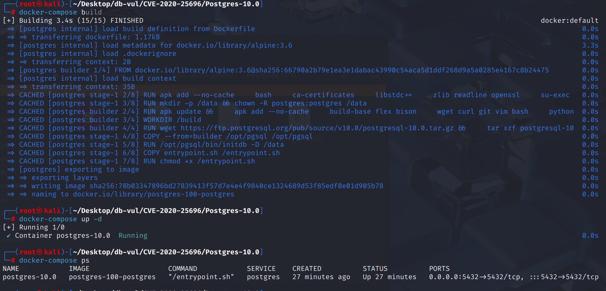
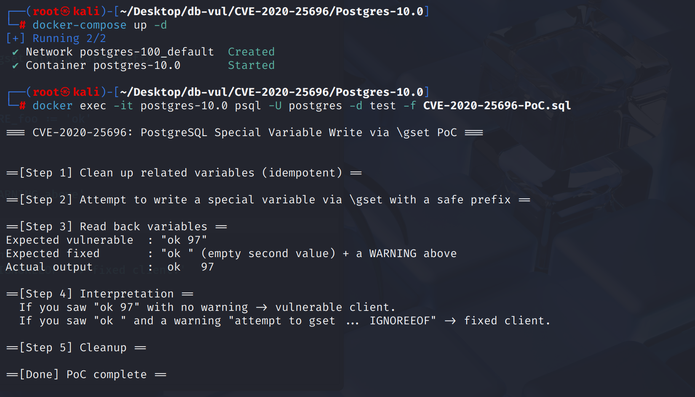

# CVE-2020-25696 CWE-697&183 PostgreSQL 命令注入

## 漏洞背景

- **PostgreSQL**：PostgreSQL 是一个开源、功能强大的对象关系型数据库管理系统，广泛应用于 Web 开发、数据分析和企业级应用。它支持 ACID 事务、复杂查询、全文搜索和多版本并发控制（MVCC），确保高并发和数据一致性。PostgreSQL 提供了扩展性，允许用户自定义数据类型、函数和索引，还支持 JSON 和地理空间数据。
- **特殊变量：**指 PostgreSQL 客户端 psql 中带有特殊处理逻辑的内置变量。这类变量在赋值或取值时会触发钩子函数（hook），从而改变 psql 的行为，例如提示符显示（`PROMPT1/2/3`）、编码切换（`ENCODING`）、历史记录控制（`HISTSIZE`、`HISTCONTROL`）、命令回显（`ECHO`、`ECHO_HIDDEN`）等。
- **钩子函数（Hook Function）：**一类在系统或程序中被特别注册的回调函数，它们会在变量赋值、取值或特定事件发生时被自动触发，从而执行预定义的特殊逻辑。在 PostgreSQL 的 psql 客户端中，一些内置特殊变量（如 `ENCODING`、`PROMPT1` 等）就绑定了钩子函数，当用户修改这些变量时，并不仅仅是更新数值，而是会触发相应的钩子函数去调整编码、刷新提示符或改变运行环境，因此钩子函数起到了 拦截与扩展默认行为 的作用。
- **\gset：** PostgreSQL 客户端工具 psql 中的一个元命令，用于将查询结果的 列名和值 自动存储为 psql 变量。执行时，要求查询结果必须只有 一行，否则报错；随后 `\gset` 会遍历这一行的所有列，把列名（可加前缀）作为变量名、对应的列值作为变量值写入 psql 变量空间。这样用户就能在后续 SQL 或脚本中直接引用这些变量，实现结果与脚本逻辑的联动。
- **CWE-697: Incorrect Comparison：**程序在比较数据或条件时，使用了错误的逻辑或不完整的判断，导致本该被阻止的情况被当作合法输入处理。
- **CWE-183: Permissive List of Allowed Inputs：**系统允许的输入范围过于宽松，没有排除危险或特殊的输入，结果导致安全边界被突破。

## 漏洞原理

PostgreSQL 的客户端工具 **psql** 提供了 `\gset` 命令，可以将查询结果的列值存储到 **psql 变量**中，用于后续 SQL 构造或脚本逻辑。

但是`psql` 对 `\gset` 写入变量时没有正确转义或限制变量名与内容，导致可以通过 `\gset` 注入到本地 **特殊变量**。这些特殊变量能改变 **psql 的本地行为**，例如历史文件路径（可能导致命令历史泄漏）、错误处理策略（脚本意外中断）、编码环境（可能影响脚本处理）等。从而达到混淆用户、窃取信息或干扰环境的目的。

## 漏洞定位

分析 PostgreSQL 12.2 源码：

在 src/bin/psql/common.c 中第 853 行 StoreQueryTuple 函数是 `psql` 客户端在处理 **`\gset`** 时调用的核心逻辑

但是`\gset [prefix_]` 不区分目标是否为特殊变量，没有检查目标变量是否为 特殊处理变量，恶意列名可与前缀拼接后“碰撞”到这些变量，导致本地行为被劫持。

```c
static bool StoreQueryTuple(const PGresult *result)
{
    bool success = true;

    /* \gset 要求结果必须正好 1 行，否则报错 */
    if (PQntuples(result) < 1)
    {
        psql_error("no rows returned for \\gset\n");
        success = false;
    }
    else if (PQntuples(result) > 1)
    {
        psql_error("more than one row returned for \\gset\n");
        success = false;
    }
    else
    {
        int i;

        /* 遍历这一行里的所有列 */
        for (i = 0; i < PQnfields(result); i++)
        {
            char *colname = PQfname(result, i);      /* 列名（攻击者可控） */
            char *varname;
            char *value;

            /* 拼接变量名 = 前缀 + 列名
             * 例如：前缀 "X"，列名 "foo" -> 变量名 "Xfoo"
             */
            varname = psprintf("%s%s", pset.gset_prefix, colname);

            /* 如果不是 NULL，就取实际值，否则表示 unset 变量 */
            if (!PQgetisnull(result, 0, i))
                value = PQgetvalue(result, 0, i);
            else
                value = NULL;

            /* 把 (变量名, 值) 写入 psql 的变量空间 */
            if (!SetVariable(pset.vars, varname, value))
            {
                free(varname);
                success = false;
                break;
            }

            free(varname);
        }
    }

    return success;
}
```

## 漏洞修复


升级到 PostgreSQL 13.1、12.5、11.10、10.15、9.6.20、9.5.24，或相应分支中的更高版本。
介绍  `VariableHasHook(space, name)`  在src/bin/psql/ variables.c中,通过变量链接列表,确定变量是否绑定  `substitute_hook`  或  `assign_hook`  作为"特殊变量"识别标准。 如果发现一个变量是特殊的,则直接忽略并警告。

```c
/*
 * Return true iff the named variable has substitute and/or assign hook
 * functions.
 */
bool
VariableHasHook(VariableSpace space, const char *name)
{
	struct _variable *current;

	Assert(space);
	Assert(name);

	for (current = space->next; current; current = current->next)
	{
		int			cmp = strcmp(current->name, name);

		if (cmp == 0)
			return (current->substitute_hook != NULL ||
					current->assign_hook != NULL);
		if (cmp > 0)
			break;				/* it's not there */
	}

	return false;
}
```

在src/bin/psql/common.c中的StoreQueryTuple函数中,调用变量HasHook方法来确定和拦截特殊变量。 如果目标变量包含替换/任务钩,则发出警告并跳过设置,将查询结果根植到"特别处理的"变量中。

```c
if (VariableHasHook(pset.vars, varname))
{
    pg_log_warning("attempt to \ \gset  into specially treated variable \"%s\" ignored",
                   varname);
    continue;
}
```

## 影响范围


** 受影响的版本:** PostgreSQL：

-  9.5.0 改为 9.5.23
-  9.6.0 改为 9.6.19
-  10.0 改为 10.14
-  11.0 改为 11.9
-  12.0 改为 12.4
-  13.0

## 环境搭建

启动 Docker 环境，PostgreSQL 版本为 10.0，管理员为 postgres，密码为 postgres，已存在数据库 test。

```txt
NIST:NVD     Base Score:7.5    HIGHVector:CVSS:3.1/AV:N/AC:H/PR:N/UI:R/S:U/C:H/I:H/A:H
```

```txt
cpe:2.3:a:postgresql:postgresql:10.0:*:*:*:*:*:*:*
```



## 漏洞复现

1. 使用 postgres 用户身份连接容器中的 PostgreSQL 的数据库 test 并运行 PoC 文件，可以看到成功写入了“带钩子”的特殊变量 IGNOREEOF 

   ```bash
   docker exec -it postgres-10.0 psql -U postgres -d test -f CVE-2020-25696-PoC.sql
   ```

   


## PoC分析

```sh
select 97 as "EOF", 'ok' as _foo \gset IGNORE
```

生成两列结果：列名 `"EOF"`，值 `97`；列名 `"_foo"`，值 `ok`。之后 \gset IGNORE 会把查询结果的列名和值存成 psql 变量，前缀是 `IGNORE`。所以会尝试写入两个变量`IGNOREEOF` = `97`和`IGNORE_foo` = `ok`。IGNOREEOF 是带 hook 的特殊变量，存在漏洞的版本不会拒绝写入或警告。

## 参考链接


[ NVD - CVE-2020-25696 ](https://nvd.nist.gov/vuln/detail/CVE-2020-25696#range-15100086)

[ Ignore attempts to  \gset  into specially treated variables. · postgres/postgres@098fb00 ](https://github.com/postgres/postgres/commit/098fb00799ffb026ff12c64bd21635f963cfc609#diff-4320bbe3972268361bc22385e3bd32f74009100a15435d512dcf55a07943fe56)
