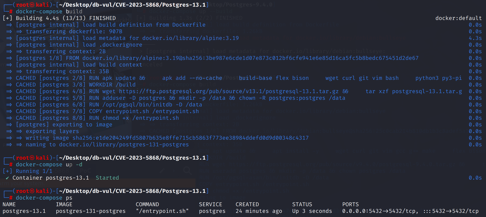
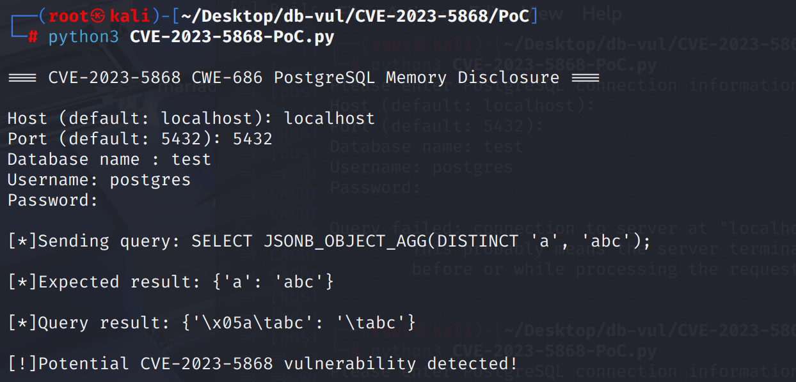

# CVE-2023-5868 CWE-686 PostgreSQL 内存泄露

## 漏洞背景

- **PostgreSQL**：PostgreSQL 是一个开源、功能强大的对象关系型数据库管理系统，广泛应用于 Web 开发、数据分析和企业级应用。它支持 ACID 事务、复杂查询、全文搜索和多版本并发控制（MVCC），确保高并发和数据一致性。PostgreSQL 提供了扩展性，允许用户自定义数据类型、函数和索引，还支持 JSON 和地理空间数据。
- **CWE-686  Function Call With Incorrect Argument Type （参数类型不正确的函数调用）**：程序在调用某个函数时，传入了与函数定义不匹配的参数类型，可能导致程序行为异常、逻辑错误、甚至安全漏洞。该类问题常见于静态类型检查不足或类型推断错误的场景，是许多类型混淆、内存访问错误等漏洞的根源之一。

## 漏洞原理

在 PostgreSQL 中，解析 `Aggref` 聚合函数调用时，系统过早地记录了参数类型（即 `agg->aggargtypes`），此时 `DISTINCT` 和 `ORDER BY` 等语义尚未完成对 `unknown` 类型字面量的类型推断和转换，导致记录的参数类型与实际运行时类型不一致。结果是在调用如 `JSONB_OBJECT_AGG` 等聚合函数时，这些原本已被转换为 `text` 类型的参数仍被按照 `unknown` 类型处理。由于 PostgreSQL 会将 `unknown` 类型当作以 `\0` 结尾的 C 字符串读取，错误的类型解释可能造成越界访问，最终导致内存泄漏。

## 漏洞定位

分析 PostgreSQL 13.1 源码：

在 src\backend\parser\parse_agg.c 文件，第 102 行`transformAggregateCall`函数用于解析聚合函数调用表达式，构造并填充 Aggref 结构体的各个字段，包括参数列表、排序信息、去重信息等。

第 117 行的代码用于提取聚合函数参数的类型（OID 形式）并保存到 `agg->aggargtypes` 字段中，用于后续执行阶段确定函数调用的行为。

但是 PostgreSQL 在解析聚合函数调用时，**过早捕获了参数的类型信息**，此时传入的参数可能是 `unknown` 类型的字面量（如 `'a'`、`'abc'`），它们在随后的 `DISTINCT` 或 `ORDER BY` 处理过程中可能会被隐式转换为更具体的类型，例如 `text`。但此时 `agg->aggargtypes` 中保存的仍是旧的类型（如 `unknown`），导致类型信息与实际运行时数据不一致。

在执行阶段，PostgreSQL 会根据 `aggargtypes` 所记录的类型信息选择对应的函数实现和数据解析方式。如果类型记录错误，比如将 `text` 数据当作 `unknown`（即 C 风格的以 `\0` 结尾的字符串）处理，可能会**继续读取内存中非预期的数据字节，造成信息泄露**。

```cpp
void transformAggregateCall(ParseState *pstate, Aggref *agg,
					   List *args, List *aggorder, bool agg_distinct)
{	
    // ... ...
    
	/*
	 * Before separating the args into direct and aggregated args, make a list
	 * of their data type OIDs for use later.
	 */
    //  **************** 第 117 行 ******** 漏洞点：过早调用 ***********************
	foreach(lc, args) // 遍历聚合函数的参数列表（args）
	{
		Expr *arg = (Expr *) lfirst(lc); // 取出每一个参数表达式
		// 获取参数的类型OID，添加到 argtypes 列表中
		argtypes = lappend_oid(argtypes, exprType((Node *) arg));
	}
    // 将所有参数的类型列表赋值给 agg->aggargtypes
	agg->aggargtypes = argtypes;

    // ...

	check_agglevels_and_constraints(pstate, (Node *) agg);
}
```

## 漏洞修复


升级到 PostgreSQL 16.1、15.5、14.10、13.13、12.17、11.22，或相应分支中的更高版本。
移动 `agg->aggargtypes` 将逻辑构建到函数的结尾： 处理后提取类型 `transformSortClause()`， `transformDistinctClause()`等,此时所有 `unknown` 已推断为实际类型(例如： `text`)基于上下文类型。 记录 `aggargtypes` 匹配执行时的实际数据类型,在执行期间,由于类型解释错误,内存将不会读出界限。

```cpp
void transformAggregateCall(ParseState *pstate, Aggref *agg,
					   List *args, List *aggorder, bool agg_distinct)
{	
    // ... ...	
    
	/*
	 * Now build the aggargtypes list with the type OIDs of the direct and
	 * aggregated args, ignoring any resjunk entries that might have been
	 * added by ORDER BY/DISTINCT processing.  We can't do this earlier
	 * because said processing can modify some args' data types, in particular
	 * by resolving previously-unresolved "unknown" literals.
	 */
	foreach(lc, agg->aggdirectargs)
	{
		Expr	   *arg = (Expr *) lfirst(lc);

		argtypes = lappend_oid(argtypes, exprType((Node *) arg));
	}
	foreach(lc, tlist)
	{
		TargetEntry *tle = (TargetEntry *) lfirst(lc);

		if (tle->resjunk)
			continue;			/* ignore junk */
		argtypes = lappend_oid(argtypes, exprType((Node *) tle->expr));
	}
	agg->aggargtypes = argtypes;

	check_agglevels_and_constraints(pstate, (Node *) agg);
}
```

## 影响范围


** 受影响的版本:** PostgreSQL：

- 11.0 改为 11.21
- 12.0 改为 12.16
- 13.0 改为 13.12
- 14.0 改为 14.9
- 15.0 改为 15.4

## 环境搭建

启动 Docker 环境，PostgreSQL 版本为 13.1，管理员为 postgres，密码为 postgres，已存在数据库 test。

```txt
CNA:Red Hat,Inc. Base Score:4.3 MEDIUM Vector:CVSS:3.1/AV:N/AC:L/PR:L/UI:N/S:U/C:L/I:N/A:N
```

```txt
cpe:2.3:a:postgresql:postgresql:13.1:*:*:*:*:*:*:*
```



## 漏洞复现

运行 PoC 文件，根据构建的环境，输入目标IP、端口、数据库名为 test、用户名为 postgres 和密码为 postgres。发送 SQL 查询后可以看到返回的结果和预期不符。这说明聚合函数在参数类型未正确处理的情况下错误读取了内存中的内容，结果混入了脏数据或格式错误的字符串，发生了内存泄露。

```python
python3 CVE-2023-5868-PoC.py
```



## PoC分析

```sql
SELECT JSONB_OBJECT_AGG(DISTINCT 'a', 'abc');
```

该 POC 利用了 PostgreSQL 聚合函数在处理 `unknown` 类型字面量（如 `'a'`）并结合 `DISTINCT` 时类型推断错误，导致运行时错误地将 `text` 类型数据按 `unknown` 类型解释，从而泄露内存中的敏感字节

在解析阶段会过早把聚合参数类型记录为 `(unknown, unknown)`，写进 `aggargtypes`。为了做 DISTINCT 去重，对两个字面量 `'a'`、`'abc'` 会在后续步骤中被**解析成 `text`**（用于比较/哈希）。但 `aggargtypes` 仍认为它们是 `unknown`。

执行聚合时，框架根据 `aggargtypes` 把参数当成 **C 字符串（cstring，`\0` 终止）**来处理，而实际传入的是 **PostgreSQL 的 `text`（varlena）**。这会把 `text` 的**数据指针/长度**当成 cstring 去用，常见后果是用 `strlen()` 一路读到下一个内存中的 `\0` 才停。于是把**不属于该字符串的后续内存字节**一并纳入结果，形成信息泄露。`jsonb_object_agg` 最终把这些多读出来的字节打包进 JSONB 的键或值里，表现为尾部“乱码/超长字符串”。

实际返回的结果是`{"\u0005a\tabc": "\tabc"}`。key 是错误解析后的内容，value 是混入内存泄露字节的字符串。这种乱码现象，说明 PostgreSQL 把某个本应是 `text` 类型的参数，当作 `unknown`（即 C 字符串）去解析了。这是典型的内存解释错误现象。

## 参考链接


[NVD - CVE-2023-5868](https://nvd.nist.gov/vuln/detail/CVE-2023-5868#range-15973688)

[PostgreSQL: CVE-2023-5868: Memory disclosure in aggregate function calls](https://www.postgresql.org/support/security/CVE-2023-5868/)

[Compute aggregate argument types correctly in transformAggregateCall(). · postgres/postgres@3b0776f](https://github.com/postgres/postgres/commit/3b0776fde56763c549df35ce9750f3399bc710b2)
