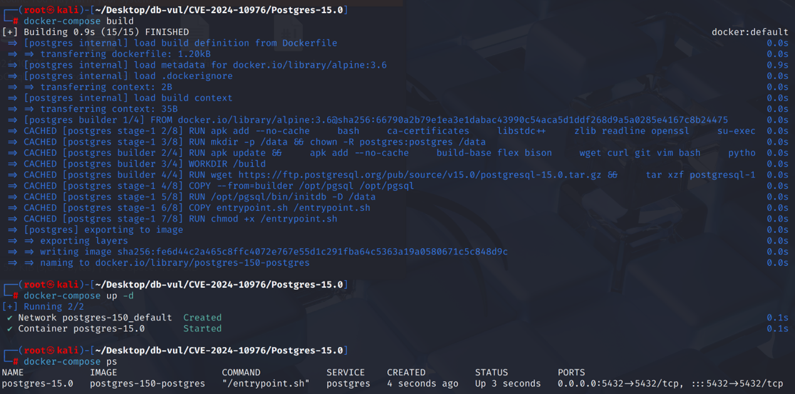
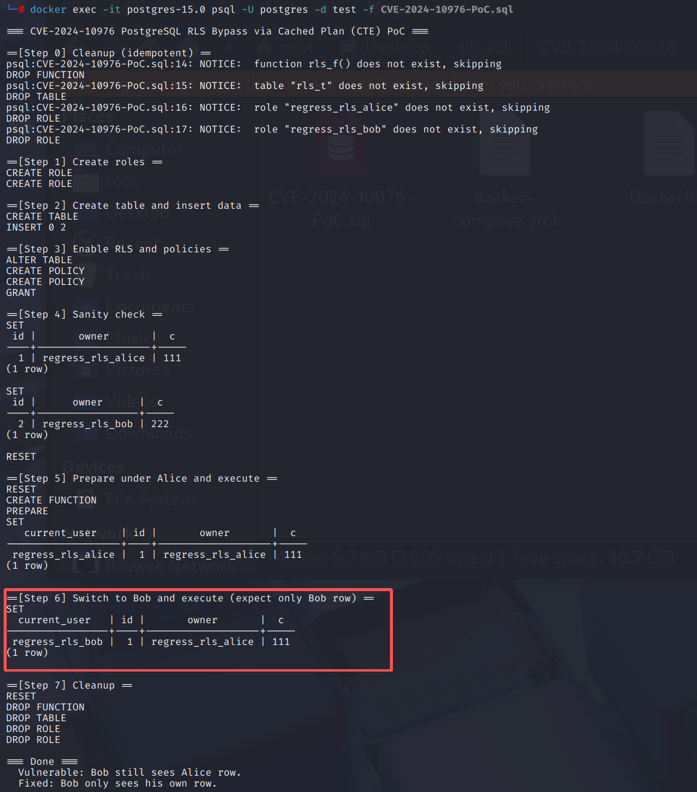

# CVE-2024-10976 CWE-1250 PostgreSQL Access Control Bypass

## Vulnerability Background
- **PostgreSQL:** PostgreSQL is an open-source, powerful object-relational database management system widely used in web development, data analysis, and enterprise-level applications. It supports ACID transactions, complex queries, full-text searches, and Multi-Version Concurrency Control (MVCC), ensuring high concurrency and data consistency. PostgreSQL offers extensibility, allowing users to customize data types, functions, and indexes, and also supports JSON and geospatial data.
- **CTE (Common Table Expression) :** A temporary naming method in SQL that allows for multiple references in subsequent queries through `WITH ... AS (...)` definition, making query logic clearer and more structured. It is similar to "inline view" or "temporary subquery," but its scope is limited to the current statement and does not persist.

## Vulnerability Mechanism
When generating query plans, PostgreSQL binds the corresponding role's line-level security (RLS) policy to the plan, but in scenarios involving CTEs, subqueries, SubLinks, views, or SQL functions, these plans are not fully labeled as "dependency roles," resulting in plans being reusable across roles after caching; This way, when a query is prepared under one role and executed under another, the incorrect RLS policy will be applied, causing access control to be bypassed, allowing users to see or modify lines that do not belong to them.

## Vulnerability Location
Analysis of PostgreSQL 9.5.0 source code:

In the src/backend/rewrite/**rewriteHandler.c** file, line **1703**, the ApplyRetrieveRule function is used to expand the definition of a View into a subquery. Line **1978** The fireRIRrules function is used to recursively expand the definitions of all views in the query, replacing the views with their subquery definitions. Line **1947** The fireRIRonSubLink function is used to traverse and expand all views referenced in the `SubLink` (subquery expressions) in the query tree. This scatter function does not properly propagate the `hasRowSecurity` flag when handling subqueries, CTEs, and views, resulting in subsequent queries not properly considering the RLS policy during execution.

## Remediation

Upgrade to PostgreSQL 17.1, 16.5, 15.9, 14.14, 13.17, 12.21, or a later release on the corresponding branch.
Fix query RLS propagation in the ApplyRetrieveRule function, ensuring that external queries are flagged as dependency row-safe when handling views and subqueries. Even if `rule_action` (such as query plans for views or subqueries) have a line-level security policy, external queries will inherit this policy.

```c
parsetree->hasRowSecurity |= rule_action->hasRowSecurity;
```

Fixed row-level safe flag propagation in subqueries in fireRIRonSubLink

```c
context->hasRowSecurity |= ((Query *) sub->subselect)->hasRowSecurity;
```

Fixed line-level safe passing in fireRIRrules

```c
parsetree->hasRowSecurity |= rte->subquery->hasRowSecurity;
```

## Affected Versions
**Affected version:** PostgreSQL:

-  12.0 to 12.20
-  13.0 to 13.16
-  14.0 to 14.13
-  15.0 to 15.8
-  16.0 to 16.4
-  17.0

## Environment Setup
Start the Docker environment, PostgreSQL version 15.0, administrator postgres, password postgres, database test exists.

```txt
NIST:NVD    Base Score:5.4 MEDIUM   Vector:CVSS:3.1/AV:N/AC:L/PR:L/UI:N/S:U/C:L/I:L/A:N
CNA:PostgreSQL    Base Score:4.2 MEDIUM    Vector:CVSS:3.1/AV:N/AC:H/PR:L/UI:N/S:U/C:L/I:L/A:N
```

```txt
cpe:2.3:a:postgresql:postgresql:15.0:*:*:*:*:*:*:*
```



## Vulnerability Reproduction
Use Postgres user identity to connect to the PostgreSQL database test in the container and run the PoC file.

After executing Step 5 (Alice), the preparation statement was cached, but in Step 6 (Bob) reuse the plan, Alice's RLS visible set was still applied, so Bob saw Alice's lines.

```bash
docker exec -it postgres-15.0 psql -U postgres -d test -f CVE-2024-10976-PoC.sql
```



## PoC Analysis
The PoC prepares a query while Alice's row-level-security policy is active and then executes the cached plan as Bob. If Bob receives Alice's row set, the plan cache has reused role-dependent RLS state without recording the correct role dependency. A fixed server invalidates or rebuilds the plan for the new role.


```sql

 
```

## References
[NVD - CVE-2024-10976](https://nvd.nist.gov/vuln/detail/CVE-2024-10976#range-16705920)

[Ensure cached plans are correctly marked as dependent on role. · postgres/postgres@cd7ab57](https://github.com/postgres/postgres/commit/cd7ab57532bb4fbf2e636b1f7d132e6e2d9ac5fc#diff-5023377c1be123d607ed0cb3d984f97381833f28d84fbc1e2e233737f531d1a1)
