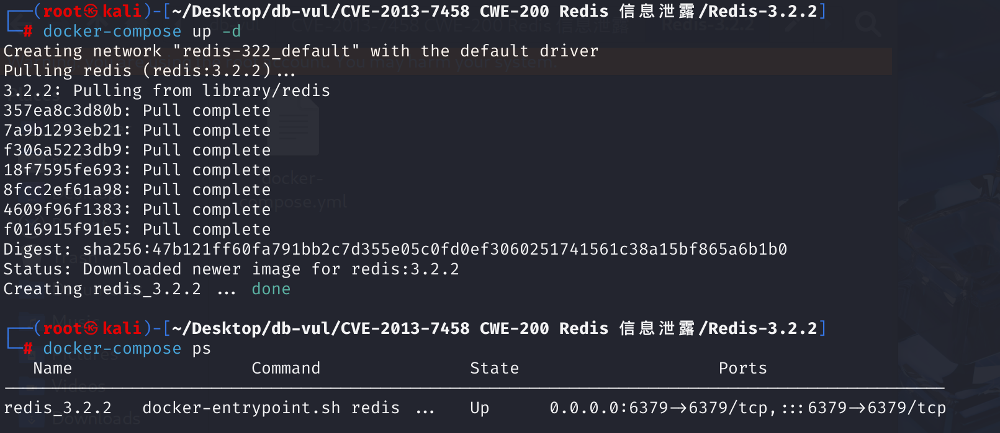
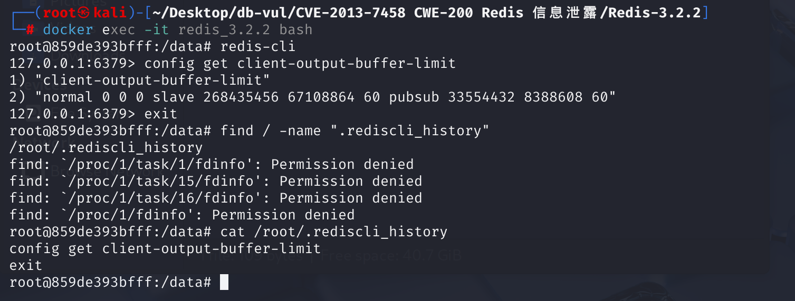

# CVE-2013-7458 CWE-200 Redis Information Leak

## Vulnerability Background
- **umask:** In Linux systems, `umask` (user file creation permission mask) is used to set default permissions for newly created files or directories. When `umask` is set to `0022`, the default permission to create a regular file will be `0644`, meaning the owner has read/write permissions, and group users and other users have read-only permissions. In Linux systems, by default, the `umask` for regular users is usually set to `0022`. When creating a file with `fopen(filename, "w")`, the system determines file permissions based on the current `umask` value. Specifically, the actual permissions of a file are determined by bitwise and calculating the default permissions (usually `0666`) with the complement of `umask`. For example, the default permissions `0666` and `umask` `0022`'s complement `0755` perform bitwise AND operations, resulting in `0644`, meaning the file permission is `rw-r--r--`.
- **.rediscli_history Files:** History files automatically created by the Redis command-line client (`redis-cli`) in interactive mode. It is located in the user's home directory, with the default path being `~/.rediscli_history`. This file is used to store commands entered by users in the `redis-cli`, making it easy for users to quickly access and repeatedly execute previous commands using the arrow keys (↑/↓).

## Vulnerability Mechanism
Prior to Redis 3.2.3, .redishistroy set readability permissions, allowing local users to access sensitive information by reading files.

## Vulnerability Location
1. In the **deps\linenoise\linenoise.c** file, line **1162**, `linenoiseHistorySave` function is used to create a file, write it to the history, and save it.

```cpp
/* Save the history in the specified file. On success 0 is returned
 * otherwise -1 is returned. */
int linenoiseHistorySave(const char *filename) {
    FILE *fp = fopen(filename,"w");
    int j;

    if (fp == NULL) return -1;
    for (j = 0; j < history_len; j++)
        fprintf(fp,"%s\n",history[j]);
    fclose(fp);
    return 0;
}
```

2. In the **src\redis-cli.c** file, line **1262**, `repl` function calls `linenoiseHistorySave` to save historical commands, but does not consider permission allocation. In Linux, the default `umask` is 0022, so a file with permission 0644 is created. rediscli_history file, i.e., file permissions are `rw-r--r--`

```cpp
static void repl(void) {
    sds historyfile = NULL;
    int history = 0;
    char *line;
    int argc;
    sds *argv;
    // ... ...
    while((line = linenoise(context ? config.prompt : "not connected> ")) != NULL) {
        if (line[0] != '\0') {
            argv = cliSplitArgs(line,&argc);
            if (history) linenoiseHistoryAdd(line);
            if (historyfile) linenoiseHistorySave(historyfile);
            // ... ...
        }
        // ... ...
    }
    // ... ...
}
```

## Remediation
Add `umask` settings to the `linenoiseHistorySave` function.

```cpp
mode_t old_umask = umask(S_IXUSR|S_IRWXG|S_IRWXO);

chmod(filename,S_IRUSR|S_IWUSR);
```

Before opening the file, set the permission mask first:

S_IWUSR 00200 permissions represent that the file owner has writable permissions; S_IRWXG 00070 permissions represent that the file user group has permission to read, write, and perform operations; S_IRWXO 00007 permission means other users have permission to read, write, and execute operations.

After writing data, change the file permission (chmod) to S_IRUSR 00400, meaning the file owner has read permission; S_IWUSR(S_IWRITE) 00200 permission means the file owner has write permission; other groups and other users have no permissions.

## Affected Versions
Redis < 3.2.3 

## Environment Setup
Start the Docker environment, Redis version 3.2.2



## Vulnerability Reproduction
1. Enter the container command line interface and use redis-cli to connect locally to Redis

2. Randomly execute some database operation commands, such as `config get client-output-buffer-limit`

3. Exit redis-cli, use the find command to find and view the .rediscli_history file, where you can directly see the series of redis-cli operations recorded in this file



## PoC Analysis
The reproduction creates Redis CLI history and then checks the resulting `~/.rediscli_history` permissions. A mode such as `0644` permits other local accounts to read commands that may contain keys, values, hostnames, or credentials. This is a local file-permission disclosure, not a remote Redis-server data leak.
## References
[linenoise, used before Redis 3.2.3, using world... · CVE-2013-7458 · GitHub Security Bulletin Database --- linenoise, as used in Redis before 3.2.3, uses world... · CVE-2013-7458 · GitHub Advisory Database](https://github.com/advisories/GHSA-gfx7-7mf7-vcxx)

[Tahir's Wiki](https://tahirmars.github.io/wiki/)

[redis-cli: Permission issues when opening historical files · Question #3284 · redis/redis --- redis-cli: permissions when opening history file · Issue #3284 · redis/redis](https://github.com/redis/redis/issues/3284)

[Make history file private #3284 by denisvm · Pull Request #3322 · redis/redis](https://github.com/redis/redis/pull/3322)
