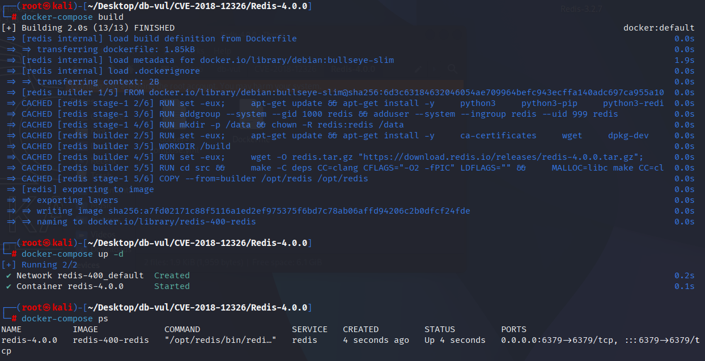
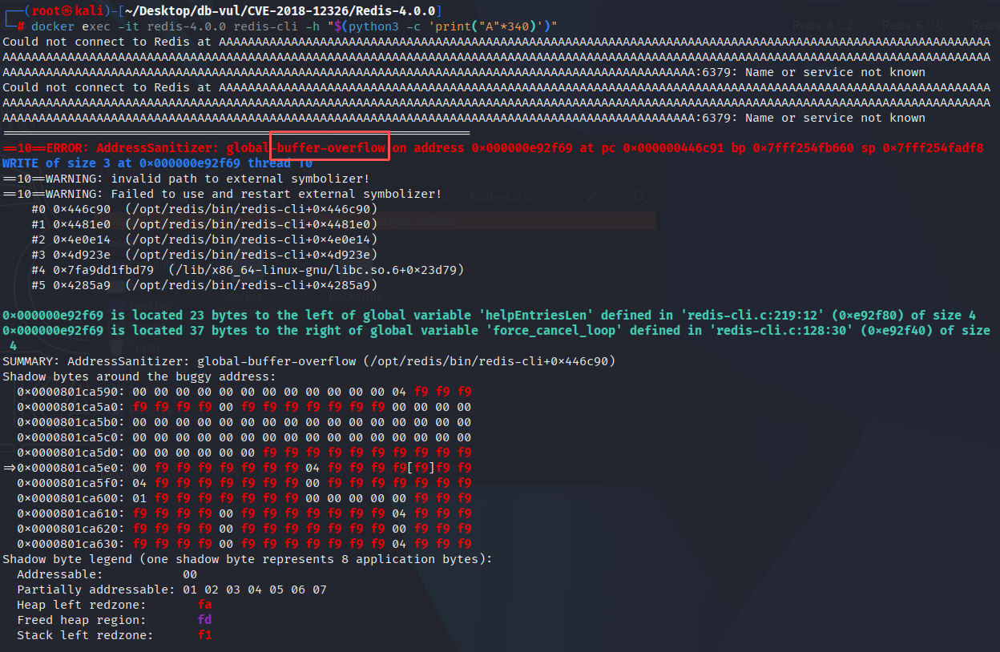

# CVE-2018-12326 CWE-119 Redis buffer overflow

## Vulnerability Background
- **Redis**: A key-value storage system that is a cross-platform non-relational database. An open-source in-memory database that provides a high-performance key-value storage system, commonly used in caching, message queues, session storage, and other application scenarios. Clients communicate with Redis servers via sockets, sending commands, and the server changes its state (i.e., its memory structure) to respond to such commands.
- 

## Vulnerability Mechanism
When constructing interactive prompts, redis-cli directly concatenates hostname and port information into a fixed-size global buffer, and mistakenly treats the return value of `anetFormatAddr/snprintf` as the "actual write length" for subsequent offset and space calculations. When an extremely long hostname is passed (such as via the -h argument) causing the output to be truncated, the return value may exceed the buffer size, causing subsequent continuation to go out of the global buffer boundary

## Vulnerability Location
Analysis of the Redis-4.0.0 source code:

The vulnerability is located on the `cliRefreshPrompt()` of `src/redis-cli.c`. This function first writes the Unix socket path or `host:port` into a fixed-size `config.prompt`, then continues to accumulate the return value of `snprintf()`/`anetFormatAddr()` as the "actual written length." According to the C standard, when the output is truncated, the return value is the "length that should have been written," which can be greater than the buffer size; Afterwards, `config.prompt + len` points outside the buffer, and `sizeof(config.prompt) - len` also experiences unsigned overflow.

```c
// redis-cli.c file, line 153
static void cliRefreshPrompt(void) {
    int len;

    if (config.eval_ldb) return;
    if (config.hostsocket != NULL)
        len = snprintf(config.prompt,sizeof(config.prompt),"redis %s",
                       config.hostsocket);
    else
        len = anetFormatAddr(config.prompt, sizeof(config.prompt),
                           config.hostip, config.hostport);
    /* Add [dbnum] if needed */
    if (config.dbnum != 0)
        len += snprintf(config.prompt+len,sizeof(config.prompt)-len,"[%d]",
            config.dbnum);
    snprintf(config.prompt+len,sizeof(config.prompt)-len,"> ");
}
```

Attackers only need to make the `hostsocket` long enough to cause the above truncation. The danger point is not the first `snprintf()` itself, but the `len` used to calculate the addresses and remaining space for the second and third writes without verifying its return value. The fix switched to using a growable SDS to concatenate the complete prompt, and finally copied it to the static buffer once more with a bounded `snprintf()`.

## Remediation

Upgrade to Redis 4.0.10, a fixed 5.0 release candidate, or any later supported release containing commit `9fdcc15962f9ff4baebe6fdd947816f43f730d50`. The patch builds the prompt in a growable SDS, appends the database number and suffix without pointer arithmetic on a truncated length, and performs one bounded copy into `config.prompt`.

Because the flaw is in the `redis-cli` process rather than the Redis server, also replace old client binaries on administrator workstations and automation hosts. Until then, do not invoke the vulnerable client with attacker-controlled, excessively long Unix-socket paths or host strings.

```c
static void cliRefreshPrompt(void) {


    if (config.eval_ldb) return;

    sds prompt = sdsempty();
    if (config.hostsocket != NULL) {
        prompt = sdscatfmt(prompt,"redis %s",config.hostsocket);
    } else {
        char addr[256];
        anetFormatAddr(addr, sizeof(addr), config.hostip, config.hostport);
        prompt = sdscatlen(prompt,addr,strlen(addr));
    }

    /* Add [dbnum] if needed */
    if (config.dbnum != 0)
        prompt = sdscatfmt(prompt,"[%i]",config.dbnum);

    /* Copy the prompt in the static buffer. */
    prompt = sdscatlen(prompt,"> ",2);
    snprintf(config.prompt,sizeof(config.prompt),"%s",prompt);
    sdsfree(prompt);
}
```

## Affected Versions
Reids：

-  x to 4.0.9
-  5.0 rc1 to rc2

## Environment Setup
Launch the Docker environment with Redis version 4.0.0, and enable the ASan memory detection tool at compile time

```txt
NIST:NVD    Base Score:8.4 HIGH    Vector:CVSS:3.1/AV:N/AC:L/PR:L/UI:N/S:U/C:H/I:H/A:H
```

```txt
cpe:2.3:a:redislabs:redis:4.0.0:*:*:*:*:*:*:*
```



## Vulnerability Reproduction
Go to the container command line and execute the PoC command. From the key information in ASan, you can see that the `redis-cli` client has experienced buffer overflow

```bash
docker exec -it redis-4.0.0 redis-cli -h "$(python3 -c 'print("A"*340)')"
```



## PoC Analysis
The PoC invokes `redis-cli` with an overlong hostname. `anetFormatAddr()` reports the length that would have been written, even though the fixed-size prompt buffer truncated the text; vulnerable code then uses that larger length as an offset and writes beyond the global prompt buffer. The ASan report confirms a client-side buffer overflow. The Redis server itself is not the vulnerable process.
## References
[NVD - CVE-2018-12326](https://nvd.nist.gov/vuln/detail/CVE-2018-12326#range-14718924)

[Security: fix redis-cli buffer overflow. · antirez/redis@9fdcc15](https://github.com/antirez/redis/commit/9fdcc15962f9ff4baebe6fdd947816f43f730d50)

[Redis CVE-2018-12326 Analysis](https://bestwing.me/redis-CVE-2018-12326-analysis.html)
