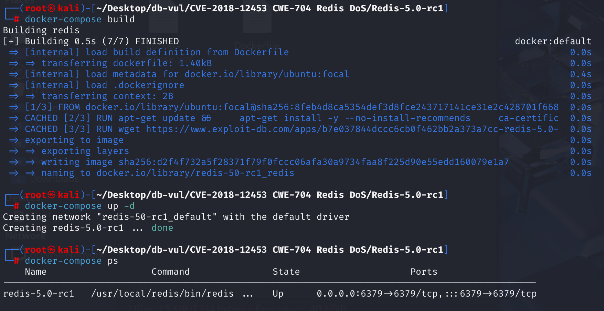
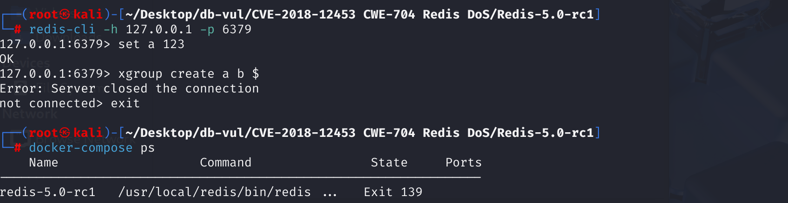

# CVE-2018-12453 CWE-704 Redis DoS

## Vulnerability Background
- **XGROUP**: A command in Redis used to manage stream data structures. Through `XGROUP`, consumers can create, burn, and manage consumer groups associated with streams. Consumer groups allow multiple consumers to collaboratively process messages in the same stream, enabling message distribution and load balancing.

- **Consumer Group**: A mechanism used to manage and coordinate multiple consumers to jointly consume the same message stream. It allows multiple consumers to work together, each drawing different subsets of messages from the stream, thereby improving the efficiency and reliability of message processing. Each consumer group has a unique name and can include multiple consumers. The consumer group ensures that each message is handled by only one consumer within the group, avoiding duplicate consumption. Additionally, the consumer group provides a message confirmation mechanism, requiring consumers to explicitly confirm messages after successful processing so Redis knows which messages have been processed and which remain pending. This enables Redis's Stream data structure to provide more powerful features and flexibility when achieving efficient message queue and event stream processing.

- **XGROUP CREATE**: This command is used to create a new consumer group, with the following syntax:

  ```
  XGROUP CREATE <stream> <groupname> <id>
  ```

  Here, `<stream>` is the name of the stream, `<groupname>` is the name of the consumer group, and `<id>` is the starting message ID of the consumer group.

   `XGROUP CREATE` command is used to create a consumer group on a Redis stream:

  - `a`: Name of a stream.
  - `b`: The name of the consumer group.
  - `$`: Indicates that the consumer group will start spending from the latest news in the stream.

  When using `$` as the ID parameter, it means the consumer group will start consuming the latest message in the stream, ignoring historical messages already present in the stream. This means that only new messages added to the stream after executing `XGROUP CREATE` commands will be read and processed by consumers of that consumer group.

## Vulnerability Mechanism
The vulnerability relates to Redis command handling of stream data types, especially when handling commands like `XCLAIM` and `XREADGROUP`, which can lead to type confusion errors.

In the `xgroup` function, Redis assumes the incoming key is a stream type, but does not conduct thorough type checking. If an attacker passes a key of a non-flow type, internal operations within the function may cause type confusion, potentially causing program crashes.

## Vulnerability Location
In the `xgroupCommand` function at line **1562** of the **src/t_stream.c** file

```c
void xgroupCommand(client *c) {
     const char *help[] = {
 "CREATE      <key> <groupname> <id or $>  -- Create a new consumer group.",
 "SETID       <key> <groupname> <id or $>  -- Set the current group ID.",
 "DELGROUP    <key> <groupname>            -- Remove the specified group.",
 "DELCONSUMER <key> <groupname> <consumer> -- Remove the specified conusmer.",
 "HELP                                     -- Prints this help.",
 NULL
     };
     stream *s = NULL;
     sds grpname = NULL;
     streamCG *cg = NULL;
     char *opt = c->argv[1]->ptr; /* Subcommand name. */
 
     /* Lookup the key now, this is common for all the subcommands but HELP. */
     if (c->argc >= 4) {
         robj *o = lookupKeyWriteOrReply(c,c->argv[2],shared.nokeyerr);
         if (o == NULL) return;
         s = o->ptr;
         grpname = c->argv[3]->ptr;
 
         /* Certain subcommands require the group to exist. */
         if ((cg = streamLookupCG(s,grpname)) == NULL &&
             (!strcasecmp(opt,"SETID") ||
              !strcasecmp(opt,"DELCONSUMER")))
         {
             addReplyErrorFormat(c, "-NOGROUP No such consumer group '%s' "
                                    "for key name '%s'",
                                    (char*)grpname, (char*)c->argv[2]->ptr);
             return;
         }
     }
 
     /* Dispatch the different subcommands. */
     /******/
 }
```

When there are 4 parameters passed, use the `lookupKeyWriteOrReply` function to find the specified key (`c->argv[2]`) and assign it to `o` of type `robj *`. `robj` is a struct used to represent objects of various data types in Redis. However, this code only checks whether object `o` is empty, and does not check whether its type is a stream (`OBJ_STREAM` )

If the object corresponding to key `c->argv[2]` is not of the stream type, subsequent flow operations (such as creating consumer groups) will not be executed correctly, leading to unexpected behavior or errors

The fixed code added `checkType(c,o,OBJ_STREAM)` to determine whether the `o` is of the stream type

## Remediation

Upgrade to Redis 5.0 or a later supported release containing commit `c04082cf138f1f51cedf05ee9ad36fb6763cafc6`. The corrected `xgroupCommand()` validates the selected subcommand and its required argument count before accessing `argv[2]`/`argv[3]`, and returns a syntax error for malformed `XGROUP` requests instead of dereferencing an absent or wrongly typed object.

Until upgraded, block `XGROUP` from untrusted clients by using network isolation or command renaming where available, require authentication, and limit Redis access to trusted application hosts. Automatic restart supervision reduces downtime but is not a fix for the remotely triggerable crash.

## Affected Versions
All versions before the official release of Redis 5.0

## Environment Setup
The Redis version used is 5.0-rc1, which is a candidate release release



## Vulnerability Reproduction
1. Use redis-cli to connect locally to Redis

```sh
redis-cli -h 127.0.0.1 -p 6379
```

2. Execute the following commands in sequence

```sh
set a 123
xgroup create a b $
```



3. View the container log; the `CURRENT CLIENT INFO` section displays the client's current status. Here, `cmd=xgroup` indicates that the client is executing `XGROUP` commands. Subsequently, Redis recorded the register status and memory test results


4. The final display shows the figure below, indicating that Redis encountered a serious error while handling the `XGROUP` command, causing the crash


## PoC Analysis
1. Assign the string value `123` to key `a`. If key `a` already exists, its original value will be overwritten by the new value `"123"`

```sh
set a 123
```

2. Create a new consumer group

```sh
xgroup create a b $
```

3. When executing this command, the specified `a` key already exists and its type is not stream. `xgroup` function may incorrectly handle this key, causing type confusion and triggering crashes or denials of service (DoS).

## References
[Redis 5.0 - Denial of Service - Linux dos Exploit](https://www.exploit-db.com/exploits/44908)

[Type confusion in the xgroupCommand function in t_stream... · CVE-2018-12453 · GitHub Advisory Database](https://github.com/advisories/GHSA-wjvh-g4jc-jg48)

[Abort in XGROUP if the key is not a stream · redis/redis@c04082c](https://github.com/redis/redis/commit/c04082cf138f1f51cedf05ee9ad36fb6763cafc6)
