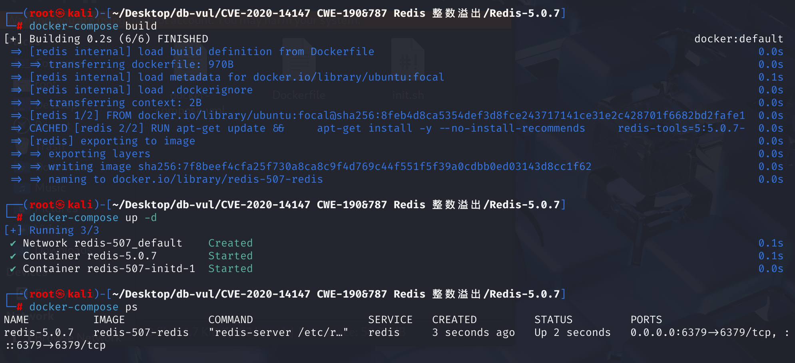
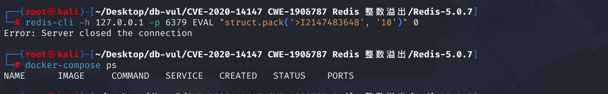

# CVE-2020-14147 CWE-190/787 Redis 整数溢出

## 漏洞背景


Redis 内嵌 Lua 解释器，并通过 `EVAL` 等命令执行脚本。此前针对 CVE-2015-8080 的回归修复仍使有权运行 Lua 脚本的攻击者能够在捆绑的 `lua_struct.c` 库中触发整数溢出和栈缓冲区溢出。

## 漏洞原理

在 Redis 的 Lua 脚本引擎中，`getnum` 函数存在一个整数溢出问题，发生在 `lua_struct.c` 文件中。具体来说，当恶意用户提交一个非常大的数字作为 Lua 脚本的输入时，可能触发整数溢出，从而导致内存损坏和应用崩溃。

与 **CVE-2015-8080** 存在相似的原理和漏洞表现

## 漏洞定位

与**CVE-2015-8080**漏洞点一样，在后续更新至该版本时，把之前的修复代码删除了

1、根据漏洞原理，在 **deps/lua/src/lua_struct.c** 文件第 **93** 行的`getnum`函数中，`getnum` 函数用于从格式字符串中提取连续的数字序列`**fmt`，并将其转换为整数值`a`，常用于解析格式化字符串中的数值参数

```c
static int getnum (lua_State *L, const char **fmt, int df) {
  if (!isdigit(**fmt))  /* no number? */
    return df;  /* return default value */
  else {
    int a = 0;
    do {
      a = a*10 + *((*fmt)++) - '0';
    } while (isdigit(**fmt));
    return a;
  }
}
```

​	该函数在解析数字时，使用了一个`int`类型的变量`a`来存储解析结果。然而，`int`类型的范围是有限的（通常是32位，范围为-2,147,483,648到2,147,483,647）。当用户提交一个非常大的数字（例如超过2,147,483,647）时，`getnum`函数会将这个数字存储到`int`类型的变量中，导致整数溢出。

2、接下来往上分析，在当前文件的第 **109** 行的`optsize`函数中调用了`getnum`函数，根据格式字符串中的当前字符（`opt`）来确定对应的数据类型所占的字节数。当格式字符串中出现以下字符时，会调用`getnum`函数来解析后续的数字：

- `i` 或 `I`：用于指定有符号或无符号整数的大小
- `c`：用于指定字符序列的长度
- `!`：用于指定对齐方式

​	而这个函数在`b_pack`函数以及第 291 行的`b_unpack`函数中被调用，用于解析格式字符串并获取每个格式字符对应的数据大小

```c
static size_t optsize (lua_State *L, char opt, const char **fmt) {
  switch (opt) {
    case 'B': case 'b': return sizeof(char);
    case 'H': case 'h': return sizeof(short);
    case 'L': case 'l': return sizeof(long);
    case 'T': return sizeof(size_t);
    case 'f':  return sizeof(float);
    case 'd':  return sizeof(double);
    case 'x': return 1;
    case 'c': return getnum(fmt, 1);
    case 'i': case 'I': {
      int sz = getnum(fmt, sizeof(int));
      if (sz > MAXINTSIZE)
        luaL_error(L, "integral size %d is larger than limit of %d",
                       sz, MAXINTSIZE);
      return sz;
    }
    default: return 0;  /* other cases do not need alignment */
  }
}
```

3、继续往上分析，这里只分析`b_pack`函数，在当前文件的第 **206** 行，`b_pack`函数负责将Lua中的数据按照指定的格式打包成二进制数据。`optsize`函数在`b_pack`函数的主循环中被调用，用于解析当前格式字符并确定对应的数据大小，也就是在处理格式字符串中的每个字符时会调用`optsize`函数

```c
static int b_pack (lua_State *L) {
  luaL_Buffer b;
  const char *fmt = luaL_checkstring(L, 1);
  Header h;
  int arg = 2;
  size_t totalsize = 0;
  defaultoptions(&h);
  lua_pushnil(L);  /* mark to separate arguments from string buffer */
  luaL_buffinit(L, &b);
  while (*fmt != '\0') {
    int opt = *fmt++;
    size_t size = optsize(L, opt, &fmt);
    int toalign = gettoalign(totalsize, &h, opt, size);
    totalsize += toalign;
    while (toalign-- > 0) luaL_addchar(&b, '\0');
    switch (opt) {
      case 'b': case 'B': case 'h': case 'H':
      case 'l': case 'L': case 'T': case 'i': case 'I': {  /* integer types */
        putinteger(L, &b, arg++, h.endian, size);
        break;
      }
      case 'x': {
        luaL_addchar(&b, '\0');
        break;
      }
      case 'f': {
        float f = (float)luaL_checknumber(L, arg++);
        correctbytes((char *)&f, size, h.endian);
        luaL_addlstring(&b, (char *)&f, size);
        break;
      }
      case 'd': {
        double d = luaL_checknumber(L, arg++);
        correctbytes((char *)&d, size, h.endian);
        luaL_addlstring(&b, (char *)&d, size);
        break;
      }
      case 'c': case 's': {
        size_t l;
        const char *s = luaL_checklstring(L, arg++, &l);
        if (size == 0) size = l;
        luaL_argcheck(L, l >= (size_t)size, arg, "string too short");
        luaL_addlstring(&b, s, size);
        if (opt == 's') {
          luaL_addchar(&b, '\0');  /* add zero at the end */
          size++;
        }
        break;
      }
      default: controloptions(L, opt, &fmt, &h);
    }
    totalsize += size;
  }
  luaL_pushresult(&b);
  return 1;
}
```

4、而在当前文件的第 **383** 行，`thislib`数组将Lua中的函数名（如`pack`）与对应的C函数（如`b_pack`）绑定在一起。`luaopen_struct`函数是`struct`库的初始化函数，它将`thislib`中的函数注册到Lua环境中。当Lua脚本调用`struct.pack`时，实际上调用的就是`b_pack`函数。

```c
static const struct luaL_Reg thislib[] = {
  {"pack", b_pack},
  {"unpack", b_unpack},
  {"size", b_size},
  {NULL, NULL}
};


LUALIB_API int luaopen_struct (lua_State *L);

LUALIB_API int luaopen_struct (lua_State *L) {
  luaL_register(L, "struct", thislib);
  return 1;
}
```

5、综上，当我们在 lua 脚本中使用 `struct.pack` 或 `struct.unpack` 函数时，如果格式字符串中包含需要解析数字的部分（如 `'i4'`、`'c8'`、`'!4'`），会调用 `getnum` 函数。`getnum` 函数在解析非常大的数字时存在整数溢出漏洞，可能导致内存损坏和应用崩溃。修复后的代码中，为防止溢出，在 `getnum` 函数中添加检查，确保累积的数字不会超过 `INT_MAX`。如果检测到溢出情况，函数应抛出错误

## 漏洞修复

升级到 Redis  5.0.9， 6.0.3,或后支持的释放。 上游 Lua  `struct` 修复恢复已检查的数字格式宽度解析,并在数值用于缓冲分配和复制之前验证乘法/添加,关闭先前的回归 CVE-2015-8080 修复。

升级前， 拒绝不信任的用户访问 `EVAL` 和 `EVALSHA`,删除不必要的 Lua 脚本和限制 Redis 已启用认证的私有网络。 内存限制可能限制错误的请求的效果,但并不妨碍整数包或出界写入。

## 影响版本


Redis < 6.0.3

## 环境搭建

启动docker环境，redis版本为5.0.7



## 漏洞复现

1、进入容器命令行，执行poc代码，redis崩溃

```bash
redis-cli -h 127.0.0.1 -p 6379 EVAL "struct.pack('>I2147483648', '10')" 0
```



2、查看容器日志：

- `crashed by signal: 11`： Redis 崩溃是由于信号 `11`（通常表示段错误 Segmentation Fault）导致的，说明程序试图访问非法内存地址，导致崩溃。
- 堆栈信息指向了 Redis 内部的函数调用链，其中 `evalGenericCommand` 和 `lua_pcall` 是与 Lua 脚本执行相关的，暗示崩溃与 Lua 脚本的执行有关。

```bash
docker logs redis-5.0.7
```


## POC分析

```lua
EVAL "struct.pack('>I2147483648', '10')" 0
```

- `EVAL` 是 Redis 中用于执行 Lua 脚本的命令。后面跟着的是 Lua 脚本本身，`0` 表示该脚本不需要任何 Redis 键作为参数。
- `struct.pack` 是 Python 中用于打包数据为二进制格式的一个函数。它将数据按照指定的格式字符串转换为二进制数据。

- `2147483648` 是一个用户控制的索引，大于 `MAX_INT32`，即在 32 位无符号整数范围之外（最大无符号整数为 4294967295）。这个数字在实际的 Lua 执行过程中可能会导致问题。
- `>I` 用于在 `putinteger（）` 中达到缓冲区溢出。`>` 表示大端字节顺序（Big-endian）。`I` 表示无符号整数（4字节），即 32 位无符号整数。
- `10` 是用户控制的 input 存储到 `value` 中。这是要打包的值。在这个格式中，它会将字符串 `'10'` 转换为一个二进制形式，并尝试将其与 `2147483648` 这个数字进行打包。这个值 `'10'` 作为一个字符串会被处理为其字节表示，通常是字节 `0x31 0x30`（表示 ASCII 字符 '1' 和 '0'）。

`2147483648` 是一个非常大的数字。它超出了 32 位无符号整数的最大值（即 `4294967295`）。如果该值被传递给 `struct.pack` 函数并被处理为一个 32 位整数（`I` 格式），它将发生溢出，因为 32 位整数的最大值为 `4294967295`。

## 参考链接


[[FIX\] Revisit CVE-2015-8080 vulnerability by WOOSEUNGHOON · Pull request #6875 · redis/redis vulnerability --- [FIX] revisit CVE-2015-8080 vulnerability by WOOSEUNGHOON · Pull Request #6875 · redis/redis](https://github.com/redis/redis/pull/6875)

[An integer overflow in the getnum function in lua_struct... · CVE-2020-14147 · GitHub Advisory Database](https://github.com/advisories/GHSA-5q54-rrmc-9jrp)
