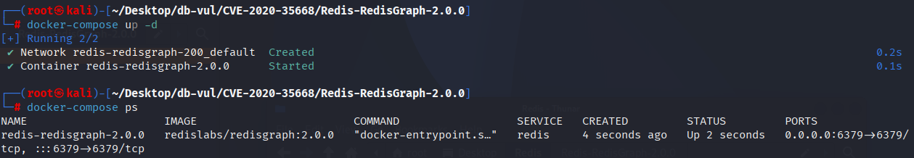
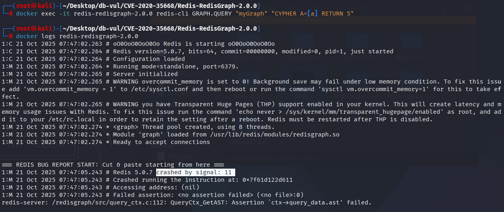

# CVE-2020-35668 CWE-476 Redis-RedisGraph Null pointer dereference

## Vulnerability Background
- **Redis**: A key-value storage system that is a cross-platform non-relational database. An open-source in-memory database that provides a high-performance key-value storage system, commonly used in caching, message queues, session storage, and other application scenarios. Clients communicate with Redis servers via sockets, sending commands, and the server changes its state (i.e., its memory structure) to respond to such commands.

- **RedisGraph :** An extension of Redis that directly embeds graph database capabilities into memory caches: storing nodes and edges with sparse matrices, supporting SQL-like Cypher query language, completing complex relational operations such as multi-hop traversals and path searches in submilliseconds, suitable for real-time scenarios like social networks and recommendation engines.

- ```txt
  CWE-476: NULL Pointer Dereference
  The product dereferences a pointer that it expects to be valid but is NULL.
## Vulnerability Mechanism
Before accessing variables in RedisGraph, the system fails to correctly verify whether the variable is defined. Specifically, in `_AR_EXP_FromIdentifier` functions, if you try to access an unbuilt abstract syntax tree (AST), the system will attempt to access an uninitialized variable, causing a NULL pointer dereference and potentially causing the server to crash.

## Vulnerability Location
Analysis of RedisGraph -2.0.0 source code:

In the /src/arithmetic/arithmetic_expression_construct.c file, in line 20 of the _referred_entity function, it is possible to continue accessing AST when the `ast` is `NULL`, which will cause a null pointer reference error (NULL pointer). dereference）

```c
static inline bool _referred_entity(const char *alias) {
	AST *ast = QueryCtx_GetAST();
	return AST_AliasIsReferenced(ast, alias);
}
```

## Remediation
In function `_AR_EXP_FromIdentifier`, a check for `ast` (abstract syntax tree) is now empty. The function of this function is to construct an expression node from the identifier expression. Before accessing `ast`, check if it is `NULL`. If so, it returns a new constant node directly and sets the error message. This avoids accessing identifiers in ASTs before they are built or defined, preventing system crashes or incorrect behaviors.

```c
diff --git a/src/arithmetic/arithmetic_expression_construct.c b/src/arithmetic/arithmetic_expression_construct.c
index 998e83d35f..fca65dc3f8 100644
--- a/src/arithmetic/arithmetic_expression_construct.c
+++ b/src/arithmetic/arithmetic_expression_construct.c
@@ -116,8 +116,14 @@ static AR_ExpNode *_AR_EXP_FromIdentifierExpression(const cypher_astnode_t *expr
 }
 
 static AR_ExpNode *_AR_EXP_FromIdentifier(const cypher_astnode_t *expr) {
-	// check if the identifier is a named path identifier
 	AST *ast = QueryCtx_GetAST();
+	if(ast == NULL) {
+		// Attempted to access the AST before it has been constructed.
+		ErrorCtx_SetError("Attempted to access variable before it has been defined");
+		return AR_EXP_NewConstOperandNode(SI_NullVal());
+	}
+
+	// check if the identifier is a named path identifier
 	AnnotationCtx *named_paths_ctx =
 		AST_AnnotationCtxCollection_GetNamedPathsCtx(ast->anot_ctx_collection);
```

## Affected Versions
RedisGraph ：

- 2.0.0 to 2.2.10

## Environment Setup
Start the Docker environment, RedisGraph version 2.0.0

```txt
NIST:NVD   Base Score:7.5 HIGH   Vector:CVSS:3.1/AV:N/AC:L/PR:L/UI:N/S:U/C:N/I:N/A:H
```

```txt
cpe:2.3:a:redislabs:redisgraph:2.0.0:*:*:*:*:*:*:*
```



## Vulnerability Reproduction
1. Enter the container command line, connect to Redis, and execute the PoC code. You will see the container exit directly

   ```bash
   docker exec -it redis-redisgraph-2.0.0 redis-cli GRAPH.QUERY "myGraph" "CYPHER A=[a] RETURN 5"
   ```

4. Checking the container log, you can find that the PoC triggered segment error (signal: 11) causing Redis to crash

   ```bash
   docker logs redis-redisgraph-2.0.0
   ```

   

## PoC Analysis

```bash
GRAPH.QUERY "myGraph" "CYPHER A=[a] RETURN 5"
```

`"CYPHER A=[a] RETURN 5"`: This is a statement in the Cypher query language, attempting to define a path alias `A` containing an undefined variable `[a]`, then attempting to return a constant `5`. `A=[a]`: Here, `A` is defined as a list containing elements `a`, but `a` is not defined or initialized in the query. According to normal Cypher query rules, `a` should be a defined node, relationship, or variable. If the `a` is not defined, the query will throw an error.

In RedisGraph, if the system attempts to access an undefined variable (such as `a`), it may attempt to access a null pointer or an uninitialized memory address, causing a NULL pointer dereference error. This can trigger system crashes or unexpected behaviors.

## References
[NVD - CVE-2020-35668](https://nvd.nist.gov/vuln/detail/CVE-2020-35668#range-15118219)

[DoS (Denial Of Service) Bug · Issue #1502 · RedisGraph/RedisGraph](https://github.com/RedisGraph/RedisGraph/issues/1502)

[Error on alias references in parameters by jeffreylovitz · Pull Request #1503 · RedisGraph/RedisGraph](https://github.com/RedisGraph/RedisGraph/pull/1503/commits/5dba254abe97c1bae905a99e63b21a58d3cb4b08)
