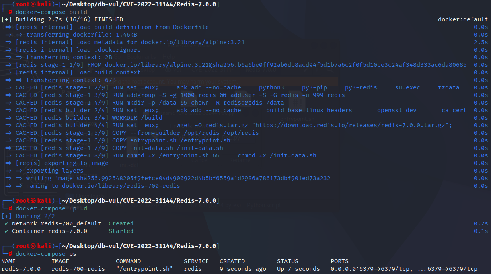
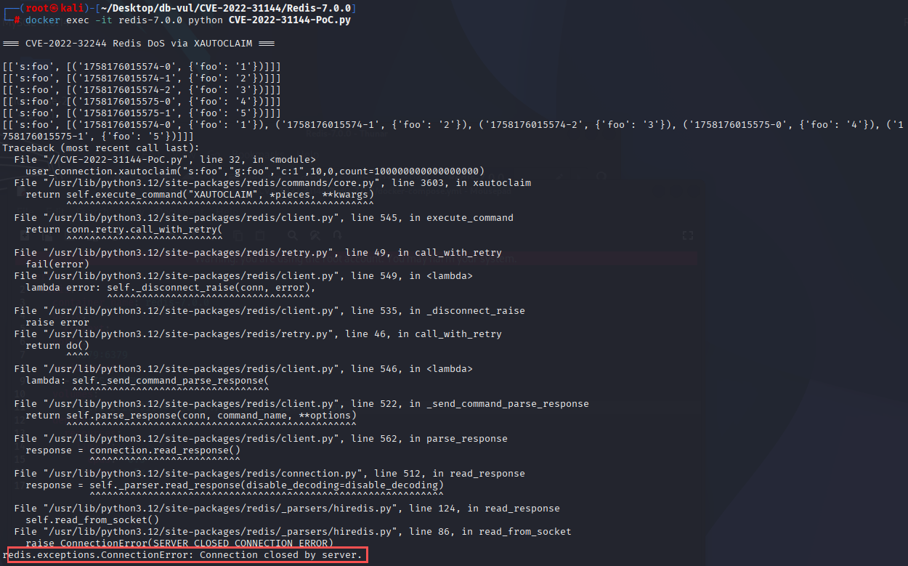
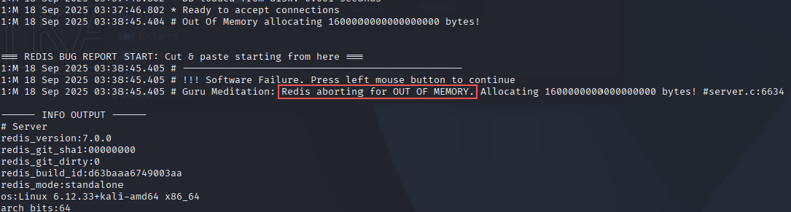

# CVE-2022-31144 CWE-787&122 Redis DoS

## 漏洞背景

- **Redis**：一个key-value 存储系统，是跨平台的非关系型数据库。开源的内存数据库，提供了一个高性能的键值（key-value）存储系统，常用于缓存、消息队列、会话存储等应用场景。客户端通过套接字与 Redis 服务器通信，发送命令，服务器更改其状态（即其内存结构）以响应此类命令。
- CWE-787（Out-of-bounds Write 越界写入）：程序向预期边界之外的内存位置写入数据，可能破坏关键控制信息或执行任意代码
- CWE-122（Heap-based Buffer Overflow 基于堆的缓冲区溢出	）：在堆上分配缓冲区后，因未校验长度即写入超量数据，导致覆盖堆管理元数据或相邻对象，可被利用实现任意代码执行或拒绝服务。

## 漏洞原理

Redis 在处理 `XAUTOCLAIM` 命令时，对流条目进行删除和状态更新时，未正确处理边界和内存管理。特别是在删除条目和操作待处理队列时，缺乏充分的错误检查和内存释放，可能导致数组越界、堆溢出或内存泄漏，从而导致崩溃。

## 漏洞定位


分析 Redis-7.0.0 源代码 ：

实际漏洞位于 `src/t_stream.c` 的 `xautoclaimCommand()`（Redis 7.0.0 源码约第 3411–3425 行），而不是 `streamTrim()`。遍历待处理条目列表时，如果对应 PEL 条目的流记录已经不存在，代码会把 ID 写入 `deleted_ids` 数组并执行 `continue`，却没有递减用于限制循环的 `count`。

```c
if (!streamEntryExists(o->ptr, &id)) {
    raxRemove(group->pel, ri.key, ri.key_len, NULL);
    raxRemove(nack->consumer->pel, ri.key, ri.key_len, NULL);
    streamFreeNACK(nack);

    deleted_ids[deleted_id_num++] = id;
    raxSeek(&ri, ">=", ri.key, ri.key_len);
    continue;                 /* count was not decremented */
}
```

当PEL中有许多条目已被从流中删除时,循环写入的数量可以超过分配的长度 `deleted_ids`导致大量缓冲溢出。 修复 `count--` 先前添加 `continue` 因此"删除的条目"也算向XAUTOCLAIM的COUNT响应盖。

## 漏洞修复


通过减少 `count` 对于循环中处理的每个条目,确保响应大小不超过 `COUNT` 参数,从而避免堆积。

```c
  deleted_ids[deleted_id_num++] = id;
  raxSeek(&ri, ">=", ri.key, ri.key_len);
  count--; /* Count is a limit of the command response size. */
  continue;
```

## 影响范围


Redis：

- 7.0.0 至 7.0.3

## 环境搭建

启动 Docker 环境，Redis 版本为 7.0.0

```txt
CNA:GitHub, Inc.    Base Score:7.0 HIGH    Vector:CVSS:3.1/AV:A/AC:L/PR:L/UI:N/S:U/C:N/I:N/A:L
NIST:NVD    Base Score:8.8 HIGH    Vector:CVSS:3.1/AV:N/AC:L/PR:L/UI:N/S:U/C:H/I:H/A:H
```

```txt
cpe:2.3:a:redis:redis:7.0.0:*:*:*:*:*:*:*
```



## 漏洞复现

进入容器命令行，执行 PoC 文件，可以看到 Redis 断开了连接

```bash
docker exec -it redis-7.0.0 python CVE-2022-31144-PoC.py
```



查看容器日志，可以发现执行 PoC 命令时，Redis 尝试分配大内存，导致内存不足（OOM）错误并崩溃

```bash
docker logs redis-7.0.0
```



## PoC分析


该 PoC 创建流及待处理状态，使 `XAUTOCLAIM` 遇到已删除的条目。在存在漏洞的循环中，删除分支持续执行却不递减剩余的 `count`，从而向 `deleted_ids` 追加超出预期数量的 ID。由此产生的堆覆盖可能在容器日志中表现为分配器故障或类似 OOM 的中止。

## 参考链接


[NVD - CVE-2022-31144](https://nvd.nist.gov/vuln/detail/CVE-2022-31144#range-15593865)

https://github.com/redis/redis/commit/2825b6057bee911e69b6fd30eb338d02e9d7ff90.patch

[CVE-2022-31144/ab.py at main · SpiralBL0CK/CVE-2022-31144](https://github.com/SpiralBL0CK/CVE-2022-31144/blob/main/ab.py)
