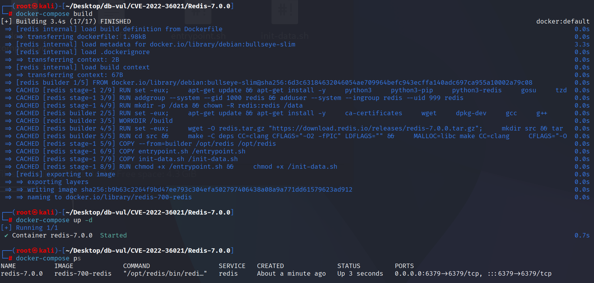
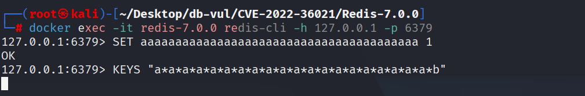
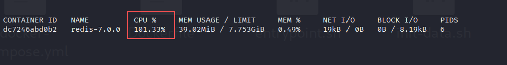
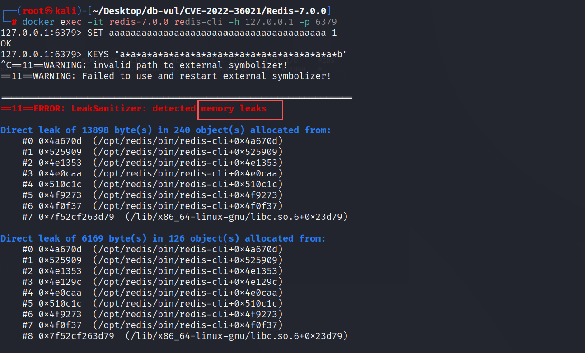

# CVE-2022-36021 CWE-407 Redis DoS

## 漏洞背景

- **Redis**：一个key-value 存储系统，是跨平台的非关系型数据库。开源的内存数据库，提供了一个高性能的键值（key-value）存储系统，常用于缓存、消息队列、会话存储等应用场景。客户端通过套接字与 Redis 服务器通信，发送命令，服务器更改其状态（即其内存结构）以响应此类命令。
- **Glob 风格：**一种简单的字符串通配匹配语法，常用于文件名匹配或键名搜索，它不像正则表达式那样复杂，而是通过少量符号实现灵活匹配：`*` 表示匹配任意长度的任意字符（包括空串）、`?` 表示匹配任意单个字符、`[abc]` 表示匹配字符集合中的任意一个、`[a-z]` 表示匹配一个范围内的字符。Redis 的 `KEYS`、`SCAN MATCH`、Pub/Sub 等功能就采用这种 glob 风格来筛选键名或频道名。

## 漏洞原理

 Redis 对 glob 风格模式（`KEYS`/`SCAN ... MATCH` 等）匹配时的回溯算法弱点：当模式为病态结构（例如大量交替的 `a* a* ... *b`）且目标键无法满足末尾约束时，匹配器会对每个 `*` 逐个尝试不同的“吞字符”长度，导致对同一对 `(pattern, string)` 状态进行大量重复递归尝试，回溯组合数呈指数级增长；把这种昂贵的匹配对数据库中每个键都执行（`KEYS` 会遍历所有键）就会把单线程的 Redis 主循环耗尽 CPU（100%），造成拒绝服务。

## 漏洞定位

分析 Redis-7.0.0 源码：

在 src/util.c 文件，第 52 行`stringmatchlen`函数是 Redis 用来做**glob 风格通配匹配**的核心实现（非正则）

其中 Redis 的 glob 匹配对 `*` 的处理是**纯回溯**，没有剪枝/记忆化 当 `*` 出现时，会尝试把 `*` 对齐到目标串的不同长度（0、1、2、…），每次都递归去匹配后续模式。

当模式是“`a* a* a* ... a* b`”这类**病理型（pathological）结构**，而目标串又很长且无法满足最后的 `b` 时，匹配器会在很多层 `*` 与 `a` 之间产生**指数级**的尝试组合，导致 CPU 飙高、请求“卡死”。

```c
// util.c 文件，第 52 行
int stringmatchlen(const char *pattern, int patternLen,
        const char *string, int stringLen, int nocase)
{
    while(patternLen && stringLen) {
        switch(pattern[0]) {
        case '*':
            while (patternLen && pattern[1] == '*') {
                pattern++;
                patternLen--;
            }
            if (patternLen == 1)
                return 1; /* match */
            while(stringLen) {
                if (stringmatchlen(pattern+1, patternLen-1,
                            string, stringLen, nocase))
                    return 1; /* match */
                string++;
                stringLen--;
            }
            return 0; /* no match */
            break;
                
                // ...
```

## 漏洞修复


处理时 `*` 分支(在 glob 匹配中的“ 任意长度” 通配符)， 新的** pruning 旗帜** `skipLongerMatches` 已添加到 ** 结束 ** 在确定“ 后续模式无法从当前字符串的任何地方匹配” 之后， 重复尝试“ 更长的匹配 ” 。

```c
// When handling '*'
while (stringLen) {
    if (stringmatchlen_impl(pattern+1, ... , skipLongerMatches))
        return 1; // Subsequent modes match, success

    if (*skipLongerMatches)
        return 0; // Subsequent mode: "No success from any position in the current string", pruning: stop lengthening the '*' in front
    // Otherwise, try to add one extra character to the current '*' and try again
    string++; stringLen--;
}

// Reaching this point means "trying all lengths from the current starting point won't succeed in subsequent matches."
// Tell the outer layer not to keep making the previous '*' longer
*skipLongerMatches = 1;
return 0;
```

## 影响范围


Redis：

- 转 6.0.17
-  6.2.0 改为 6.2.10
-  7.0.0 改为 7.0.8

## 环境搭建

启动 Docker 环境，Redis 版本为 7.0.0

```txt
CNA:GitHub, Inc.    Base Score:5.5 MEDIUM    Vector:CVSS:3.1/AV:A/AC:L/PR:L/UI:N/S:U/C:N/I:N/A:L
```

```txt
cpe:2.3:a:redis:redis:7.0.0:*:*:*:*:*:*:*
```



## 漏洞复现

1. 进入容器命令行，执行 PoC 代码，可以看到命令行卡住

   ```bash
   SET aaaaaaaaaaaaaaaaaaaaaaaaaaaaaaaaaaaaaaaa 1
   
   KEYS "a*a*a*a*a*a*a*a*a*a*a*a*a*a*a*a*a*a*a*a*b"
   ```

   

2. 重新打开另一个命令行，查看查看容器 CPU 状态，可以看到 CPU 占用接近 100%，说明 Redis 正在处理极复杂模式，导致客户端命令无法立即返回，触发了高 CPU DoS

   ```bash
   docker stats redis-7.0.0
   ```

   

3. 使用 ctrl + c 强行退出，可以看到 ASan 检测到 Redis 处理模式匹配时有内存分配未释放（内存泄漏）

   

   

## PoC分析

```bash
# 把键名为一长串 a的 key 存入数据库，值为 1
SET aaaaaaaaaaaaaaaaaaaaaaaaaaaaaaaaaaaaaaaa 1

# KEYS <pattern>：列出当前数据库中所有与 <pattern>（全局模式）匹配的 key
KEYS "a*a*a*a*a*a*a*a*a*a*a*a*a*a*a*a*a*a*a*a*b"
```

当模式是“病理结构”，比如大量的 `a*` 交替，末尾再跟一个**不可能匹配到**的字符（如 `...*b`），而待匹配的字符串又很“配合”（例如很多个 `'a'` 串，不含 `b`），就会发生什么：

- 第一层 `*` 会尝试吃 0~N 个字符
- 对每个吃法，进入第二层 `*` 又会再尝试 0~N' 个字符
- ……层层叠加，导致**尝试组合数呈指数级增长**

一旦在 `KEYS` 或 `SCAN MATCH` 中对库里**很多键**都做这种匹配，就会把 CPU 吃满、客户端卡死

## 参考链接


[NVD - CVE-2022-36021](https://nvd.nist.gov/vuln/detail/CVE-2022-36021)

[String pattern matching had exponential time complexity on pathologic… · redis/redis@dcbfcb9](https://github.com/redis/redis/commit/dcbfcb916ca1a269b3feef86ee86835294758f84#diff-96a377263d83bb4c4bdbf2ca8a87ae8310d80f0b35bfcd796c80c3f403cfe65c)
