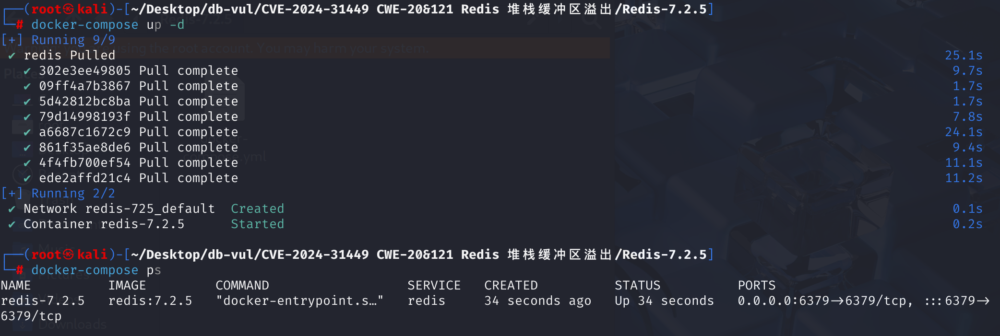
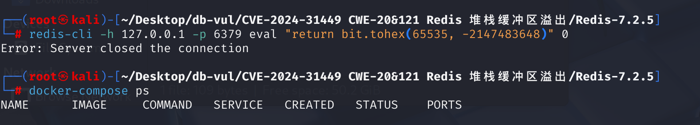
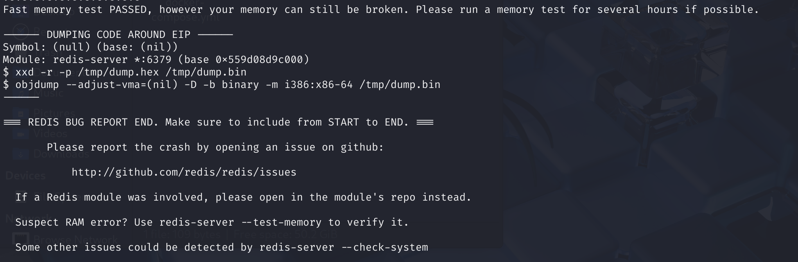

# CVE-2024-31449 CWE-20/121 Redis 堆栈缓冲区溢出

## 漏洞背景

- **bit.tohex **: Lua BitOp 库中的一个函数，用于将给定的整数转换为十六进制字符串。这个函数通常用于位运算处理，`bit` 模块是 Redis 自带的 Lua 库之一（`bit` 库本身依赖于 C 实现的 bit 操作）。在 Lua 脚本中，`bit.tohex` 会将整数转换成其十六进制表示形式。

## 漏洞原理

该漏洞与 **Lua 脚本引擎** 中的一个库（`bit.tohex` 函数）有关，攻击者可以利用这个漏洞通过发送特制的 Lua 脚本来触发堆栈溢出，从而使 Redis 服务器崩溃，甚至执行任意代码，但漏洞的触发过程并不直接与恶意代码一起传递，更多的是依赖于如何在堆栈溢出时覆盖或修改 Redis 内存中的数据。

## 漏洞定位

根据漏洞原理，在 **deps/lua/src/lua_bit.c** 文件中，第 **128** 行的 `bit_tohex` 函数，用于将一个无符号整数转换为十六进制字符串表示。其中，如果`n`为负数，函数会将其取反，并使用大写的十六进制字符。然而，存在一个特殊情况：当`n`等于`INT32_MIN`（即-2147483648）时，取反操作会导致整数溢出，因为在32位有符号整数中，`INT32_MIN`的绝对值无法表示。

```c
static int bit_tohex(lua_State *L)
 {
    // 获取第一个参数b，使用 barg 函数将 Lua 中的数字参数转换为无符号整数类型 UBits
   UBits b = barg(L, 1); 
    // 获取第二个参数n并转换为带符号整数 `SBits`，如果未提供，则默认值为8
   SBits n = lua_isnone(L, 2) ? 8 : (SBits)barg(L, 2); 
   const char *hexdigits = "0123456789abcdef";
   char buf[8];
   int i;
    // 如果n为负数，则取其绝对值，并将 hexdigits 改为大写形式（0-9, A-F）
   if (n < 0) { n = -n; hexdigits = "0123456789ABCDEF"; } 
    // 限制n的最大值为8，以确保输出不超过8个十六进制字符
   if (n > 8) n = 8;
    // 函数从最低有效位开始，每4位对应一个十六进制字符，将其存储在缓冲区buf中
   for (i = (int)n; --i >= 0; ) { buf[i] = hexdigits[b & 15]; b >>= 4; }
     // 将 buf 数组中的字符转换为 Lua 字符串，并推送到 Lua 栈中，作为函数的返回值
   lua_pushlstring(L, buf, (size_t)n);
    // 返回 1，表示函数返回一个结果
   return 1;
 }
```

参数 `n` 的值直接影响缓冲区的使用。如果 `n` 的值超过预期范围，可能导致缓冲区溢出等未定义行为。

修复后的代码加上了判断`n`是否等于`INT32_MIN`的语句: `if (n == INT32_MIN) n = INT32_MIN+1`

## 漏洞修复

升级到 Redis 6.2.16、7.2.6、7.4.1，或包含提交 `1f7c148be2cbacf7d50aa461c58b871e87cc5ed9` 的更高受支持版本。补丁会在取绝对值或将参数用作循环/缓冲区边界前，验证 Lua 位运算库所请求的 `bit.tohex()` 宽度（包括 `INT32_MIN` 情况），并把十六进制宽度限制在固定栈缓冲区支持的范围内。

直到升级,否认 `EVAL`， `EVALSHA`， `FCALL`,然后将脚本/功能加载到未信任的用户中 Redis ACLs (法语)。 限制网络访问并删除已存储在服务器上的未信任脚本； 内存限制无法防止腐败 Lua 堆栈缓冲器。

## 影响版本


- Redis  2.6 之前通过版本 6.2.16

- Redis  7.0.0 之前通过版本 7.2.6

- Redis  7.3.0 之前通过版本 7.4.1

## 环境搭建

启动docker环境，Redis版本为7.2.5



## 漏洞复现

1、使用redis-cli连接数据库并使用bit.tohex执行调用具有大值或负值的函数的Lua脚本，可以看到Redis服务关闭了连接。

```bash
redis-cli -h 127.0.0.1 -p 6379 eval "return bit.tohex(65535, -2147483648)" 0
```



2、查看容器日志：Redis 服务器遇到了一个崩溃，并输出了内存转储（dump）的相关信息。出现这种错误通常与内存损坏、无效指针操作、内存访问违规等有关。

```bash
docker logs redis-7.2.5
```



## POC分析

```bash
redis-cli -h your-ip -p your-port eval "return bit.tohex(65535, -2147483648)" 0
```

`eval` 是 Redis 的一个命令，它允许在 Redis 服务器上执行 Lua 脚本，这里调用了 `bit.tohex` 函数。`bit.tohex(65535, -2147483648)` 会尝试将 `65535` 和 `-2147483648` 转化为十六进制并返回一个结果。但在 Redis 的 Lua 环境中，`bit.tohex` 的实现存在漏洞或不兼容负数的表示方法（特别是在处理 32 位整数时），可能会导致错误或不可预期的行为（如缓冲区溢出）。

## 参考链接


[Redis CVE-2024-31449: How to Reproduce and Mitigate the Vulnerability | CN-SEC Chinese Website](https://cn-sec.com/archives/3407255.html)

[Fix lua bit.tohex (CVE-2024-31449) · redis/redis@1f7c148](https://github.com/redis/redis/commit/1f7c148be2cbacf7d50aa461c58b871e87cc5ed9)
